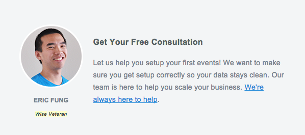
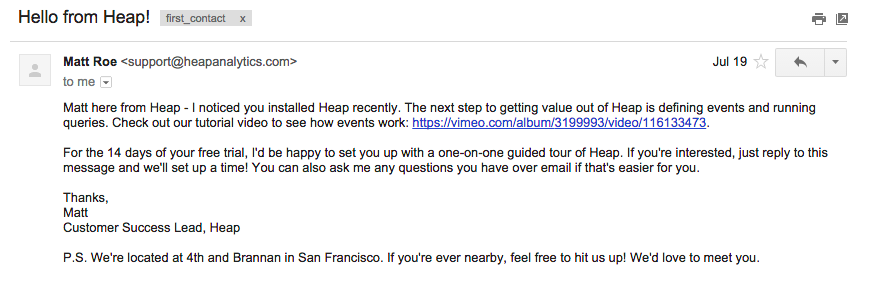
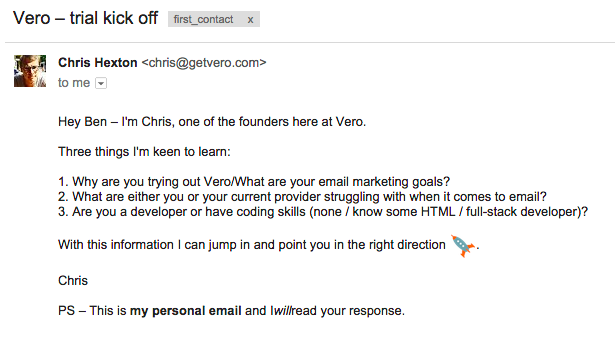
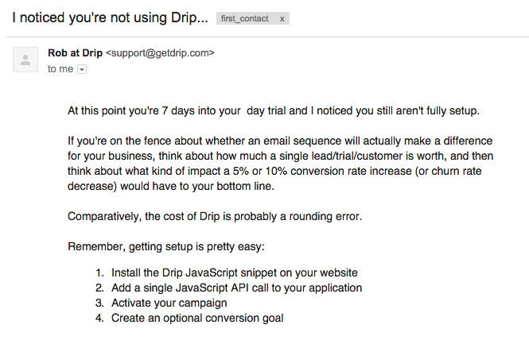
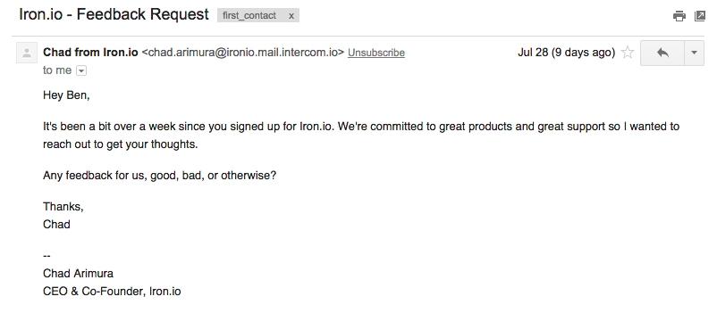
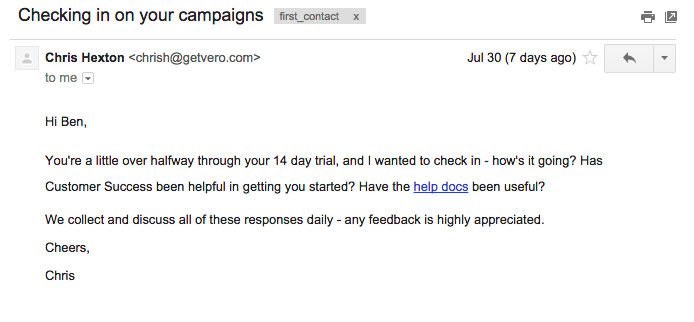

If you work at one of our integrations partners, you might have noticed by now the copious amount of test accounts I've created with you. 'Ben@astronomer.io,' 'Ben+1@astronomer.io,' 'fake@fake.fake,' test@test.test.' All of these have at one point or another been mechanisms for me to test that our architecture is working properly. But creating all of these accounts has created an unexpected consequence.  
  
Drip emails. You know the ones I'm talking about. Most have the common theme of 'Just Checking in...' or 'Wanted to Introduce Myself' and are, for the most part, entirely ignored. But because I’ve been creating a ton of test accounts, these emails have really started to pile up. And I’ve started to notice some patterns.

&nbsp;By my count, there are at least six (and probably more) types of email you typically receive:

**Email #1 - The Immodest Hero**

The Immodest Hero sends you all those super polished welcome emails as soon as you sign up for their service. These vary in length and content but its basically to the effect that they’re really happy you’re trying their product and just know that you’re going to love it. There will be plenty of custom graphics, maybe a welcome video (or two), and multiple reminders to finish the initial set up or you’re not going to fully appreciate how great their product is.   
  
   
  
Yikes, it looks like KISSmetrics may have already beaten me to the archetype joke. As soon as you send KISSmetrics some data, they send you a laundry list of things that you can do with KISSmetrics as well as the opportunity to talk with a Hero, ahem ‘Wise Veteran.’ (_I’m sure that speaking with a KISSmetrics Veteran would still be immensely helpful in learning about their product. This archetype is still called a ‘Hero’ for a reason and I’ve found KISSmetrics to reliably be the best at trying to put a face behind each of their emails._)  
  
**Email #2 - The Honest Priest**  
The Honest Priest is the opposite of the Immodest Hero. Although created for the same purpose, the Priest adopts an unassuming tone and quietly welcomes you to their service. That's not to say that the Priest and the Hero don't often go hand in hand. Many companies will use a combination one-two punch to get your attention.   
  
But specifically, you’ll recognize the Priest by the unpolished notes they send you. As opposed to the Hero, the Priest places an emphasis on creating a personal and honest connection. I'm a fan of Heap Analytics' approach to this:  
  
   
  
Notice how the email:

- Demonstrates value in the very first section by clearly defining the next step and giving instruction on how to complete that step.
- Makes a personal connection by offering (but not insisting) to set up a time to talk.
- Reinforces and extends that personal touch by giving out their office address and inviting the recipient to meet them in person.

Second place goes to Vero for that emphatic sign off: "I _will_ read your response."

**Alt. Email #2 - Beware False Prophets.** These are the ones who try to take the info you gave at sign up and feign a personal connection with you without putting in any effort. I’m not going to show a concrete example at the risk of hurting someone with misguided intentions but the email will look something like this:

_Hey { **YOUR NAME** }-_  
  
_Thanks for signing up! I took a look at { **YOUR COMPANY NAME** } and it looks really interesting! I’m a huge fan of what you guys are doing over there and I think you could really get a lot of value out of our product._  
  
_Sincerely,_  
_False Prophet&nbsp;_

If you get an email like the above and want to test whether the person sending it is a False Prophet, intentionally sign up with a fake company name (e.g. McKullen-Blunderbuss Industries) and see if you get the same email. If instead, you get an email saying they tried to look you up and couldn't find much but would love to know more about your needs, then they're the real deal.  
  
**Email #3 - The Town Drunk**   
  
_"Let’s set up a time to talk this week. Please send me some times that you are available.”_  
  
Silly drunk, what on earth makes you think that I’m going to go out of my way to schedule a time? I don’t know you and, if you’re sending this the day I signed up, I haven’t had a chance to evaluate your product. Send you a few times? Send me a reason I should talk to you. Make a concerted effort to provide value equivalent to my time instead of asking me to do your job for you. (_Look at me getting all high and mighty that my time is actually that valuable...but I'd like to think it kinda is..._)  
  
The counter to this argument goes that those who do respond with times to meet will end up being your best leads. I have a hard time believing that and (in my own experience being the Town Drunk) these people end up being the ones who take any call so they can try to sell you back their own product. You do want to get people on the phone and you absolutely want to make sure they understand your product. But make an actual effort. Nothing is more frustrating than lazy lead gen.

**Email #4 - The Struggling Artist**

  
I really feel for this archetype. I’ve been there. We probably all have. You just want someone to FINISH their setup. You know that if only they could finish, then they would absolutely love your product. Or even if they didn’t, they would at least given it a fair shake because, at the end of the day, that's all we really want. For anyone who signs up to give our product a fair and measured assessment. If, after that, they still decide not to use you, you're just going to have to live with that. Such is the free market. Ain't capitalism a b#@!$?  
  
**Email #5 - The Helpful Fool**

_“Watch my tutorial videos!"_

This can go both ways. I call this person the Fool not because their efforts are foolish. I actually really admire this kind of effort and personally respond to it better than most emails. I call this the Fool because, like a court jester, they have to create something original and put it out there for people to interpret how they will. It could be a master stroke in educating prospects about your product or it could entirely fall flat. Most likely, it’s going to be a combination of both and what is one person’s invaluable resource is another’s junk mail.  
  
  
**Email #6 - The Inscrutable Squire**   
  
This one is the hardest to pin down. And the hardest to find. They’re…asking for feedback! What’s their endgame?! Like this guy:  
  
   
What the hell is his problem? Realizing that I'm not getting the full potential of a product that I'm sure took him a lot of time, effort, and sacrifices to make, and then - and THEN having the gall, no - the audacity, NO - the IMPUDENCE to try to improve my experience through a forthright request for feedback. Some people, right?  
  
Oh and this guy again?! Trying to learn more about the efficacy of their education process so they can send more relevant and useful messages? You got a lot of nerve Chris Hexton of Vero.  
  
   
  
Have I made it clear enough by now that the Squire is **BY FAR** my favorite type of email? I might not respond to them if I don't have something to contribute but just getting them greatly improves my impression of the company. I don't know if they actually discuss all this feedback every day (I also have no reason to assume they don't) but the fact that they're trying to solicit feedback via emails ON the emails themselves is some kind of meta-marketing voodoo awesomeness that I'm 100% on board with. Well done Vero and any other company who does this. The squire is the unsung hero of email marketing but the one who actually keeps the ball rolling.

Think you've seen an email archetype I left out or have your own example of one of the above you've just GOT to share? Send it to me at ben@astronomer.io and I'll include it in a follow up blog post! Only you can prevent bad email marketing by publicly praising someone when a job is done well.

