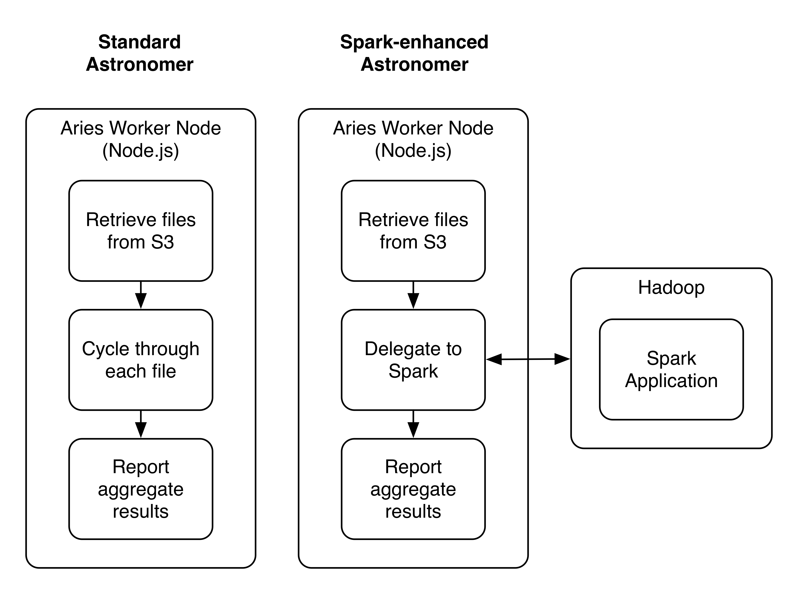

At Astronomer, we're creating a platform to make it radically easier for both novice and expert data engineers to create and deploy data pipelines.&nbsp;Sometimes a step in a data pipeline is exceptionally long-running.

Would&nbsp;those steps benefit from [Apache Spark](https://spark.apache.org/) to speed up the processing?&nbsp;Should we delegate all steps&nbsp;to Spark, or only the long-running ones?&nbsp;How would Spark affect the cost to execute the work?&nbsp;

Our hypothesis was that it would be a tradeoff: we'd&nbsp;get speed, but the job would cost more to execute. However,&nbsp;this&nbsp;speed would be worth it for&nbsp;customers who want&nbsp;their data in&nbsp;real time.

### The Test

To test Spark, we focused in on a pipeline that scans [user clickstream events](https://en.wikipedia.org/wiki/Clickstream) for a high-volume web application, and writes daily summary data to Redshift. This data is then used to visualize how the usage is changing over time, at a very granular level.  
  
Our approach was to:

1. Build a script to do the work using our standard functionality.
2. Build an Aries/Spark integration, and write a script to use that infrastructure.

Note: [Aries](https://github.com/aries-data/aries-data) is an open-source Javascript framework that powers certain aspects of the platform.

### The Code

This task requires very little code, thanks to the power of Node and Aries. In fact, 90% of our time on this adventure went to setting up Spark on AWS.

First, we wrote the pipeline code... it's just two steps:

- An activity that sets Spark up to use S3 as a backend, pointing to yesterday's data bucket.
- Write the results of step 1 to Redshift, to a table called `daily-clickstream-stats`.

### Pipeline Configuration

   {
    "interval" : "86400",
    "activityList" : [ 
        {
            "name" : "aries-activity-acme-daily-analysis"
        }, 
        {
            "name" : "aries-activity-redshift-sink",
            "config" : {
                "schema" : "astronomer_prod",
                "table" : "daily-clickstream-stats",
                "connection" : "acme-redshift"
            }
        }
    ]
}

### Spark-Enhanced Activity

import { SparkActivity } from 'aries-data';
import AWS from 'aws-sdk';
import moment from 'moment';

export default class AcmeDailyAnalysis extends SparkActivity {
    static props = {
        name: require('../package.json').name,
        version: require('../package.json').version,
    };

    @singleS3StreamOutput()
    async onTask(activityTask, config) {
        // Create a dataframe from s3 files. 
        const dataframe = this.sqlContext.read().jsonSync(this.s3Path());

        // Spark query
        const ctx = df.select("context.userAgent")
            .groupBy('userAgent')
            .count()
            .sort('count')
 
        // Run the job and return the results.
        return ctx.collectSync();
    }

    // Return a s3 path for yesterdays data.
    s3Path() {
    const yesterday = moment.utc().subtract(1, 'day').format('YYYY/MM/DD');
        return `s3n://acme-clickstream/data/${yesterday}/*`;
    }
};

With just 30 lines of code, we get the power to process data from any S3 bucket and push summary data to any destination supported by Aries.

### Results

**Setup**** Task Runtime ****Cost** Standard Astronomer infrastructure  
(1 m3.medium EC2 instance) 50 minutes $0.067/hr x .83 hr =  
**$0.06** 3-slave m3.medium Spark cluster 14 minutes $0.067/hr \* 3 slaves \* .23 hr =  
**$0.05** 4-slave m4.xlarge Spark cluster 8 minutes $0.239/hr \* 4 slaves \* .13 hr =  
**$0.12**

We discovered that tuning the infrastructure to the task is important.

- With a modest Spark setup the task&nbsp;ran&nbsp;4 times faster, and cost less.
- With a bigger&nbsp;Spark cluster, the task ran&nbsp;6 times faster, but doubled our original cost.

### Next Steps

We're excited to have a proof-of-concept Spark integration now with Astronomer, but we'll have to think about how to utilize it effectively. Spark is not a magic bullet.

If any readers have advice on how to optimize Spark clusters for target workload, we'd love tips.

And if any readers want to start live-streaming user events, sign up for free today at [app.astronomer.io](http://app.astronomer.io/login).

