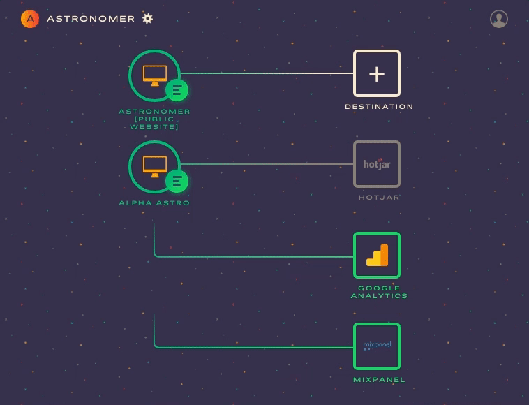

Our clickstream product emerged into the world naturally.

More and more companies are enabling their sites and apps to capture analytics events to better understand how their users interact with them and draw insights from that "[clickstream](https://searchcrm.techtarget.com/definition/clickstream-analysis)" data. We found an unexpected space in the market for companies—from mid-size businesses to enterprises—that wanted these insights. And to get them, they needed a custom clickstream solution that would still allow them to own their data warehouse as a [Redshift](https://aws.amazon.com/redshift/) instance.

So what was built as an MVP to stream user events evolved into one of Astronomer's first products. We began by creating connectors for numerous analytics services (and there are a LOT—[check out this infographic](https://cdn.chiefmartec.com/wp-content/uploads/2016/03/marketing_technology_landscape_2016.jpg) from 2016). As our customers came to us with new use cases, services and integrations, we took the wise advice of Paul Graham from Y Combinator, who said,["do things that don't scale,"](https://paulgraham.com/ds.html) and continued building custom connectors internally. Eventually we came up with a whole library of general purpose integrations that could be reused across clients. Our clickstream customers continued to grow, but then we hit a bottleneck.

The engine underneath it all began to buckle under the heavy load as it wasn't designed to handle the scale of events it was receiving every day. As a startup engineer, this is what I call a good problem. It means that we understood our customers' needs well enough to make the right product decisions to build something they wanted. Consequently, this is also the best way to build a product in a startup environment. I really like the 10x scale heuristic proposed by Sam Altman, the President of Y Combinator in [Startup Playbook](https://playbook.samaltman.com/#growth):

> _A related trap is thinking about problems too far in the future—i.e. “How are we going to do this at massive scale?” The answer is to figure it out when you get there. Far more startups die while debating this question than die because they didn’t think about it enough. A good rule of thumb is to only think about how things will work at 10x your current scale._

The startup graveyard is littered with companies that focused on scalability before locking down product/market fit. Spending too much time focused on making tons of features perfect or future scalability in engineering before you need it is a critical mistake for a startup ([YAGNI](https://martinfowler.com/bliki/Yagni.html)). Luckily, we followed Sam's advice and didn't overbuild what our customers didn't need.

At this point though, we sought a deeper understanding of which critical components in our stack should be replaced or rewritten and of whether or not we needed to make architectural changes for scalability. Once you can extrapolate outgrowing your current scale to see where the puck is going, this becomes easier to do. So we thought about the problem and came up with a two-pronged approach: (1) build the best long-term solution for scalability using world class open source components and (2) in the short-term, understand and swiftly handle what your customers need today.

Our CTO, Greg, created the stopgap solution running as a nightly job to bulk load events into customers' Redshift instances with [Apache Spark](https://spark.apache.org/). This got us further and  [we learned a lot about Spark](https://www.astronomer.io/blog/adding-apache-spark-to-astronomer), but we also knew it wasn't a permanent solution to the problem of keeping every customer's Redshift instance up to date throughout the day. Today's data scientists, data analysts and BI teams want to be able to make data-driven decisions at any time, and to do that they need a frequently-updated source of truth.

Greg tasked me (Taylor) and Tyler, another engineer on our core platform team, with building the long-term solution. We took everything we learned from the v1 of Clickstream and the stopgap solution to build out a full v2 which is highly horizontally scalable. We made prototypes of Vortex, our clickstream micro-batch event processor, using Apache Spark's Scala and Python bindings. The decision to move forward with the Python version was based on our in-house expertise writing and running Python in a production environment _and_ the fact that Python is already used throughout our stack to handle ETL tasks via [Apache Airflow](https://medium.com/airbnb-engineering/airflow-a-workflow-management-platform-46318b977fd8).

In taking this on, we architected and built a long-term solution that scales to billions of events per day. The most important part of this architecture is [Apache Spark](https://spark.apache.org/) which provides "lightning-fast cluster computing" and, better yet, a distributed memory model for parallel processing at massive scale called the resilient distributed dataset (RDD) and the [Spark Streaming](https://spark.apache.org/streaming/) module that fills the perfect happy middle ground between batch and real-time processing.

The micro-batches are created to improve performance in terms of bandwidth over the network (instead of sending tons of requests with very small payloads), which [improves Redshift copy performance](https://stackoverflow.com/a/25594451/149428). Additionally, we can use our existing Apache Airflow data pipelines that run ETL workflows.

After extensive development and testing, I'm excited to announce its release to production and initial rollout to the first customers. Our frontend looks like this:

And our backend stack looks like:

- A [Kinesis](https://aws.amazon.com/kinesis/) stream for Redshift event ingestion (soon to be [Kafka](https://kafka.apache.org/))
- An Apache Spark Streaming app to process event micro-batches in 10-second windows ("Vortex")
- [S3](https://aws.amazon.com/s3/) to store event micro-batches (soon to be [Ceph](https://ceph.com/))
- Apache Airflow (running on Mesos via our DC/OS cluster)
- A clickstream [DAG](https://www.astronomer.io/blog/what-exactly-is-a-dag) in Airflow that fetches the microbatched events from S3 hourly and kicks off the data loading
- A Redshift sink to copy the events into Redshift\*

_\*Besides Redshift, we're also exploring building an equivalent BigQuery connector too—if this is something your company would be interested in, please let us know with a vote or comment [on our ideas portal](https://ideas.astronomer.io/ideas/A-I-75)._

The clickstream DAG (directed acyclic graph) also flattens out custom properties and traits on events to the top level to create table columns in Redshift. This allows our customers to dynamically add, remove and change the metrics they track without any code change on our end.

Last month, I had the opportunity to present a high-level talk on Apache Airflow and Spark Streaming at the Cincinnati Data Science meetup. [The slides](https://paper.dropbox.com/doc/Airflow-Spark-talk-cnpGgauiqEK1Ot5dUeICj) to that talk are available online, and if you're local to Cincinnati, we'd love to have you come out for our next meetup. You can find more info on the [Cincinnati Data Science meetup page](https://www.meetup.com/Cincinnati-Data-Science/).

We plan to write future posts diving deeper into specific parts of the clickstream stack. Please let us know if you'd like to hear about something specific! Also, if you'd like to be among the first to try clickstream v2, [reach out anytime](https://www.astronomer.io/contact).