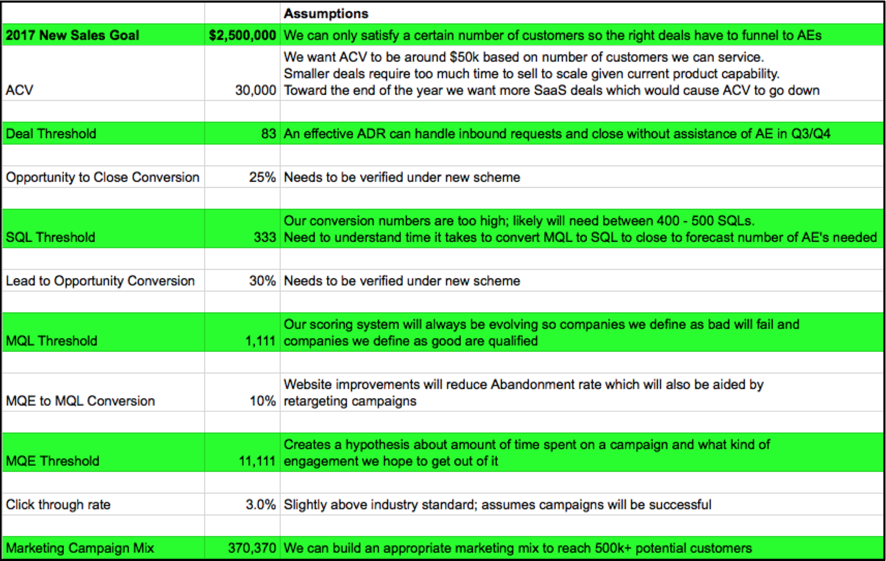
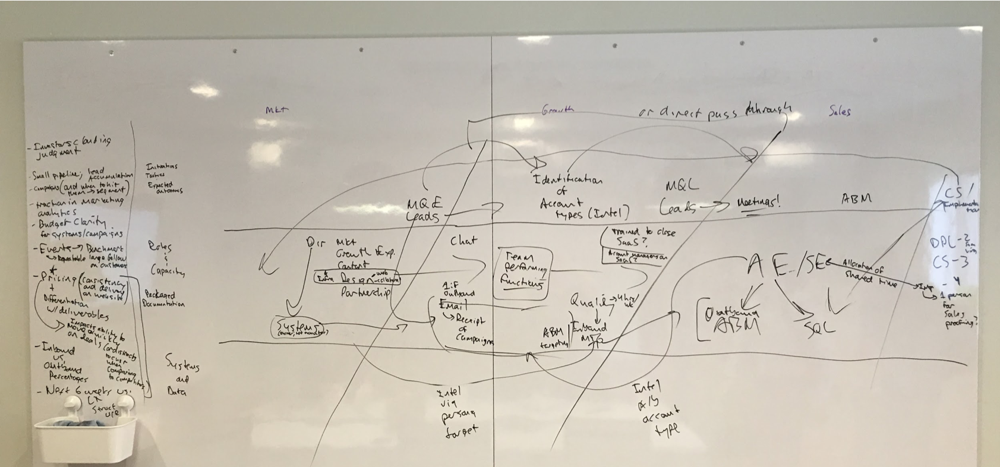
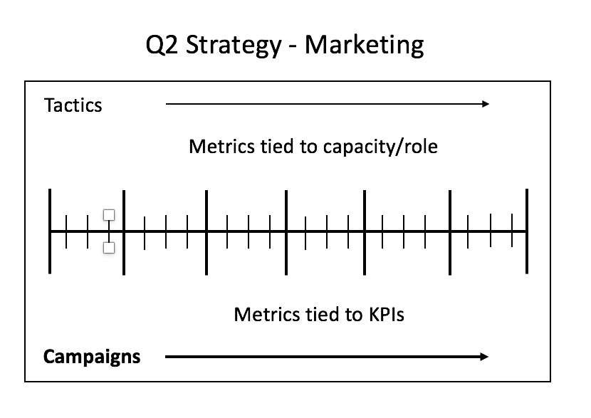
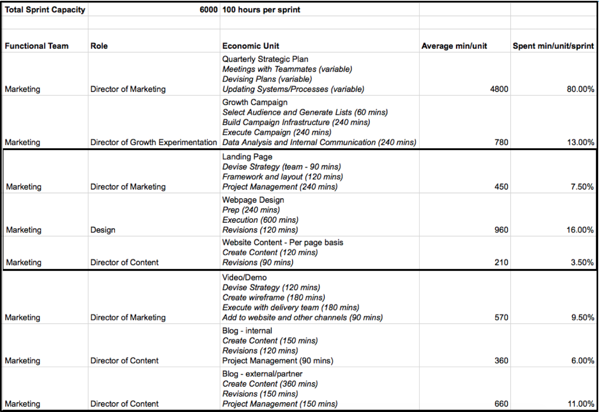

For those new to this blog series, I’m chronicling my first eight weeks at Astronomer as I build the growth model that will position us for Series A funding and beyond. I’m calling it The Beacon Project, because that’s my inspiration—to be an intentionally inconspicuous device that attracts Astronomer to the right customers, and vice versa. I believe we can do that by becoming a growth team that's focused on&nbsp;the right opportunities.&nbsp;

### In Case You Missed It...

In my first blog [I outlined my plan of attack to build a model](https://www.astronomer.io/blog/how-to-scale-your-growth-process-in-8-weeks) that would quantify our growth process to shed light on which customer profiles (including buyer personas) are hottest for Astronomer right now, giving special consideration to the human constraints we have to market, sell, implement and service _the right_ customers.

Specifically, I want to confirm:

- (1) It’s possible for Astronomer to rank potential leads based on historical analysis of several key datasets (lead scoring, total sales cycle, business/persona type)
- (2) Our dynamic growth scoring algorithm must consider current team capacity and future potential sales scenarios so we are not taking on campaigns/customers that will not produce significant value for our business
- (3) We can scale dynamically as more information gets entered into the system (short-term manual testing eventually turns to automation through use of our own product).

I laid out specific steps to test these hypotheses, rolled up my sleeves and got started:

### The First Sprint: Take Inventory of the Data Needed

Here, I'm talking about everything about the growth process that needs to be quantified. Like Astronomer&nbsp;[recommends doing before any data initiative](https://www.astronomer.io/blog/five-steps-to-take-before-kicking-off-a-clickstream-data-initiative), I "began with the end in mind." This phrase borders on cliche in the startup world, kind of like “fail fast.” But those terms aren’t fluff; they actually matter.

As I mentioned, the next “end” for us is raising Series A funds.&nbsp;For those unfamiliar with Venture Capital financing, [Series A VCs typically invest between $5 - $10m](https://bothsidesofthetable.com/what-is-the-definition-of-a-seed-round-or-an-a-round-2cf20264297c)into “established” startups, those that have proven metrics highlighting predictable revenue growth from customer types who&nbsp;have bought from us through a repeatable sales and implementation process. [Competition for Series A funding is intense](https://bothsidesofthetable.com/getting-back-your-series-a-mojo-eb137a816f48). True big league stuff.

So we backed into a “Sales and Marketing Mix,” a series of KPIs the sales and marketing teams would have to hit to generate $2.5m in additional revenue by the end of the year. Here are ours:

  
\*_These are approximations that can change at any time_

This is what I would call a “barbell” strategy. The end and beginning points are identified first; then “conversion” assumptions in the middle drive tactical KPIs upon which campaigns can be run.

Of course, these numbers are all approximations: we _THINK_ this is what we have to do to reach our goals, but in reality, we don’t know how our campaigns will fare and must&nbsp;maintain flexibility to call audibles. The key is coordination so we’re not wasting time or money on tactics that aren’t working (or duplicating efforts!). When everyone is moving as quickly as possible, precision is paramount.

To get on the same page, the whole growth team convened for a three-hour, off-site brainstorming session. The objectives were:

- Team top of mind – what NEEDS to be addressed during the session?
- Outline sales process start to finish 
- Discussion of roles and capacity 
- Discussion of systems and budget ask

Here’s how the whiteboard looked at the end of 3 hours:

  
_\*[Union Hall](https://unionhallcincy.com/) Room 304 Whiteboard_

Besides chicken-scratch handwriting, what do you see? Follow the arrows to understand how EVERY one of our teams are impacted by the needs and capacity of another unit.

When marketing gets asked to do a random presentation deck from sales, for example, what is that preventing our Director of Content from doing? Or when the implementation team is pulled into the sales process to answer very technical questions, does that take away from the time they have to&nbsp;create the documentation that will, ironically, make the implementation process smoother and more efficient? These questions drive&nbsp;critical decisions.

In a nutshell: it takes discipline and a system to keep the trains running on time. The Beacon is that system.

### Next: If You Build (The Framework), They Will Come (to Buy)

After our offsite, the sales and marketing teams began formulating their strategy for the remainder of the quarter to be put into a system (at that&nbsp;time, non-existent). The third blog in this series will cover those details (and more!).

Knowing their&nbsp;information was coming soon, I quickly had to build the system into which their information would flow. To do so, I backed into a structure where strategies are comprised of campaigns that require new tactics to be completed by one or many team members.

Here’s a visual of that structure:

This theoretical structure turned into the following “tactical capacity menu”:

The model assumes a two-week sprint format where employees will average 50 hours per week. Said differently, 6000 is the number of minutes someone would work in a two week sprint. That’s important because it gives a standard baseline from which we can run our unit economics model.

The last thing we needed was to set up the infrastructure to centralize and analyze data from real campaigns.

Below is a screenshot of our “Unit Economics Scorecard” MVP ([click here](https://docs.google.com/a/astronomer.io/spreadsheets/d/1hKq2b29u7ahFrkWqjIHFEYhMb9JBxlp0sAO4PVahSwY/edit?usp=sharing) or on the image for a better view). New campaigns pull “raw material” from our “Marketing/Sales Mix” and “Tactical Capacity Menu” so we can formulaically understand:

- Capacity spent per role
- Projected and real campaign results
- Unit economics of a campaign

Because the system was built based on formulas, changes to any assumptions in the scheme will immediately be updated in the other tabs. It’s the beginning of what our algorithm will eventually look like when the system is automated.

One step at a time, though! As promised in blog one, here’s what we’ll be doing next to push this baby along:

- Step 3: Start running campaigns to populate the system with data, add infrastructure to systems as needed, test framework for automation
- Step 4: Cross-reference the datasets like crazy; focus marketing and sales according to what’s working (manual exercises at first)
- Step 5: Iterate the model accordingly and build proven models into automated systems

It’s been awesome to see the interest in what we’re doing! Many have reached out directly through LinkedIn and other sources to ask questions. If you want to know more or share your ideas, hit me up on chat through our website or email me directly ([kevin@astronomer.io](mailto:kevin@astronomer.io)).&nbsp;And, of course, stop back in a couple weeks to see the progression of&nbsp;this beacon that we're building as we go!

