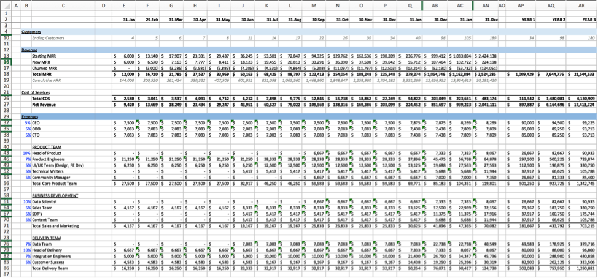
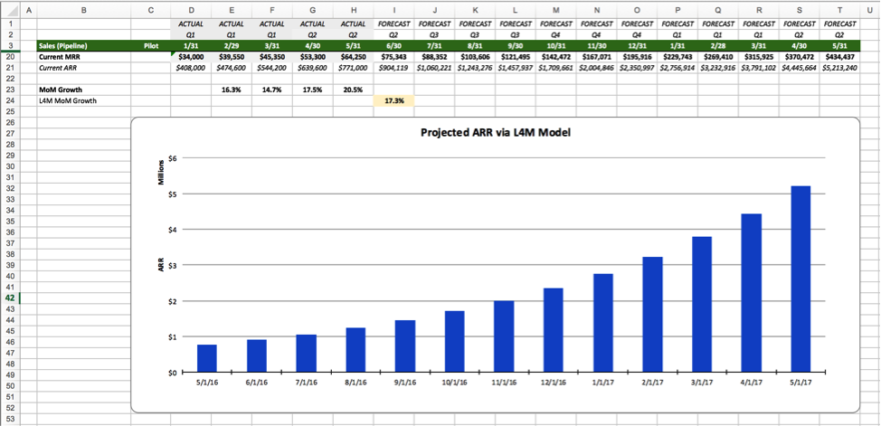
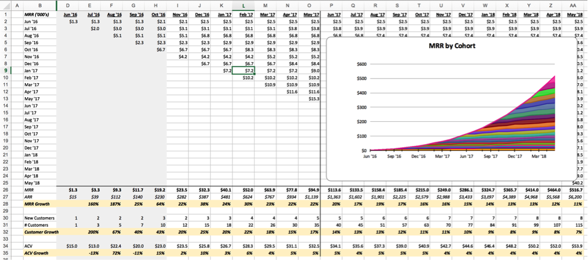

Over the last ten years as a founder and analyst, I’ve spent countless hours probing the depths of nerdom with my trusty companion, Microsoft Excel. Together we’ve built complex stock trading algorithms, analyzed large companies through sum-of-parts valuation models and even built a quite ugly, dynamic progress tracker to make sure I was ready for a CFA exam (time that probably would’ve been better spent studying…)

Truth be told, I’ve spent so much time in Excel that I’ve started to think in terms of spreadsheets, and occasionally, even dream in rows and columns...

Many models ago, when I was a young hedge fund analyst, my boss, one of only two true geniuses I’ve ever met, gave me a bit of advice that shaped my journey with financial models:&nbsp;_“Always follow the money.”_

I was analyzing a potential investment for the fund and struggling to understand some of the company’s recent strategic moves. My boss’s comment triggered a new appreciation&nbsp;and,&nbsp;ultimately, obsession with the power of a well-designed financial model to display how&nbsp;money moved&nbsp;through an organization.

Whether you are analyzing a stock pick or managing a startup, the discipline of tying strategy to **real numbers** is critical. It's&nbsp;amazing how ridiculous core/critical assumptions can be. For example, your gut may have you certain you can add 25% more revenue each month for the next year. However, what underlying metrics will you have to hit to achieve this growth? What will your customer acquisition costs need to be? Given what they’ve been historically, how much money will you need to spend on marketing/advertising to deliver this accelerating growth? Do you even have that much money to spend on marketing? And how will the rest of your organization need to adjust to account for all these new customers?

It’s only once you take the time to play these scenarios out across the whole business and across time that you begin to see if your original assumptions were even close to realistic. If too far off-base, faulty assumptions can cause cashflow problems, layoffs and even business failure.

At Astronomer, we use several&nbsp;different models to understand:

1. What happened in the past
2. What’s happening right now
3. What we expect to happen in the future

This has served to not only make our planning smarter and more reliable but also to hold our “gut” accountable.

So, in an effort to encourage more sharing between startups around taboo subjects like finances, I’d like to walk you through a few of our models with the hope that they can, at a minimum, serve as encouragement for you to _always follow the money_ in your own company.

_\*Note: these are some actual models we use, but I have changed many of the names and figures (mostly to obfuscate my enormous compensation and shady tax strategies)._

**3&nbsp;Year Hypothetical What-If**

([link to download](https://drive.google.com/open?id=0B6i3PlmiB1NQa2pCY3NTR19rdHc))

**Summary:** A simple revenue and cost forecasting model

**Description:** This model is extremely helpful for strategically thinking through your business. What will revenue growth look like with various assumptions for the key revenue drivers? How many engineers or customer support staff will I need to hire to deliver and support that growth? How much will that cost? How much capital will I need to raise fund my growth plan?

These questions really help&nbsp;drive&nbsp;clarity around&nbsp;a business's&nbsp;revenue, cost and income forcast.

**Primary Uses:**

- Identifying the key assumptions that drive your business
- Accountability for growth plans
- Stress testing (adjust assumptions up and down and watch the impact)
- Establishing metric goals
- Staff planning against various revenue scenarios (most useful for immediate 12 months)
- Determining how much capital you will need to raise

**Caveats** :

- It’s easy to get lost in the numbers here. That same boss who taught me to follow the money always warned me to not “lose the forest for the trees.” This is particularly true when looking at years two and three of the&nbsp;forecast. Use this model as a thinking tool to help you with the above listed uses. Avoid using it to try and&nbsp;determine your three-year utility bill to the exact dollar.
- You’ll need to determine the best way to calculate revenue. As we're heavy outbound sales driven currently (while marketing and inbound pick up steam), I’ve tied revenue growth&nbsp;exclusively to sales reps for&nbsp;simplicity in our model. Think through how you plan to really drive revenue and make sure that plan is reflected here.

**Last 4 Months (L4M) Model**

([link to download](https://drive.google.com/open?id=0B6i3PlmiB1NQbVFsYkNiSjctU3c))

**Summary:** A true-up for your next 12 months of revenue

**Description:** This model is a bit simpler than the 3&nbsp;Year What-If, but packs a big focused punch. One of our incredibly helpful investors/advisors, Morris Wheeler, turned us onto this ([originally from Jason Lemkin](https://www.saastr.com/the-power-and-honesty-in-a-t4m-model-build-one-now/)) and it’s been really interesting to update and watch.

**Primary Uses** :

- Keeping track of your most recent sales activity (including average contract value, or ACV, expansions and contractions)
- Understanding your recent revenue growth and using it to adjust your next 12-month forecast

**Caveats** :

- You almost certainly won’t grow at the same rate you’ve grown over the last few months. The goal here is not to perfectly forecast revenue but instead to compare reality with your projections (Pro-tip: use this to update your 3 Year What-If assumptions!)
- This model only works on recurring revenue. I’ve added a column to show Pilot revenue (or one-time revenue) but it’s purely for informational purposes.
- If your company is super early-stage, this chart may be crazy-town. You’ll (hopefully) be experiencing rapid revenue growth—easier to do when you’re just starting out and don’t have a high revenue base.

**Cohort Revenue Analyzer**

([link to download](https://drive.google.com/open?id=0B6i3PlmiB1NQNUlHUGpwYXlDblk))&nbsp;

**Summary:** Growth insights by cohort and key driver (monthly recurring revenue, Customer # and ACV growth)

**Description:** This model allows for a deep dive into revenue growth by looking at the past and expected change in ACV, number of customers and&nbsp;monthly recurring revenue&nbsp;(MRR) in a cohort manner. The cohort view allows you to see if you’re achieving revenue growth through the gold standard in SaaS—contract expansion—or growing exclusively through new clients (which can be problematic at scale). This model is also helpful for looking at whether growth is driven by expansion in ACV or simply acceleration in number of new customers (which often happens at static or decreasing ACV’s).

**Primary Uses:**

- Seeing revenue (past and future) by cohort
- Understanding churn and LTV metrics ([great post on this here](https://tomtunguz.com/negative-churn/), btw)
- Focusing sales efforts: higher volume of contracts vs. higher ACV’s

**Caveats:**

- This model makes some big leaps around contract expansion, which can be helpful if you have a good sample size of clients to base your assumptions off of. However, if you’re very early stage, your projections will once again likely be significantly off.
- I like to use this model to help establish sales targets for our Growth team, but in reality, our sales rarely grow in a linear fashion. We’ll often have a big contract land one month, then a small (or handful of small) contracts in the following month. This leads to a choppy reality and can be frustrating for your sales team.

These are three models we look at regularly here at Astronomer, but there are many others out there.&nbsp;Crossroads Church here in Cincinnati did a series on health and fitness a few years ago, and they would caveat each sermon with the following encouragement:

> &nbsp;_A great workout is one you’re currently doing. Just get started._

The point is, you don’t need to be a full-fledged CFO to have a positive impact on your business.

Just start with something; a simple trailing, 12-month cash flow analysis or three-month spending forecast is a great start. You’ll build from there. And trust me, it’s addicting. Soon you’ll be building complex workflows and financial projections, or even, if you’re super hardcore, [flight simulators](https://excelunusual.com/a-first-flight-simulator-model-in-excel/)…&nbsp;

_P.S. if you have any feedback or suggestions for the models (or find any mistakes), send me a note at: tim@astronomer.io_

