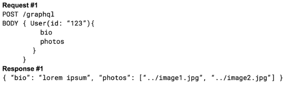

Introduced to the public in 2015, [GraphQL](https://graphql.org/) came out of Facebook as the query language to power their transitioning of the mobile interfaces from web-based to native applications. Since then, it's been adopted by [GitHub](https://github.com/), [Pinterest](https://www.pinterest.com/), [Shopify](https://www.shopify.com/) and others to power their APIs.

The reason? There are many things that set GraphQL apart from RESTful APIs, but the main difference is that the requester has more control over exactly which parts of the response they want.   
  
With a typical RESTful setup, you have to dictate available information as URL endpoints and use the routing of those endpoints, with the request type, to determine what information to provide. If someone wants user info, fore example, they’ll most likely trigger a GET request to /users on your API. Or, if they would like to update the info for user #123, they could trigger a POST request to /users/123.  
  
Alternatively, with GraphQL, _all_ requests are POST requests and only go to a single endpoint. If someone wants user info, or to update a user’s info, they simply pass the operation they want to perform, with any arguments, and provide the schema for the data result. This prompts GraphQL to return only the fields defined with the request.  
  
This means that the API only needs to transmit the specific data that is necessary, while giving the requester complete control over the shape of the data that is received.

There are plenty of other things that make GraphQL a great tool to power your next API, but when we decided to update our [Clickstream Interface for real-time customer insights](https://www.astronomer.io/blog/apache-spark-streaming-for-real-time-customer-insights), we decided to implement GraphQL and open it up as a publicly available API that could provide access to our clients and partners, as well as power our next generation of applications.

### **3 Reasons Why Astronomer We Chose It:**

#### **Query Batching**

The modular approach to GraphQL's schema allows applications to receive more data specific to their needs by defining the shape of their data in the request to the API. With RESTful APIs you normally would have a separate endpoint for each data resource, even if these resources are related to each other.

Let's say I'm making a social web application that has a page in which I need to load a user's bio and the last 10 photos they've posted. Normally, with a RESTful API, specific data is located at different endpoints, like /users/{id}/bio to grab the user bio and /users/{id}/photos to receive the links to their photos. With GraphQL, since all requests go to the same endpoint and I just request how I want my data, I can get the bio and photo URLs in one single request.

So this:

Gets replaced with this:

#### **Joining Rich Data Sources**

GraphQL operates well as a proxy to parts of your data stack. Since each query requires you to write how it should be resolved, you can add custom logic depending on the request and the data needed. You are free to mix different data sources together, no matter how dissimilar, by prescribing exactly how to join that data before is it sent to the application requesting it.   
  
Be it SQL, NoSQL or other APIs, you have precise control on when these sources are tapped and how they are combined. No matter what, the requester will only receive a consolidated JSON response and be none the wiser.

#### **Documentation and Deprecation**

Moving fast and breaking things seems to be a requirement for a new company to keep innovating; however, it's a disaster once you open up control to external applications. Anyone connecting to your API needs to know what is available and when things will change well in advance. GraphQL makes moving quickly much easier with their schema, as it will automatically build documentation from your comments.

Once you mark up comments within the schema, they're available as a requestable part of queries. There are tools that will create documentation from a single GraphQL endpoint to HTML or Markdown—and GraphQL even ships with an interactive tool, called GraphiQL, to explore and run queries while having the developer notes available to you. Deprecating specific queries and fields with a @deprecated flag can alert requesters which parts of your API will not be supported in the future.

### **Watchouts**

With all the cool, new features that GraphQL has to level up your API, there are a few parts that can give you some trouble if you don't expect it.

#### **Setting it up isn't magic**

Most of [GraphQL’s documentation](https://graphql.org/learn/) favors talking about the client-side of connections, so you may start thinking it will do most of the heavy lifting for you. However, it is just as difficult, if not more so, to get a project set up. This is thanks to the need GraphQL has for knowing exactly how to resolve every specific data type within the schema.   
  
With the use of the @deprecated flag, you can help inform connected applications of updates to your GraphQL API, but major changes to your structure can still break things. In order to prevent having to create multiple endpoints or running different versions of your API, make sure to spend plenty of time planning to make sure the API grows with you before you roll it out.&nbsp;  
  
Helpful hint: When you are starting out with GraphQL, read the documentation about [Thinking in Graphs](https://graphql.org/learn/thinking-in-graphs/). This article will help you with thinking about the relational structure of your data.

#### **Authorization is Tricky**

The schema used for the API expects to show every function available with the API, leaving you to handle access outside of what GraphQL controls. Hiding queries that a user doesn't have access to is not a pattern that it supports. It is left up to the developer to create their own methods for restricting access to endpoints or modifying the schema on-the-fly to only include the functionality a user should be able to access.

#### **Rate Limiting is Harder**

Due to the flexibility of GraphQL's natural batching of queries, it's harder to enforce limits. With RESTful APIs, you can rate limit on the amount of requests to endpoints per requester, but a single GraphQL query may ask for an equivalent amount of data that multiple REST calls would. It becomes problematic if one of several resources in a user’s GraphQL request is rate limited. Should the rate limited data be omitted, possibly breaking the hierarchy or logical structure of the data? Would denying the entire request make sense, even if it means potentially hamstringing the entire API? What about always allowing the full request to go through if partially rate limited—does rate limiting have any meaning then? As a result, those desiring to apply limits will just have to get more creative in conserving resources. For instance,  [Github uses a point-based system](https://developer.github.com/v4/guides/resource-limitations/) to keep track of how taxing specific queries will be and refreshes that allowance hourly.&nbsp;If every connection gets, say, 5000 points an hour, asking for the user's bio might only cost 50 points, but asking for the user's repos would cost 1000 points. So it's by no means a dealbreaker—more of a fun challenge.&nbsp;

### **In Summary**

GraphQL provides plenty of improvements to RESTful APIs for dynamic applications, and I highly recommend it. However, like all tools, you should make sure it fits your needs before you wield it. If your applications need to pull data from many different sources, you want to optimize your application speed by only requesting the data you need or you simply need an API that is a bit more forgiving as you grow, then GraphQL may suit you. If you do not have a complex system to provide access to,&nbsp;your system will stay fairly static over time, then the overhead of building out a GraphQL API may be more than what it's worth.

At Astronomer, we're focused on using our new GraphQL API to allow full access to our platform of data engineering tools. This will allow us to continue to create great applications for interacting with our platform, give our users plenty of control to build on top of what we have and fully integrate our solutions into their workflow.

All that said, I have not nearly begun to describe all that you can do with GraphQL or awesome clients like Apollo and Relay that extend GraphQL's capabilities for your application. Learn more on what it can do directly from the [GraphQL](https://graphql.org) site or follow [Apollo's blog](https://dev-blog.apollodata.com) to see great examples and what new features are coming down the pipeline. And let us know what you’re doing with GraphQL!

