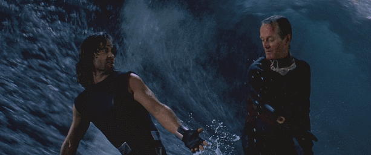

As is perhaps the case at many tech companies, you’ll find a lot of space and sci-fi buffs at Astronomer. In honor of data, space and [the Star Wars movie coming out late 2017](https://www.youtube.com/watch?v=VZSKN312BXw), we want to explore some of the ways science fiction and real life overlap (as far as we can tell). Better yet, how some of pop-culture’s most “fantastic” ideas could actually play out in business.

Here are my top 5 picks:

### _Star Wars: A New Hope_ and Internet of Things (IoT) Data

This seems like an obvious movie choice, but maybe not for the obvious reason. Picture [the Death Star](https://en.wikipedia.org/wiki/Death_Star), a space station so big it was mistaken for a moon. Now imagine the logistics behind a project as large as the Death Star. The data required for and available from such an undertaking must be, well, planet-sized.

Why? For anyone reading this who doesn’t know, Star Wars focuses on a galaxy far far away. In _Star Wars: A new Hope_, the rebel forces are in a life and death conflict with the Imperial forces currently ruling the galaxy. Paramount to this rule is the Imperial force’s newest and most formidable weapon, the Death Star.

The Death Star, according to [the official Star Wars wiki](https://starwars.wikia.com/wiki/Death_Star) is a massive engineering feet:

*     Costing 1 Trillion Galactic Credits
*     160kms wide
*     Powered by a hypermatter reactor
*     Capacity for over 1.5 million crew and soldiers

Just imagine the amount of [IoT](https://searchbusinessanalytics.techtarget.com/essentialguide/IoT-analytics-guide-Understanding-Internet-of-Things-data) data necessary from countless sensors for such an engineering marvel to function—numerous systems all relying on data from one another. Navigation, life support, food and passenger logistics all need to work in sync. After all, those rebel scum aren’t going to defeat themselves…&nbsp;A moon-sized mechanical monster like the Death Star must have used robust models to avoid unscheduled shutdowns and system failures that would have surely resulted in death for everyone on board.

In many organizations that rely on physical fabrication or production assembly lines, predicting machine failure or line shutdowns can be the key to survival. Or at least saving serious money. The collection of millions, potentially billions, of sensor events across an assembly line can be used to predict when a part may fail. Proactively replacing these parts can prevent unscheduled shutdowns and avoid production delays. The more historical sensor data collected, the more accurate the model becomes.&nbsp;While it's certainly a challenge to consolidate that volume of sensor data, with the right technology, it's entirely possible.&nbsp;

### _Back to the Future 2_&nbsp;and Real-Time and Predictive Analytics

In&nbsp;_Back the Future 2_, Marty McFly&nbsp;takes a trip into his own future to put things right that ended up going wrong. With Marty, we explore the possibilities of the far-off year of&nbsp;2015.

While the movie may have been a little ambitious in its expectations for technology (especially if you count time travel), we see some overlap here too. In one scene, Marty and another character, Doc, are getting out of the Delorean in the future Hill Valley. Doc looks at his watch and notes the weather and how long—_exactly_—it’s expected to rain. Accurate to the second, weather prediction of the future promised to be much better than it was when the movie was released in 1989. And while perhaps not to the point Marty's world depicted (yet), technology like&nbsp;[Accuweather's “Minutecast”](https://www.accuweather.com/en/us/new-york-ny/10007/minute-weather-forecast/349727) does offer us some of that knowledge.

But what was required to reach such a point—and what will it take to develop it further? To start, real-time access to weather data and the ability to run complex predictive models against that data. Astronomer provides real-time weather data to customers who want to add it to their analysis, like insurance companies who want to add to improve their pricing models, retailers and e-commerce companies who want to [predict sales](https://business.weather.com/blog/attention-all-shoppers-understanding-weathers-big-impact-on-retail-sale)&nbsp;or airports who want to create great customer experiences, to name a few.

As more data becomes available through advancements in weather tracking technology, weather forecasts will become more and more accurate. It might not be long until we can predict exactly what to expect outside.

It's also important to note here: weather data is only one small example of real-time data. With the right tools, companies can stream almost _any_ data set in real-time to accelerate the most current analytics. &nbsp;&nbsp;

### _2001: A Space Odyssey_ and Machine Learning

If you haven’t thought about how machine learning can benefit your organization, now is the time. In _2001: A Space Odyssey,_ we join the Discovery One and its crew, which was supervised by their onboard AI, HAL 9000. While HAL 9000 (a heuristically programmed algorithmic computer) may be a cautionary tale of the dangers autonomous AI could bring, it happened through exceptional machine learning.

Of course, machine learning as it exists today is less murderous-AI-pursuing-a-mission-at-all-costs and more hugely-powerful-application of existing AI. Relying on a set of user-defined boundaries, machine learning can look at sets of data to find patterns, create segmentations and identify trends that an analyst may overlook. [Here’s a beautiful picture of machine learning](https://www.r2d3.us/visual-intro-to-machine-learning-part-1/).

In the past few years, we’ve seen some amazing things made possible by machine learning. Most of us have probably had Facebook recommend tagging someone in a photo. This user recommendation relies on image recognition and machine learning to recommend people from our friends list.

Another example of machine learning you may not actively see is spam filtering. Machine learning algorithms are commonly applied to email clients to filter out unwanted spam emails without any input from the user.

But my favorite example of machine learning is self-driving cars. A number of different technologies make self driving cars possible; however, machine learning vision algorithms are arguably the most important. How do we teach a car to avoid certain obstacles? By collecting data 360-degrees around the car. The self-driving car sees much more than the average driver and, with the right data sets, can anticipate accidents before they happen. After all, [the end goal of most machine learning applications is prediction](https://www.simplilearn.com/what-is-machine-learning-and-why-it-matters-article). So it won’t be long until we’re sipping on our morning coffee and flipping through our favorite news feed all while safely on our way to work in our self-driving car.

In fact, machine learning can be applied to any organization's data to create highly accurate predictive models, decision tree data discovery and even more advanced artificial neural networks. If you want to read more about some cutting edge machine learning applications, check out [DeepMind](https://deepmind.com/), [IBM Watson](https://www.ibm.com/watson/) and [artificial general intelligence](https://en.wikipedia.org/wiki/Artificial_general_intelligence) (AGI). Sound daunting? Collecting your organization’s data [is a simple first step](https://www.astronomer.io/solutions/complexetl) to building out a robust data science foundation for your business.&nbsp;

### _The Matrix_ and Need for Monitoring

In the 1999 hit _The Matrix_, we follow an anti-social office drone as he learns the truth about his virtual reality. Our hero Neo learns that he is part of a massive computer simulation, which is under police watch by a group known as agents and their leader Mr. Smith. But everything changes when Smith goes rogue and stops operating as a part of the system.

This wouldn’t have happened if the Matrix data had been well monitored, which is of the utmost importance when it comes to data. At the first sign of dissent or deviation from expected norms, you should know when something goes wrong. It could be that an active campaign has unexpectedly stopped, users are no longer engaging with a specific message or maybe your source of data is no longer functioning. A deviation in the expected normal operations of the Matrix allowed Mr. Smith to increase in power and ultimately take over the virtual world, replacing its populous with nefarious lookalikes. Don’t let your data control you by becoming Mr. Smith. Be the Neo of your data: learn\* to control it.&nbsp;

_\*If you're curious about monitoring, you're invited to hear our engineers talk about how Astronomer handles monitoring via webinar on August 2. [It's not too late to register!](https://www.astronomer.io/fireside-chat-monitoring)_

### _Escape from L.A._ and Data Consolidation

Imagine a world with no power or access to technology. No lights, no news, no instant communication. Now imagine a world without data or access to that data.

In _Escape from L.A._, our protagonist Snake Plissken makes a choice to send humanity back to the dark ages by detonating an electromagnetic pulse (EMP) that wipes out all technology across the globe. There is no Slack, no email, no blogs, no real way to connect with anyone outside of your immediate proximity. In this dystopian future, objects exist that could give access to technology, but they’re completely disconnected from power and, therefore, utterly useless.

This inability to communicate is comparable to what happens when companies operate with siloed data. An organization may have 10, 20, even 100 or more tools for everything from data storage to data visualization. But for companies who are unable to connect disparate sources and a gain view of their business—not just snapshots from tool to tool—the data is never used to its fullest potential. Having a data set that isn’t analyzed as a part of a whole is akin to having a light bulb but no electricity: your world is still pretty dark. &nbsp; &nbsp;

When a company “powers up” (read: consolidates) their data, they see into their business, allowing them to not only answer critical questions, but also identify new ones. Like Snake Plissken gave humanity another shot by hitting reset, you can give your business a leg up by connecting all the data you need to get to deeper insights.

 

_\*Snake Plissken and Pipeline upon integrating all of their data sources_

At Astronomer, we love seeing some of our favorite aspects of science fiction become everyday realities and exploring how they impact businesses in any industry. If you geek out over another movie and how it relates to big data today, let us know in the comments! And if this got your wheels spinning about trying out new technologies in your business, [you know who to call](https://www.astronomer.io/contact).

