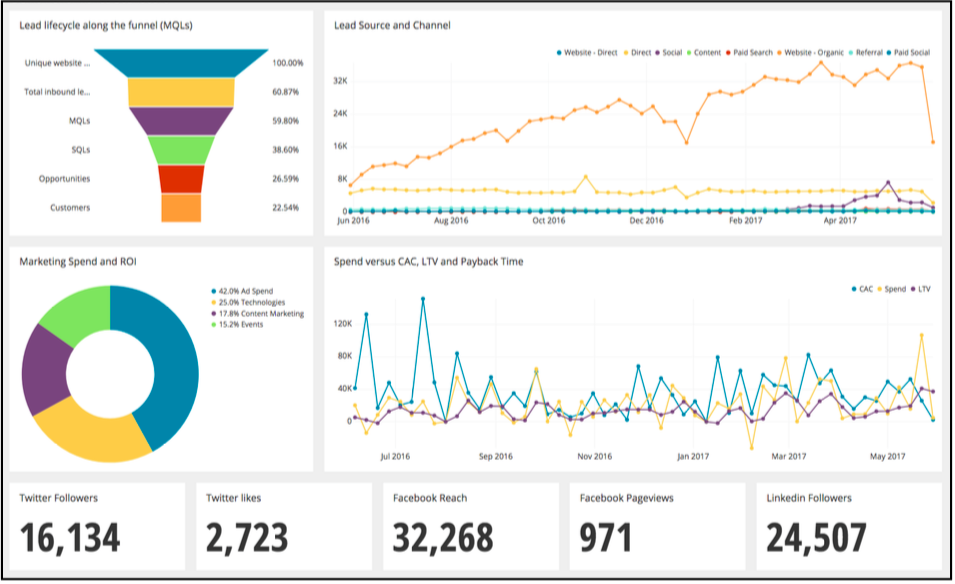
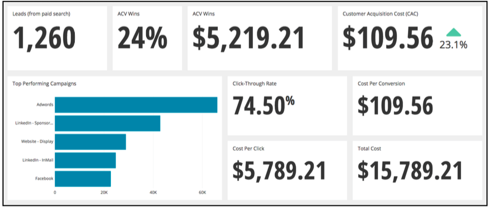
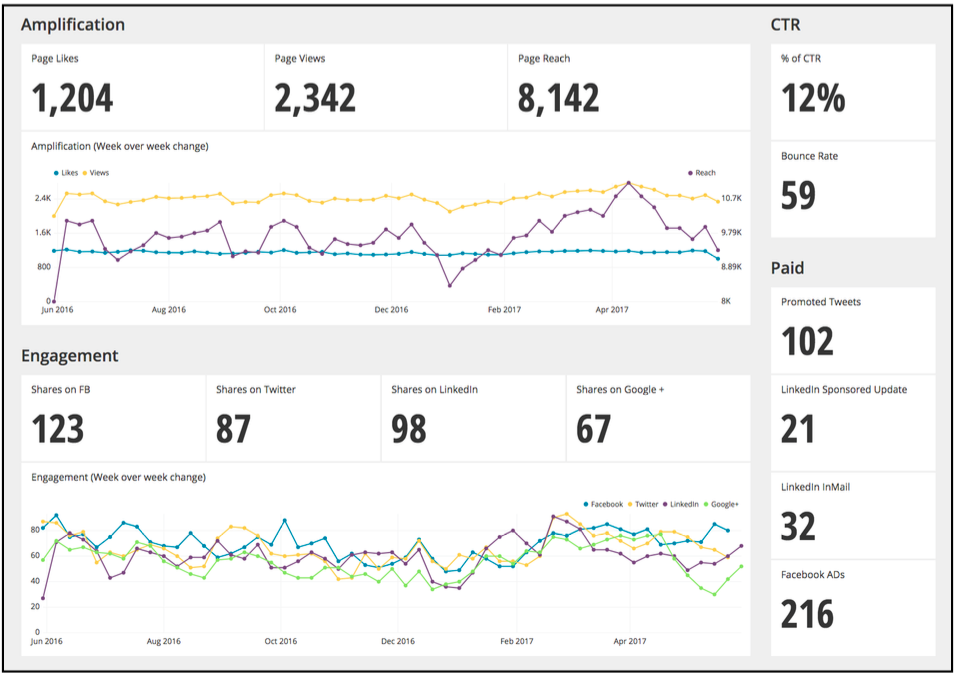
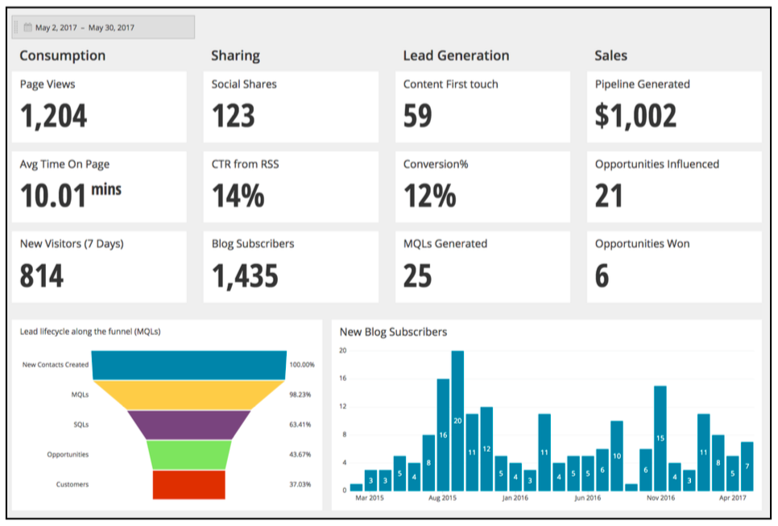
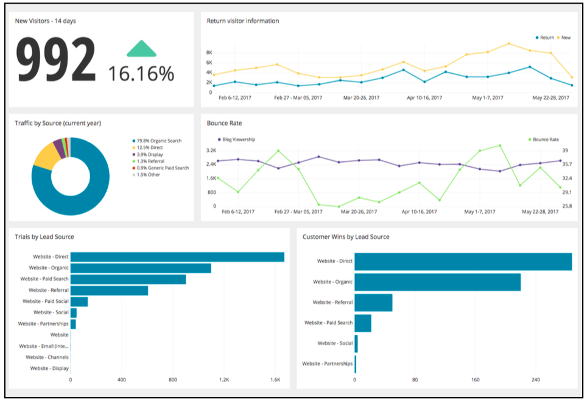

_\*Image thanks to Matthew Juzenas and article thanks to Tina Nguyen, Content Marketing and Strategy Manager at [Chartio](https://www.chartio.com/),&nbsp;a cloud-based business analytics solution that allows everyone to explore their data and create business dashboards.&nbsp;_

Every Marketing team, B2C or B2B, faces similar challenges. They want quality leads, exponential growth at the top of the funnel and a high conversion rate from lead to sales opportunities. Sometimes marketing feels like a rollercoaster ride. These challenges are what drive Marketing teams to think creatively and analytically.

But huddling in conference rooms thinking about ways to generate more leads by leveraging data isn’t enough. As data becomes more voluminous, it’s our responsibility to extract insights from data, create reports and turn those reports into action.

This process may seem arduous, but it doesn’t have to be complicated. At [Chartio](https://chartio.com/), we’ve created a cloud-based data exploration tool for all marketers.&nbsp;Together with Astronomer, you can consolidate data from all your data sources and visualize your data.

### Why Visualize?

According to [Business to Community](https://www.business2community.com/digital-marketing/visual-marketing-pictures-worth-60000-words-01126256#zH8TkrtJuguxgDDh.97), the human brain is more accustomed to processing images, often processing visuals 60,000 times faster than text. Which could [explain the ever-growing popularity](https://www.scribblelive.com/blog/2012/02/23/why-is-data-visualization-so-hot/) of data visualization. With that, we believe the best way to overcome your marketing challenges is to use your data and create dashboard visualizations.

Start by asking questions: what are you doing and why are you doing it? If you’re launching a paid campaign, what goals do you want to attain?, What are the specific numbers that you want to hit? The list goes on.

Once you know your metrics and have a grasp on how your data is defined within your databases (Marketing Automation, email data, CRM, paid channels, etc.), then you can start thinking about the dashboard.

Great dashboards start with your data. [A research study conducted by Google](https://www.thinkwithgoogle.com/articles/marketing-analytics-data-challenges-opportunities.html)&nbsp;revealed that “61% of marketing decision-makers said they struggled to access or integrate the data they need.” Fortunately, with solutions like [Astronomer](/) and [Chartio](https://www.chartio.com/), accessing,&nbsp;consolidating&nbsp;and visualizing your data is easy.

Here are six dashboards that every CMO should know about:

### KPI Dashboard

This sample KPI dashboard is tied to broader business goals. In this example, we’re tracking MQLs, because that’s a high-level company goal and how we calculate overall pipeline revenue.

   

From this dashboard, we can access the health of our top of funnel and drill down into what’s working and iterate on what isn’t working. In analyzing what’s working, we can improve our messaging for low-performing channels and continue to grow the top of funnel pipeline. It’s clear visualization that enables us do this quickly.

### Return on Investment Dashboards

Lead generation is always top of mind for Marketing teams, so measuring overall ROI is close behind as one of their top challenges. To say the least, marketing tactics have always been tricky to measure, and when paired with today’s complex buyer’s journey—it’s all the more difficult. But of course, it doesn’t have to be difficult.

As marketers continue to refine and optimize their campaigns, we’re also getting smarter about capturing data. With data pipelines and dashboards, you can easily consolidate **all** your marketing data and transform rows of raw data into invaluable insights for everyone on the Marketing team.

Here are just a few ROI dashboards that you can create:

### Search Engine Marketing Dashboard

If you’re spending a lot of money on paid channels and search, chances are you’re going to want to meticulously track every dollar spent, so you know how and where you’re spending your money. As marketing budgets continue to fluctuate, the clearest way to prove Search Engine Marketing (SEM) value is through a dashboard, because data is always truthful.

Here are a few key metrics to track in your SEM dashboard:

- **Customer Acquisition Cost (CAC):** The cost to acquire a customer&nbsp;
- **Top Performing Campaigns:** A visualization of which campaigns are leading to the highest conversion, so you know where to focus budget 
- **Leads (from paid search):** This metric is about accurately attributed leads to paid search 
- **Wins (from paid search):** This metric is about accurately attributed revenue to paid search 
- **ACV (of wins from paid search):** Again, aligning your paid search efforts with its impact on revenue
- **Cost Per Click** : The cost that you pay for every click coming from a search engine 
- **Total Cost** : The difference between how much money you planned on spending and how much you actually spent 
   
  

To create an optimal Paid Search dashboard, you’ll need to combine data from your website analytics, search engine data (AdWords, Bing) and CRM data.

### Social Media Dashboard

According to a 2015 report by [Social Media Examiner](https://www.socialmediaexaminer.com/SocialMediaMarketingIndustryReport2015.pdf), “88% of marketers want to know how to measure their return on investment (ROI) for social media activities." With the continued emphasis on social, that number has more than likely grown. A Social Media dashboard contains all the metrics from your social channels, shares, engagements, followers, etc.

   

To create this dashboard, you’ll need to connect data from Marketing Automation, CRM and social channels (Facebook, LinkedIn, Twitter, Google +).

### Content Marketing Dashboard

As Content Marketing continues to grow, metrics provide insights into how content is performing. Taking a page from Jay Baer’s book, content marketers can track consumption, sharing, lead generation and sales metrics all from one dashboard.

   

To create this dashboard, you’ll need to connect data from your Marketing Automation, CRM, content management system, social channels and website analytics.

### Website Analytics

A web analytics dashboard focuses on your web analytics data, detailing specific numbers such as site traffic and time spent on site.

    

Metrics on this dashboard should include:

- **Unique website visitors** : Unique new visitors to your website 
- **Return visitor information** : Even if a person didn’t convert on their first visit, it’s important to know that they came back 
- **Bounce rate** : Tells you where visitors are dropping off, so you can better optimize the page or rethink strategy 
- **Trials by Lead Source** : Traffic source where leads are coming from (direct, organic, paid, referral) 
- **Customer Wins by Lead Source** : Tells you which source led to a closed deal ((direct, organic, paid, referral) &nbsp;

A website analytics dashboard gathers data from several different sources including website traffic, CRM, Marketing Automation, website optimization data and mobile analytics (if applicable).

### Marketing Funnel

A Marketing Funnel Dashboard visualizes the multi-stage process and ascension throughout the marketing lifecycle. It visualizes movement throughout the funnel from Top of Funnel to conversion goal.

Since Marketing encompasses a spectrum of disciplines, nearly every Marketing initiative has its own funnel:

- **Conversion funnel** : Tracks a prospect’s progressions as they move through the funnel and towards the desired outcome such as a conversion to a sales opportunity
- **Customer Acquisition funnel** : This funnel stems from digital marketing data and tracks campaign efforts
- **Content Marketing funnel** : Showcasing when a new contact downloads a piece of content and monitors their journey throughout the buyer’s journey
 

&nbsp;

Regardless of your Marketing team’s structure, funnel charts are essential. To create the above mentioned funnels, you’ll need to combine data from your CRM, Marketing Automation, website analytics and digital marketing data.

### Conclusion

By design, marketing dashboards are meant to deliver insights that drive action and data-informed decisions. To get the definitive guide to marketing dashboards, [download the white paper, The CMO’s Guide to Marketing Dashboards](https://landing.chartio.com/whitepaper-marketing-guide-to-dashboards%20).

