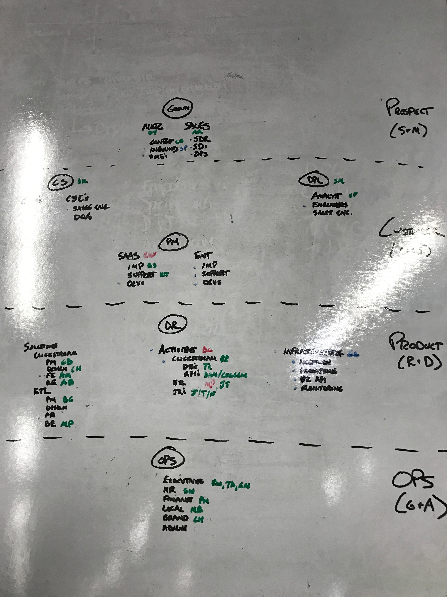

&nbsp;

At the beginning of February, my co-founder and I attended the [SaaStr](https://www.saastrannual.com/) conference in San Francisco. (We’re huge fans of investor and co-founder of SaaStr Fund Jason Lemkin, btw, and [highly recommend his blog](https://medium.com/@jasonlk)). Historically, Ry and I have been heavily influenced at conferences … in a roundabout sort of way. In fact, two years ago, we attended the Collision conference in Vegas. After day 1, we devised a completely new business model—really, a new company (Astronomer!)—and spent the rest of our time there pitching it to anyone who would listen. SaaStr proved to be no exception and by the beginning of day 2, we were camped out in the hallway hammering out a new org chart.

### Why the Change?

Astronomer is in a stage we affectionately call “startup puberty.” The prior two years have been pure scrap and hustle to get enough traction for some product market fit and the basic DNA of a decent pitch. Last fall, we were finally to a point where we could [raise a little venture funding](https://www.astronomer.io/blog/our-unique-path-to-raising-2m-seed-in-the-midwest), which is exactly what we needed to start putting some "real company" structure in place.

Of course, we immediately hired a couple dozen people and thrust ourselves right back into the chaos of redlined growth. But that chaos has been the combustion needed to propel us out of infancy and into the early stages of adolescence. We’re no longer jumping at any revenue that comes along—especially “consulting” revenue. And we’re beginning to talk and think beyond the next couple payrolls and form an image of who we want to be when we grow up.

 

_\*First whiteboarding session for the new org chart_

This is an important inflection point for a company and was new territory for us as founders/leaders. As we worked through what the key metrics of our business would need to be at maturity, we realized our current organizational structure was just flat out unscalable. There was no way we could hit both our revenue and gross margin targets with certain roles structured the way they were.

For example, we had “Account Managers” handling everything from sales engineering (in the initial “discovery” process) to implementation and onboarding to customer success. What constituted “support” was ambiguous and the product team was constantly pulled away from their roadmap and into customer-specific issue resolution. In short, we looked very much like an early stage startup: everyone was doing anything they could to help the org. Not bad when you’re trying to get those first few customers, but a real problem as you start to think about large-scale growth.

### A Plan&nbsp;to Expand

We wouldn't be in business if we didn't expect to grow, so we want to be ready for it in every way. Thanks to some incredibly good advice from one of our advisors, Harsh Patel, we starting working on the press release for our future IPO (a great exercise—we highly recommend it). What would Astronomer look like if we got that big? How many customers at what average contract value (ACV) would we need to justify going public? How many corresponding employees would we need to support those customers? What would those FTEs be doing and how would that affect the all-important gross margin?

As we sat through two amazing back-to-back sessions at SaaStr led by the&nbsp;[Hubspot](https://www.hubspot.com/) and&nbsp;[Veeva](https://www.veeva.com/)&nbsp;founders, the lightbulb went off for us. Both companies are publicly traded and have huge revenues, but Hubspot has thousands and thousands of customers while Veeva has less than 500. It didn’t take long for us to agree that at our core, we are much more like Veeva than Hubspot—fewer, larger customers with whom&nbsp;we focus on building long-term and expansive partnerships.

As we worked through how future Astronomer would operate, we began to form a key organizational philosophy: specialization vs. generalization. To earn the trust of large corporations and expand contract values to the level we desired, we would need highly focused specialists from product engineering to Customer Success. Like a high-end restaurant, we would need experts at every level concentrating on executing their function perfectly.

Right from the beginning, we had ideas about how this could look: one of Astronomer’s most popular customer use cases is our [Clickstream](https://www.astronomer.io/solutions/clickstream) solution for digital marketers. In our new organizational structure, we have a small team of four (soon to be six) people dedicated to building out this solution, which is really just a specific implementation of our core platform with use-case specific integrations and features. This team is composed of a designer, a product manager, two front-end engineers and two back-end engineers. Each person has a specific function, but they work together to accomplish the Clickstream squad’s overall function.

There is nothing earth-shattering about this, but it was a new way for us to operate, and it began to reveal a clear pathway to scalable growth and high margins. After several hours of configuration, we put the finishing touches on our new org chart in San Francisco and prepared to disseminate it to the team back at Cincinnati headquarters.

### Making It Happen (And What We've Learned So Far)

The only thing nagging at me was the expectation that there could be complications and a bit of system shock with the changes. I just didn’t know what to expect with a team of 30—many of whom had only been around for 4 - 6 months. Like a good team does, most people simply rallied together to figure out new roles, transition plans, etc, without dropping anything from their already stacked plates. But there were some hiccups and a few new lessons learned:

#### Lesson #1: Handle with care.

As much as we don’t want to admit it, roles and titles deeply impact a person’s sense of identity. Even in a startup where roles can often be ambiguous and rapidly changing, people almost instantly attach a level of meaning and self-worth to their title or function. So translating a list of titles on paper to the people wearing those titles is a delicate matter.

If you’re considering a re-org, I would strongly encourage you make sure you get facetime with individuals whenever possible and be strategic about how you communicate the changes. Define the new role clearly and give people the chance to ask questions and process with you. It takes some time, but it’s important. That leads to another lesson:

#### Lesson #2: Purpose (the “why”) matters.

Everything is at some level “sales,” and this is no exception. When implementing a re-org, you are absolutely selling a brand&nbsp;new vision to your team. So when&nbsp;you’re defining new roles, explain _why_ this is happening in the first place. Provide overall and specific context for the changes. I started each conversation with the bigger picture explanation of our journey to “scale” and what would need to be true. I discussed the realities of gross margin in SaaS and how we would likely end up going down a service-heavy and low margin path if we didn’t isolate certain functions and create specialization. Then I focused the discussion on how their specific role fit into the puzzle and why it mattered.

I think that creates a level of trust and communicates how much we value our people, but it also has an unexpected benefit: feedback. The truth is, the org chart we brought back from SaaStr was only 80% complete. The remaining 20% was driven by changes and additions suggested during these individual conversations. Gold.

#### Lesson #3: Get out ahead of the rumor mill.

The final lesson I’ve learned through this and prior re-orgs is that quick and thorough communication is critical to proper adoption. Like any communication, as it makes its way from person to person, there’s a loss of the original message’s integrity. With something this important, you want the details coming from the source. And that means you have to move swiftly. I designed a plan of attack (ie. set up a million meetings for our first day back) so that I could make sure just about every person heard the story from me directly within 24 hours. And if I didn’t have the chance to discuss in person that first day, I sent direct messages that night.

Today, we are in the process of slowly migrating to the new structure. Some teams formed quickly and easily while some will takes weeks or even months to fully establish. We also have a ton of [new hires](https://astronomer.recruitee.com/#/) to make, as specialization creates lots of “holes” in the old system that need to be filled. But I’m optimistic that the team is generally aligned and on board with the new structure and that we’re headed in the right direction for future Astronomer.

Of course, planning ahead is important. But now scaling, the truly hard part, actually begins… stay tuned for more about this journey. And if you have had some major wins or learnings in your own organizational structuring, please leave us a comment. We are hungry to learn as much as we can as we grow.

