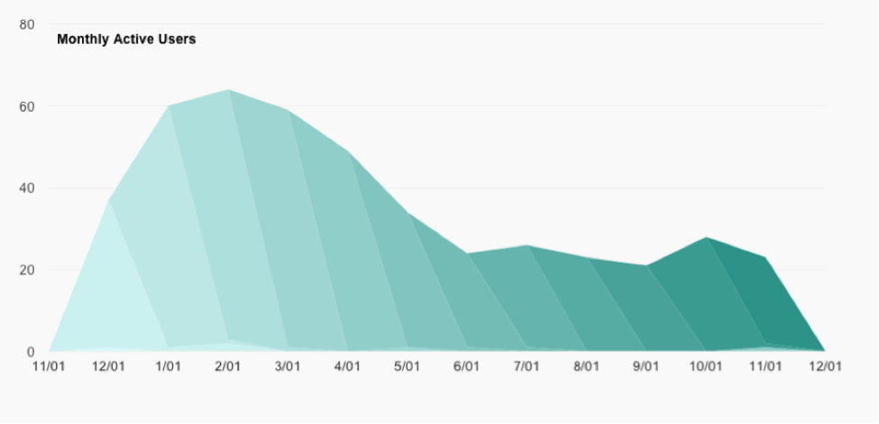
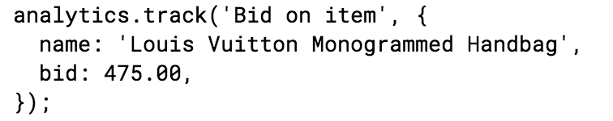

Astronomer is a data engineering platform that collects, processes and unifies users' enterprise data, so they can get straight to analytics, data science and—more importantly—insights. We make it easy to capture data from any source and send it to any location, from a custom dashboard for visualization to a database for analysis.

Data is becoming the most valuable resource a company owns, and building pipelines that can accommodate all of a company's use-cases while easily scaling is a challenging problem. We’re lowering the barrier to entry for anyone who wants to put their data to work.

Astronomer’s core comprises an API and the tooling to help our customers use powerful open source tools including Apache Mesos, Apache Airflow, Apache Spark, Apache Kafka and others. Users can simply point and click to set up a pipeline or dig in and write some code, while we stay out of the way, though of course, we’re always there with dedicated support.

### Blasting Off

Astronomer is still young, and like all young technology companies, we’ve already had some interesting pivots and stack changes. We started out as an analytics/visualization company focused on user retention. We prototyped some fun visualizations into a web application, and immediately noticed our customers struggling to get their data into the system.&nbsp;

As our quest to accelerate customer insights began, we decided to focus our attention on the biggest bottleneck: data pipelining.

Our first challenge was getting data out of customer applications in the form of user event data, or clickstream data. We used an open source SDK that app developers could install in their applications, which would send us (and our integration partners) events about how their users were interacting with their app over time. In a JavaScript app, the code might look something like this:&nbsp;

Developers could quickly start tracking new users, pageviews or other important user-application interactions. On the front end we provided a web application, which let users enable and configure connectors that forwarded events to other SaaS products (Analytics, CRM, Marketing, etc), as well as data warehouses like Amazon Redshift. To handle all these events on our backend, we needed a scalable way to ingest large volumes of event data and turned to AWS managed services.

We decided to build our ingestion API using AWS Lambda (Amazon’s “serverless” compute offering) and AWS API Gateway. We quickly prototyped and deployed a JavaScript function to handle all of our incoming requests. API Gateway mapped incoming HTTP requests to our configured Lambda function.

Our Lambda function ran some basic logic and forwarded the events to an Amazon Kinesis stream, which allowed us to ingest large amount of event data very quickly and reliably. Kinesis consumers deployed to AWS Elastic Beanstalk ingested the data from the streams and operated independently, autoscaling as our traffic increased.

AWS-managed services gave us an incredible head start. We were able to quickly prototype this entire system with minimal engineering time and quickly turned our attention in a new direction.

Many of our customers wanted their processed data pushed into Redshift because of the flexibility it gave them to slice and dice their raw event data. Soon, customers started asking us how to get data from application databases (MySQL, MSSQL and Mongo) and SaaS tools (Salesforce and CRMs) into Redshift as well, so they could query across multiple sources. We started building a platform to execute these modern ETL (Extract, Transform and Load) tasks.

Addicted to the rapid development pace on AWS, we reached for a lesser-known product called AWS SWF or Simple Workflow Service. ETL was one of the use-cases listed, so we quickly picked it up and started building. We immediately hit several roadblocks with this system. It was difficult to monitor and was, as the name implies, very simple. A lot of functionality would still have to be built around the service to be able to provide anything of use. There was no way we would be able to scale using SWF. [Our luck had ran out with AWS managed services, so we plunged into the ocean of open source projects for help](https://www.astronomer.io/blog/why-we-built-our-data-platform-on-aws-and-why-we-rebuilt-it-with-open-source).

### In-flight Adjustments

While poking around for an ETL scheduling system, we stumbled upon Apache Airflow (incubating), a project that has roots at Facebook, but later manifested out of Airbnb through [Maxime Beauchemin](https://medium.com/the-astronomer-journey/airflow-and-the-future-of-data-engineering-a-q-a-266f68d956a9). Airflow is a platform to programmatically author, schedule and monitor workflows. Its core is a DAG (Directed Acyclic Graph) scheduling system that does a great job at executing tasks as it walks through a dependency graph. It’s flexibility allows users to customize almost every major behavior.

Our customer DAGs are currently represented using JSON, stored in MongoDB. It was simple to integrate our existing DAG representation into Airflow. The next big question was how to scale beyond our laptops. Airflow has a notion of an executor, which allows users to control where their tasks run. It ships with a few built-in executors and also gives users the ability to create their own through its plugin system. The simplest place to run tasks is on the same machine as the Airflow scheduler with the LocalExecutor. To scale out, Airflow ships with a first-class executor for Celery (a distributed task queue that can run on top of RabbitMQ) and a community contributed executor for Apache Mesos.

At this time, we were focused on getting Airflow to work, but we had much larger plans: to be an all-encompassing data processing engine that could run anywhere and do anything. In addition to running Airflow, we wanted to run Kafka, Ceph, Alluxio, Cassandra, Spark, Drill and more. Mesos acts as a distributed kernel for frameworks like Airflow, as well as container orchestrators like Marathon. The ability to run containers on the same platform with data services would give our stack the flexibility and portability we needed to realize our plans.

Mesos and Airflow were looking like a perfect match. Airflow would take care of executing tasks at the right time, in the right order, while the executor for Mesos would run our tasks wherever it could in our cluster. The next step was to get a Mesos cluster put together and try this thing out.

Deploying a Mesos cluster seemed like a bit much to bite off at the time, but we quickly discovered DC/OS and the AWS CloudFormation template. Within a few minutes, we had a perfectly healthy Mesos cluster fired up and ready. Woo!

Getting Airflow to run was relatively straightforward with only a few minor snags. We quickly packaged it up in a Docker container and deployed it to the cluster using a DC/OS Pod. We were able to visit the Airflow UI and monitor the scheduler, but tasks were failing to execute on the agent nodes. DC/OS on AWS uses CoreOS as it’s host OS, and our tasks were failing because it was trying to execute airflow run… commands on nodes that didn’t and shouldn't have Airflow installed. A simple fix was to fork the Mesos executor and modify it to execute the command inside of our Airflow container.

In a relatively short time, we were able to put together a massively scalable distributed DAG execution system that could easily integrate with the rest of the tools we were planning to use. We then realized that our entire stack could be picked up and moved DC/OS. Apache Kafka is a first-class citizen on DC/OS and could easily be swapped in to replace our Kinesis streams. Our stream processing applications could be adapted to pull events from Kafka with a few minor adjustments and then deployed and scaled with Marathon. The rest of our supporting microservices could also be easily deployed using Marathon. DC/OS seemed like it could support, in one way or another, all of our data processing needs at the current time and well into the future.

### Hitting Some Turbulence

A few of our services didn’t have a direct, obvious mapping over to DC/OS though. For example, our current system relies on online persistent data stores like MongoDB and Redis. There were packages for these services in the DC/OS universe, but they were a bit out of date and seemed unmaintained. We haven't yet decided the best way to store data for these services, and are considering a couple options. We could deploy clusters and rely on replication between containers to ensure we lose no data, or we could mount external volumes with external vendors or our own Ceph cluster. Currently these systems are provisioned separately, outside of our DC/OS cluster, while we determine the best course of action.

To run our whole stack on DC/OS, we would also have to ditch AWS Lambda and API Gateway and roll our own system to run our high-traffic event API. [We’ve re-written this API in Go](https://www.astronomer.io/blog/scaling-off-aws-exploring-go-for-high-performance-services) and are currently experimenting with horizontally scaling it behind the open-source Kong API Gateway on Mesos. Kong is giving us the ability to offload authentication, rate-limiting and logging while we focus on our business logic.

While running on AWS we relied heavily on Cloudwatch to aggregate our application logs and monitor our streaming pipelines. We decided we wanted to use the Elastic stack (ELK) as our centralized logging system on DC/OS, but have since run into a few minor issues scaling it out. We’re currently running ELK on Marathon and have gone back and forth with keeping the data on mounted EBS volumes and just writing data inside the container, relying on replication between the containers.&nbsp;We are planning to experiment with Ceph as an alternative next—and&nbsp;explore the new Elastic Framework that was just released.

### Achieving Orbit

Migrating to open-source tools and DC/OS has been relatively straightforward and we’re taking the migration as an opportunity to refactor the way our data processing engine works along the way. We knew when we got into this that we were taking on more operational load by managing our own servers and services, but we’ve gotten away with a relatively small operations team, thanks to the abstractions and pre-configured services that come out of the box with DC/OS. We hit some issues on our first iteration using default settings so we’re rebuilding our DC/OS infrastructure with Terraform to completely customize our installation.

As we grow, we plan to offer our customers the option of running on any infrastructure including GCP, Azure and VMware. DC/OS has given us the flexibility to host our SaaS anywhere and given us the ability to manage private installations for some enterprise customers. It took some time and effort to decouple from AWS, but Astronomer is in a much better place and we’re glad we did it before we got too deep.

