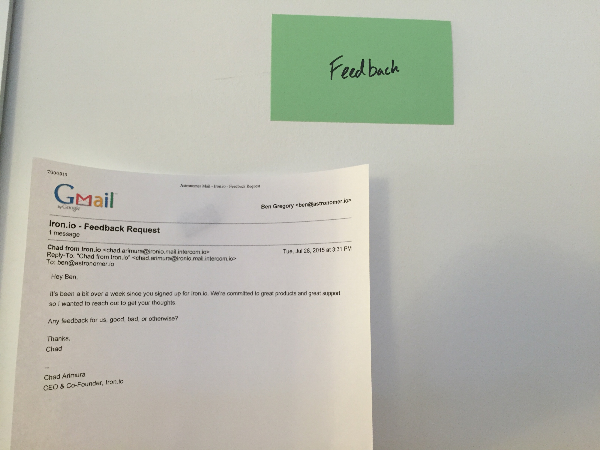

The [last post I wrote](/blog/a-hero-a-priest-and-a-drunk/)&nbsp;re: email personalities/archetypes/whatever you want to call them got a fair amount of attention so I thought I’d do a follow up post to go a bit deeper on how we came up with the marketing archetypes and why we're confident they're universally true and will absolutely never be contradicted or changed (_until they inevitably are..._)  
  
Say hello to the Email Wall.

Yep, that’s right. I did a panorama shot and this STILL isn’t all of the emails that we have up there. Let's see your CTR take this into account. Not only do we read your emails, we print them up and decorate our freaking office with them. If we sign up for one of your services [which we will], and you have a drip email campaign [which you do], you can be sure that your email is on our wall.   
  
We’ve made a study of it and the trends are interesting. The biggest insight is (perhaps sadly, if you’re one of these companies) that no one's marketing tactics is as original as they might think.

### **Creating your own wall is super simple**

The green cards are category emails that are 'triggered' based on certain actions within the app. This can become an unwieldy behemoth fast because every app delineates the stages of their activation funnel slightly differently. That being said, there are always a few that nearly every company uses. Here's a quick guide on how you can get to work building your own Email Wall.

- **Welcome emails -** Pretty Self-Explanatory. Let's dig deeper.
- **Polished Welcome -** The initial polished email that is sent to you when you first sign up for a service with a lot of custom graphics and bravado. This was the inspiration for the 'Hero' archetype and, while it's certainly not bad at all to send these emails, this is _the_ most common email that will be sent and is quickly becoming white noise. Think of it like the sidebar ad, not completely ineffective but it has certainly had better days.
- **Personal Welcome -** Just as Impressionism emerged as a personal meta-expressionary reaction to the cold, objective Romanticism, so too the personal welcome emerged as a subversive reaction to its polished counterpart. This is, obviously, the Priest archetype. Instead of more white noise, this would be received as a unique, real connection. Unfortunately, it too is becoming far overused and quickly becoming as common as the polished welcome. C'est la vie.&nbsp;
- **Stuck? -** Every (good) SaaS company has an ideal set up process for you to go through to understand their product and unique value proposition. Especially for analytics platforms, if you don't finish that process, you probably aren't going to get much value out of that tool. And if you're the owner of one of these tools, you have an enormous incentive to get users through this funnel before the trial runs out. Without naming names, I had one company send me essentially the exact same email 5 days in a row to get set up. I admire their persistence but the definition of insanity is doing the same thing over and over again while expecting different results. Try switching up the tone and content to see if something else might work better.
- **Tutorial -** The really good companies will go beyond just asking if you need help and actively send you action items via a set of tutorials to explore. This inspired the "Fool" archetype and, again, that's not meant as an insult. It just struck us as such a crushingly optimistic idea that companies, who had to know how woefully low CTRs can be, would still(!) choose to develop such thoughtful content and not be deterred by the majority of their audience archive/deleting it without a second thought. Would you call Frodo a fool? Hell yes, but it's how the ring got destroyed, amirite?

Not in the above photo is a lone category that is so depressingly sad a reality to come to terms with that I debated even including it in here. What is it, you ask? It’s simply asking for feedback. If you read my last post, this email should look familiar.   
  
   
  
We think getting feedback is absolutely critical at any stage of your company and are honestly kind of surprised by how few companies actually reach out. This was the last archetype, named the "Squire" for the humble service it performs to keep the wheel of innovation turning. Also, it kills me to say it Chad…but you kinda do look like the squire...

> [@chexton](https://twitter.com/chexton) [@astronomerio](https://twitter.com/astronomerio) [@getvero](https://twitter.com/getvero) [@heap](https://twitter.com/heap) [@getiron](https://twitter.com/getiron) Boom. The Squire. People tell me I actually look like this squire. [pic.twitter.com/undC5vPY5k](https://t.co/undC5vPY5k)&nbsp;— Chad Arimura (@chadarimura) [August 7, 2015](https://twitter.com/chadarimura/status/629703818259755008)

In all fairness, I have gotten a few emails asking for feedback besides the one above, but those are universally sent when I haven’t logged in after a while or are sent within the context of a soon-to-expire trial. Unfortunately, I’m not counting them because they fall into one of the already created categories, but kudos to those do include them.  
  
**Company Categories -** You'll notice that aside from the green cards, there are also yellow cards. These are maps of specific companies and it can be incredibly useful to see how they manage their own messaging. Use cases could be companies you admire, companies you're trying to partner with, or even (read: especially) with your competitors. BUT be careful with these because they are a devious sinkhole. You think it'll be as simple as putting up their welcome email, a check in message, and a notification that your trial is ending. But then before you know it, you're reverse engineering their entire event triggered drip campaign. Suddenly your clean, linear email progression turns into a hellish spiderweb of conditional possibilities. You want high level knowledge of what companies on average are doing. Once you start mapping exact email progressions, you've probably gone too far.   
  
_One interesting note:_ As it turns out, drip email companies tend to be pretty aggressive with their drip campaigns if you don’t fully complete their set up process. Who would've thought?

Feel like testing out the email wall yourself? Hit me up at ben AT astronomer DOT io or yell at me on [Twitter](https://twitter.com/benbeingbin)&nbsp;and let me knows how it goes! Honestly, we get a kick out of other people using our crazy techniques in their own workflow so I promise I'll respond.

