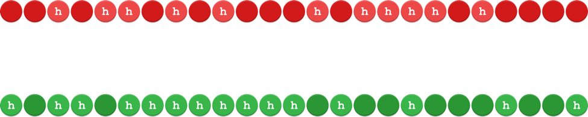
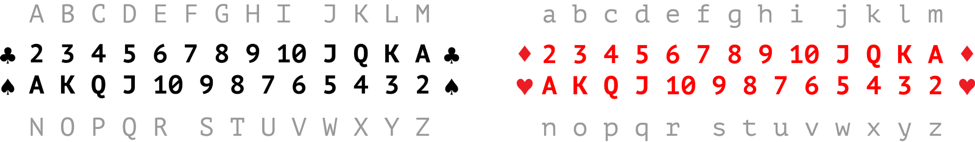

### Or, how I used a deck of cards to protect my data.

Every year, our data becomes more accessible as the world is increasingly interconnected and more services we depend on become available online. This allows for an ease that was unimaginable just twenty years ago. You can bank, apply for a mortgage and credit cards, share personal photos, store important documents and get a real-time view into your home at any time.

However, with all of this online ease comes a higher incentive to gain access to this data. McAfee reported that the [total losses due to cybercrime in 2014 was between $375 billion and $575 billion](https://www.mcafee.com/us/resources/reports/rp-economic-impact-cybercrime2.pdf). There are even marketplaces for thieves to sell [individual credit cards, personal data and access to online accounts](https://www.mcafee.com/us/resources/reports/rp-hidden-data-economy.pdf).&nbsp;

Our main defender in the battle against malicious online attackers is the lowly password, but its job gets harder every year. The tools available to break in only become more sophisticated over time. Faster computers shorten the moments it takes to simply guess a password, but there are also shortcuts that speed up the process significantly. [Dictionary Attacks](https://en.wikipedia.org/wiki/Dictionary_attack) cut down the time it takes to guess passwords made up of words while [Rainbow Tables](https://en.wikipedia.org/wiki/Rainbow_table) use passwords that have been broken into before to instantly gain access to an account with the most minimal computer effort.

At this point, you may feel that it is inevitable that someone will eventually guess your password. And it’s true, it’s only a matter of time. The trick is to have a password so unique and hard to guess that it takes someone eons to actually crack it.

The likelihood that you are using a such a password right now, however, is slim. [WP Engine's review of 10 million passwords](https://wpengine.com/unmasked/) shows how we tend to use the same techniques as other people. But even if we create a password that uses the least common parts of that report, it is still predictable enough to leave us vulnerable. Instead let’s throw predictability out the window and&nbsp; leverage the unpredictability of nature to guard us.

In this article, we’ll explore methods that capture some of the absolutely unique and random data that flows around us all the time, and how we can turn it into a strong defense.

### Humans are Naturally Too Predictable&nbsp;

Before we get into these methods, though, let’s discuss why we are bad at creating strong passwords in the first place: we are awful at being unpredictable. When we evaluate randomness, we do it by looking at the patterns it creates. For a real-world example of how bad you probably are at being random (no offense), write out a hypothetical outcome of 25 heads-or-tails coin flips. Then, flip an actual coin and compare the results.&nbsp;

If you don’t feel like doing it yourself, I got you covered below. Since I don’t have a coin on me I’ll be flipping a piece of generic “Heads & Tails” chocolate candy 25 times.

The red candy was created by me trying to be as random as possible and the green candy shows the results of flipping a piece of candy 25 times:

While 25 flips is not enough to truly tell if something is random, it can still illustrate the differences between the two methods. When we attempt to emulate randomness, [we tend to avoid repetition and tend to repeat groups of characters](https://citeseerx.ist.psu.edu/viewdoc/summary?doi=10.1.1.211.9085). This is noticeable within the red candy where there is a heavy amount of single runs that are back-to-back and never longer than 4 candies. Comparing this to the green candy, where there is a run of 8 candies and only an occurrence of 1 run back-to-back with another.

This self-sabotage is more apparent for the longer strings you create. If we were, for example, going to guess the flip of an M&M™ 250,000 times (I’m not typing that), we would likely see the totals of heads to tails would be disproportionate from each other.&nbsp;

When we consider the effects of this trend on a passcode, it's no surprise that patterns, like popular words, can be expected—and therefore exploited—by computers that can guess thousands of words per second. By leveraging randomness, though, we can block any shortcuts and greatly increase the effort it takes to guess a passphrase.&nbsp;

### Harnessing the Power of Real Randomness

There are many tools available to help generate random sets of characters, including digital services. It is [arguable how random digital tools can be](https://www.random.org/randomness/) when creating random characters, since they utilize software that by its nature cannot be random. Suffice it to say, however, there are plenty of good tools that can create safe passcodes for you automatically. But for this article, let’s focus on a source of unpredictability in the world, instead of software.

Consider: What is the likelihood that the combination of 20 license plates at the grocery store right now will ever occur again? How about combining the third word of the 42nd page of every book in the room you’re in?

I tend to find games of chance as a trustworthy source of randomness and unpredictability, especially playing cards. Did you know every time you shuffle a deck of cards, the odds are extremely high that [you are the first person in history to ever hold that combination](https://ed.ted.com/lessons/how-many-ways-can-you-arrange-a-deck-of-cards-yannay-khaikin)? So, for the example of this article, let’s use the untold power of using playing cards to be completely random.&nbsp;

The only catch to harnessing any source of non-digital randomness is that there has to be a way to directly translate data into the digital world. For instance, you cannot use “shapes you see in the clouds” as a way to generate random data. Even though the clouds are random, you still need a way to digitize it.

#### Translate that Randomness into Computer-Speak

So how do we translate a deck of cards from our world to the digital one without losing what makes it random? By making sure your random is random.

Seems like a silly phrase, but you must make sure that what you use is an actual example of randomness. For example, using a full sentence from your favorite book as a passphrase wouldn’t be truly random since the English language is based off of patterns.

For cards, the best thing you can do is use an old deck. We are looking for cards to be shuffled as well as possible in order to have the most unique combination. If your deck has gone through years of shuffling for every game played on it, it takes some preparation out of this step.

If your deck is new, you can get unpredictability into it by using the [Corgi Shuffle](https://en.wikipedia.org/wiki/Shuffling#Corgi_shuffle) method.&nbsp;

_\*Corgi Shuffle illustrated. Source: [https://giphy.com/gifs/corgi-rDRZc3VRmiKGI](https://medium.com/r/?url=http%3A%2F%2Fgiphy.com%2Fgifs%2Fcorgi-rDRZc3VRmiKGI)&nbsp;_

The Corgi Shuffle is simply spread all the cards out, face down, on a table and move them over each other repeatedly. You will want to do this several times, making sure to move all the cards around and that you are moving cards under each other as well. By doing this several times, we force any patterns that existed from when the deck was packaged. This will limit sequential runs of cards, such as 3, 4, 5, 6, 7 of the same suit, and will get us the randomness we need.&nbsp;

#### **Establish Your Rules**

Next, make sure the same amount of data within the cards is reflected within the password. This can be accomplished by making a [cipher](https://medium.com/r/?url=https%3A%2F%2Fen.wikipedia.org%2Fwiki%2FCipher) that will translate the card’s suit and value into characters a computer will recognize.

Since we are using 52 playing cards, we can use the 26-letter alphabet to encode our passphrase. By using lower and uppercase letters, we get exactly 52 possible results, which allows us to keep the full amount of randomness.

Here is an example of a cipher you can use to create your random passcode. You can change any of the details you want as long as you make sure that each card has it’s own specific letter:

Using this cipher, I laid out a newly- and thoroughly-shuffled deck of cards and got this new passcode: FvXpuaYNwTZNDQgAqrJonWHxPIvpcyFRjlasbtdGXLhEKiSOuYVm.

#### **Use the Wildcard**

Have a Joker in your deck? Even better! You can assign the Joker to be a number or special character, and shuffle it into your deck. Each variable you add to the cards just makes it that much tougher to crack. Here’s my passcode with the Joker variable: FvXpua!YNwTZNDQgAqrJonWHxPIvpcyFRjlasbtdGXLhEKiSOuYVm.&nbsp;

#### **Watch Your Bias**

It’s easy to see parts of your newly-generated passcode and think that parts of it are not random. Maybe you see that it spells a word, or that some characters are repeated close to each other.

But don’t fret, it’s still randomness that you are seeing. &nbsp;Just do not change any of the characters on your own, as you might accidentally add predictability back into it. If you aren’t confident in the results, just shuffle and do it again.

#### **That’s It!**

Great, now you have a 52-digit long passcode. Let’s see how secure it is by using the online tool [How Secure Is My Password](https://howsecureismypassword.net/).

If you keep all 52 characters within your passcode, it will take 135 duovigintillion (135\*1069) years to crack (test mine out, if you want!). Comparing that to the [age of the universe](https://en.wikipedia.org/wiki/Age_of_the_universe) at 13.7 billion (13.7\*109) years, it is more likely that all computers attempting to crack your passcode [will be engulfed by The Sun](https://phys.org/news/2015-02-sun-wont-die-billion-years.html) before they are successful.

Now, let’s say a 52-character long password is too long. I get it, we’re all human, and long strings of nonsensical information are hard to remember. Even when you cut the string in half (FvXpuaYNwTZNDQgAqrJonWHxPI), it will still take 327 septillion years to break. In which time, our friend The Sun will still have destroyed anyone with malicious intent.

However, keep in mind that length is still your friend. Cutting&nbsp;that string down to 16 characters only provides 4 million years of a head start and 8 characters long will only take 42 minutes to crack.&nbsp;

And that’s with one modern computer. As computers become faster, the ability to guess your password become quicker. With the advent of quantum computing, [with speeds more than 100 million times faster than your current computer](https://www.sciencealert.com/google-s-quantum-computer-is-100-million-times-faster-than-your-laptop), that 4 million year lead becomes 14 days really quickly. My point is: the more digits, the better.

### Keeping Your New Password Safe

The most important part of your new password is to prevent people from figuring it out. Here are some tips to make sure you practice good sanitization techniques and keep your password safe.

#### **Don’t Provide Clues to Your Passcode**

A passcode is only as secure as it is secret. Don’t keep it written down, and try not to save it in too many places. Also, don’t rely on your browser’s built-in password manager, as they tend to have [security vulnerabilities](https://www.wired.com/2016/08/browser-password-manager-probably-isnt-enough/).   
   
 To keep track of these long and complex passcodes, you can use a dedicated password manager like [Dashlane](https://www.dashlane.com/) or [1Password](https://1password.com/). Although not perfect, they tend to be the more secure way to have passwords managed for you across devices.&nbsp;

#### **Keep&nbsp;Your Passcode Moving**

Even if you feel confident you’ve landed on a truly random passcode, it’s a good idea to change your passcodes regularly. Since security breaches can happen at even [the biggest companies](https://fortune.com/2017/01/23/yahoo-sec-data-breaches/), don’t use the same password for multiple services. That way, if one becomes compromised, nobody gains access to the rest of your accounts.&nbsp;

#### **Use This Method Only If It Works For You**

Keeping a passcode in your brain is the best way to keep it secret. However, passcodes are not very memorable.&nbsp;Instead, [you can use a] (https://lifehacker.com/5893510/using-common-phrases-makes-your-passphrase-password-useless-heres-how-to-pick-a-better-phrase)[*passphrase*](https://lifehacker.com/5893510/using-common-phrases-makes-your-passphrase-password-useless-heres-how-to-pick-a-better-phrase)_._ A passphrase is a grouping of words to create a password. Now it may not be as secure as passcode, but groupings of 6 to 8 words will take octillions of years to guess correctly.  
   
 If you prefer passphrases, I recommend that you use a technique called [Diceware](https://en.wikipedia.org/wiki/Diceware) that uses dice to help you create one that is unique. It combines the easier way of remembering passphrases with the unpredictability of the real world.

Even better, you can use your new passphrase for a Password Manager, and have the manager remember all of the complex passcodes for you.

#### Leverage Other Types of Authentication

Of course, the more layers of safety you have for your passwords, the harder you will make it for anyone attempting to break in. If you use a service that has two-factor authentication, usually by entering a password and typing a code that is sent to your phone, you should enable it in case your password is cracked or leaked.

### In Conclusion

Password security is paramount, and only long, unpredictable passwords can be trusted to last long in this digital age. If you don’t feel like using a deck of playing cards to make your password, there are [plenty of good methods out there to create something just as strong](https://open.buffer.com/creating-a-secure-password/). But just as important as creating a tough password is using it correctly.

Prevent yourself from keeping your password somewhere, either written or digital, where it can be accessed, use different passwords for different sites and change your passwords often in order to prevent as much damage as possible even if your password is figured out.

It may seem like a lot of work, but your online data is only becoming more valuable as time goes on ... and passwords only become easier to crack. It’s time to rely on a good lock—not just the door itself—to keep people out.

