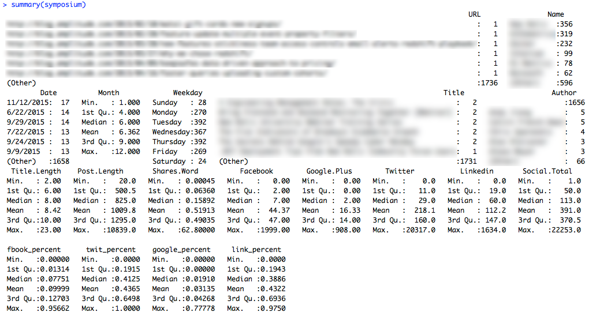
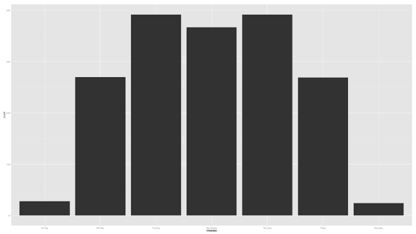
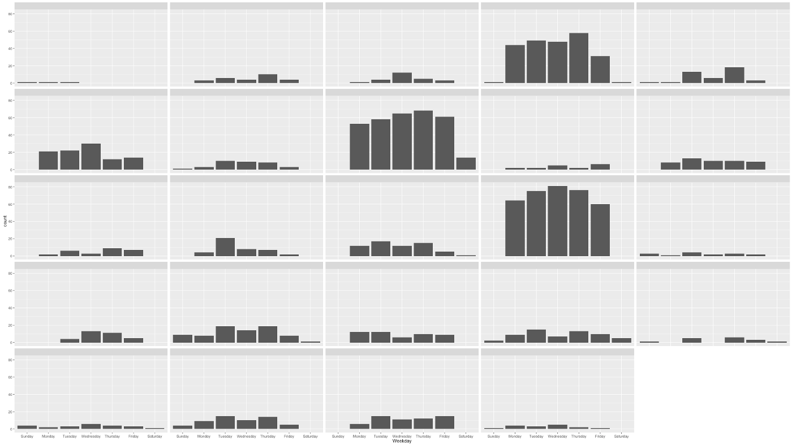
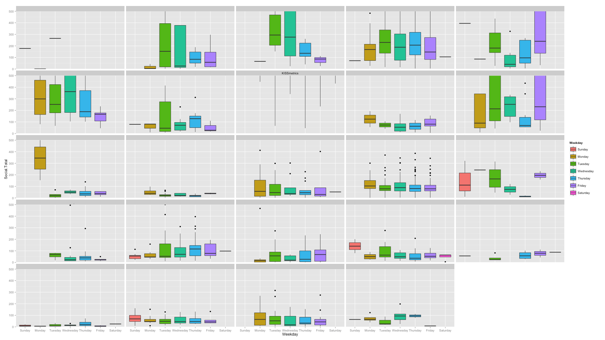
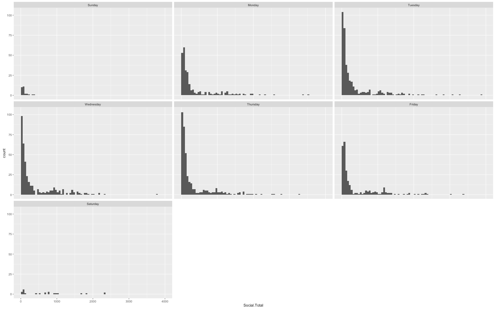
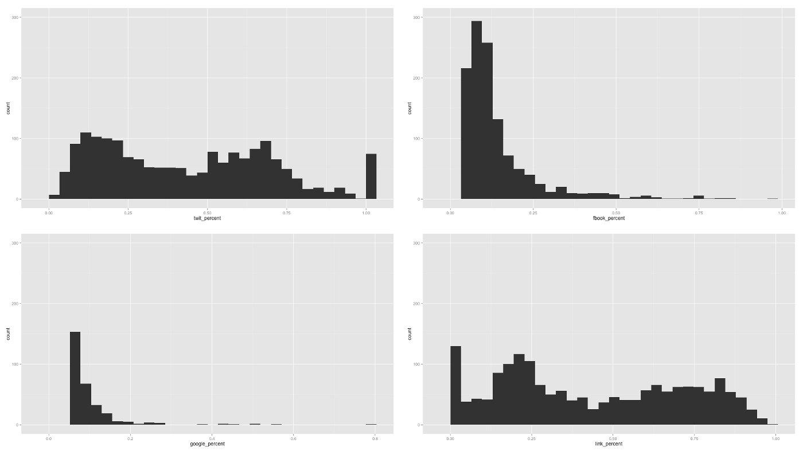

 **Stop me if this sounds familiar:**

- Your marketer friend tells you you have to keep a blog. It’ll help you with SEO or something along those lines. Muscle memory causes you to nod in agreement. “Yeah, absolutely,” you remember saying.

- You decide you’re going to write a new post once a week. Umm…what to write about? Who is your audience? Where should you post? What if…

- Your lead investor needs more diligence; your customer needs more support; your **[situation]** causes **[problem]**. You haven’t answered any of the initial questions and you’re now three weeks behind schedule.

- You write down some of the thoughts you’ve been having but you don’t have time to get it proofread or critiqued. You don’t have a distribution strategy and you never tried to optimize any keywords so SEO is all but irrelevant. A couple friends retweet it but you’ve already moved on to another fire.

- A week later you need another post. Um…what to write about?

This was our experience because, frankly, we were a startup with a lot of stuff to do. Writing blog posts was just another box to check when we were a scrappy team of six. Or so we thought.

**Astronomer is a what...?**

[Astronomer](https://astronomer.io/) is a&nbsp;data engineering platform that collects, processes and unifies your enterprise data, so you can get straight to analytics, data science and—more importantly—insights.&nbsp;So when it comes to any part of our business, including content strategy, we rely on data to drive us.

Like any data initiative, we began by asking questions…when is the right day to post? What metric do we track for success? How long is the optimal blog length?

Then we discovered a blog post of course. Specifically, [this blog post](https://medium.com/strategic-content-marketing/the-ultimate-guide-to-kickstart-your-content-marketing-machine-67929426a6ae#.4aeaacb0c).

**_"Analyze your competition’s posts…"_**

Of course! We’re not the first to play in this space so why are we trying to create a content strategy from scratch? We can learn from our own market! This was taking “data-driven” marketing from distribution (e.g. retargeting ads) into the actual creation itself and that was exciting. Given that we’re a team of numbers people (even our designer — super into geometry) and this was numbers work, it felt right up our alley.

  

**So I outlined a plan:**

**1. Create a list of every company in our space.**

_\*NOTE: This list has changed somewhat since the origin of this post (see update notice below).&nbsp;_

**2. Recursively crawl through their blogs, scraping each post.**

I wrote a Python script using [Scrapy](https://scrapy.org/) and [Beautiful Soup](https://www.crummy.com/software/BeautifulSoup/) to crawl through the blogs and write out a) a copy of each blog post in&nbsp;.txt formatting (removing all html formatting to ease textual analysis down the line) and b) export out a summary CSV with a list of all the post titles and URLs.

**3. Get some social stats on how well these posts did across different channels (I’ll use this as the dependent variable to judge success — brilliant!)**

This was a bit of a puzzler until I found [BuzzSumo](https://buzzsumo.com/). It’s really an incredible platform and while we only used it for some CSV exports for this MVP, I’m excited to see what their [API](https://buzzsumo.com/api/) can do. Highly recommend it.

**4. Collate and clean some metadata (Post Date, Author, Title, Post Length, Shares by Platform, etc.) into a single flat file.**

This was just tedious.

**5. Load that file up and do some analysis.**

I’m generally trying to switch to [PANDAS](https://pandas.pydata.org/)/[Jupyter](https://jupyter.org/) for everything but for this I needed accelerated exploration cycles so I went with [R](https://www.r-project.org/about.html)/[RStudio](https://www.rstudio.com/), which is a really nice environment that makes basic EDA really quick and easy.

**So now the moment of truth**

What do I now know with over 1700 blog posts in my Evernote? That’s a damn good question.

 &nbsp; _(I did blur out the specifics. Gotta keep it classy.)_

__

_Histogram of posts by day of the week. (From Left: Sun-Sat)_

**Post Frequency**  — The fact that Sunday and Saturday aren’t popular posting days isn’t really too much of a surprise but it is interesting that Tues-Thurs is much higher than either Monday or Friday (which are at equal levels.)

**What if we break it out by competitor?**

****

Histogram of posing frequency broken out by competitor

Yikes — looks like three companies are voracious posters. That makes it kinda hard to get a good sense of the rest of them…Let’s reset the y-axis to 30 posts and check it out again.

Histogram reset to make the scale easier to read.

&nbsp;

From the looks of it, most companies seem to favor posting either on Tuesday or Thursday. A couple companies prefer Wednesday and few posts tend to be posted on Mon/Fri&nbsp;. None of that is really too much of a surprise.

But wait a minute — does this prove that Tuesday or Thursday is the _best_ day to post? Because what this actually shows us is that Tuesday is the most_popular_ day to post (and by a narrow margin at that.) But is it the best? I’m glad you asked…

The boxplots below represent the distribution of shares posts receive on any given day. The box themselves are the middle 50% (25–75%) of shares with the line in the middle being the median shares for that day and dots representing outliers.&nbsp;

Answer: **It seemingly depends on the company\*** , but there do appear to be a number who publish their most successful posts on Tuesday. Now, whether or not that is because they _too_ believe that Tuesday is the best day to publish and thus save their best posts for then I can’t say. But it won’t matter either way if it isn’t statistically significant. To that, we turn to our handy dandy [Kruskal-Wallis Test](https://en.wikipedia.org/wiki/Kruskal%E2%80%93Wallis_one-way_analysis_of_variance), a statistical method ( **fun nerd fact** :  it’s actually just an extension of the [_Mann-Whitney U Test_](https://en.wikipedia.org/wiki/Mann%E2%80%93Whitney_U_test)) of determining whether a distribution of data is significantly different (technically: testing for the existence of stochastic dominance — whether a random data point of one group is prone to be above or below a random data point of another group) than all other distributions. Importantly, this test is useful for our purposes because it does NOT assume a normal distribution within the sets.

_\*We don’t consider KISSmetrics to be a competitor of ours but knew they were super good at content marketing so we wanted to use them as a ceiling of sorts. I decided to expose them on this graph specifically because they were LITERALLY off the charts for every day of the week. Well done KISSmetrics!_

**To quickly recap your college stats course…**

A normal distribution occurs when the majority of the data (68%) falls within 1 standard deviation from the mean (95% two standard deviations; 98% three deviations.) Importantly, it’s symmetrical in its distribution which means, in practice, your data should look like this.

 &nbsp; 

&nbsp;

 &nbsp;  Histogram representing shares/day. Left Top Row: Sunday, Monday, Tuesday; Left Middle Row: Wednesday, Thursday, Friday; Bottom Row: Saturday 

&nbsp;

 In the above graphs, each bar represents the count of posts that fall in ‘buckets’ of 50 shares. Notice how all the graphs seem lumped together on the left side? That is because, regardless of day of week, the majority of posts tend to have fewer shares. The long tail on the right with fewer posts each with a lot of shares show that this distribution is _not normal._ Good thing we decided to use the Kruskal-Wallis. **So what did we find?**

After throwing out Saturday and Sunday due to their small sample size, **the Kruskal-Wallis test did NOT indicate a statistically different variation in the distribution of total shares given to blog posts from any specific week day.**

**(Kruskal-Wallis _χ_²** **= 5.2314, df = 4, p-value = 0.2644)**

So much for that…we’ll probably still post on Tuesday…&nbsp;

**Ok - now what about sharing?**

Looking at the distribution of social shares across channels, both Facebook and Google+ are heavily skewed to the right while Twitter and Linkedin are somewhat bimodal. Consistently, they compose either ~25% or ~75% of the total.

> The average post gets ~44% of total shares from Twitter, 43% from Linkedin, 10% from Facebook, and 3% from Google Plus. Distribution of % shares across channels. Clockwise from Top Left: Twitter, Facebook, Linkedin, Google+.&nbsp;

**What about Post-Length?**

There doesn’t appear to a very strong relationship between post length and total shares, though you can definitely see a positive trend, especially just after the 1000 word mark.

> **The median length for all posts is 825 words. For those with \>500 shares, it’s 1427 and for \>1000 shares, it’s 1609.** NOTE: I’ve taken the log of both the x and y axis in the above chart.

&nbsp;

**Predictive Factors**

“Ok,” you’re saying, “but what about some meaty bivariate analysis?” I want to know what factors go into a blog post so I can engineer a large number of shares! Don’t worry; I’ll feed you, baby birds.

So what do all these dots, lines, and decimals tell us? A few things —

> **Title Length is largely irrelevant (r^2 = 0.0647) although it (somewhat) interestingly has a normal distribution with a median of 8 words and IQR = 2.**

Pretty meaningless but an interesting factoid. The title of this post is…wow, 8 words. That’s creepy.

> **Twitter Shares are extremely correlated with Total Shares (r^2 = 0.969), much more so than Linkedin (r^2 = 0.691) which shares on average an equal share of the total.**

Basically, if it does well on Twitter, it’s going to do well across all channels. Not as much for Linkedin.

> **Post Length has a r^2 = 0.241 with Total Shares and a r^2 = 0.189 for Twitter.**

This is a rather weak correlation but it’s likely understated by two factors: 1) Some of the most shared posts are fundraising announcements which are very short and 2) A significant portion of high performing posts being videos and infographics with a low word count. The fact that the correlation between post length with Twitter is much less than any other distribution channel could suggest that people share shorter posts on Twitter but the correlation is too weak to make much of a statement in either direction.

**So What Did We Learn?**

- Tues-Thurs are the most popular days to post but good posts can get a good number of shares on any day.
- Posts should be at least 1000 words but receive diminishing returns after ~1500.
- Twitter and Linkedin are equally the best distribution channels.
- We didn’t get a chance to test this for all posts but we began to see a trend of posts with infographics and videos receiving a large number of shares. This makes sense but was difficult to classify in our current model where we were looking primarily at post length (where videos + infographics have a low amount of words.)
- Looking at channels, timing, and length is a good start but none of that can truly predict how well a post is going to do. We’re going to need to get into the content itself to answer that.

**And...what's next?**

Well, I want to explore more about the content of the blog posts themselves. It’s useful to look at some descriptive qualities (post-length, title length, post-date) but predictive modeling is really difficult by just looking at variables that don’t really speak to the structure, theme, or quality of the post. The really fun stuff begins when you start digging into sentence structures, keyword frequencies, sentiment, and readibility ( **nerdy extra credit:** _check out the_ [_Flesch-Kincaid index_](https://en.wikipedia.org/wiki/Flesch%E2%80%93Kincaid_readability_tests)_._) With this we’ll be able to see what themes people respond to as well as essentially reverse engineer the directions companies in our space are moving towards. Stay tuned!&nbsp;

And in the meantime, what business questions do you have that require a new kind of data to analyze? Tweets, emails, employee notes, etc.? Get creative about where and how you get your data; it can make a big difference.&nbsp;

_EDIT: Updated Tuesday, May 30, 2017. And also, Part II is published! Check out what we did next [here](/blog/what-i-learned-from-analyzing-1700-blog-posts-part-ii)._

