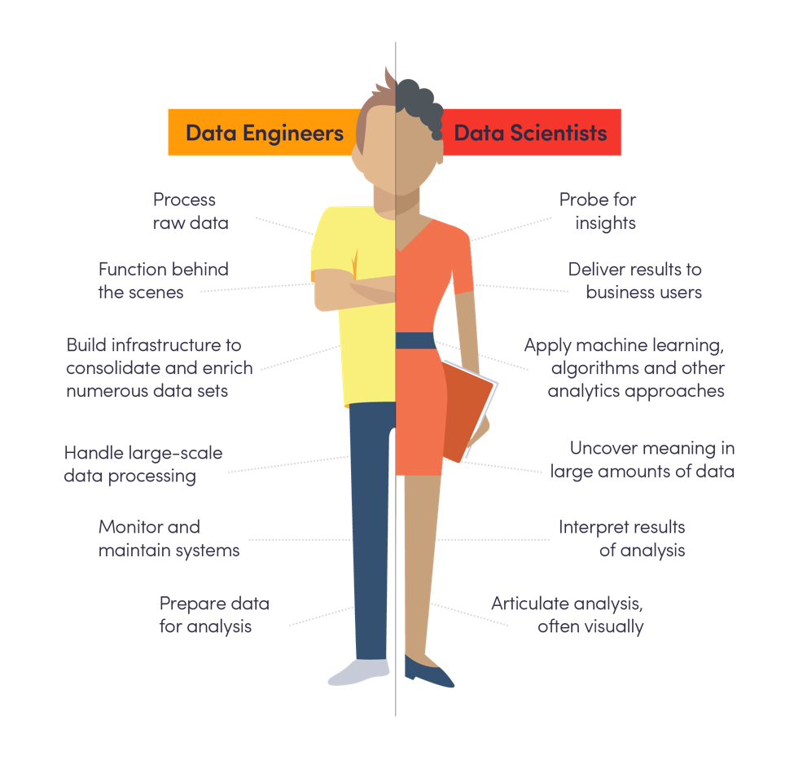

The data scientist was deemed the “sexiest job of the 21st century.” [The Harvard Business Review] (https://hbr.org/2012/10/data-scientist-the-sexiest-job-of-the-21st-century)reasons that this “hybrid of data hacker, analyst, communicator and trusted adviser” is a rare combination of skills, worth a high paycheck.

Too good to be true? Yes, [according to Forbes](https://www.forbes.com/sites/gilpress/2016/03/23/data-preparation-most-time-consuming-least-enjoyable-data-science-task-survey-says/#2fe31d416f63). Turns out, data scientists spend most of their time (up to 79%!) on the part of their job they hate most.

### The Demand for Data Scientists

[Thousands of companies](https://www.datasciencecentral.com/profiles/blogs/6000-companies-hiring-data-scientists) across a myriad of industries are hiring data scientists, likened to the[“quants” of Wall Street](https://hbr.org/2012/10/data-scientist-the-sexiest-job-of-the-21st-century) in the 1980s and 1990s for their exclusive abilities to understand and interpret data, a kind of secret weapon for doing better business, [as depicted in The Big Short](https://www.youtube.com/watch?v=FoYC_8cutb0).&nbsp;

But with a supply of just over 11,000 data scientists and a rapidly growing demand, the competition among employers to secure this role is steep.&nbsp;The [U.S. Bureau of Labor Statistics](https://hired.com/blog/candidates/landing-data-science-job/) projects that demand will be 50-60% higher than supply by 2018. And&nbsp;[McKinsey predicts](https://www.mckinsey.com/business-functions/digital-mckinsey/our-insights/big-data-the-next-frontier-for-innovation) that by 2018, the United States alone will face a shortage of 1.5 million analysts and managers who know how to use big data to make decisions.&nbsp;

Companies who don’t hire a data scientist now might not be able to find one at all.

### The Role of a Data Scientist

Once an organization has a data scientist, however, what then? How do they cultivate an environment that maximizes that person’s skills and makes them want to stay?

Consider first what [an average data scientist](https://www.forbes.com/sites/gilpress/2016/03/23/data-preparation-most-time-consuming-least-enjoyable-data-science-task-survey-says/#2fe31d416f63) does all day:

- Builds training sets (3% of the time)
- Cleans and organizes data (60%)
- Collects data sets (19%)
- Mines for data patterns (9%)
- Refines algorithms (4%)
- Other (5%)

Here’s where we see just how un-sexy the role has become, because an overwhelming majority of data scientists agree that collecting data sets and cleaning and organizing them is their _least_ favorite part of the job. Worse, collecting and organizing data has absolutely nothing to do with insights; it’s simply data preparation. It takes a high level of skill to do, but it’s not data science.

Companies could free their data scientists to spend up to 79% more of their time on analysis by having someone else prepare the data. Not only would companies derive more value from every extra moment spent on insights, but they would enable their data scientists to do what they love.

Data preparation, therefore, should be applied to the correct role—data engineer.

### The Role of A Data Engineer

The need for data engineering is growing, too. In “[The Rise of the Data Engineer,](https://medium.freecodecamp.org/the-rise-of-the-data-engineer-91be18f1e603)” Maxime Beauchemin, “data engineer extraordinaire” at Airbnb, writes about how he joined Facebook as a business intelligence engineer in 2011 and left as a data engineer two years later. The need for more complex, code-based ETL and changing data modeling drove the demand for data engineering.

So what is data engineering, exactly? It’s the act of accessing, processing, enriching, cleaning and/or otherwise orchestrating data analysis. Beauchemin puts it like this: “Data engineers build tools, infrastructure, frameworks, and services. In smaller companies — where no data infrastructure team has yet been formalized — the data engineering role may also cover the workload around setting up and operating the organization’s data infrastructure.”

In other words, data engineering alone doesn’t reveal insights; it readies your data to be analyzed reliably. By whom? The data scientist or analyst.

### Bringing Sexy Back

([We couldn’t resist](https://www.youtube.com/watch?v=3gOHvDP_vCs).) If data engineers handled the cleaning and organizing and collecting data sets, data scientists could focus on mining for data patterns, refining algorithms and more—you know, the sexy parts of their job. In the simplest of terms, data engineering and data science work together like this:

To build the kind of organization that gets prepared data into the hands of the analysts, companies can take two major action steps:

1. Create a new role, the data engineer, and establish [a culture of data engineering and democratization](https://medium.com/airbnb-engineering/democratizing-data-at-airbnb-852d76c51770) within their organization. 
2. Adopt amazing new data processing technology (Airflow, Kafka, Spark and Mesos, to name a few) that can handle both big data and fast data.

Those who do this will inevitably attract the best data scientists. And as a result, get th .e most value from their data.

*Astronomer exists to help companies accelerate these steps. We’re a data engineering platform that collects and routes your data—right into the hands of your data scientists. [Download and share our Data Engineers vs. Data Scientists infographic](http://resources.astronomer.io/infographics-and-visuals/why-every-data-scientist-needs-a-data-engineer).*

