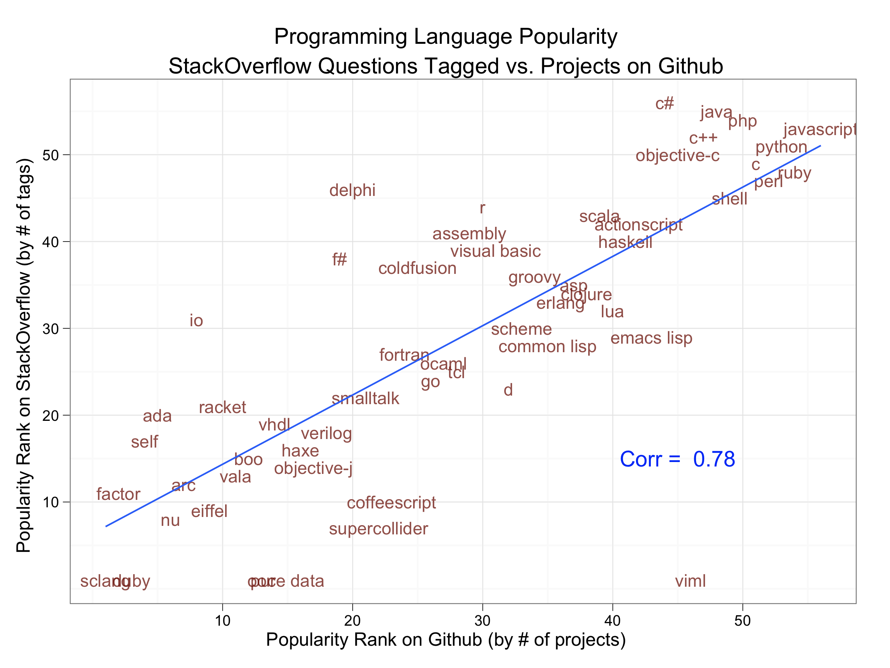
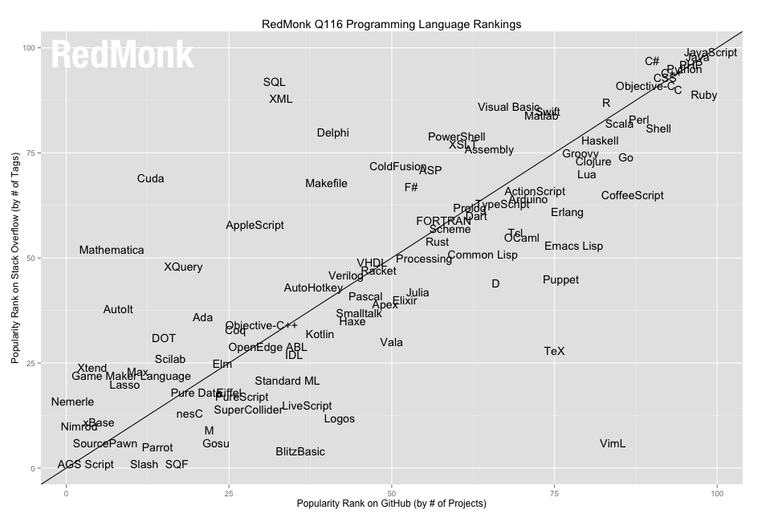

In 2011, the consulting firm McKinsey & Co caught headlines when they predicted that in a mere seven years the newly minted "Data Scientist” role would have a 200,000-person talent deficit. This prediction gave enormous credibility to the idea that the economy as a whole was moving toward becoming more data driven, and the [study](https://techcrunch.com/2015/12/31/how-to-stem-the-global-shortage-of-data-scientists/) continues to be quoted even today, appearing as recently as last December in [TechCrunch](https://techcrunch.com/2015/12/31/how-to-stem-the-global-shortage-of-data-scientists/). Although different research firms and publications may give slightly different deficit predictions and timelines, there is a consistent message that can be found throughout all of them. Namely, we don’t have enough people with the skills to do the job. And we won’t anytime soon.

We’ll dive into why this skill gap is occurring in a second. But first, let’s jump back to 2011. Or rather, to December 2010 when Drew Conway and John Myles White [published their analysis](https://www.dataists.com/2010/12/ranking-the-popularity-of-programming-langauges/) on the relative number of Github repositories and StackOverflow questions to assess relative “popularity” among programming languages. Their analysis produced three key insights, the most interesting for our purposes being that language popularity is tiered. At the far right, some “super popular” languages lean more heavily toward the StackOverflow side (C#, Java, PHP, C++) and others toward Github (Perl, Ruby) but generally they all cluster together with JavaScript being the “most popular” by this metric.

Fast forward to today and how this has changed. To find that, we look towards the fine people at [RedMonk](https://redmonk.com/) who have kept the project going. The below represents language rankings as they stood in January 2016.

Notice anything interesting about the two charts made almost exactly five years apart? Well, it’s neat to see where some newer languages have landed (Julia is growing fast!), and it’s always amazing to see that someone out there is still using FORTRAN nearly 60 years after it was created. But to us as a full-stack JavaScript company, what’s most interesting is that JavaScript is still on top and, really, this makes a lot of sense as we'll soon see.

**What do language&nbsp;rankings have to do with the Data Scientist talent gap?**

Let’s connect the dots and ask " **_What are the necessary languages&nbsp;a Data Scientist needs to know?_** ” At the most rudimentary, it’s expected that you have a working knowledge of SQL so you’ll be able to actually access the data you’ll be using. The majority of companies will store data in a relational format but sometimes the data you’ll need will be stored in a document-oriented database (like [MongoDB](https://www.mongodb.com/)), in which case, you’ll also need to have an understanding of JSON (JavaScript Object Notation) objects, the de facto storage format for NoSQL databases. Then you’ll want to do some quick data analysis, modeling, and prediction on this data you’ve retrieved, so you learn, say, Python, R, C++, and/or Julia. And then, assuming you’re a Data Scientist working at scale (which, given that we’re on track to soon be generating 240 exabytes of data daily, is a safe assumption), you’ll need to work with some data processing engines, requiring you to learn Java, C, and/or Scala.

It’s all starting to make a lot of sense that we’re looking a 200k person deficit, isn’t it? No wonder any person with that entire skill set is colloquially termed a “unicorn."

But what if I told you that all of that can be done in one magical, and exceedingly ubiquitous, language, one that is already often being used in the current data stack for data visualization? What if the unicorn of data science wasn’t a person but was, instead, just JavaScript? Yes, the very same JavaScript that slowed down your IE browser 20 years ago. Some new projects have us convinced there’s merit to the idea that every web developer already has the skills to join their company’s data team.

**Javascript for the Data Science Stack**

JavaScript has a lot of inherent properties that make it a good choice for data science. Its non-blocking I/O structure makes for efficient memory and CPU allocation during heavy throughput processing tasks. But what really gets us excited are the new JavaScript tools at every layer of the data science stack.

**1) The IDE (Integrated Development Environment)**

Every good Data Scientist needs a development environment to help them explore their dataset and iteratively build algorithms through isolated testing of code. Everyone has their preferred environment but the faraway favorite (in our book) is iPython, ahem, Jupyter. What started originally as a project to create a collaborative, browser-based environment to enable scientific computing in Python has been rebranded as Jupyter following its functionality expansion into other languages. Jupyter’s clean interface and ability to blend code with html or markdown make it a great option to develop and share notebooks. You can find the complete list of supported languages [here](https://github.com/ipython/ipython/wiki/IPython-kernels-for-other-languages) and (hurray!) JavaScript/Node.js is one of them. In addition to [iJavascript](https://github.com/n-riesco/ijavascript), mentioned on that list, we’d also recommend checking out [Jupyter-NodeJS](https://github.com/notablemind/jupyter-nodejs). Whether you’re just getting started in data science or coming from Jupyter with any other language, making the switch to using JavaScript/Node in your IDE is as simple as switching out the kernel (the file that tells Jupyter how to interpret your code.)

**2) The Libraries**

An IDE is great but it’s only going to be as good as the algorithms you’re able to create through it. The ability to efficiently create meaningful algorithms is key to any good data science stack and, in large part, is dependent upon available libraries and the communities behind them. The balance between powerful yet usable libraries (e.g. nltk, sciki-learn, scipy, numpy, pandas) that make statistical and machine learning tasks more approachable is largely credited for Python’s position as a pervasive and essential data science language. Just check out Github and you’ll see how big the community is around these tools. NLTK has over 3,000 stars, pandas has over 6,000, and scikit-learn has over 11,000 (with nearly 600 contributors!) But look closely at NPM and you’ll see a growing community of comparable packages being written in Node. Don’t believe me? Check out this [great presentation by Sean Byrnes](https://nodesummit.com/media/data-science-in-node/), the founder of [Flurry](https://www.flurry.com/), at last year’s Node Summit. Want to implement a [multi-arm bandit algorithm](https://en.wikipedia.org/wiki/Multi-armed_bandit)? Use [Percipio](https://www.npmjs.com/package/percipio). How about import a [Bloom Filter](https://en.wikipedia.org/wiki/Bloom_filter) as a self-contained module? Use [Bloom.js](https://www.npmjs.com/package/bloom.js). While Python without question has the upperhand right now, the growing number of data science packages in Node make it an increasingly feasible alternative.

All that being said, building a meaningful algorithm is not a trivial task. Even with the right tools, it’s far too easy to succumb to inferences that are not actually statistically significant or employ an inappropriate model for your data’s distribution type. Unless your data team has a person with advanced training in applied mathematics, you’re taking a risk when you try to roll your own algorithm from these packages and trust you know what you’re doing. In response to that, many large tech companies are stepping in to help you outsource the algorithmic work that might require an expert eye.[Google](https://cloud.google.com/products/machine-learning/), [IBM](https://www.ibm.com/smarterplanet/us/en/ibmwatson/), and [Amazon](https://aws.amazon.com/machine-learning/) all have these products and, you guessed it, they all come with a Node SDK. We’ve personally used [IBM’s Bluemix for some internal projects](https://www.astronomer.io/blog/what-i-learned-from-analyzing-1700-blog-posts-part-ii) and found it cut down our development time by a great amount.

**3) The Processing**

Hadoop is the biggest name in big data processing and won’t likely be displaced anytime soon (at least with multi-petabyte and up scale) but old paradigms like MapReduce are giving way to new projects like [Apache Spark](https://spark.apache.org/). Spark claims to run up to 100x faster than MapReduce on Hadoop and, while we can’t speak to that kind of performance, in our own internal testing we’ve seen massively faster processing times than traditional means. Only problem: You can write in Java, Scala, Python, or R, but Spark doesn’t come in JavaScript! However, as it turns out, this isn’t so much of a problem because of Node’s aforementioned growing data community and the very impressive [Node-Spark](https://github.com/henridf/apache-spark-node) project by Henri DF. This project creates bindings around Spark’s DataFrame APIs so that you can still gain the performance of Spark without having to context switch into another language.

**4) The Processing Alternative**

Spark is an insanely impressive tool, but wrappers aside, it is not a native Javascript framework. If you really want to commit to the vision of a JavaScript-driven data stack, you’d be remiss not to look at [Skale](https://skale.me), a truly next-generation, distributed processing platform. You can interact with its API via native JavaScript and, as opposed to Node-Spark (which is just a thin layer on top of native Spark), the back-end runs entirely on Node! We got the chance to speak with [Cedric Artigue](https://www.linkedin.com/in/cedricartigue), Skale’s CEO, on the future of JavaScript as the language of big data. Here’s what he told us:

> _As it’s still gaining more and more momentum, thanks to Node.js and NPM, we‘re pretty sure JavaScript is the best candidate to solve the underlying skill shortage in big data. But to address this issue, something was missing in the javascript landscape: a proper general purpose distributed processing framework that runs on top of Node.js, leveraging on its fast JIT compiler and its ability to natively process JSON data. This is the reason why we built Skale._

We haven’t used Skale personally but our CTO, Greg, got to see a demo of what they were working on and relayed it back as “crazy fast.” Plus, as Cedric puts it, “_Skale allows any javascript developer to create, test and deploy scalable data integration and machine learning distributed workloads.”_ We’re sold.

**5) The Pipelines**

Let’s take a quick temperature check. You’ve now done your analysis in a Node IDE, built algorithms using Node libraries or SDKs, used a Node wrapper around the data processing big dog or the new up-and-coming alternative to feed your algorithm, and now need to pass your results off to a dashboard (which is probably written in JavaScript) or your app (which is at least half JavaScript, if not full-stack). What in the world should you use to build pipelines between all of these JavaScript-centric stages? We’d humbly suggest taking a look at [Aries](https://github.com/aries-data/aries-data), the only workflow generator where all you need to know is JavaScript. Aries is written to break each pipeline (“workflow”) into modular composite stages (“activities”) so sources, destinations, and transforms can be used in any combination desired. These integrations can outsource work to non-JavaScript tools (like the [Aries-Spark](https://github.com/aries-data/aries-activity-spark-demo) integration) but are written in such a way that any web developer can now become a data engineer.

If you’re working on a data team and have a stack that works for you, then great! Other languages have a lot of maturity in their development as data science tools and it might not be worth it for you to switch over to JavaScript. But as more companies look to become data driven, there is going to be a crunch of talent and, in this moment, every&nbsp;web developer will have&nbsp;the potential to take up the mantel and generate insights. From the development environment to the processing engine, you can now create a full data science stack without ever leaving JavaScript.&nbsp;

**Astronomer for Data Scientists**

Of course, as anyone who's dabbled in data science knows, the key to discovering new intelligence is having reliable data in real-time—once data is in your hands, the fun stuff begins: processing,&nbsp;analysis, modeling, prediction, etc. If your organization wants to focus on insights, [contact Astronomer](https://www.astronomer.io/contact), a platform for data engineering. We'll make it easy to get the data you need, wherever you need it, meaning insights are closer than you think.&nbsp;

