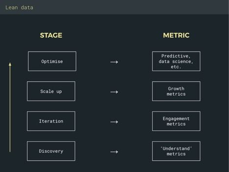

*Note: David Fauchier works for [Mr Wolf](http://https://fantasticmrwolf.com/), a London-based, data-driven SWAT team for venture-backed companies. They help companies upgrade their data infrastructure, become more data-driven and translate all of that into faster growth and higher revenue. Through their collection of war stories and experiences, they have gained insider insight to the deliberate preparation it takes to do analytics in a way that is meaningful. According to Mr. Wolf, here are the five steps every company should take to make their product and marketing analytics worthwhile:*

# 1. Set the right KPIs

*Metrics and KPIs are like squares and rectangles: All squares are rectangles, but not all rectangles are squares. Similarly, all KPIs are metrics, but not all metrics are KPIs. KPIs are essentially a set of metrics that you’ve judged to be "Key" to business success.

Pretty much any business model in the world can be placed somewhere on a spectrum between groceries and engagement rings. When you’re selling groceries, you’re going to extract value from a customer, ideally over their lifetime—customers have to eat, and they’re unlikely to ever eat less. So if they’re not shopping with you, they’re shopping with someone else. Meanwhile, if you’re selling engagement rings, your customers are only ever going to buy from you once, so you need to capture all the value you can in that one transaction. Each business, therefore, needs to optimise for very different things. Knowing which type of business you are in is critical to success.

Are you a groceries business? Evernote, Uber and Pret a Manger certainly are. They want you to buy from them every day (or month) for pretty much the rest of your life. It’s no accident that these companies have excellent customer service and satisfaction. Grocery-type businesses are willing to pay up to make sure that your post-transaction experience is excellent, because they need you to come back again and again.

***Grocery-type businesses focus on KPIs like usage frequency, retention, satisfaction rates and NPS.***

Meanwhile, diamond jewelers know full well they’ll probably not see you again—hence the focus on the sales experience (champagne and red velvet, possibly a private room) and up-selling (insurance and after-care) and the conspicuous absence of 30-day refunds or money-back guarantees. They are trying to extract the most value out of their customers as possible at the moment of purchase. It’s no accident that support quality is awful at luxury retailers. There’s simply not much point in spending money to keep you happy once you’ve paid—you’re probably never coming back regardless.

***Diamond ring businesses focus on KPIs like acquisitions, conversion rate, avg. sale value, upsell rate and sales cycle velocity.***

There’s no "right" business to be in. Both can work; you don’t need retention for your business to succeed (just look at game developers!). But what does not work is blindly picking KPIs based on what your friends are measuring for their businesses without thinking about what type of business you are building.

### 2. Focus on the right metrics

*Most of the content on the internet around "analytics" is focused on things like virality, cost-per-click (CPC) and conversion rates. Most of the content on "data infrastructure" revolves around the pros and cons of data lakes and whether you can eek out performance gains using a Hadoop cluster and a non-relational data architecture.*

It’s easy for such discussions to get way complicated, way quick. As a result, many companies get put off and avoid getting serious about using data.

"Data" is in serious need of being de-mythologised. In fact, "data" is a loose term for "anything you can use to answer a question," whether that be numbers or customer conversations or patterns you’re seeing in your support queue. 

In actuality, data is the easy part. The most important thing you can do is ask the right questions. And the questions you should be asking depend entirely on the stage you’re at, the vertical you’re in and the type of product you’re building.

The first stage of any product is "Discovery"—you’re identifying a customer problem you think you can solve. "Iteration" is all about finding product / market fit and building a solution that users want to use to solve the problem you discovered. "Scaling" is about growing the product usage once you know your solution works and can scale. "Optimisation" is the last stage of a product lifecycle. It’s about taking something that’s relatively mature and tweaking it to perfection: a few basis points of extra conversion here, and a percentage or two’s increase in lifetime value (LTV) over a six month period there.

Each of these stages also has a corresponding set of metrics to focus on. "Understand" metrics over-index for qualitative data points like customer conversations, and under-index for multi-variate testing and data exploration. The goal is to gain context around a problem. Conversely, "Growth" metrics are all about optimising the top of the conversion funnel. They’re about acquiring more users for less money, getting them to that first "[aha moment](http://medium.com/parsa-vc/how-to-discover-your-apps-aha-moment-5f75dd7b6536)," and letting the product do the work from there. Growth metrics are 90% of the reading you’ll find on "data" on the internet.

Make sure you know which stage your business is in, and focus on those metrics. Anything else is a distraction.

### 3. Balance data with context

*Awhile back, I was working with a marketplace product. We’d just overhauled their data analytics capabilities (what we call "instrumentation"). Early results indicated some serious UX issues. We quickly switched to fixing those. After a couple weeks, however, I got a call from the founder who saw one of his KPIs—"time on site"—dropping. He was none too happy and wanted to reverse the UX changes until we figured out why people are dropping out faster.*

Thanks to the fact that we’d instrumented his entire website to collect all customer behavior (or "clickstream") data, I was able to dig into that KPI pretty quickly. Two things jumped out:

1. None of our other KPIs (like conversion and transaction volume) were taking a hit.
2. If we clustered the site’s pages by category (signup / product / admin / support…) and measured the "time on site" delta from a 30-day rolling average pre-UX-changes, the only area we were taking a hit on was support.

It turned out that 100% of the time on site drop could be attributed to people spending less time on the support pages, which is likely a good thing. Instead, our "time on site" KPI was flawed. We were measuring time as a proxy for how engaged somebody was with the product. In fact, we should have been measuring how many products they viewed, or even better, interacted with. Both of these are still proxies for engagement, but they’re nonetheless more accurate ones.

We continued full steam ahead with the UX fixes.

We also learned firsthand that data without context is dangerous. As humans, we’re hardwired to immediately infer explanations from numbers. Subconsciously, we want to explain a movement, and we’ll reach for the first plausible thing we can think of. It’s important to constantly remind yourself that numbers are only the start: you should use quantitative data (i.e. numbers) to unearth oddities and quirks to investigate. Numbers should be curiosity sparks; they are red flags—nothing more. It’s then up to you to establish as many hypotheses as to why, and then go and [disprove or confirm those qualitatively](http://blog.fantasticmrwolf.com/how-to-run-a-tight-product-ship-a7815b8c4502) (i.e. in customer conversations, surveys or the like).

Your process should look something like this:

***Quirk → hypothesis → confirm qualitatively***

### 4. Use an architecture that lets you scale

*We had a client whose data was like spaghetti. Each product had multiple integrations (usually with an associated software development kit, or SDK), sending the same data to lots of different services—one for analytics, one for messaging, another for Salesforce, etc. When it comes to event-driven products, it’s a slippery slope.*

In the beginning, it’s wonderful:

Then you add a couple more tools that your sales and marketing team asked for:

And then one day, it looks like this:

Data spaghetti sucks for all those involved. It leads to fragmentation, mistakes, data paralysis and the occasional engineering mutiny (as performance degrades beyond what any self-respecting developer will bear).

You can avoid it all by using an events dispatcher, like [Astronomer’s](http://www.astronomer.io/).

Analytics, push messaging, email, user testing and support tools all require pretty much the same data: who are your users and what are they doing. Instead of doing an integration for each of these, send your data once to platform like Astronomer, and have it automagically translated and pushed to whatever service you want ([Mixpanel](http://mixpanel.com/) / [Amplitude](http://amplitude.com/) / [Salesforce](http://www.salesforce.com/) / [Mailchimp](http://mailchimp.com/)…). This saves on engineering time, boosts your load performance and gives your product, sales and marketing teams the freedom to use the best tool for them, at the flick of a switch.

It looks something like this:

Much neater. Using a dispatcher lets you scale faster: you can start with one team (i.e. Product) who might require Mixpanel. Then suddenly your marketing team needs to send triggered personalized emails—you just flick a switch on the Astronomer dashboard:

And:

Congratulations, you just implemented a whole new tool and you’re pushing all your data to it without needing to disturb your engineer. If engineering does want to get involved, the news is good! Astronomer leverages [Apache Airflow](http://www.astronomer.io/blog/airflow-at-astronomer/) to define all workflows as code. So your team can modify, collaborate, port and extend anytime (using Astronomer’s custom pipes or building your own—it’s up to you). And you can repeat this again and again, for as many destinations as you need, as your teams grow and as their needs evolve.

### 5. Send events from the right place

*One crucial factor in determining how successful your instrumentation will be is carefully deciding where you send your events from. Client-side data has advantages and weaknesses compared to server-side data. One recurring theme across many of our clients is a failure to take these into account, resulting in inaccurate or incomplete data and, therefore, a great deal of frustration and skepticism of the numbers, which is difficult to reverse. We’ve recently been working with a company that implemented four separate analytics tools, all of which were throwing out wildly different numbers for things like monthly active user (MAU), revenue, retention and conversion.*

There’s no such thing as perfect data. Pretty much everything you do will come with a trade-off. How you manage those trade-offs will determine the quality of your instrumentation. The most important of these to understand is whether to send an event from the client-side or server-side.

Each has its advantages and disadvantages, so it really depends what you’re tracking and what context you need. Here’s a handy guide:

#### Server-side:

+ You only have to write code once

+ Generally easier to debug and to audit

+ Deploy immediately

+ Since you own the codebase and control the environment, you can be more confident in the tracking accuracy

- You get less stuff for ‘free’ like context objects, which give you things like OS, build #, UTM params and referring domain (which helps with attribution).

#### Client-side:

+ Instrumenting the UI (i.e. "user clicked this button") is as easy as it gets—these events are super easy to code.

+ You get loads of context for "free" (see above) by using the SDK.

- If you have multiple clients (e.g. Android + iOS app + web), you need to implement and maintain the same event multiple times.

- You have to deal with App Store review times, introducing delays.

- You’re reliant on the user updating the mobile app. In practice, you’ll have multiple versions of the same event floating around (unless you get it all right on the first go, which you never will).

Here’s a flowchart to help you make the decision:

### In Summary

Nobody ever complained that they over-invested in knowing their customers too well. Understanding your customers, understanding how they’re using your products and using that knowledge to better serve them is the only formula for long-term sustainable growth.

If you want to build a world-changing product, you can’t do it flying blind. Invest early and aggressively in data, analytics and instrumentation, and do it right. You can even [try out using Astronomer](http://app.astronomer.io/login) (up to 50K events free per month) as your event dispatcher to keep it all tidy! It’ll be the best investment you can make. 