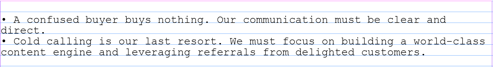
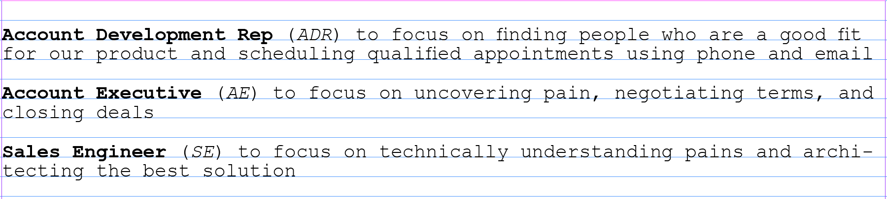
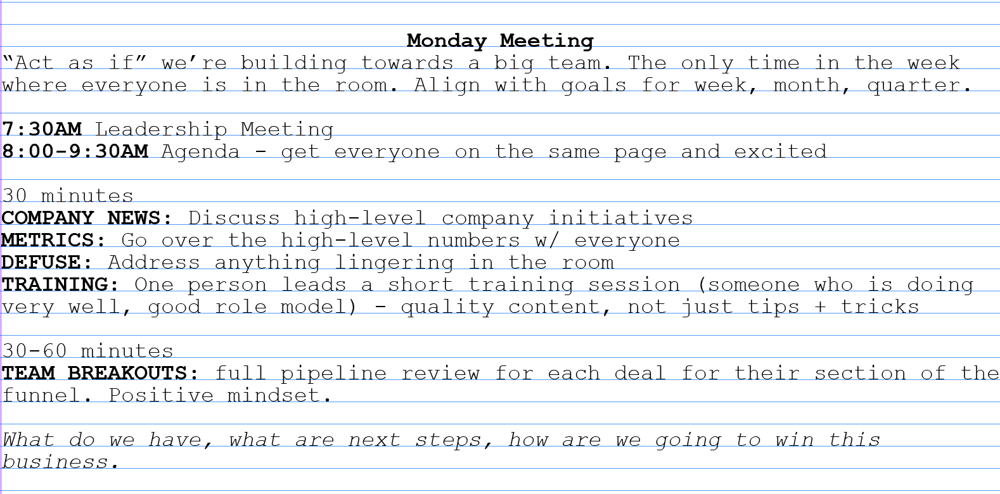
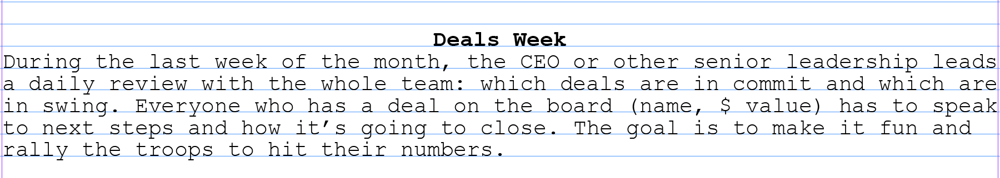

  

Astronomer is a customer-first organization. But what does that mean, really? And how do we ensure that no matter how busy – or how big – we get, we stay that way? Well, now that we’ve figured out [who our target customer is](https://www.astronomer.io/blog/how-astronomer-found-its-target-customer) and [how to effectively communicate with them](https://www.astronomer.io/blog/what-we-learned-after-we-discovered-our-target), we can continue this journey and start to build processes to enhance our customers’ experience with us.

For me, in business development, this means creating a culture that puts the _prospective_ customer first. So let’s talk about the way we engage customers from initial contact to fulfilled contract. The internal document that outlines this process, and all its moving parts, is called our Customer Engagement Model.

**Customer Engagement&nbsp;Model Overview**

The overarching goal of this model is to make our prospective customers feel understood. From the get-go, our relationship should be a two-way street in which both parties communicate problems, opportunities and goals to identify whether Astronomer is a good fit.

This model encompasses our entire process – from initial introduction of our capabilities to securing a customer agreement to implementing customer solutions. It’s a combination of rhythms, guidelines and tools outlined explicitly to keep our team members on the same page, from the outset. It also serves as an internal playbook for our sales organization.

We’re still iterating as we go, learning through real-world trial and error, but we’re excited about the direction we’re headed and ready to share some excerpts from the working model and the rationale behind them:

**A Four-Part Journey**

Staying organized is crucial to maintaining focus, so we started by breaking the whole process into four phases. In our document, we describe them like this:&nbsp;

**"Rules" to Live By**

Early-stage startups, especially highly technical startups, can be a whirlwind of innovation, iteration and pivots. Because we value simplicity and focus, we’ve included&nbsp;a list of guidelines. We don't want to give away all our secrets but here's a small taste:

Some of our&nbsp;guidelines probably&nbsp;seem obvious, but we don’t want to leave anything to chance.

**And..."Roles" to Live By**

Any effective sales organization has clearly defined roles in order to holistically serve the customer. Here are our main three:

In our model, we address the responsibilities of each role, including tasks and personal development, and the metrics used to measure success.

**A Mutual Action Plan**

If this is truly going to be a conversation, it’s important to keep everyone accountable and connected. We accomplish this through a living document we call the Mutual Action Plan, a customer-friendly document that includes full visibility (no excerpts though; it's just for our customers). This positions our process as a professional project plan designed to help customers achieve their goals.

In this document, we outline the four specific phases (Initial Meeting, Needs Analysis, Solution, Implementation) and provide project scope, timelines and any other pertinent information and to-dos for the prospective customer’s team to reference. They&nbsp;can even&nbsp;interact with us directly through this document using a sweet new tool called [Canvas](https://usecanvas.com/).

**Meetings With A Side&nbsp;of Strategy**

Actually, it's more like strategy with a side of meeting. We know our AE’s will be out hunting and our ADR’s will be out researching, and we don’t want to hinder their progress or their mojo. To maximize each team member’s time, we have an all-hands meeting with the sales organization every Monday. We call this, creatively, the Monday Meeting. This excerpt is from our model:
## &nbsp;

Keeping a strict agenda is important. This meeting is like the “stretching period” before the big game. Everyone creates a clear plan and gets ready to run.

We have a monthly rhythm too, inspired by my past life as a corporate accountant. The first week of every month was “Close Week,” during which the entire accounting department hunkered down with the finance and the leadership teams to recap the previous month and close the books to get ready for the coming month. The pressure was&nbsp;hell, but it forced the company to stay organized.

Taking a page from that book, we developed "Deals Week":

Deals Week has already proven successful. During our most recent Deals Week, we reprioritized our prospective deals. The ones that seemed serious about closing rose to the top, and the ones that needed more time sunk to the bottom – or got placed in a separate category to receive some further nurturing. Not long afterwards, one of our newly prioritized deals got closed and another is currently working through an agreement.

In conclusion, for Astronomer to be a customer-first organization, our number one metric, in any department, must have&nbsp;to do with customers and their happiness with our product and our team (similar to [Net Promoter Score](https://www.netpromoter.com/know/)). From the top down, we are building processes and teams focused solely on being an incredible experience, a robust and scalable product and a resource for our customers as they (and we) progress.

