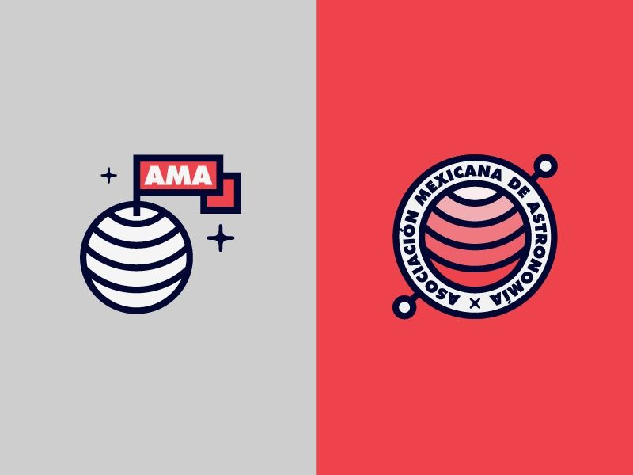
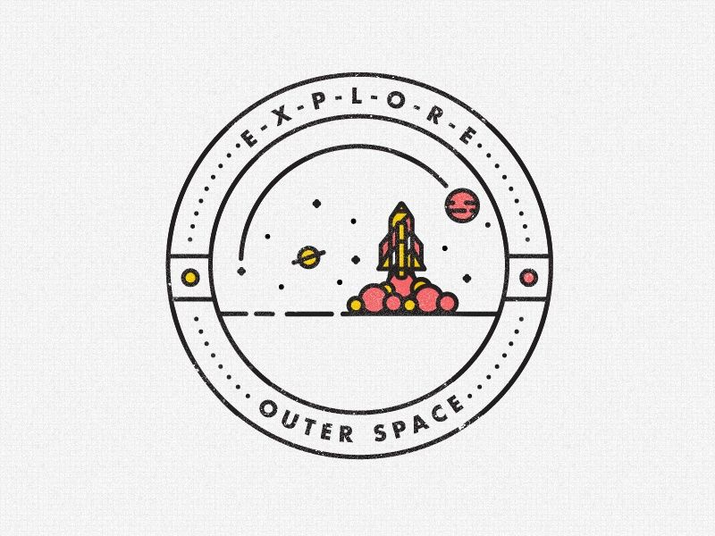
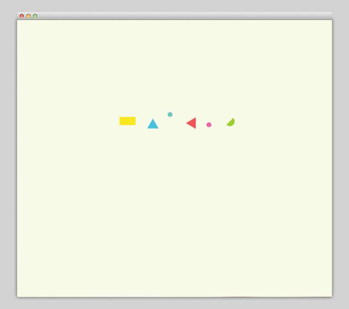

In August 2015, I had a conversation with Ry Walker and agreed to start working full-time on an enterprise data startup he was co-founding, called Astronomer. I’d known Ry for a few years and he was an advisor for my own startup, a great friend and someone I admire. I joined the Astronomer team with a decade of graphic and product [design experience](https://www.inkdryercreative.com). I’ve worked on everything from album covers to Android apps and designed logos for companies large and small. My first task? Redesign the Astronomer logo.

**August 18, 2015**

**10:35 AM**

First, I created a new directory in Dropbox called “Astronomer” and added one file to it: _investordeckv6.key_, a pitch deck showing the current logo and visuals, art directed by Ry himself…

**10:37 AM**

It was a Tuesday, my first day at Astronomer. I was supposed to start the day before but I was wrapping up a logo and visuals contract with [Crossroads Church](https://medium.com/r/?url=http%3A%2F%2Fwww.crossroads.net) (who later became one of Astronomer’s first customers).

**10:41 AM**

I saved my first found image\* into a new folder titled _inspiration_.&nbsp;

> _\*This is typically the first thing I do when starting a new logo project: pore over the internet for inspiration. I spent the next two hours completely locked in, listening to music very loudly, zipping through [www.designspiration.net](https://www.designspiration.net) and&nbsp;[www.dribbble.com](https://www.dribbble.com) and collecting visual inspiration. I searched for keywords “stars,” “space,” “galaxy” and so on and saved anything I found interesting—a font, a color, an illustration, a vibe, a tiny rounded corner, a building, a combination of colors, a photograph, etc.&nbsp;_> _But before any of that I searched good ol’ fashioned Google&nbsp;for “astronomer.” I found one image worth saving: a painting from 1668 by Dutch artist Johannes Vermeer, titled The Astronomer ([Wikipedia](https://en.wikipedia.org%2Fwiki%2FThe_Astronomer_%28Vermeer%29))._

The following images are in order of when I saved them, starting with Vermeer’s 17th century painting:&nbsp;

**12:37 PM**

**One hour of inspiration collection, results: 11 images saved, hundreds more viewed.**

At this point I fired up Adobe Illustrator and started messing around\* with fonts, colors and shapes based on bits of inspiration from these 11 images (and every random, space-themed thing I’d ever seen, logged in a massive inspiration folder in my brain).

> _\*I don’t typically do much sketching by hand nowadays, at least for work, though I had a voracious appetite for drawing as a kid. A recent conversation with a friend, however, has inspired me to get back into the habit. I’m usually too impatient to sketch freehand, instead choosing to have millions of colors at my fingertips with Illustator._

I came into this logo project with a few design rules of what I did _not_ want the Astronomer to be or include, a good first step in narrowing focus and eventually getting to a finished design:

1. **No telescopes.** My first instinct was to illustrate a telescope. Makes sense, right? No. Be more creative.
2. **Use stars, planets, moons.** An astronomer studies the universe, Astronomer studies the “universe of data.” Felt right.
3. **But be abstract with the visuals.** The space theme is strong but can be distracting. A great logo is the right amount of distracting. When in doubt, subtle is better because simple is best.
4. **It’s Astronomer, Inc. _not_ Astronaut, Inc.** Don’t go overboard showing space suits and rockets. But do use sparingly—those things are really cool and… close enough, right?

**3:13 PM**

After a few hours of sketching in Illustrator, about half-a-day into my first day on the job, the first iteration of Astronomer's new logo came to life:

### 

**The Visuals**

Well, I did break my first rule about using a telescope, sort of. The gray circle and stars are a simplified illustration of what you might see peering_through_ a telescope into a galaxy of stars.

I figured that some, most even, would not immediately interpret the logo as_a view through a telescope_ but that was ok by me. The logo felt tidy as-is and the stars were easily recognizable. The circle holds the elements together with the word and I had a feeling that viewers would appreciate later that it was intended to represent a telescope (a sort of [easter egg](https://en.wikipedia.org%2Fwiki%2FEaster_egg_%28media%29)). A friend and amazing [designer](https://www.heckhouse.com) once told me that a good logo should roll down a hill.\*

> _\*Spoiler alert: the logo that would become our primary logo would surely not roll down a hill nicely. Sometimes design rules should be broken, as outlined in Scott Dadich’s delightful [DesignWrong](https://www.wired.com%2F2014%2F09%2Fwrong-theory%2F) theory._

**The Font**

I chose a font that I’d been using with vigor recently, called [Filmotype Fashion](https://www.myfonts.com%2Ffonts%2Ffilmotype%2Ffashion%2F). Its wide letters seemed the right choice for a word wrapping around a circle. It is a beautiful font, from a collection of outstanding display fonts from the 1950s, called [Filmotype](https://www.myfonts.com%2Ffoundry%2FFilmotype%2F).&nbsp;

While one of my rules was to not focus too much on astronauts or space travel, [NASA’s Brand Guidelines Manual](https://www.flickr.com%2Fphotos%2Ftimgeorge%2Fsets%2F72157627210540947%2F), published in 1976, was a huge inspiration for the logo and visuals. With its retro look, Filmotype Fashion feels like it was plucked right from those pages.

**The Colors**

I chose the main colors—dark purple and yellow—from some of the inspiration I had found earlier in the day.\*

> _\*I have continued to tweak Astronomer’s colors to this day, exploring probably a hundred slightly different shades of purple and yellow._

During the next few nights, I literally looked to the sky for inspiration. You might think a night sky is just plain black (#000000) though it is typically a variation of deep blue, gray, or purple.&nbsp;

I chose the secondary colors (orange, blue, gray and white) without profound foresight. They complimented the purple and yellow well. I knew I wanted this to be a colorful brand because I wanted to be able to use a wide spectrum of colors for future brand assets.

**3:23 AM (later that night)**

By the middle of the night I was still awake noodling around in Illustrator, an all-hours-of-the-night activity I do too often. Earlier in the evening I had mocked up the newly created logo for Astronomer’s Twitter page wherein I broke apart the word and telescope graphic to better fit horizontally inside the Twitter header image. I got rid of the “telescope” circle and sprinkled the stars (carefully, randomly) on either side of the word. I initially thought of this variation onlyas a secondary logo but soon it would become Astronomer’s primary logo. This was the first iteration that nearly resembles what we use today at Astronomer:

And _that_ was the end of my first day at Astronomer.

**August 19, 2015 (the next day)**

**1:11 PM**

To be sure I did not miss a single bit of inspiration on the internet, I went back in for another round. Same process as before:

**2:14 PM**

I started searching through some incredible Hubble space telescope photos and I found an image of deep space that simply blew my mind. The Hubble Deep Field (HDF) image below is of a small region in the constellation Ursa Major, a minuscule corner of the night sky about as big as your thumbnail. **&nbsp;_Let that sink in._** Everything you see in the image below fits inside of a tiny region that, from here on Earth, looks like nothing more than empty space between a couple of faint stars. The HDF was built from 342 separate images observed by Hubble over a ten day period in 1995. Read more about the HDF&nbsp;[here](https://en.wikipedia.org%2Fwiki%2FHubble_Deep_Field).

The whimsy of colors and shapes in the HDF became a major piece of inspiration for Astronomer’s logo. I’ve attempted to capture the nature of this image with every iteration of the logo since.

**August 24, 2015**

**4:02 PM**

About a week into the job, I presented a Keynote to the Astronomer team, the first of what came to be known as “Design Dailies.” I outlined the work I had done so far—basically, what I’ve shared with you so far in this blog post—and shared an updated version of the logo (in the middle below, alongside of the first version of the logo from _ **August 18, 2015** _ and the most recent version I’ve been using as of _ **March 16, 2016** _:

 &nbsp; &nbsp; &nbsp; 

**Fun**

I always wanted the Astronomer logo to be fun. I latched onto this from the very beginning — make an enterprise logo, and eventually the product itself, fun — and it remains integral to Astronomer’s brand. Because enterprise users are accustomed to bland, utilitarian experiences I knew this was both a huge opportunity and a huge challenge. If Astronomer can create a product that is both a powerful and fun utility we will have created something truly special in the enterprise space.

&nbsp;

> > _As I was starting to work on Astronomer’s logo and visuals last fall, [Slack](https://www.slack.com) was just coming on to the scene as an enterprise product both playful and robust. Slack remains a big inspiration for its simplicity, fun user experience, and, above all, its great utility as a team communication tool. Our team uses Slack all day, every day._

**My Next Task?**

Design the user interface for DataHub, Astronomer’s front end tool for customers—an opportunity I am relishing. DataHub’s visuals will be inspired by the logo and the logo will likely evolve along with DataHub. The logo and product are not the same but are inextricably linked as the foundation of Astronomer’s brand.

_ **Are you a graphic designer, or know one, who is intrigued by all of this? Are you a product designer interested in architecting a next generation enterprise data product? Come work with me at Astronomer.&nbsp;** _

_**Email [chris@astronomer.io](mailto:chris@astronomer.io).&nbsp;**_

_Note: Because I initially had no intention of sharing the inspiration images publicly, I regrettably do not know who created each one. If you are the designer, or know him/her, please email me and I will add a caption._

 &nbsp; 