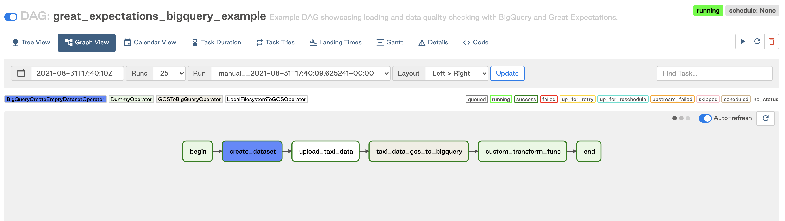
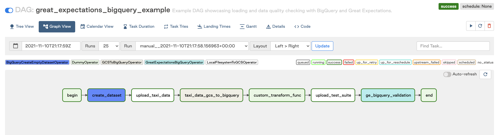

<!-- markdownlint-disable-file -->

### **Introduction**

[Introduce authors here as an italic note(?)]

In this blog post we will talk about how to use Great Expectations in an Airflow DAG to perform data quality checks. You’ll learn how to think about adding data quality in an iterative way to existing pipelines, including prioritizing what checks are done and how they’re scheduled with Airflow.

If you aren’t familiar with [Great Expectations](https://docs.greatexpectations.io/docs/why_use_ge) or Airflow, check out the docs and learn about the basics of [DAGs](https://www.astronomer.io/guides/dags), [Expectation Suites](https://docs.greatexpectations.io/docs/reference/expectations/expectations), and [Checkpoints](https://docs.greatexpectations.io/docs/reference/checkpoints_and_actions/) before continuing here.

### **Iterative Approach**

A broken dashboard and angry exec are the traumatic moments that lead many orgs to add data quality checks. We believe data quality should be added to pipelines before major issues surface – data quality as preventative pipeline medicine, not treatment. This follows the same model as [test-driven development](https://developer.ibm.com/articles/5-steps-of-test-driven-development/), where tests are written first to ensure that code (or data!) is correct from the start. Two kinds of tests we’ll be looking at in this post are acceptance and unit tests, where the former checks the results of a pipeline and would happen after the “T” in ELT, and the latter checks data being inputted into the pipeline, happening as part of the “L” in ELT.

Adding data quality to pipelines doesn’t have to happen all at once. By implementing one critical data unit test (e.g. type-checking input data) and one critical data acceptance test (e.g. checking ranges of outputs from a transform), your data team can start small and work iteratively towards covering all your data test cases. To figure out what those first tests should be involves identifying data that is most vital for stakeholders–perhaps data that has already caused a headache.

#### **Basic Use Cases**

Now that we understand at a high level what to look for and how to look for it, let’s dive into a couple specific unit test cases to get your first iteration of data quality set. Using the [NYC taxi dataset](https://www1.nyc.gov/site/tlc/about/tlc-trip-record-data.page), we see that taxi trips involve this data:

Let’s say we talk to our business experts about the data and learn that every ride should have at least one passenger and the length of the ride should not be null. These are great examples of low-hanging fruit for our first iteration as the expectation of the data is very clear and specific, and that data outside of the expectation is a certain indicator that something is very wrong. In Great Expectations, the tests for these columns simply looks like:

`expect_column_values_to_be_between(column=”passenger_count”, min_value=1)`
`expect_column_values_to_not_be_null(column=”trip_distance”)`

[See here for a more in-depth tutorial for getting started with Great Expectations](https://docs.greatexpectations.io/docs/tutorials/getting_started/intro)

If we are concerned about mission-critical data, such as a CRO tracking daily revenue, we could implement a check to ensure that a minimum daily mean for trip price is enforced. If the unit test fails, an alert could be sent, allowing the error to be caught and resolved quickly. With this single safety check in place, a strong case for including data quality in your company’s pipeline can already be made. The test looks like:

`expect_column_mean_to_be_between(column=”total_amount”, min_value=”20.00”)`

Of course, understanding what data are mission-critical means collaborating with the stakeholders of the data, as it can’t always be surmised from the dataset alone.

Putting together a suite of expectations at this level of complexity is simple, easy, and already starts to make data much more reliable. We can already find errors in data that may hint at underlying issues in business logic in code, or even errors at the source like taxi cab hardware malfunctions. There are also expectations that get deeper into the statistics of our data, like `expect_column_quantile_values_to_be_between`, or `expect_column_kl_divergence_to_be_less_than`. Our next step is to find more nuanced issues in the data, ones that can’t be found just by looking at the csv file for a day.

#### **Defining Table And Column Metrics**

Table and column metrics are both important ways to think about data quality, and the concept is important to note before diving into more advanced use-cases. Both types of checks can be written using Great Expectations, and it’s almost assured both will be used when building a robust test suite for your data.

Table-level expectations concern the structure of your data at the table level. For instance, imagine your taxi data are ingested as a daily csv. If you wanted to ensure that each day’s csv has the same structure as previous days, you could add an expectation called `expect_table_columns_to_match_ordered_list`. Or if you know that a lookup table has 22 possible values, you could add `expect_table_row_count_to_equal` to ensure that values were not added or removed from this table.

Column level expectations tend to deal more with the data itself. These expectations can be about the aggregate of a column, as in `expect_column_mean_to_be_between`, or they can be about the individual values of a column, checking whether each value matches a given expectation, such as `expect_column_values_to_be_in_set`.

In order to facilitate the initial creation of Expectation Suites, Great Expectations provides a few different Profilers. These will introspect your data and give you a scaffolded Expectation Suite that you can then modify to better suit your purposes. Profilers help you cut down on the writing of  boilerplate code, and help you broadly cover your bases with data before dialing in to specific columns and table metrics.

The [`UserConfigurableProfiler`]() is what you get out of the box. It’s available from Great Expectations’ CLI, and, while basic, it allows for some configuration. Great Expectations also has a [Rule-Based Profiler](https://docs.greatexpectations.io/docs/reference/profilers/#rule-based-profilers) that is smarter, more configurable, and more reusable.

#### **Advanced Use Cases**

For advanced cases with Great Expectations, instead of just looking at simple expressions based on a column, we may instead be comparing data across tables or on the same table across different times. Great Expectations also allows checks on statistical analysis on columns, tables, or entire databases.

Looking again at the NYC taxi data below, we can come up with an acceptance test for our data at the table level.

For instance, perhaps we’d like to see if the distribution of our taxi trip distances remains similar from month to month. We could look at the distribution of our trip_distance column in January, and confirm that the distribution in February hasn’t diverged too much, using both of the previously mentioned Expectations to our Expectation Suite:

`expect_column_quantile_values_to_be_between`
`expect_column_kl_divergence_to_be_less_than`

Great Expectations lets you apply Expectations in an interactive way on an actual batch of data. So when we add `expect_column_quantile_values_to_be_between` to our Expectation Suite, we can see right away whether the Expectation passes on the January batch of data, and refine it until we have the quantiles values that we want. We could then run our Expectation Suite on our February data to see if our distribution matches our Expectations.

In any case, quality checks on data need to be run in the right place, at the right time. Fortunately, with DAGs, instrumenting the right process is easy. In the next section, we'll provide some criteria for when quality checks make sense within a DAG versus in their own DAG. We’ll also take a look at how to decide on the schedule for these DAGs.

### **Orchestrating Data Quality**

Where data quality tasks are run matters. When using a tool like Great Expectations, it’s important to know some of how GE works to decide on where to put the GE tasks.

#### **As Tasks Inside The DAG**

If you’re using Write-Audit-Publish, a pattern to ensure that bad data doesn’t make it to production, then keeping the checks within the same DAG as the pipeline is ideal. You can use checkpoints to test data in batches on staging, moving failing data to an error table, or dropping it altogether. This pattern works in cases where the tests should be “close” to the data, and for ensuring that transformations in the pipeline are happening correctly. In terms of scheduling, it means that your data quality is always scheduled along with the pipeline, so critical pipelines running frequently would highly benefit from this pattern.

The two examples above show how easy it is to add Great Expectations operators to a working ETL pipeline. More information about how to use the `GreatExpectationsBigQueryOperator` can be found in the [Astronomer Registry](https://registry.astronomer.io/providers/great-expectations/modules/greatexpectationsbigqueryoperator).

#### **As A Separate DAG**

This scenario is great for running checkpoints or test suites on entire tables, especially for more complex metrics like statistical analyses. As a separate DAG, multiple suites can be run on many tables simultaneously, and dependencies between test suites can be respected. This is generally better for cases where data are known to be populated at certain intervals, or data in a warehouse needs to be checked at regular intervals. For example, weekly table checks for tables that get populated by hourly or daily jobs. This data may be less critical, or may simply not be ready for checks right away (say there’s a dependency between datasets that get populated at different times). The DAGs can also be kicked off after completion of a pipeline for a post-hoc check; it’s better to run checks this way on data that aren’t critical, so if the data are wrong, the whole warehouse isn’t tainted.

The above example DAG shows how to serially run a set of Great Expectation suites as its own DAG. More information on how to use the `GreatExpectationsOperator` can be found on the [Astronomer Registry](https://registry.astronomer.io/providers/great-expectations/modules/greatexpectationsoperator).

#### **Managing the Data Quality lifecycle**

Using Great Expectations as your dedicated data quality tool with Airflow will give you several other important benefits:

1. [Compile to docs](https://docs.greatexpectations.io/docs/reference/data_docs/): All of your tests can be compiled to clean, human-readable documentation, allowing you to build trust with other data stakeholders and continuously keep tests and docs in sync.
2. [Automated Profilers](https://docs.greatexpectations.io/docs/reference/profilers): Quickly create a starting point for generating Expectations about a dataset by building an expectation suite from one our more data assets
3. [A broad, open, and extensible library of Expectations](https://greatexpectations.io/expectations/) that comes with a variety of useful checks for your data built-in, and for which your own custom Expectations can be written.

Broadly speaking, you can think of all of these as components of managing the lifecycle of data quality. Whether you’re deploying quality checks as code within tasks, as tasks within a DAG, or as a separate DAG, you’ll need to create, manage, and share Expectations with others in your organization.

Great Expectations is a purpose-built tool, backed by a large, active community. With over 5,000 members in Slack, it’s clear that we’ve become a trusted tool in the community to help people have confidence to always know what to expect from their data.

And as stewards of the data quality community, we recognize that in order for our users to become even more effective towards this goal, we need to provide them with the tools they need to succeed.
