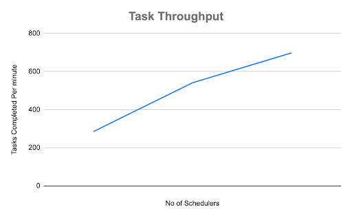
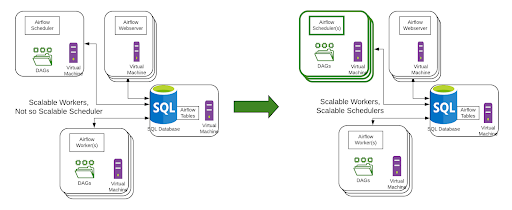

As part of [Airflow 2.0](https://www.astronomer.io/blog/introducing-airflow-2-0), a key area of focus has been on the Airflow Scheduler. The Airflow Scheduler reads the data pipelines represented as Directed Acyclic Graphs (DAGs), schedules the contained tasks, monitors the task execution, and then triggers the downstream tasks once their dependencies are met. Historically, Airflow has had excellent support for task execution ranging from a single machine, to Celery-based distributed execution on a dedicated set of nodes, to Kubernetes-based distributed execution on a scalable set of nodes.

# Motivation for Update

Though Airflow task execution has always been scalable, the Airflow Scheduler itself was (until now) a single point of failure and not horizontally scalable. We at [Astronomer](https://astronomer.io) saw this scalability as crucial to Airflow's continued growth, and therefore attacked this issue with three main areas of focus:

**1. High Availability:** Airflow should be able to continue running data pipelines without a hiccup, even in the situation of a node failure taking down a Scheduler. This has been a source of concern for many enterprises running Airflow in production, who have adopted mitigation strategies using “health checks”, but are looking for a better alternative.

**2.Scalability:** Airflow’s scheduling functionality should be horizontally scalable, able to handle running hundreds of thousands of tasks, without being limited by the computing capabilities of a single node. We have heard data teams want to stretch Airflow beyond its strength as an Extract, Transform, Load (ETL) tool for batch processing. An example of this has been in automated surge pricing where the price is recalculated every few minutes requiring data pipelines to be run at that frequency. We have long felt that a horizontally scalable and highly-available Scheduler was critical to moving the needle in Airflow's performance with predictable latency in order to meet such new demands and cement its place as the industry's leading data orchestration tool.

**3. Performance:** Measured by task latency, the scheduler must schedule and start tasks far more quickly and efficiently. The performance capability of Apache Airflow's Scheduler has been a pain point for advanced users in the open-source community. In fact, "Scheduler Performance" was listed as the most asked for improvement in [Airflow's 2019 Community Survey](https://airflow.apache.org/blog/airflow-survey/), which garnered over 300 individual responses.

A solution that addresses all three problem areas was originally proposed by the Astronomer team as part of [AIP-15](https://cwiki.apache.org/confluence/pages/viewpage.action?pageId=103092651) in February 2020. 

With the imminent release for Airflow 2.0, we're delighted to officially announce Airflow's refactored Highly Available Scheduler, and formally share our work with the open-source community. 

# High Availability

There are several standard patterns to solving the High Availability problem in distributed systems. 

The standard and the simplest pattern is to use the “active / passive” model of running two instances of a service, where the active (primary) instance of a service is processing transactions and the backup (passive) instance is waiting to take over in case of a failure rendering the primary inactive. The biggest advantage here is that it is one of the simplest to implement. 

However, one of the several disadvantages is that there is a “wastage” of resources in running a passive instance. There is also a defined “recovery interval” after the failure of the “active / primary” instance, for the “backup / passive” instance to detect that the primary has failed and for it to start processing transactions. Additionally, it does not solve the second problem of horizontal scalability.

## Multiple Schedulers in an Active / Active Model

Airflow 2.0 comes with the ability for users to run multiple schedulers concurrently in an active / active model. This is again a standard distributed systems pattern, but significantly more complex to implement as compared to the active / passive model described above, because of the synchronization needed between schedulers. The advantages here are that both instances are processing transactions concurrently, therefore solving the disadvantages of the active / passive model detailed above.

The following enhancements have been made as part of Airflow 2.0:

- Multiple schedulers can now be run within Airflow. For a high availability situation (any production deployment), this should be at least two.
- Each scheduler is fully 'active'. This includes 'non-scheduling' work as well as task execution monitoring, task error handling, sending task emails, and clean-up.
- The running schedulers all use the same shared relational database (the 'metadata database').
- The scheduler uses this database as the 'shared queue' for operations to be performed. In practice, this means that one of the schedulers picks 'the next DAG to be run' from the list and 'locks it' in the database to start working on it. It retains the lock while it is working on it, and releases it when done.

The Scheduler's now-zero recovery time and rolling updates for easier maintenance concretely pulls it away from acting as a single point of failure for any Airflow Deployment.

## Zero Recovery Time

Historically, the recovery time for a crashed scheduler largely relied on an external health check to identify a failure in the first place. The health check itself needed to be conservative in doing so given the Scheduler's regular operation could be a time-consuming operation as well as varied, resulting in irregular heartbeat.

Since the 2.0 Scheduler is implemented as an active / active model, there is zero downtime and no recovery time, since the other active scheduler(s) are constantly running and taking over operations. There is a possibility of reduced throughput because of more work to be done by remaining active schedulers, but there is no recovery time required.

## Easy Maintenance

Another major advantage of running multiple Airflow schedulers is the ease of maintenance that comes with rolling updates. The Airflow 2.0 model allows for changes to be made to individual schedulers without impacting the rest. This is especially useful for security patches and configuration updates that are often needed for regular maintenance.

# Single Scheduler Optimization

Airflow 2.0 brings significant performance improvements even for teams running a single scheduler.

## DAG Serialization

[DAG Serialization](http://airflow.apache.org/docs/stable/dag-serialization.html), which was introduced in Airflow 1.10.7+ and will be a hard-requirement for 2.0, set a strong foundation for improved performance by freeing the Webserver from needing to parse 100% of DAG files and instead allowing it to read _serialized_ DAGs from the database and de-serialize them to show DAGs in the Airflow UI. The Airflow 2.0 Scheduler expands the use of DAG Serialization by using the _serialized_ DAGs from the database for task scheduling and invocation. This reduces the time needed to repetitively parse the DAG files for scheduling.

## Fast-Follow Implementation

Airflow 2.0 introduces "fast-follow" also referred to as a "mini-scheduler" in the workers. This has been discussed for a while within the Airflow developer community and at times has also been referenced as a "distributed scheduler".

Fast-follow workflow:

- After the current task is completed in an Airflow Worker, Airflow looks to see if there is a follow-on task in the same DAG that is now ready to be run.
- If this is available, this follow-on task is taken by the current worker and is executed immediately.
- Overall efficiency is much greater as a result, since the follow-on task does not need to be scheduled to a worker by the Scheduler. Also, since the current worker already has the DAG parsed, the DAG parsing time for the follow-on task is eliminated.
- The "fast-follow" mechanism is extremely beneficial for linear DAGs and even more so in the context of the Kubernetes Executor.

## Benchmarked Performance Gains

We have been using _"task latency"_ as the key metric to benchmark scheduler performance and validate improvements. Often evident in the "Gantt" view of the Airflow UI, we define task latency as the time it takes for a task to begin executing once its dependencies have been met.

Along with the above architectural changes, Airflow 2.0 also incorporates optimizations in the task startup process and in the scheduler loop, which reduces task latency. 

To sufficiently test this, without skewing numbers based on the actual task “work” time, we have chosen to benchmark using a simple BashOperator task with a trivial execution time. The benchmarking configuration was: 4 Celery Workers, PostgreSQL DB, 1 Web Server, 1 Scheduler.

Results for 1,000 tasks run, measured as _total task latency_ (referenced below as _task lag_).

| Scenario                                         | DAG shape   | Airflow 1.10.10  Total Task Lag | Airflow 2.0 beta  Total Task Lag | Speedup  |
|--------------------------------------------------|-------------|---------------------------------|----------------------------------|----------|
| 100 DAG files, 1 DAG per file, 10 Tasks per DAG  | Linear      | 200 seconds                     | 11.6 seconds                     | 17 times |
| 10 DAG files, 1 DAG per file, 100 Tasks per DAG  | Linear      | 144 seconds                     | 14.3 seconds                     | 10 times |
| 10 DAG files, 10 DAGs per file, 10 Tasks per DAG | Binary Tree | 200 seconds                     | 12 seconds                       | 16 times |

As the above benchmark results show, even a _single_ Airflow 2.0 Scheduler has proven to schedule tasks at _much_ faster speeds.

# Horizontal Scalability

Airflow 2.0 Scheduler’s support of an active / active model is also the foundation for horizontal scalability, since the number of Schedulers can be increased beyond two, to whatever is appropriate for the load. 

## Increasing Number of Schedulers

The key benefit of the active / active model is the ability to scale Airflow horizontally by provisioning multiple Schedulers across nodes, much like one maintains a [ReplicaSet](https://kubernetes.io/docs/concepts/workloads/controllers/replicaset/) for some collection of Pods in Kubernetes. If the load on one Scheduler increases due to high task volume, a user can now launch additional "replicas" of the Scheduler to increase the throughput of their Airflow Deployment. 

Similarly, users can always reduce the number of schedulers to minimize resource usage as load lessens. Since each Scheduler is “fully active” and identical, there is no downside to scaling down based on the load.

## Service Composition

One of the distributed systems principles followed in the Airflow 2.0 Scheduler is that of _Service Composition_ to enable external tooling to manage the number of Scheduler instances to be run. This was a conscious choice leading to the following architectural decisions:

* Having each Scheduler be complete and _“fully active”_, rather than have a _“leader”_ and other _“followers”_, with differing sets of capabilities. 
* Not having internal monitoring of Scheduler instances by other Scheduler instances. This is generally, though not always, implemented by a _“leader election”_ model related to the above.
* Expecting distributed system tooling to be _“layered”_ on top of Airflow to monitor elements such as task load and task latency, and to easily scale up / down Airflow Schedulers and Workers as needed.
* Using the metadata database as the shared queue and synchronization mechanism. This has the added benefit of not requiring communication between Scheduler instances and therefore eliminates the need for additional system and network configuration.

## Scalability Benchmarks

We have been using _task throughput_ as the key metric for measuring Airflow scalability and to identify bottlenecks. _Task throughput_ is measured in “tasks per minute”. This represents the number of tasks that can be scheduled, queued, executed, and monitored by Airflow every minute.

To sufficiently test this, without skewing numbers based on the actual task “work” time, we have chosen to benchmark using a simple PythonOperator task with a trivial execution time. The benchmarking configuration was: Celery Workers, PostgreSQL DB, 1 Web Server.

Results for _task throughput_ (metric explained above) using Airflow 2.0 beta builds, run with 5,000 DAGs, each with 10 parallel tasks on a single Airflow deplosyment. The benchmark was performed on Google Cloud and each Scheduler was run on a [n1-standard-1 machine type](https://cloud.google.com/compute/docs/machine-types#n1\_machine\_types).

| Number of Schedulers  | Number of Workers  | Task Throughput (average)  | Task Throughput (low) | Task Throughput (high) |
|-----------------------|--------------------|----------------------------|-----------------------|------------------------|
| 1                     | 12                 | 285                        | 248                   | 323                    |
| 2                     | 12                 | 541                        | 492                   | 578                    |
| 3                     | 12                 | 698                        | 632.5                 | 774                    |

As the results show, adding Schedulers consistently increases _task throughput_. This enables flexible scale up / scale down of Schedulers based on demand. 

## Deployment Models

A sample Airflow Scheduler HA deployment on a set of Virtual Machines is shown below. The Airflow 1.x deployment model is on the left, with the Airflow 2.0 scalable scheduler deployment model on the right.

# New Possibilities

Based on the original goals for Scheduler - Performance, High Availability, and Scalability - the above benchmark results show that the early signs are extremely positive.

However, the most compelling takeaway from the Airflow 2.0 Scheduler is its implication for the future of Apache Airflow. A horizontally scalable Scheduler with low task latency enables Airflow to stretch beyond its current limits towards new, really exciting applications. A couple of interesting possibilities are around near real-time analytics and machine learning.

## Near Real-time Analytics

Many business problems in domains such as the Internet of Things (IoT), Smart City, Medical telehealth, and Financials require near real-time analytics. This is typically done using micro-batch processing. Micro-batch processing is the practice of collecting and processing data in small groups (“batches”) at high frequency - typically in the order of minutes. 

Preventive maintenance is a key IoT use case intended to detect problems in equipment before they occur. This requires analytics based on data being reported by sensors at frequent intervals, measuring values such as temperature. 

Fraud detection and Stock market analysis in the Financials industry and patient vitals monitoring as part of telehealth follow similar patterns of needing multiple data points to process in near real-time while taking historical data into account.

## Machine Learning

Some machine learning use cases require a dramatic scale up of tasks for a short period of time, to handle making a decision "as late as possible", based on the "most current data set available". Quick scale-up of processing for an extremely high volume of short tasks to be executed in parallel is a key requirement to accommodate these scenarios.

## Task Computing Flexibility and Observability

The Airflow Scheduler does more than just scheduling of tasks and is well on the way to being a hypervisor. The Airflow 2.0 Scheduler is a big step forward on this path, which enables lighter task execution with fewer dependencies. This enables a more flexible task computing execution infrastructure which can be tailored to data processing requirements resulting in better compute time / cost tradeoffs,  a more secure execution profile, and better task observability.

By introducing horizontal scalability, low task latency and high predictability, the Airflow 2.0 Scheduler builds the foundation for an expanded set of data processing infrastructure, which is critical for reliable artificial intelligence analytic applications.

As members of the Airflow community, we are excited for a new frontier!