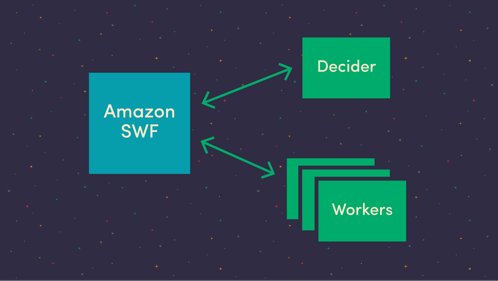
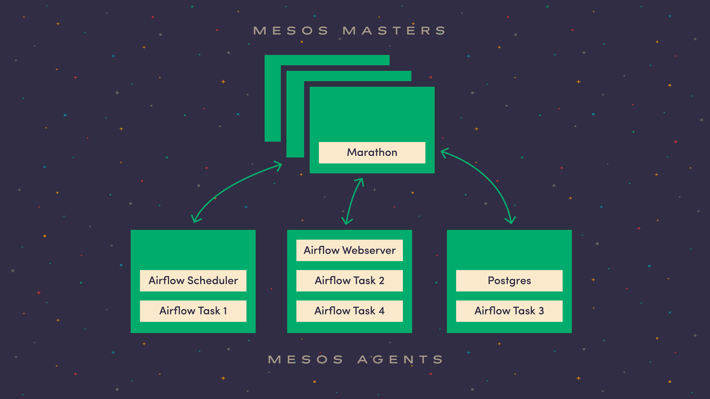

**Update**: Since this blog post was published, we've made some huge developments on our managed Airflow service, which we call Astronomer Cloud. [Check out the product page here](https://astronomer.io/cloud) and [start a free trial here](https://trial.astronomer.io) if you'd like.

At Astronomer, we're&nbsp;creating&nbsp;a modern platform for organizations to build data pipelines to power their analytical and machine learning workloads. Our goal is to make it extremely simple for anyone to set up a data pipeline without having to worry about everything involved with keeping that pipeline running. We pride ourselves on being adaptable enough to extract data from _anywhere_ and get it into your data lake or data warehouse.

We could, for example, synchronize data from your Salesforce account, collect webhook data from Stripe, replicate your application database and stream user event data from your web and mobile applications into a single data warehouse, where you could run an ML algorithm to model propensity to upgrade plan tiers against in-app usage.

Of course,&nbsp;executing&nbsp;and monitoring all these different types of data pipelines can easily get messy without a unified scheduling system. Airflow was our answer to avoiding the mess—and, turns out, a whole lot more.

### Version 0.5

Let’s back up: Early in the Astronomer journey, we needed to quickly prototype our system to run a simple pipeline to pull data from a database or API, transform it and dump it somewhere else, like Amazon Redshift. Our first instinct was to scour open source tools we could leverage to get us up and running quickly. Unfortunately, a cursory open source search came up relatively dry, but in the meantime we stumbled through the ever-expanding AWS Services dropdown menu and ended up experimenting with Amazon SWF, Amazon’s _Simple_ Workflow Service. The marketing page says a lot of things about&nbsp;it being highly simple (obviously), scalable, flexible,[yadda, yadda, yadda](https://www.youtube.com/watch?v=O6kRqnfsBEc). Our bank was full of AWS credits (one of the perks of going through[Angelpad](https://angelpad.org/)), so we decided, why not? It seemed like we could get the process moving pretty quickly without worrying about scale, and without the hassle of a distributed scheduling system. With that, Version 0.5 was underway!

Amazon had published Ruby and Java frameworks to make it simple to write workflow programs, which abstracted away the chatty SWF API. Turns out, though, these frameworks weren’t great for our particular use case, since we wanted to stay within the Node ecosystem like the rest of our stack. So we started writing[a little JavaScript library to wrap up the SWF API](https://www.astronomer.io/blog/aries-a-source-for-your-data-pipeline) and googled “list of constellations” to find a space-related library name to complement Astronomer: we landed&nbsp;on Aries.

Aries wrapped up all the back and forth between an Amazon customer’s programs and the SWF service. We could plug in logic for what Amazon calls the “decider,” a program that long-polls the SWF service for events. When something important happened, we could execute some logic to start a workflow, execute a task or end a workflow. It also provided support for more subtle features like heartbeats and version management.

So we&nbsp;set up an Elastic Beanstalk environment to host our decider, and another one where we would execute tasks. This kept the two services separated to reduce failures and allow them to be scaled independently. The worker nodes would long-poll the SWF service for tasks to execute. When one got a task, it ran it directly and reported the status back to the SWF service—and the cycle continues. This was exactly what we needed, at first.

### Oversimplified

Pretty quickly, though, we hit issues with the system as we operated it in production. Because the SWF interface is minimal and generic, operators have very little insight into what is going on under the hood. Debugging issues was difficult when we could barely keep track of what was happening, let alone where. Even when we sent logs to Cloudwatch to monitor our services like we did with applications on Elastic Beanstalk, we struggled to track down tasks or identify which log streams to look at. Clearly, we needed to invest more resources into fixing this system up or rebuild something of our own.

Around this same time, we were having some serious discussions about&nbsp;who and what Astronomer was, and where our platform was heading. Whatever we built, our top priority became building a customer-hosted, cross-cloud, enterprise edition that could adapt to any technology. So we ditched SWF, Elastic Beanstalk and Cloudwatch and prepared to create our own platform, [this time digging deeper to determine the right open source technologies](https://www.astronomer.io/blog/why-we-built-our-data-platform-on-aws-and-why-we-rebuilt-it-with-open-source).

### On the Hunt

Open source had some seemingly viable options:&nbsp;[Luigi](https://github.com/spotify/luigi), [Oozie](https://github.com/apache/oozie), [Azkaban](https://azkaban.github.io/), [Airflow](https://github.com/apache/incubator-airflow), and a few other lesser-known ones. Luigi, built by Spotify, seemed to support complex[DAG](https://en.wikipedia.org/wiki/Directed_acyclic_graph)s defined _in code_, and had a nice web application for visualizing workflows, but lacked support for running in a highly available, distributed setting that supported our multi-tenant system. Oozie seemed established but really only played in the Hadoop world, and that’s not the only place we were. Azkaban (developed at LinkedIn) was similar: it simply wasn’t as adaptable&nbsp;as we needed it to be. We needed a system that didn’t have many external dependencies and didn’t make too many assumptions about its environment.

Then we looked closely at Airflow. It’s currently incubating in the Apache Software Foundation but was initially developed by Maxime Beauchemin at Airbnb, who spent a lot of time working on Facebook’s ETL systems. DAGs were defined using code, a web interface offered great task logging support and a lot of components can be plugged in. Moreover, Airflow makes no assumptions about where you want to execute your tasks, although it ships with a few built-in options. With Airflow, we could execute our task code locally, like Luigi, or we could use a distributed task queue, like Celery (RabbitMQ / Redis).

Things were already looking good when we discovered a lone community contributed executor, the Mesos Executor. Mesos acts as a distributed systems kernel, scheduling arbitrary work to be done within a cluster of general purpose compute nodes. We have a lot of tasks to run, all with varying computational needs. Mesos hit the sweet spot for the type of work we would be executing.

Now we had a plan: build up a Mesos cluster, run the Airflow service components in containers and delegate the tasks to run in containers on the cluster when it was time to do some work. So we packaged Airflow up into a Docker container and used Marathon to run the various components. Marathon is the Mesos framework that allows cluster operators to execute and scale long-running applications. Our Marathon application group consists of a Postgres database, the Airflow scheduler and the Airflow webserver. Marathon also keeps track of these services and will scale and restart them if they fail to start over.

### Astronomer Reloaded

With this plan, we finally felt confident that Astronomer would be a bundle of best-of-breed big data tools, APIs and libraries. It was time to rethink and reposition Astronomer in the market as a suite of open source projects bundled up into a premium package.

If we were going to do this, though, we had to take a modular approach to everything we did, knowing damn well that any component could be cycled out of the system in the future. In a fast-moving industry, new tools are emerging every day. Adapting and contributing to new projects as quickly as possible was crucial if we were going to offer our users the absolute best experience available at all times. The good news is, with Airflow’s unique, adaptable architecture, we had the boost we needed to march boldly down this path.

### Time to Migrate

With a highly available cluster to run the entire Airflow system, we began to migrate away from the SWF system. While we were working on the new cluster, we were still building integrations for the old system to support our customers, but luckily, it was pretty easy to rip out the SWF-related code and swap in Airflow support.

All the integrations adhered to a very simple, well-defined interface, so we just created a CLI tool that takes arguments from an `airflow run` command and passes them along to the tasks. Since they existed as separate repositories, the upgrade process for each task was super simple: `echo FROM astronomerio/aries-data \> Dockerfile`. The `aries-data` base image takes care of adding the appropriate files, installing dependencies and setting the correct entrypoint. When it was time to run a task on the cluster, our system automatically checked for an updated Docker image (downloading it if necessary), started a container and called the aries-data CLI as the entrypoint, which passed the arguments from Airflow on down to the actual task code.

Now we have a great system that not only schedules work, but also executes that work wherever it fits in the cluster. We currently run all Aries integrations on this system and just added support for webhooks. As we receive webhook data from third parties, we micro-batch and flow the data through an Airflow DAG. Soon, we'll be migrating our clickstream integrations over to this system.&nbsp;Then, as we receive events on our clickstream API, they’ll be micro-batched and dumped to S3, triggering an Airflow DAG execution.

### Our Future With Airflow

We’re currently&nbsp;working on first-class support for executing integrations written using the [Apache Beam](https://beam.incubator.apache.org/) API, which offers developers a unified way to write batch and streaming jobs for clustered execution environments. Soon, our cluster will be equipped with execution environments for Flink and Spark, allowing us to package integrations written in Beam and schedule them to execute on our Flink back-end. Because Airflow makes so few assumptions, we should also be able to plug these integrations right into our existing ecosystem.

Airflow is great because it conforms to the Unix philosophy of building software that is modular, extensible and does one thing well. These core principles are what allow Airflow to run perfectly in a distributed environment, letting the components to be independently scaled, restarted and upgraded. Airflow is a scheduler at heart, with tools like a CLI, web interface and distributed logging to support that. It makes no assumptions about what you actually want to do or where you want to do it, giving operators the freedom to make changes and swap things around under the hood.

With Airflow as part of our foundation, Astronomer is fully adaptable, swappable and upgradeable at our very core. Airflow enables us to build our platform on&nbsp;a unified scheduling system that can scale to enterprise and be hosted anywhere. As we continue to build on this type of architecture, we are able to&nbsp;stay agile and free to experiment with new technologies as they are developed. No matter where data wants to hide, we will be able to extract and monitor it, and&nbsp;see to it that it gets wherever organizations need&nbsp;it to go.

