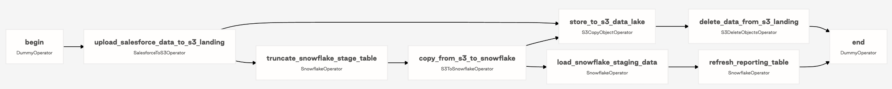
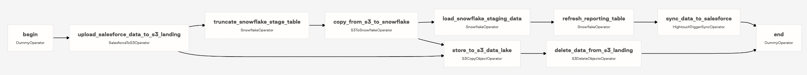
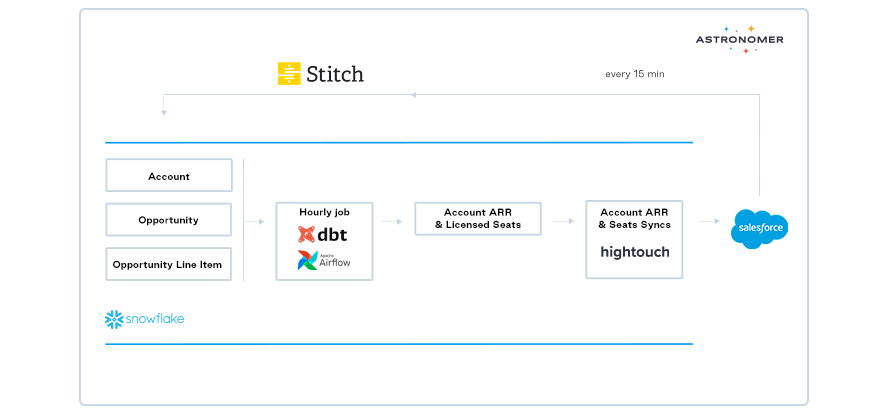

As data has become more relevant to all parts of a business, SQL has risen as a universal access layer that allows anyone to get the data they need to do their job. This is a democratizing force as data is no longer stuck in the hands of an engineer — it can be used by anyone in the company to answer questions about the business. Today, using Reverse ETL tools like Hightouch and modern orchestrators like Apache Airflow takes the power of SQL to the next level.

## Operational Workflows & Analytics Workflows

The term “data pipeline” traditionally describes an analytics workflow focused on answering questions. BI teams try to understand what is going on within the business by building executive dashboards and showing information like KPIs across sales, marketing, finance, etc. In Airflow, an analytical workflow might be running transformations to format data for a tool like Looker. These analytics workflows, often expressed as Airflow DAGs, are the core of a team’s BI and analytics functions.

On the other hand, [operational data workflows](https://hightouch.io/blog/what-is-operational-analytics/) are about leveraging data to actually “do things.” They could trigger a daily email to all customers who leave something in their cart for an e-commerce business or enrich customer records in Salesforce with product usage data for sales teams. [Reverse ETL](https://hightouch.io/blog/reverse-etl) tools turn SQL queries into data pipelines to write data into systems, not just pull data for analysis. **Tools like [Hightouch](https://hightouch.io/) enable anyone to use SQL to not only answer questions, but also to take actions- expanding the scope of data pipelines to be operational, not just analytical.**

The rise of operational data workflows is only possible due to key changes in modern data warehouses. Warehouses are now:

* more affordable (you only pay for compute at query run time)
* more accessible (you don’t need full time staff to maintain your warehouse with SaaS solutions)
* faster than ever (shared compute allows for nearly infinite compute).

As companies standardized on these warehouses, they became the central store for business data, models, and key metrics (e.g: ARR and LTV). Naturally, analysts responsible for these metrics started to see the potential within the warehouse as a means for activating their own workflows and projects. With the warehouse as the source of truth, **reverse ETL empowers analysts to use SQL as both an access layer AND as an action layer.**

## The Role of Data Analyst and Data Engineers

Reverse ETL allows anyone who knows SQL to write data pipelines. So that begs the question: who should be in charge of pipelines within a company? Traditionally, Data Engineers would own this, but most often, there are not enough data engineers to keep up with all the pipelines a business needs. Moreover, data engineers often have to spend a lot of time understanding the business context behind the pipelines they are writing.

There are some pipelines that data engineers are always going to be responsible for, but analysts and other SQL-enabled team members (ex: RevOps) likely have the most context for creating pipelines that push to tools they use. This frees up time for Data Engineers to focus on their core competency: pipelines necessary for data modeling and maintaining the data warehouse as the single source of truth. With data engineers setting up the models and schema, analysts can leverage their work for business value (which includes syncing those models into business tools).

## Using Airflow for Operational Workflows: Case Studies

So how does this work in practice? [In Airflow, a standard ELT or ETL workflow might hit an external API in the first task, pull that data to a data lake (S3) in the next one, load it into the data warehouse downstream, and end with a few transforms to put it into a materialized view](https://registry.astronomer.io/dags/modern-elt-salesforce-to-snowflake).

So far, this is an analytic data workflow - the data is being prepped for analysis. From there, a single Airflow task with a Hightouch operator can be [used to operationalize the workflow by *pushing* to an external tool](https://registry.astronomer.io/dags/modern-elt-salesforce-to-snowflake-hightouch).

For example, **Mattermost**, an open-source messaging platform, created an operational
workflow to help their sales team stay on top of new leads. The initial trigger of this workflow is a user creating a new workspace within the Mattermost cloud app. Then, when that new data is detected in their data warehouse, that user is converted from a Lead to a Contact in Salesforce. Then, an opportunity is created for that contact’s company and an account manager is assigned. Finally, a task is created for that account manager to reach out to the contact with information on Mattermost’s paid plans.

1. Airflow runs dbt "Hourly Job" to create tables of records that need to be updated/created in Salesforce.

2. Hightouch sync via API call when the dbt jobs finish.

3. Salesforce data is updated/created via Hightouch Bulk API.

4. Stitch sync Salesforce data into Snowflake (every 15 minutes).

## Airflow + Reverse ETL

The Airflow [Hightouch Provider](https://registry.astronomer.io/providers/hightouch) includes a production ready hook and operator that can be plugged right into your pipelines. To get started with Airflow + Hightouch, check out [these docs](https://hightouch.io/docs/integrations/airflow/) and sign up for [Hightouch](https://hightouch.io/) and [Astronomer](https://www.astronomer.io/get-astronomer/).