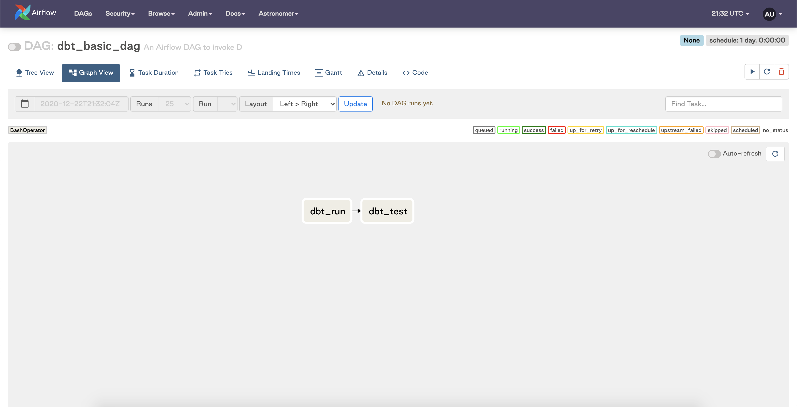
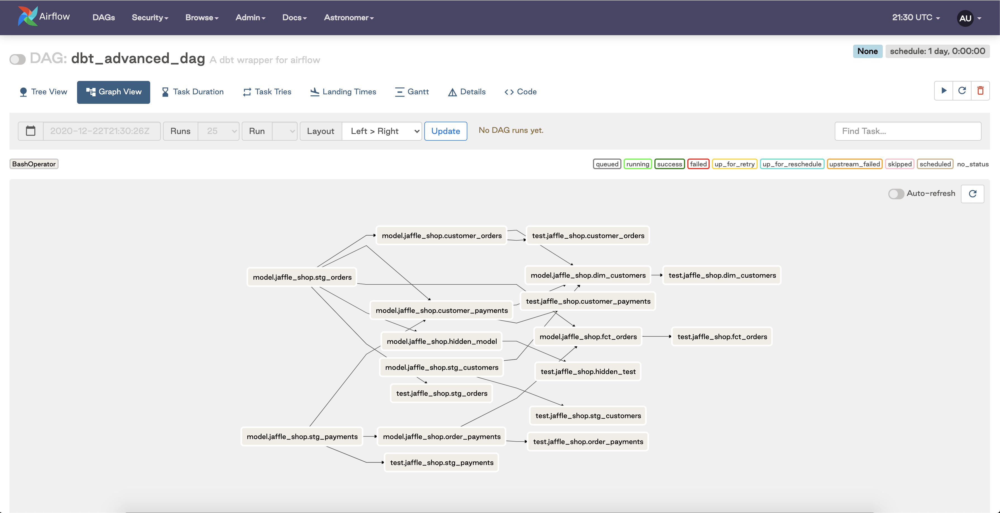

> **Note:** All of the code in this post is available in [this Github repository](https://github.com/astronomer/airflow-dbt-demo) and can be run locally using the Astronomer CLI.

## Editor's Note

At Astronomer, we're often asked how to integrate Apache Airflow with specialized data tools that accommodate certain usage patterns. A tool that often comes up in conversation is [dbt](https://getdbt.com), an open-source library for analytics engineering that helps users build interdependent SQL models for in-warehouse data transformation. The portion of the modern data engineering workflow that dbt addresses is significant; as ephemeral compute becomes more readily available in the data warehouse itself thanks to tools like [Snowflake](https://snowflake.com), data engineers have embraced an ETL—>ELT paradigm shift that encourages loading raw data directly into the warehouse and doing transformations on top of the aforementioned ephemeral compute. Dbt helps users write, organize, and run these in-warehouse transformations. Given the complementary strengths of both tools, it's common to see teams use Airflow to orchestrate and execute DBT models within the context of a broader ELT pipeline that runs on Airflow and exists as a DAG.

In chatting with a handful of Astronomer customers who have spent time exploring solutions at the intersection of Airflow and dbt, we discovered that our friends at [Updater](https://updater.com) have built a particularly great experience for authoring, scheduling, and deploying dbt models to their Airflow environment.

With that, we collaborated with [John Lynch](https://www.linkedin.com/in/john-lynch-31146579/), Senior Data Engineer, and [Flavien Bessede](https://www.linkedin.com/in/flavienbessede/), Data Engineering Manager at Updater to turn the brilliant work they've done into this two-part series covering the various approaches, considered limitations, and final output of a team who has put endless thought into building a scalable data architecture at the intersection of dbt and Airflow. We hope you enjoy.

<hr/>

## Introduction

At Updater, we're big fans of [Airflow](http://airflow.apache.org) (running on Astronomer of course) and [dbt](http://getdbt.com). Until recently, however, we've struggled to integrate the two in a way that accommodates all of our requirements; this doesn't just entail escaping Python dependency hell when trying to install dbt and Airflow in the same environment, but rather the more fundamental problem of figuring out the best way to have Airflow manage and schedule dbt runs at scale.

To understand the challenges associated with running dbt in the context of Airflow, we'll start from first principles with the [dbt documentation](https://docs.getdbt.com/docs/running-a-dbt-project/running-dbt-in-production/). There, they have three primary suggestions outlining the ways to make dbt and Airflow play nicely together:

1. Use a [community-contributed Airflow plugin](https://github.com/dwallace0723/dbt-cloud-plugin/) to farm out execution to dbt Cloud.
2. Invoke dbt through a `BashOperator`.
3. Use pre-existing dbt Airflow operators in the [community-contributed airflow-dbt python package](https://pypi.org/project/airflow-dbt/).

All of these are perfectly reasonable methods that essentially unlock the same output: the ability to have Airflow call dbt and have dbt run your models for you.

Given that we wanted full control over our fundamental logic, we ended up going for Option 2. If you are just getting started with dbt and Airflow, invoking dbt through a `BashOperator` may not be conceptually clear. Once you have a handle on the basics, however, it's refreshingly simple; in Airflow, a task that invokes the `BashOperator` simply executes a shell command. Because the primary dbt interface is the command line, the `BashOperator` proves to be a useful tool to interact with it. The familiar `dbt run` or `dbt test` commands can be executed directly in Airflow the same way they would be executed from any other localized environment.

A simple DAG that invokes these baseline commands with the `BashOperator` would look something like the following:

```python
from datetime import timedelta

from airflow import DAG
from airflow.operators.bash_operator import BashOperator
from airflow.utils.dates import days_ago
from airflow.utils.dates import timedelta

default_args = {
    'owner': 'astronomer',
    'depends_on_past': False,
    'start_date': days_ago(2),
    'email': ['noreply@astronomer.io'],
    'email_on_failure': False,
    'email_on_retry': False,
    'retries': 1,
    'retry_delay': timedelta(minutes=5)
}
dag = DAG(
    'dbt_dag',
    default_args=default_args,
    description='An Airflow DAG to invoke simple dbt commands',
    schedule_interval=timedelta(days=1),
)

dbt_run = BashOperator(
    task_id='dbt_run',
    bash_command='dbt run',
    dag=dag
)

dbt_test = BashOperator(
    task_id='dbt_test',
    bash_command='dbt test',
    dag=dag
)

dbt_run >> dbt_test
```

This Airflow DAG has two tasks:
1. A task that runs the `dbt run` command.
2. A subsequent task that runs `dbt test`. 



We end up with simple workflow that runs and tests a dbt model seamlessly. **That is, until you scale your dbt footprint and your models start failing**.

### Growing Pains

When you're just getting started with a small dbt project, a model failure in Airflow isn't much of an issue and you can debug it the same way you'd handle troubleshooting any other Airflow: by taking a peek at your Airflow logs, determining the expected dbt model output, identifying the failing model, fixing it, deploying your new code, and then re-running your Airflow task to rebuild your dbt models. As your dbt project grows and you want to invoke an increasing number of models, however, things start to get complicated.

To contextualize this complication, let's explore a case in which you would like to execute and test 50 dbt models on a daily basis using the DAG we defined above. As you monitor the status of your daily DAG (which now takes 2 hours to run because it needs to execute these 50 models) and hope for success , you get a dreaded Airflow task failure slack notification *just* as the DAG is about to finish running. You jump through the usual hoops of looking through Airflow logs and you notice that the _final_ model in your workflow failed because you accidentally merged in some broken code. You fix the code and deploy it, but you soon realize that rerunning a single `BashOperator` Airflow task will not only rerun your broken model, but it will also rerun entire dbt project! And thus, you instead re-run your model and find yourself waiting for another two hours, praying for success once again.

As Airflow users may already know, the problem here is that Airflow doesn't know anything about your dbt DAG. As far as Airflow is concerned, the `dbt run` task is just some arbitrary shell command that happens to take a very long time to run. Because Airflow only knows how to interact with dbt through huge monolithic tasks in this model, it's challenging to actually take advantage of Airflow's great scheduling and retry features within the context of dbt modeling.

## A Better Way

A natural first step is to try to break down your monolithic dbt Airflow DAG into a collection of smaller DAGs that each run a subset of your dbt models. If you have a `staging` folder and a `marts` folder in your dbt project (as suggested in this [wonderful article](https://discourse.getdbt.com/t/how-we-structure-our-dbt-projects/355) by the dbt folks) you could create two Airflow DAGs: one to run all of your `staging` models by calling `dbt run --models staging` via the `BashOperator` and another to run all of your `marts` models in the same way.

Once you've split up your `dbt run` commands into two separate DAGs, you'll need a way to make sure that all of your `marts` models run *only* *after* all of your `staging` models finish running. To set up interdependency between DAGs in Airflow, you can invoke a [Sensor](https://airflow.apache.org/docs/apache-airflow/stable/concepts.html#sensors) that waits for your first DAG to finish before it triggers the second.

This approach works decently well, but again it quickly breaks down at scale. The more models and Airflow DAGs you have to run, the more complicated it becomes to monitor and validate interdependent sensors. Soon enough, your team will begin relying on mental gymnastics to track dependencies between groups of models in each DAG. Moreover, the approach we're outlining here greatly undermines one of dbt's greatest strengths: model dependency management. Dbt amazingly allows you to naturally define dependencies between models in code via a [`ref()` function](https://docs.getdbt.com/reference/dbt-jinja-functions/ref/) and then takes care of running everything in the right order under the hood. If we leverage the setup described above with multiple Airflow DAGs running their own subgroups of models, we inadvertently waste cycles worrying about the order of our tasks without taking advantage of core dbt functionality to alleviate that very problem.

## A Better, Better Way

Given the barriers we encountered running dbt with Airflow at scale, we at Updater went back to the drawing board to consider more robust alternative solutions. After watching and participating in [a few dbt talks](https://www.youtube.com/watch?v=2xVjlOMMZFY), we determined that recreating the dbt DAG in Airflow might be a solution to all of our problems. If we create an *individual Airflow task* to run each and every dbt model, we would get the scheduling, retry logic, and dependency graph of an Airflow DAG with the transformative power of dbt.

Instead of having a single Airflow DAG that contains a single task to run a *group* of dbt models, we have an Airflow DAG run a single task for *each* model. This means that our entire dbt workflow is available at a much more granular level in the Airflow UI and, most importantly, we have fine-grained control of the success, failure, and retry of each dbt model as a corresponding Airflow task. If a model near the end of our dbt pipeline fails, we can simply fix the broken model and retry that individual task without having to rerun the entire workflow. Plus, we no longer have to worry about defining Sensors to configure interdependency between Airflow DAGs since we've consolidated our work into a single DAG.

In order to make this approach work, however, we had to dig into how dbt works under the hood. The starting point for us was a file that's generated by dbt and is called `manifest.json`. This file is generated in the `target` directory of your dbt project ([see docs here](https://docs.getdbt.com/reference/dbt-artifacts/)) and contains a full representation of your dbt project, which gives you all the information you need to create your dbt Airflow DAG.

With this file in hand, the path to our desired experience becomes more clear:

1. Define a dbt DAG that reads and parses `manifest.json` .
2. Create a series of Airflow  `BashOperator`  tasks that run the appropriate `run` and `test` commands for a dbt model and use the information contained in `manifest.json` to set the correct dependencies between tasks.

Assuming that your `manifest.json` is available at `dags/dbt/target/manifest.json` in your Airflow project, the following DAG file will generate the dbt DAG on your behalf.

```python
import datetime
import json

from airflow import DAG
from airflow.operators.bash_operator import BashOperator
from airflow.utils.dates import days_ago
from airflow.utils.dates import timedelta

default_args = {
    'owner': 'astronomer',
    'depends_on_past': False,
    'start_date': days_ago(2),
    'email': ['noreply@astronomer.io'],
    'email_on_failure': False,
    'email_on_retry': False,
    'retries': 1,
    'retry_delay': timedelta(minutes=5)
}

dag = DAG(
    'dbt_dag',
    default_args=default_args,
    description='A dbt wrapper for airflow',
    schedule_interval=timedelta(days=1),
)

def load_manifest():
    local_filepath = "/usr/local/airflow/dags/dbt/target/manifest.json"
    with open(local_filepath) as f:
        data = json.load(f)

    return data

def make_dbt_task(node, dbt_verb):
    """Returns an Airflow operator either run and test an individual model"""
    DBT_DIR = "/usr/local/airflow/dags/dbt"
    GLOBAL_CLI_FLAGS = "--no-write-json"
    model = node.split(".")[-1]

    if dbt_verb == "run":
        dbt_task = BashOperator(
            task_id=node,
            bash_command=f"""
            cd {DBT_DIR} &&
            dbt {GLOBAL_CLI_FLAGS} {dbt_verb} --target prod --models {model}
            """,
            dag=dag,
        )

    elif dbt_verb == "test":
        node_test = node.replace("model", "test")
        dbt_task = BashOperator(
            task_id=node_test,
            bash_command=f"""
            cd {DBT_DIR} &&
            dbt {GLOBAL_CLI_FLAGS} {dbt_verb} --target prod --models {model}
            """,
            dag=dag,
        )

    return dbt_task

data = load_manifest()

dbt_tasks = {}
for node in data["nodes"].keys():
    if node.split(".")[0] == "model":
        node_test = node.replace("model", "test")

        dbt_tasks[node] = make_dbt_task(node, "run")
        dbt_tasks[node_test] = make_dbt_task(node, "test")

for node in data["nodes"].keys():
    if node.split(".")[0] == "model":

        # Set dependency to run tests on a model after model runs finishes
        node_test = node.replace("model", "test")
        dbt_tasks[node] >> dbt_tasks[node_test]

        # Set all model -> model dependencies
        for upstream_node in data["nodes"][node]["depends_on"]["nodes"]:

            upstream_node_type = upstream_node.split(".")[0]
            if upstream_node_type == "model":
                dbt_tasks[upstream_node] >> dbt_tasks[node]
```

> If you would like to try  this DAG with your own dbt project in a local Airflow setup, clone [the accompanying sample repo]([https://github.com/astronomer/airflow-dbt-demo](https://github.com/astronomer/airflow-dbt-demo), add your own manifest file, and follow the steps in that repo to spin up a local Airflow environment with the Astro CLI.


This DAG definition reads the `manifest.json` file from local storage via the `load_manifest()` function and then loops through the nodes of the manifest file to create an Airflow task that either runs or tests a single dbt model. The final bit then loops through each node again, reads the dependencies from the manifest file for each node, and then sets the correct dependencies between the Airflow tasks (e.g. `dbt_tasks[upstream_node] >> dbt_tasks[node]`).

When running, this DAG will look something like this, pending what's in your manfiest:



In short, this DAG file will read your `manifest.json` file, parse it, create the necessary `BashOperator` Airflow tasks, and then set the dependencies to match those of your dbt project. The end result is that each model in your dbt project maps to two tasks in your Airflow DAG — one task to run the model and another task to run the tests associated with that model. To top it all off, all of these models will run in the appropriate order thanks to the task dependencies we've set.

## Looking Ahead

At this point, we have identified and built a great DAG authoring experience at the intersection of dbt and Airflow, but there are still a few outstanding questions:

- How do we productionize this approach and automate manual steps like the generation and deployment of our `manifest.json` file?
- How do we handle models that need to have different schedule intervals?
- How can we leverage our dbt transformation layer in the broader context of an ELT pipeline?

In the next part of this series, we'll explore answers to these questions and dig into a few creative ways to take this authoring experience into a production-ready setup. Stay tuned...
