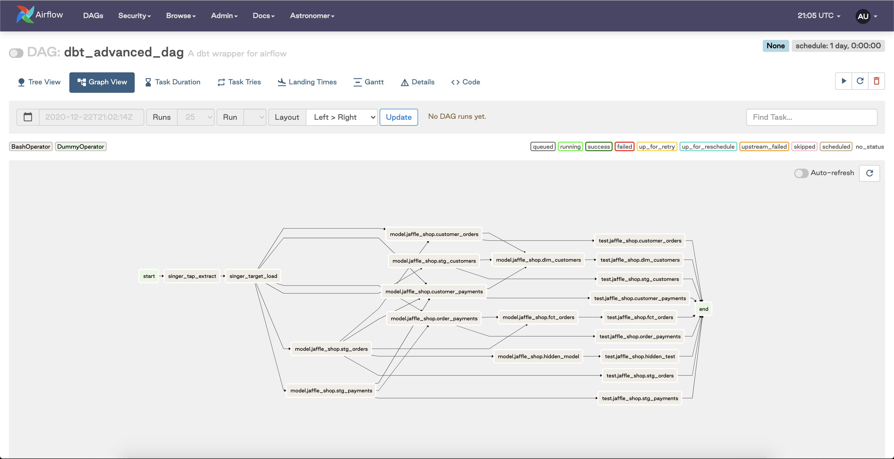

In our [previous post](https://astronomer.io/blog/airflow-dbt-1), we walked through how to build a great experience around authoring DAGs that execute dbt models with granular retry, success, failure, and scheduling capability. Now that we have these DAGs running locally and built from our dbt `manifest.json` file, the natural next step is to evaluate how these should look in a production context. 

To revisit where we left off, the workflow we've outlined thus far is great for generating a single DAG with all of our interdependent dbt models, but there are still a few outstanding questions, including:

1. How do I automatically update my `manifest.json` file so that  I don't need to manually copy it, paste it into my Airflow project, and redeploy my Airflow environment every time a model changes or is added?
2. How do I extend my workflow to extend beyond a monodag approach and accommodate multiple schedule intervals?
3. How do I contextualize this approach in the case of a broader ELT pipeline?

Let's dive in.

## Productionizing our Workflow

Because all of our dbt models are still running on the schedule of a single Airflow DAG, there exist some inherent limitations in the extensibility of our approach. For our use case at Updater, we need to be able to run different groups of dbt models on different schedules. After thinking through the desired approach, we decided that the ideal scenario would take a group of models defined by some selector, e.g. `dbt run --models tag:hourly`, and deploy that set of models as their own Airflow DAG with its own defined schedule. Leveraging the `manifest.json` file to correctly set these dependencies between an arbitrary set of models proved to be a bit tricky, but we were able to build out a robust CI process that got everything working as expected:

1. We start with a YAML file that defines a set of model selectors for each Airflow DAG schedule we want to create. We are still running on version `0.17` so this is not the new [`selectors.yml` introduced in `0.18`](https://docs.getdbt.com/reference/node-selection/yaml-selectors/), but we copied its structure. We plan to leverage `selectors.yml` for this purpose when we upgrade. We then use dbt's tagging feature to tag every one of our models with a desired schedule interval.

    ```python
    selectors:
      - name: "standard_schedule"
        definition: "tag:standard_schedule"
      - name: "late_schedule"
        definition: "tag:late_schedule"
      - name: "hourly_schedule"
        definition: "tag:hourly_schedule"
    ```

2. We then use our CI/CD provider to run a Python script that:
    1. Runs `dbt compile` to create a fresh copy of `manifest.json`
    2. Reads the model selectors defined in the YAML file
    3. Uses the `dbt ls` command to list all of the models associated with each model selector in the YAML file
    4. Turns the dbt DAG from `manifest.json` into a `Graph` object via the `networkx` library
    5. Uses the methods available on the `Graph` object to figure out the correct set of dependencies for each group of models defined in the YAML file
    6. Writes the dependencies for each group of models (stored as a list of tuples) as a pickle file to local storage

    Here is what that script looks like in practice:

    ```python
    import yaml
    import os
    import json
    import networkx as nx
    import pickle

    # README
    # This file is a utility script that is run via CircleCI in the deploy
    # step. It is not run via Airflow in any way. The point of this script is
    # to generate a pickle file that contains all of the dependencies between dbt models
    # for each dag (usually corresponding to a different schedule) that we want
    # to run.

    def load_manifest():
        """Load manifest.json """
        local_filepath = f"{DBT_DIR}/target/manifest.json"
        with open(local_filepath) as f:
            data = json.load(f)
        return data

    def load_model_selectors():
        """Load the dbt selectors from YAML file to be used with dbt ls command"""
        with open(f"{DBT_DIR}/dbt_dags/dag_model_selectors.yml") as f:
            dag_model_selectors = yaml.full_load(f)
        selected_models = {}
        for selector in dag_model_selectors["selectors"]:
            selector_name = selector["name"]
            selector_def = selector["definition"]
            selected_models[selector_name] = selector_def
        return selected_models

    def parse_model_selector(selector_def):
        """Run the dbt ls command which returns all dbt models associated with a particular selection syntax"""
        models = os.popen(f"cd {DBT_DIR} && dbt ls --models {selector_def}").read()
        models = models.splitlines()
        return models

    def generate_all_model_dependencies(all_models, manifest_data):
        """Generate dependencies for entire project by creating a list of tuples that represent the edges of the DAG"""
        dependency_list = []
        for node in all_models:
            # Cleaning things up to match node format in manifest.json
            split_node = node.split(".")
            length_split_node = len(split_node)
            node = split_node[0] + "." + split_node[length_split_node - 1]
            node = "model." + node
            node_test = node.replace("model", "test")
            # Set dependency to run tests on a model after model runs finishes
            if not node.split(".")[2].startswith("raw_"):
                dependency_list.append((node, node_test))
            # Set all model -> model dependencies
            for upstream_node in manifest_data["nodes"][node]["depends_on"]["nodes"]:
                upstream_node_type = upstream_node.split(".")[0]
                upstream_node_name = upstream_node.split(".")[2]
                dependency_list.append((upstream_node, node))
        return dependency_list

    def clean_selected_task_nodes(selected_models):

        """Clean up the naming of the "selected" nodes so they match the structure what is coming out generate_all_model_dependencies function. This function doesn't create a list of dependencies between selected nodes (that happens in generate_dag_dependencies) it's just cleaning up the naming of the nodes and outputting them as a list"""

        selected_nodes = []
        for node in selected_models:
            # Cleaning things up to match node format in manifest.json
            split_node = node.split(".")
            length_split_node = len(split_node)
            node = split_node[0] + "." + split_node[length_split_node - 1]
            # Adding run model nodes
            node = "model." + node
            selected_nodes.append(node)
            # Set test model nodes
            node_test = node.replace("model", "test")
            selected_nodes.append(node_test)
        return selected_nodes

    def generate_dag_dependencies(selected_nodes, all_model_dependencies):
        """Return dependencies as list of tuples for a given DAG (set of models)"""
        G = nx.DiGraph()
        G.add_edges_from(all_model_dependencies)
        G_subset = G.copy()
        for node in G:
            if node not in selected_nodes:
                G_subset.remove_node(node)
        selected_dependencies = list(G_subset.edges())
        return selected_dependencies

    def run():
        manifest_data = load_manifest()
        # Get list of all models in project and create dependencies.
        # We want to load all the models first because the logic to properly set
        # dependencies between subsets of models is basically the process of
        # removing nodes from the complete DAG. This logic can be found in the
        # generate_dag_dependencies function. The networkx graph object is smart
        # enough that if you remove nodes with remove_node method that the dependencies
        # of the remaining nodes are what you would expect.
        # Pass dbt project name to return all models
        all_models = parse_model_selector("updater_data_model")
        all_model_dependencies = generate_all_model_dependencies(all_models, manifest_data)
        # Load model selectors
        dag_model_selectors = load_model_selectors()
        for dag_name, selector in dag_model_selectors.items():
            selected_models = parse_model_selector(selector)
            selected_nodes = clean_selected_task_nodes(selected_models)
            dag_dependencies = generate_dag_dependencies(selected_nodes, all_model_dependencies)
            print(dag_dependencies)
            with open(f"{DBT_DIR}/dbt_dags/data/{dag_name}.pickle", "wb") as f:
                pickle.dump(dag_dependencies, f)

    # RUN IT
    DBT_DIR = "./dags/dbt"
    run()
    ```

3. Finally, we create an Airflow DAG file for each group of models that reads the associated pickle file, creates the required dbt model run/test tasks, and then sets dependencies between them as specified in the pickle file. 

    ```python
    default_dag_args = {
        "start_date": datetime.datetime(2020, 11, 24),
        "retry_delay": datetime.timedelta(minutes=10),
        "on_failure_callback": notify_all_of_failure,
        "depends_on_past": True,
        "wait_for_downstream": True,
        "retries": 0,
    }
    DAG_NAME = "standard_schedule"
    dag = DAG(
        f"dbt_{DAG_NAME}", schedule_interval="@daily", max_active_runs=1, catchup=False, default_args=default_dag_args,
    )
    # Load dependencies from configuration file
    dag_def = load_dag_def_pickle(f"{DAG_NAME}.pickle")
    # Returns a dictionary of bash operators corresponding to dbt models/tests
    dbt_tasks = create_task_dict(dag_def, dag)
    # Set dependencies between tasks according to config file
    for edge in dag_def:
        dbt_tasks[edge[0]] >> dbt_tasks[edge[1]]
    ```

Note that the functions in the DAG file above have been split out for simplicity, but the logic implemented is the same as described in [part 1 of this series](https://astronomer.io/blog/airflow-dbt-1).

Putting all of this together, we end up with multiple Airflow DAGs, each running on its own defined schedule, with a specified group of interdependent dbt models running as individual  tasks within each DAG. With this system, running a production dbt model in Airflow is dead-simple: all we need to do is tag a model with the appropriate schedule interval and it will automatically get picked up and executed by the corresponding Airflow DAG. 

Ultimately, this gives us a fully robust, end-to-end solution that captures the ideal scheduling, execution, and observability experience for our dbt models with Apache Airflow. 

### Potential Limitations

As with anything, there are a few potential limitations associated with this approach that users should be aware of. We look forward to building upon this integration going forward and welcome additional feedback from the community.

1. The biggest trade off is that dbt really expects to be executing a DAG of models, and so some features don't make as much sense when dbt is only running a single model at a time. For example, dbt has the concept of `on-run-start` and `on-run-end` hooks which execute SQL at the beginning or end of a dbt run. With this approach, these hooks would run in every Airflow task.'
2. Because dbt parses and compiles the entire project whenever any dbt command is run, there is some overhead associated with separating by task. We have about 250 models running in our dbt project and this hasn't been an issue for us, but it could cause latency problems at high scale.
3. This approach relies heavily on dbt artifacts like `manifest.json` that were up until recently not explicitly documented/supported by dbt. Fortunately, the upcoming `0.19` [dbt release](https://next.docs.getdbt.com/reference/artifacts/dbt-artifacts) will officially start versioning (as well as better documenting) dbt artifacts like `manifest.json`. 
4. Because dbt only runs a single model at a time, we are unable to take advantage of dbt's built-in support for concurrency [via threads](https://blog.getdbt.com/how-we-made-dbt-runs-30--faster/). However, Airflow supports task-level concurrency and, because Airflow is aware of the full dbt DAG, it is able to concurrently execute dbt models with the same results as native dbt threading.
5. There is some infrastructure overhead associated with provisioning a high volume of lightweight tasks with Airflow's Kubernetes Executor. However, the new [KEDA executor](https://www.astronomer.io/blog/the-keda-autoscaler) offers the best of both worlds: the autoscaling capabilities of Kubernetes without the overhead of spinning up a new Airflow image in each task pod.

## dbt in ELT

While having the visual representation of your dbt workflow in Airflow is a great way to drill down into your data *transformation* layer, it is very common to use dbt in the context of a broader ETL or ELT workflow; all of the data that dbt is working its magic on has to make its way into the warehouse *somehow.*

Airflow serves as a great tool for end-to-end scheduling, visibility, and execution of the broader ELT pipeline; this is a common usage pattern we at Astronomer see in customer contexts. In these cases, it is common for users to implement a third-party tool such as [Singer](https://www.singer.io/) or [Fivetran](https://fivetran.com) for out-of-the-box data extraction and loading. 

- Note: In real-world cases, particularly in the enterprise, the extract and load portions of the data lifecycle usually end up being handled by mix of third-party tools and custom scripts that are pulling from internal datastores, applications, APIs, etc. There are *a lot* of systems that need to have their data loaded into the warehouse for transformation.

### An Example: Singer + dbt for ELT

> **Note**: All of the code we're using in this example is available [this Github repository](https://github.com/astronomer/airflow-dbt-demo) and can be run locally using the Astronomer CLI.

Let's take a look at a common use case: building an ELT pipeline with [Singer Taps](https://www.singer.io/#taps), [Singer Targets](https://www.singer.io/#targets), and dbt. It's quite easy to mock this up using some basic singer libraries.

- Note: This code is not intended to be functionally complete (ie. the singer tap and target commands are just listing out library help feedback and aren't hooked up to live sources or destinations), but you can check out the [elt.py file of our demo repository](https://github.com/astronomer/airflow-dbt-demo/blob/master/dags/elt.py) if you would like to peruse the code powering this mock.

This approach is functionally correct, but there is an aesthetic limitation: because we have so many dbt models being run and tested, and conceivably would extract from multiple sources and load to many different tables in a production use case, it is quite challenging to sort out what's going on with this DAG at a first pass:



You can imagine the increasing amount of visual complexity introduced as you scale the amount of dbt tasks you want to execute in this DAG; it ends up being difficult to reconcile which parts of this graph are extracting, loading, and transforming

### Enter TaskGroups

As of [Airflow 2.0](https://astronomer.io/airflow), users can leverage the [TaskGroup](https://airflow.apache.org/docs/apache-airflow/stable/concepts.html#taskgroup) feature to visually organize their DAGs into logical chunks of work that map to dedicated portions of their data pipelines. While using TaskGroups doesn't change execution order or priority under the hood, it provides us with a nice way to build beautifully-organized ETL pipelines:


And voila! We have ourselves and end-to-end ELT pipeline that:

1. Has auto-generated tasks executing and testing all dbt models from our latest `manifest.json` file, scheduled according to their respective schedule tags.
2. Leverages singer taps and targets for the baseline extract and load process that *must complete successfully* before our dbt models run.
3. Organizes our models visually using the new Airflow TaskGroup feature.

## Closing Thoughts

While the system we have in place today is an excellent MVP that delivers the desired experience for our team, there is always progress to be made at the intersection of Airflow and dbt. For now, we look forward to memorializing this defined process as a supported usage pattern, but we look forward to building upon this integration going forward to create a beautiful experience for our users. As we continue on this journey, we would love to hear from other folks in the community who have encountered a similar challenge and/or have built an effective solution, so please [reach out](https://astronomer.io/contact) if you're open to brainstorming together.
