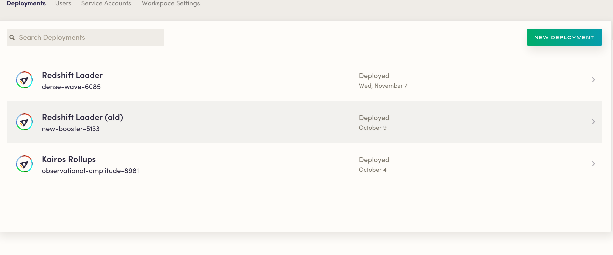
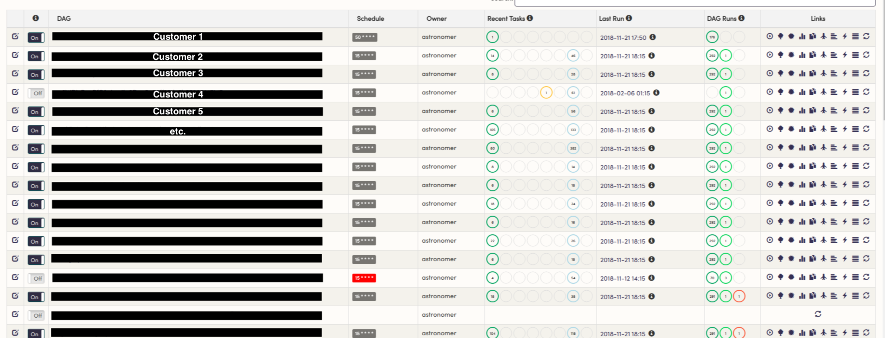
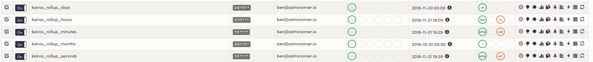

You learn a few things after Airflowing day in and day out for 2+ years. From initial DAG troubleshooting gotchas to more advanced lessons in architectural design, we've jumped down just about every rabbit hole there is with Airflow. Today, we're here to discuss one of the more significant design choices folks are forced to make when architecting their Airflow infrastructure: Is it better to run one monolitic Airflow instance to power all of your org's DAGs, or is splitting things out into multiple Airflow instances based on business function the way to go?

## A Quick History of Astronomer

Back in the day, Astronomer discovered Airflow when searching for an efficient way to batch user event data into databases like Amazon Redshift. [More on that portion of our company's journey here](https://www.astronomer.io/blog/astronomer-on-astronomer-internal-use-case/), but the tl;dr version is that, after quite a bit of research, we landed on Airflow to power the first version of what we referred to internally as our "Redshift Loader." The purpose of the loader was to batch customers' user event data into Redshift on an hourly basis so that they could warehouse all user interactions with their websites, mobile apps, and servers.

When starting, we figured it'd be easiest to run one massive Airflow deployment that contained all of our org-wide DAGs: one for each customer Redshift connection, one for each each reporting pipeline, and pipelines for all other internal workflows.

That approach definitely had it's benefits - one view for the status of all jobs gave us an easy way to check "what's on fire?"  and generally made project management easier while we got our initial production workloads set up.

However, we found it to be an unsustainable setup as we scaled because of the way the Airflow scheduler works. 

## The Scheduler Bottleneck

Since the scheduler is responsible for updating job state, it's typically regarded as the most important component of Airflow. There are a [ton](https://medium.com/snaptravel/airflow-part-2-lessons-learned-793fa3c0841e) [of](https://medium.com/@manuelmourato25/when-airflow-isnt-fast-enough-distributed-orchestration-of-multiple-small-workloads-with-celery-afb3daebe611) [articles](https://eng.lyft.com/running-apache-airflow-at-lyft-6e53bb8fccff) out there that highlight different approaches taken around optimizing the scheduler.

The scheduler loops through DAG files every heartbeat to see if any tasks need execution. This means that a file that generates a DAG with tasks  that runs every 24 hours will be pinged the same number of times as something that runs every 5 minutes. When one scheduler process is parsing a large number of DAG files (or [one file that dynamically generates tasks](https://www.astronomer.io/guides/dynamically-generating-dags/)) with several tasks it can become a pretty CPU-greedy process.

Furthermore, unlike the other Airflow components or traditional microservices, the scheduler can't be horizontally scaled. We were able to scale up workers via [Celery](http://www.celeryproject.org/) and [Mesos](http://mesos.apache.org/), the webserver via [loadbalancers](https://www.citrix.com/glossary/load-balancing.html), and the DB via managed services ([AWS RDS](https://aws.amazon.com/rds/) in this case) relatively easily, but there's no easy way to run "multiple schedulers." 

As a quick aside, the team at Clairvoyant came up with [a really interesting high avaliably solution](http://site.clairvoyantsoft.com/making-apache-airflow-highly-available/), but it didn't really fit our specific use case.

So therein lay our initial issue: our scheudler couldn't be scaled up in the way that we needed it to be. At one point, we even ended up throwing 4+ cores at the it and still experienced problems problems (we were running hundreds of tasks every hour).

Apart from scaling, dealing with silent scheduler failures can also be challenging (especially because you can't always tell just from looking at the UI). This can be alleviated in Kubernetes-land with different (albeit, imperfect) healthchecks, but you can imagine how much of a DevOps nightmare it is to have that magical "what's on fire" view says everything is fine, but Slack/email is blowing up with missed SLAs and angry customers.

We eventually landed on Kubernetes as our container orchestration tool of choice. Kubernetes is great at the "farm out work" part of the problem, but the scheduler is still a single point of failure. You can change settings and configurations in `airflow.cfg` (e.g. heartbeat time, db update time,  number of threads, etc) to try and alleviate this problem, but a lot of these settings cannot be overridden at the DAG level, so you're stuck with trying to find a "one size fits all"  type configuration instead of doing any specific optimization for the use case/situation at hand. 

In a monolithic set up, you're out of luck if you want run a certain set of DAGs with 3x priority or have a few jobs that have highly irregular run times when compared to your other jobs (when we needed one set of jobs to catchup quickly on our old set up- we'd end up turning the other ones off).

All this led us to decide that the most "highly available" and "fault tolerant" way to run Airflow was to have multiple instances, each fine tuned for the jobs they're running. And if you have multiple Airflows, you might as well throw user groups on that, and if you have a bunch of user groups, you'll need some admin-esque monitoring tools and, well, that's how the second generation of Astronomer as "The Airflow Company" was born! 

## An Example

One of our customers (which also happens to be our sister company that's a spinoff of our Clickstream product!), [Metarouter](https://metarouter.io), runs our [Enterprise Airflow platform](https://astronomer.io/enterprise) to transform and upload files from S3 into Redshift for customers.

They have three Airflow deployments:

1. A production deployment
2. An old deployment that handles some legacy workloads
3. A reporting deployment for their Kairos rollups

In the production deployment, each customer has their own DAG:

The production deployment runs 5 beefy workers in a Kubernetes namespace with a pretty high resource quota. Note that everything runs in a Kubernetes pod directly on the cluster, while Airflow simply keeps state.

However, the reporting instance runs much slimmer and only requires a small amount of resources to run efficiently:

This keeps their set up nice and clean and allows us to iterate much faster (they'll also usually have one or two other environments where they are testing out new features) than we would be able to if everything ran on one massive Airflow deployment. In this case, we were able to migrate production DAGs from the "Old" environment (New-Booster-5133) to their new one (Dense-Wave-6085) without disturbing any of their reporting pipelines. This setup is also significantly more stable-it's not as big of a deal if internal reporting metrics go down for a few hours, but it's a huge problem if the production cluster isn't performing. Setting things up in a distributed way allows us to crank up resources on the business-critical deployment so that it's infinitely less likely to go dark.

## To Close

Obviously there's no one-size-fits all solution when it comes to data infrastructure, but we've found a polycentric design to be the most effective and stable way to integrate Airflow because of the limitations imposed by the scheduler. If you feel differently or have contrasting experience, we'd love to hear from you! [Drop us a note here](https://astronomer.io/contact) so we can chat.