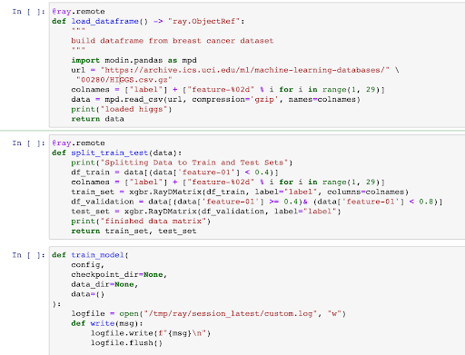

> You can now find the [Ray Provider](https://registry.astronomer.io/providers/ray) on the [Astronomer Registry](https://registry.astronomer.io), the discovery and distribution hub for Apache Airflow integrations created to aggregate and curate the best bits of the ecosystem.

## The Need for an Airflow + ML Story

Machine learning (ML) has become a crucial part of the data ecosystem at companies across all industries. As the Airflow community grows, we want to empower data science and engineering teams across the board to evolve their data pipelines into high-value outcomes. With this in mind, it’s only natural that we turn our focus towards building an optimal Airflow + ML story.

One of the best measures of quality in a modern ML framework is the flexibility and agility it allows data scientists and engineers. If using a well-built framework or tool, the time it takes to go from a training set to a working production model can be measured in hours instead of days, and iterative improvements and additions are the norm.

On its own, Airflow is a valuable tool for making reliable and reusable ML models. Using DAGs to help build models immediately brings benefits like **easy parametrization**, **SLAs & alerting**, **data watermarking & lineage capabilities**, and **robust scalability**.

However, when we look at achieving these goals, there’s a few more things we believe are crucial parts of the equation:

*   **Minimal conversion.** Data scientists should be able to bring their code directly from Jupyter notebooks (and other, similar environments) and run it with minimal changes.
*   **Large dataset handling.** ML models naturally involve large datasets, and moving large datasets between different tasks should be trivial.
*   **Per-task scalability.** Data scientists should be able to request resources for the task at hand and have the system quickly and efficiently allocate them those resources, ie: GPUs for PyTorch, RAM for Dataframes, or CPU cores for XGBoost.
*   **ML Ecosystem integration.** Data scientists should be able to easily integrate tools for recording, querying, and replicating experiments, as well as registering & deploying the resulting models.

Fortunately, there exist a handful of open-source frameworks that can be combined with Airflow to create a first-class ML story. One that we’re particularly excited about is Ray.

## Introducing Ray

[Ray](https://ray.io/) is a Python-first cluster computing framework that allows Python code, even with complex libraries or packages, to be distributed and run on clusters of infinite size. Unlike systems like Spark, which require a complex cluster set-up and Java dependencies, Ray can run the same code on any machine from a user’s laptop to a highly powered AWS virtual machine with very minimal configuration.

Once running, users can allocate Ray resources on a per-function basis (e.g. give this function 2 CPUs and 1 GPU). If used correctly, Ray’s distributed computation combined with Airflow’s robust scheduling and orchestration make a perfect platform for rapid, reliable ML development and deployment.

Ray is highly performant, and under the hood is written in C++ to quickly & automatically move Python objects around the cluster using gRPC as new functions are called that require data from previous calls. All of this is abstracted away — as a user, you simply write Python code.

## Airflow + Ray: A Match Made in Data Science Heaven

Airflow and Ray need no special packages or setup to work together, but we found inefficiencies in how most users were integrating these tools. Because of this, we wanted to create best practices that standardized Airflow + Ray usage in a tested, scalable way.

Together with the [Ray](https://ray.io/) and [Anyscale](https://www.anyscale.com/) teams, we at Astronomer are excited to introduce you to the [Ray Provider for Apache Airflow](https://registry.astronomer.io/providers/ray).

In this provider, we encapsulate all the Ray-specific setup/initialization code into decorators instead of an Operator by extending the [TaskFlow API](https://airflow.apache.org/docs/apache-airflow/stable/tutorial_taskflow_api.html#example-taskflow-api-etl-pipeline). This decorator allows Airflow users to keep all of their Ray code in Python functions and define task dependencies by moving data through python functions.

As a result, Airflow + Ray users can see the code they are launching and have complete flexibility to modify and template their DAGs, all while still taking advantage of Ray’s distributed computation capabilities.

To show the power of this integration, let’s start our data science pipeline where all data science pipelines start: a Jupyter notebook.

## Training an XGBoost Model with Ray in a Notebook

In this example, we’ve created a basic Jupyter notebook model that pulls the HIGGS dataset, splits training and testing data, and creates/validates a model using the XGBoost on Ray, which scales XGBoost training onto a cluster using Ray.

Everything here can run locally on a user’s laptop or via a remote Ray cluster with minimal work. This stack handles the experimentation aspect of model building very well, and we can now dive into how to turn this experiment into a production-ready Airflow DAG.



## Running Ray + Airflow

Hop on over to [this repository](https://github.com/astronomer/ray-airflow-demo). Follow the directions there, and you should be up and running.

Feel free to report bugs or issues -- we welcome your feedback!

Note that this code is alpha- more improvements to come as the project moves to beta.

### From Notebook to Airflow DAG in Five Steps

Let’s talk through how we adapted our notebook code in the first section to the example repo we just mentioned above.

To convert our ML notebook to an Airflow DAG using the Ray decorator, we completed the following steps:

1. Add a Ray connection to your cluster to manage Ray cluster URLs.

2. Turn each logical unit of work into its own Python function:

    ```python
    @ray.remote
    def train_model(
            data
    ):
        train_df, validation_df = data
        evallist = [(validation_df, 'eval')]
        evals_result = {}
        config = {
            "tree_method": "hist",
            "eval_metric": ["logloss", "error"],
        }
        write("Start training")
        bst = xgboost_ray.train(
            params=config,
            dtrain=train_df,
            evals_result=evals_result,
            ray_params=xgb.RayParams(max_actor_restarts=1, num_actors=8, cpus_per_actor=2),
            num_boost_round=100,
            evals=evallist)
        return bst
    ```

3. Add the `@ray_task` decorator to each of these functions:

    ```python
    @ray_task(**task_args)
    def train_model(
            data
    ):
        train_df, validation_df = data
        evallist = [(validation_df, 'eval')]
        evals_result = {}
        config = {
            "tree_method": "hist",
            "eval_metric": ["logloss", "error"],
        }
        bst = xgb.train(
            params=config,
            dtrain=train_df,
            evals_result=evals_result,
            ray_params=xgb.RayParams(max_actor_restarts=1, num_actors=8, cpus_per_actor=2),
            num_boost_round=100,
            evals=evallist)
        return bst
    ```

4. Create a DAG function with the logical flow of data:

    ```python
    @dag(default_args=default_args, schedule_interval=None, start_date=days_ago(2), tags=['finished-modin-example'])
    def task_flow_xgboost_modin():
        build_raw_df = load_dataframe()
        data = create_data(build_raw_df)
        trained_model = train_model(data)

    task_flow_xgboost_modin = task_flow_xgboost_modin()
    ```

5. Upload the DAG to Airflow, and your data pipeline is now a running Airflow DAG!

With maybe 20 minutes of work, a data scientist can turn a local Python script into a high-scale, reproducible pipeline with the power of Ray distributed computing and Airflow orchestration. These data engineers can then take advantage of Airflow [variables](https://airflow.apache.org/docs/apache-airflow/stable/concepts.html#variables), [connections](https://airflow.apache.org/docs/apache-airflow/stable/concepts.html#connections), scheduling intervals, and many other features that have made Airflow so ubiquitous with data teams requiring production-grade scheduling and orchestration.

A basic Ray workflow in the Airflow UI might look something like this:


> Note: In the alpha release of the provider package, your Airflow environment will need to be running the [Ray XCom Backend](https://registry.astronomer.io/providers/ray/modules/raybackend) for the decorator to be fully functional.

### Passing Data Between Tasks: Faster with Plasma

In the example above, Airflow users might notice that we are passing entire dataframes between tasks without explicitly sending those data chunks to external storage. With traditional XCom, this would be essentially impossible because Airflow stores each piece of data sent between tasks in a single cell of the metadata DB.

To address this issue, we get to take advantage of one of Ray's coolest features: the in-memory object store. To ensure efficient data processing for ML, Ray utilizes an object store system that enables fast data transfer and zero-copy reads. With the Ray decorator, Airflow will leverage the object store as a caching system, allowing for large data objects to stay within the RAM of the workers across multiple tasks. No more writing and reading data from S3 between tasks!

While this alpha release implements the Ray plasma store for passing data between Ray tasks, future releases will simplify moving data in and out of Ray from and to different data stores, and possibly even extend the Ray custom Xcom Backend for moving data between tasks using a multitude of different Airflow operators.

### Current Limitations

The Ray Provider for Airflow as demoed above is currently in alpha, which means there will be some rough edges. We welcome any and all bug reports, suggestions, or PRs! [You can find the code here](https://github.com/anyscale/airflow-provider-ray).

## Looking Ahead: The Future of Airflow and Ray

### Hyperparameter Tuning

Airflow has templating and dynamic parametrization capabilities, and when combined with [Ray Tune](https://docs.ray.io/en/master/tune/index.html), one can orchestrate and dynamically scale tuning an ML search space using any machine learning framework - including PyTorch, XGBoost, MXNet, and Keras - while easily integrating tools for recording, querying, and replicating experiments, as well as register & deploy the resulting models.

An example using XGBoost and Tune might begin like:

```python
@ray_task(**task_args)
def tune_model(data):

    search_space = {
        # You can mix constants with search space objects.
        "objective": "binary:logistic",
        "eval_metric": ["logloss", "error"],
        "max_depth": tune.randint(1, 9),
        "min_child_weight": tune.choice([1, 2, 3]),
        "subsample": tune.uniform(0.5, 1.0),
        "eta": tune.loguniform(1e-4, 1e-1),
    }

    print("enabling aggressive early stopping of bad trials")
    # This will enable aggressive early stopping of bad trials.
    scheduler = ASHAScheduler(
        max_t=10, grace_period=1, reduction_factor=2  # 10 training iterations
    )

    print("Tuning")

    analysis = tune.run(
        tune.with_parameters(train_model, data=data),
        metric="eval-logloss",
        mode="min",
        local_dir=LOCAL_DIR,
        # You can add "gpu": 0.1 to allocate GPUs
        resources_per_trial=XGB_RAY_PARAMS.get_tune_resources(),
        config=search_space,
        num_samples=10,
        scheduler=scheduler,
    )

    print("Done Tuning")

    return analysis

@ray_task(**task_args)
def load_best_model_checkpoint(analysis):

    print("Checking Analysis")

    best_bst = xgb.Booster()

    print(f"Analysis Best Result on eval-error is: {analysis.best_result['eval-error']}")
    print("Loading Model with Best Params")

    best_bst.load_model(os.path.join(
        analysis.best_checkpoint, "model.xgb"))
    accuracy = 1. - analysis.best_result["eval-error"]

    print(f"Best model parameters: {analysis.best_config}")
    print(f"Best model total accuracy: {accuracy:.4f}")

    # We could now do further predictions with
    # best_bst.predict(...)
    return best_bst

analysis = tune_model(data)
best_checkpoint = load_best_model_checkpoint(analysis)
```

### Checkpointing Data Using Ray

One major benefit Airflow can offer Ray users is the ability to rerun tasks with fault tolerant data storage. Ray uses a local plasma store on each worker process to keep data in memory for fast processing. This system works great when it comes to speedy processing of data, but can be lost if there is an issue with the Ray cluster.

By offering checkpoints, Airflow Ray users can point to steps in a DAG where data is persisted in an external store (e.g. S3). This fault tolerance will mean that if the task is re-run and the data is no longer available locally, the task will have the ability to pull the data from the persistent store.


```python
@dag(default_args=default_args, schedule_interval=None, start_date=datetime(2021, 1, 1, 0, 0, 0), tags=['finished-modin-example'])
def checkpoint_data_example():
    @ray_task(**task_args, checkpoint=True, checkpoint_source="s3_connection_id")
    def really_long_task(data):
        ...
        return model

    @ray_task(**task_args)
    def deploy_model(model):
        deploy(model)

    data = load_data()
    model = really_long_task(data)
    deploy_model(model)
```

### Transferring Data Between Airflow and Ray

In future iterations of this decorator, we will create a function to easily transfer data from a local Airflow task to a ray task and back. This system will work with any [Custom Xcom Backend](https://airflow.apache.org/docs/apache-airflow/stable/concepts.html?highlight=xcom#custom-xcom-backend) (including a Ray Custom Xcom backend) to enable a fully native python experience for Airflow users.

### Running on Anyscale Cloud

For those looking to further decrease their operational overhead, Anyscale offers a managed solution to hosting Ray clusters, as well as an API/SDK to programmatically control your ML infrastructure.

Plugging into the Airflow Ray Task API will soon be as simple as changing:

```yaml
RAY_URL=anyscale://<your Anyscale cluster URL here>
```

From there, everything will work just as it does in OSS, on the computing resources that you need for more parallel or higher-throughput scenarios.

[Sign up for the Anyscale beta here](https://www.anyscale.com/product).

## Conclusions

Airflow + Ray is a powerful combination for writing your machine learning or data ETL pipelines.

This alpha integration is just the beginning, and we can't wait to share more as we add new features and improvements.

[You can find the demo code for this post in this repository](https://github.com/astronomer/ray-airflow-demo), and the [code for the Airflow Ray provider in this repository](https://github.com/anyscale/airflow-provider-ray).

We are actively developing this system so any feature requests or issues would be highly appreciated- feel free to [open an issue directly on the repository](https://github.com/anyscale/airflow-provider-ray/issues) if you'd like to get involved!
