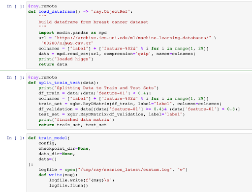

> You can now find the [Ray Provider](https://registry.astronomer.io/providers/ray) on the [Astronomer Registry](https://registry.astronomer.io), the discovery and distribution hub for Apache Airflow integrations created to aggregate and curate the best bits of the ecosystem.

## The need for an Airflow + ML story

Machine learning (ML) has become a crucial part of companies across all industries, and as Airflow grows, we want to empower data science and engineering teams across the spectrum. With this in mind, it’s only natural that we turn our focus towards building an optimal Airflow + ML story.

One of the best measures of quality in a modern ML framework is the flexibility and agility it gives you. If using a well-built framework or tool, the time it takes to go from a training set to a working model in production can be measured in hours, and iterative improvements and additions are the norm. 

Airflow on its own is a valuable tool for making ML models reliable and reusable. Using DAGs to help build models immediately brings benefits like **easy parameterization**, **SLAs & alerting**, and **easy scalability**.

However, when we look at achieving these goals, there’s a few more things we believe are crucial parts of the equation:

*   **Minimal conversion.** Data scientists should be able to bring their code directly from Jupyter notebooks (and other, similar environments) and run it with minimal changes.
*   **Large dataset handling**. ML models naturally involve large datasets, and moving large datasets between different tasks should be trivial.
*   **Per-task scalability**. Data scientists should be able to request resources for the task at hand and have the system quickly and efficiently allocate them those resources, ie: GPUs for PyTorch, RAM for Dataframes, or CPU cores for XGBoost.

Fortunately, there exist a handful of open-source frameworks that can be combined with Airflow to create a first-class ML story. One that we’re particularly excited about is Ray.

## Introducing Ray

[Ray](https://ray.io/) is a cluster computing framework built with Python as a first-class citizen. Unlike systems like Spark, which require a complex cluster set-up and Java dependencies, Ray can run the same code on any machine from a user’s laptop to a highly powered AWS virtual machine with very minimal configuration. 

Once running, users can allocate Ray resources on a per-function basis (e.g. give this function 2 CPUs and 1 GPU). If used correctly, Ray’s distributed computation combined with Airflow’s robust scheduling and orchestration make a perfect platform for rapid, reliable ML development and deployment.

Ray is highly performant, and under the hood is written in C++ to quickly & automatically move Python objects around the cluster using gRPC as new functions are called that require data from previous calls. All of this is abstracted away — as a user, you simply write Python code. 


## Airflow + Ray: A match made in data science heaven

Airflow and Ray need no special packages or setup to work together, but we found after working with many users, the same patterns came up again and again. We wanted to encapsulate best practices in a way that can standardize Airflow + Ray usage in a tested, scalable way.

Together with the [Ray](https://ray.io/) and [Anyscale](https://www.anyscale.com/) teams, we are excited to introduce you  to the [Ray Provider for Apache Airflow](https://registry.astronomer-stage.io/providers/ray). 

In this provider, we encapsulate all the Ray-specific setup/initialization code into decorators instead of an Operator by extending the [TaskFlow API](https://airflow.apache.org/docs/apache-airflow/stable/tutorial_taskflow_api.html#example-taskflow-api-etl-pipeline). This decorator allows Airflow users to keep all of their Ray code in Python functions and define task dependencies by moving data through python functions.

As a result, Airflow + Ray users will know the code they are launching and have complete flexibility to modify and templatize their DAGs while still taking advantage of Ray’s distributed computation capabilities.

To show the power of this integration, let’s start our data science pipeline where all data science pipelines start: a Jupyter notebook.


## Training an XGBoost model with Ray in a notebook

In this example, we’ve created a basic Jupyter notebook model that pulls the HIGGS dataset, splits training and testing data, and creates/validates a model using the XGBoost on Ray, which scales XGBoost training onto a cluster using Ray. Everything here can run locally on a user’s laptop or via a remote Ray cluster with minimal work. This stack handles the experimentation aspect of model building very well, but now comes the question of how we turn this experiment into a production-ready Airflow DAG.





## Running the Ray + Airflow with XGBoost example DAG

Hop on over to [this repository](https://github.com/anyscale/airflow-provider-ray). Follow the directions there, and you should be up and running.

Feel free to report bugs or issues -- we welcome your feedback! 

Note that this code is alpha, and has only been tested on LocalExecutor. More improvements to come as the project moves to beta. 


## How to: From Notebook to Airflow DAG in five steps

Let’s talk through how we adapted our notebook code in the first section to the example repo we just mentioned above. 

To convert our ML notebook to an Airflow DAG using the Ray decorator, we completed the following steps:

1. Add a Ray connection to your cluster to manage Ray cluster URLs and also add Ray params such as `num_cpu` and `num_gpu`.

2. Turn each logical unit of work into its own Python function: 

```python
@ray.remote
def train_model(
        data
):
    train_df, validation_df = data
    evallist = [(validation_df, 'eval')]
    evals_result = {}
    config = {
        "tree_method": "hist",
        "eval_metric": ["logloss", "error"],
    }
    write("Start training")
    bst = xgboost_ray.train(
        params=config,
        dtrain=train_df,
        evals_result=evals_result,
        ray_params=xgb.RayParams(max_actor_restarts=1, num_actors=8, cpus_per_actor=2),
        num_boost_round=100,
        evals=evallist)
    return bst
```

3. Add the `@ray_task` decorator to each of these functions. 

```python
@ray_task(**task_args)
def train_model(
        data
):
    train_df, validation_df = data
    evallist = [(validation_df, 'eval')]
    evals_result = {}
    config = {
        "tree_method": "hist",
        "eval_metric": ["logloss", "error"],
    }
    bst = xgb.train(
        params=config,
        dtrain=train_df,
        evals_result=evals_result,
        ray_params=xgb.RayParams(max_actor_restarts=1, num_actors=8, cpus_per_actor=2),
        num_boost_round=100,
        evals=evallist)
    return bst
```

4. Create a DAG function with the logical flow of data

```python
@dag(default_args=default_args, schedule_interval=None, start_date=days_ago(2), tags=['finished-modin-example'])
def task_flow_xgboost_modin():
    build_raw_df = load_dataframe()
    data = create_data(build_raw_df)
    trained_model = train_model(data)

task_flow_xgboost_modin = task_flow_xgboost_modin()
```


5. Upload the DAG to Airflow, and your data pipeline is now a running Airflow DAG! 

With maybe 20 minutes of work, a data scientist can turn a local Python script into a high-scale, reproducible pipeline with the power of Ray distributed computing and Airflow orchestration. These data engineers can then take advantage of Airflow [variables](https://airflow.apache.org/docs/apache-airflow/stable/concepts.html#variables), [connections](https://airflow.apache.org/docs/apache-airflow/stable/concepts.html#connections), scheduling intervals, and many other features that have made Airflow so ubiquitous with production-grade scheduling and orchestration.


### Passing data between tasks: faster with Plasma

One thing that experienced Airflow users will notice in the example above is that we appear to be passing entire dataframes between tasks without explicitly sending those data chunks to external storage. With traditional XCom, this would be essentially impossible because Airflow stores each piece of data sent between tasks in a single cell of the metadata DB. 

To address this issue, we take advantage of one of Ray’s coolest features: data caching. To ensure fast data processing for ML, Ray utilizes a_ plasma store_ system that caches all data in memory on Ray workers. With the Ray decorator, Airflow only stores a hash pointing to the result of the last task (a Ray Object ID). This caching allows for data to stay in memory between tasks without ever leaving the RAM of the workers. No more writing and reading data from S3 between tasks!

While this alpha release implements the Ray plasma store for passing data between Ray tasks. Future releases will simplify moving data in and out of Ray, and possibly even extend the Ray custom Xcom Backend for moving data between all Airflow tasks.


### Current Limitations

The Ray Airflow Task API as shown above is currently in alpha, which means there will be some rough edges. We welcome any and all bug reports, suggestions, or PRs! You can find the code &lt;LINK HERE> and &lt;LINK HERE>.


## More advanced usage: fault tolerance


### Checkpointing Data using Ray

One major benefit Airflow can offer Ray users is the ability to rerun tasks with fault tolerant data storage. Ray uses a local plasma store on each worker process to keep data in memory for fast processing. This system works great when it comes to speedy processing of data, but can be lost if there is an issue with the Ray cluster. 

By offering checkpoints, Airflow Ray users can point to steps in a DAG where data is persisted in an external store (e.g. S3). This fault tolerance will mean that if the task is re-run and the data is no longer available locally, the task will have the ability to pull the data from the persistent store.


```
@dag(default_args=default_args, schedule_interval=None, start_date=days_ago(2), tags=['finished-pandas-example'])
def checkpoint_data_example():
    @ray_task(**task_args, checkpoint=True, checkpoint_source="s3_connection_id")
    def really_long_task(data):
        ...
        return model
    
    @ray_task(**task_args)
    def deploy_model(model):
        deploy(model)

    data = load_data()
    model = really_long_task(data)
    deploy_model(model)
```


### Looking Ahead: Transferring data between Airflow and Ray

In future iterations of this decorator, we will create a function to easily transfer data from a local Airflow task to a ray task and back. This system will work with any [Custom Xcom Backend](https://airflow.apache.org/docs/apache-airflow/stable/concepts.html?highlight=xcom#custom-xcom-backend) (including a Ray Custom Xcom backend) to allow a fully native python experience for Airflow users.


### Running on Anyscale Cloud

For those looking to further decrease their operational overhead, Anyscale offers a managed solution to hosting Ray clusters, as well as an API/SDK to programmatically control your ML infrastructure.

Plugging into Airflow Ray Task API is then as simple as changing:

	RAY_URL=anyscale://&lt;your Anyscale cluster URL here>

and everything will work just as in OSS, but with a few more features and a powerful API/SDK.

Sign up for Anyscale [here](https://www.anyscale.com/product).


## Conclusions

Airflow + Ray is a powerful combination for writing your machine learning or data ETL pipelines. 

We have released the alpha version of this integration in these repos &lt;HERE> and &lt;HERE>, so please give them a try if you like! We are actively developing this system so any feature requests or issues would be highly appreciated [here](https://github.com/anyscale/airflow-provider-ray/issues).
