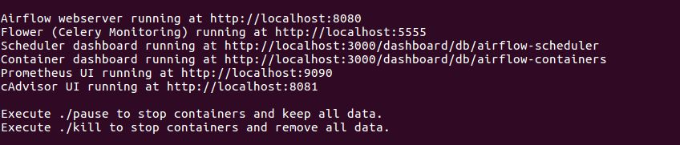
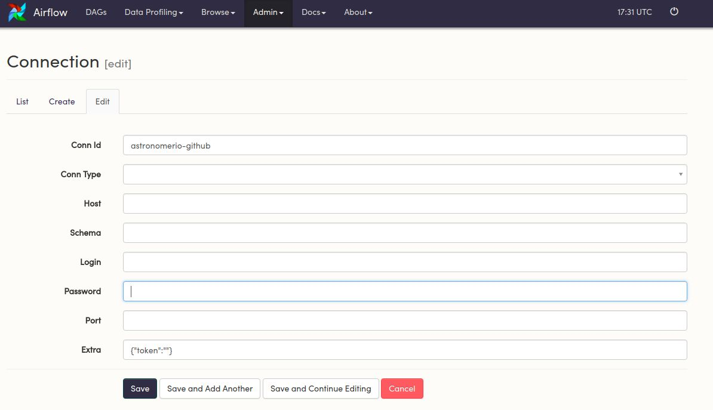
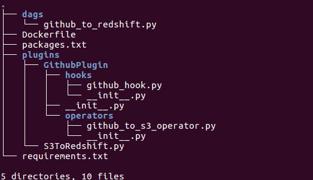
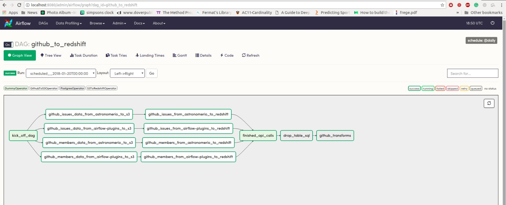
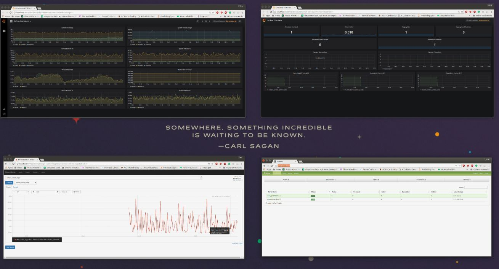
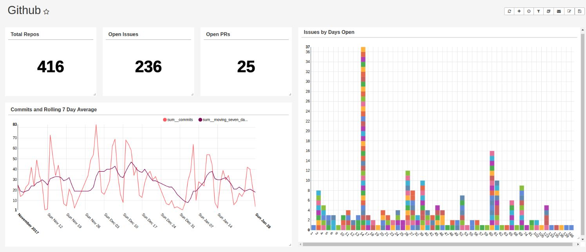

Throughout Astronomer’s short but exciting life so far, we’ve changed our stack, product direction, and target market more times than we can count. The flux has definitely caused some stress, but it has ultimately been a major source of growth both for me individually and for our company as a whole.

However, all this pivoting has been unequivocally unkind to two things: our Github org and our cofounder’s hair.


The last few years have left us with a mess of Github repos and orgs. As you can imagine, this made it difficult to do any internal github reporting on who was closing out issues, what type of issues stay open, and track milestone progress.

## Apache Airflow
Lucky for us, we’re a data engineering company with a module designed to solve exactly that type of problem.

Apache Airflow is a data workflow management system that allows engineers to schedule, deploy and monitor their own data pipes as DAGs (directed acyclic graphs). Built by developers, for developers, it’s based on the principle that ETL is best expressed in code.

Running Airflow on Astronomer lets you leverage all of its features without getting bogged down in things that aren’t related to your data. Not only that, but you get access to your own Celery workers, Grafana dashboards for monitoring, and Prometheus for alerting.

From a developer's perspective, it lets you focus on using a tool to solve a problem instead of solving a tool's problems. In the next section, we'll give you a hands-on walkthrough of Astronomer Airflow so that you can download it and play around yourself!

## Spinning up Open
Clone [Astronomer Open](https://github.com/astronomerio/astronomer) for a local, hackable, version of the entire Astronomer Platform - Airflow, [Grafana](https://grafana.com/), [Prometheus](https://prometheus.io/), and so much more.

Jump into the airflows directory and run the start script pointing to the DAG directory.
```
cd astronomer/examples/airflow
./start YOURDIRECTORYHERE
```
A bunch of stuff will pop up in the command line, including the address where everything will be located



All custom requirements can be stored in a requirements.txt file in the directory you're pointed at.

Any custom packages you want (CLIs, SDKs, etc.) can be added to packages.txt.

## Getting Github Data
You can follow along by cloning [this repo](https://github.com/astronomerio/open-example-dags) of example DAGs and pointing to it when starting Open.

All the heavy lifting in Airflow is done with hooks and operators. Hooks are an interface to external systems (APIs, DBs, etc) and operators are units of logc.

Since the Github API takes HTTP requests, writing the hook is simply going to be wrapping around the code you'd usually write to hit the Github API.
```
## python code for hitting the Github API 
import requests
r = requests.get('https://api.github.com/', headers={'Authorization': 'TOK:TOKEN'})
```
In an Airflow Hook, we take a regular request and wrap around some additional logic (i.e. where is the token, what kind of request I'm making, etc):

The request itself and all the heavy lifting is done by the HttpHook.

``` 
from airflow.hooks.http_hook import HttpHook

# Inherit from the Airflow HttpHook.
class GithubHook(HttpHook):
    
    def __init__(self, github_conn_id):
        self.github_token = None
        conn_id = self.get_connection(github_conn_id)
        if conn_id.extra_dejson.get('token'):
            # If the token was entered in the extras field in the connections panel, 
            self.github_token = conn_id.extra_dejson.get('token')
        super().__init__(method='GET', http_conn_id=github_conn_id) # Keeping it to GET requests here.

    def get_conn(self, headers):
        """
        Accepts both Basic and Token Authentication.
        If a token exists in the "Extras" section
        with key "token", it is passed in the header.

        If not, the hook looks for a user name and password.

        In either case, it is important to ensure your privacy
        settings for your desired authentication method allow
        read access to user, org, and repo information.
        """
        if self.github_token:
            headers = {'Authorization': 'token {0}'.format(self.github_token)}
            session = super().get_conn(headers)
            session.auth = None
            return session
        return super().get_conn(headers)
```

When converting this to an Airflow hook, all the credentials can be stored in the Connections panel (from above, airflow spins up at `http://localhost:8080`.




## Moving Data
Now that there's an interface to interact with the external system, we need to define what actually needs to be done.

We like using Amazon S3 as an intermediary system when working with Redshift - the COPY command makes inserts easy and if a task fails during a data pipeline, the pipeline can restart and pick up where it left off using the data in S3.

So the workflow is going to go from Github to S3 to Redshift.
```
from airflow.utils.decorators import apply_defaults
from airflow.models import BaseOperator
from ..hooks.github_hook import GithubHook # Import the GithubHook from before
from airflow.hooks import S3Hook
from flatten_json import flatten
import logging
import json


class GithubToS3Operator(BaseOperator):
    
    # Define the params - what input is needed for the logic to execute
    """
    Github To S3 Operator
    :param github_conn_id:           The Github connection id.
    :type github_conn_id:            string
    
    :param github_org:               The Github organization.
    :type github_org:                string
    
    :param github_repo:              The Github repository. Required for
                                     commits, commit_comments, issue_comments,
                                     and issues objects.
    :type github_repo:               string
    
    :param github_object:            The desired Github object. The currently
                                     supported values are:
                                        - commits
                                        - commit_comments
                                        - issue_comments
                                        - issues
                                        - members
                                        - organizations
                                        - pull_requests
                                        - repositories
    :type github_object:             string
    
    :param payload:                  The associated github parameters to
                                     pass into the object request as
                                     keyword arguments.
    :type payload:                   dict
    
    :param s3_conn_id:               The s3 connection id.
    :type s3_conn_id:                string
    
    :param s3_bucket:                The S3 bucket to be used to store
                                     the Github data.
    :type s3_bucket:                 string
    
    :param s3_key:                   The S3 key to be used to store
                                     the Github data.
    :type s3_key:                    string
    """

    template_field = ['s3_key', 'payload']

    @apply_defaults
    def __init__(self,
                 github_conn_id,
                 github_org,
                 github_object,
                 s3_conn_id,
                 s3_bucket,
                 s3_key,
                 github_repo=None,
                 payload={},
                 *args,
                 **kwargs):
        super().__init__(*args, **kwargs)
        self.github_conn_id = github_conn_id
        self.github_org = github_org
        self.github_repo = github_repo
        self.github_object = github_object
        self.payload = payload
        self.s3_conn_id = s3_conn_id
        self.s3_bucket = s3_bucket
        self.s3_key = s3_key
        if self.github_object.lower() not in ('commits',
                                              'commit_comments',
                                              'issue_comments',
                                              'issues',
                                              'members',
                                              'organizations',
                                              'pull_requests',
                                              'repositories'):
            raise Exception('Specified Github object not currently supported.')

    def execute(self, context):
        g = GithubHook(self.github_conn_id)
        s3 = S3Hook(self.s3_conn_id)
        output = []

        if self.github_object not in ('members',
                                      'organizations',
                                      'repositories'):
            if self.github_repo == 'all':
                repos = [repo['name'] for repo in
                         self.paginate_data(g,
                                            self.methodMapper('repositories'))]
                for repo in repos:
                    output.extend(self.retrieve_data(g, repo=repo))
            elif isinstance(self.github_repo, list):
                repos = self.github_repo
                for repo in repos:
                    output.extend(self.retrieve_data(g, repo=repo))
            else:
                output = self.retrieve_data(g, repo=self.github_repo)
        else:
            output = self.retrieve_data(g, repo=self.github_repo)
        output = '\n'.join([json.dumps(flatten(record)) for record in output])
        s3.load_string(
            string_data=output,
            key=self.s3_key,
            bucket_name=self.s3_bucket,
            replace=True
        )

        s3.connection.close()
```

View the rest of the Github code [here](https://github.com/airflow-plugins/github_plugin/blob/master/operators/github_to_s3_operator.py). Once the data is in S3, we use a standard [S3 to Redshift Operator](https://github.com/airflow-plugins/s3_to_redshift_operator/blob/master/operators/s3_to_redshift.py).

## Writing the DAG
Now the DAG itself can be written to leverage how the hook and operator handle all of the logic. If you're following along, make sure you change the connection variables (aws_conn_id, s3_conn_id, s3_bucket) to what you named your connections.

You can also switch enter an email to send failure or success notifications to.
```
from airflow import DAG
from datetime import datetime
from airflow.operators.dummy_operator import DummyOperator
from plugins.GithubPlugin.operators.github_to_s3_operator import GithubToS3Operator
from airflow.operators import S3ToRedshiftOperator
from airflow.operators.postgres_operator import PostgresOperator

default_args = {'owner': 'airflow',
                'start_date': datetime(2018, 1, 5),
                # 'email': ['YOUREMAILHERE.com'],
                'email_on_failure': True,
                'email_on_retry': False
                }

dag = DAG('github_to_redshift',
          default_args=default_args,
          schedule_interval='@daily',
          catchup=False
          )

# Connection creds.
aws_conn_id = 'astronomer-redsift-dev'
s3_conn_id = 'astronomer-s3'
s3_bucket = 'astronomer-workflows-dev'


# Custom SQL:
drop_table_sql = \
    """
    DROP TABLE IF EXISTS github_data.open_issue_count;
    """

get_individual_open_issue_counts = \
    """
    CREATE TABLE github_data.open_issue_count AS
    (SELECT login, sum(count) as count, timestamp
     FROM
            ((SELECT
                m.login,
                count(i.id),
                cast('{{ execution_date + macros.timedelta(hours=-4) }}' as timestamp) as timestamp
            FROM github_data.astronomerio_issues i
            JOIN github_data.astronomerio_members m
            ON i.assignee_id = m.id
            WHERE i.state = 'open'
            GROUP BY m.login
            ORDER BY login)
        UNION
            (SELECT
                m.login,
                count(i.id),
                cast('{{ execution_date + macros.timedelta(hours=-4) }}' as timestamp) as timestamp
            FROM github_data."airflow-plugins_issues" i
            JOIN github_data."airflow-plugins_members" m
            ON i.assignee_id = m.id
            WHERE i.state = 'open'
            GROUP BY m.login
            ORDER BY login)
        )
    GROUP BY login, timestamp);
    """

# Copy command params.
copy_params = ["COMPUPDATE OFF",
               "STATUPDATE OFF",
               "JSON 'auto'",
               "TRUNCATECOLUMNS",
               "region as 'us-east-1'"]

# Github Endpoints
endpoints = [{"name": "issues",
              "payload": {"state": "all"},
              "load_type": "rebuild"},
             {"name": "members",
              "payload": {},
              "load_type": "rebuild"}]

# Github Orgs (cut a few out for faster)
orgs = [{'name': 'astronomerio',
         'github_conn_id': 'astronomerio-github'},
        {'name': 'airflow-plugins',
         'github_conn_id': 'astronomerio-github'}]

with dag:
    kick_off_dag = DummyOperator(task_id='kick_off_dag')

    finished_api_calls = DummyOperator(task_id='finished_api_calls')

    drop_table_sql = PostgresOperator(task_id='drop_table_sql',
                                      sql=drop_table_sql,
                                      postgres_conn_id=aws_conn_id)

    github_transforms = PostgresOperator(task_id='github_transforms',
                                         sql=get_individual_open_issue_counts,
                                         postgres_conn_id=aws_conn_id)

    for endpoint in endpoints:
        for org in orgs:
            github = GithubToS3Operator(task_id='github_{0}_data_from_{1}_to_s3'.format(endpoint['name'], org['name']),
                                        github_conn_id=org['github_conn_id'],
                                        github_org=org['name'],
                                        github_repo='all',
                                        github_object=endpoint['name'],
                                        payload=endpoint['payload'],
                                        s3_conn_id=s3_conn_id,
                                        s3_bucket=s3_bucket,
                                        s3_key='github/{0}/{1}.json'
                                        .format(org['name'], endpoint['name']))

            redshift = S3ToRedshiftOperator(task_id='github_{0}_from_{1}_to_redshift'.format(endpoint['name'], org['name']),
                                            s3_conn_id=s3_conn_id,
                                            s3_bucket=s3_bucket,
                                            s3_key='github/{0}/{1}.json'.format(
                                                org['name'], endpoint['name']),
                                            origin_schema='github/{0}_schema.json'.format(
                                                endpoint['name']),
                                            load_type='rebuild',
                                            copy_params=copy_params,
                                            redshift_schema='github_data',
                                            table='{0}_{1}'.format(
                                                org['name'], endpoint['name']),
                                            redshift_conn_id=aws_conn_id
                                            )

            kick_off_dag >> github >> redshift >> finished_api_calls
    finished_api_calls >> drop_table_sql >> github_transforms
```

Apart from the SQL and some `for` loops, our DAG is essentially a config file - it dictates what is done and the order in which things happen. All of the "how" gets stored in the hook and operator.

## Github DAG

We use DummyOperators to separate the use of systems in our DAGs. In the DAG above, we have one that starts the DAG, and one that separates the moving of data into Redshift from the using of data in Redshift. This makes our DAGs more idempotent and makes debugging a lot easier (i.e. I can easily iterate on my SQL in the DAG above once I've gotten all the data into Redshift the way that I like it).

Our folder structure for our internal Github DAG looks like this:



The _init.py_ files in the hooks and operators folders are empty, but the one in the GithubPlugin directory tells Airflow that this is a plugins folder:
```
from airflow.plugins_manager import AirflowPlugin
from GithubPlugin.hooks.github_hook import GithubHook
from GithubPlugin.operators.github_to_s3_operator import GithubToS3Operator


class GithubPlugin(AirflowPlugin):
    name = "github_plugin"
    operators = [GithubToS3Operator]
    hooks = [GithubHook]
```

## Running Locally with Open
Now that the workflow has been defined, pop over to [https://localport:8080](https://localport:8080) to see the workflow run.



This is a pretty simple workflow where there's not a whole lot that can go wrong. But what if there was a lot more going on, and you needed information on which part of your DAG was using the most resource intensive or what worker utilization looked like?

With Prometheus and Grafana bundled with Open, you get all this and more.




## Visualizing and Dashboarding
Now that all the data is in Redshift, it's ready for visualization and dashboarding. The SQL in the DAG is what we started with, but our dashboard ended up showing a lot more.

There are a ton of [great dashboarding tools](http://astronomer.io/blog/six-open-source-dashboards/) out there, but for this use case, [Apache Superset](https://superset.incubator.apache.org/) was the best option.




Unsurprisingly, our CTO [Schnie](https://github.com/schnie) is leading the way with commits - guess he's CTO for a reason.

We maintain all of our Airflow plugins [here](https://github.com/airflow-plugins) and have a list of [best practices](https://docs.astronomer.io/v2/apache_airflow/tutorial/best-practices.html) that we briefly touched on.

Huge shoutout to Airflow Guru [Ben Gregory](https://github.com/benjamingregory) for the code used in this post.

Like what you see? Want to try something yourself? Download [Astronomer Open](https://github.com/astronomerio/astronomer) and let us know what you think!