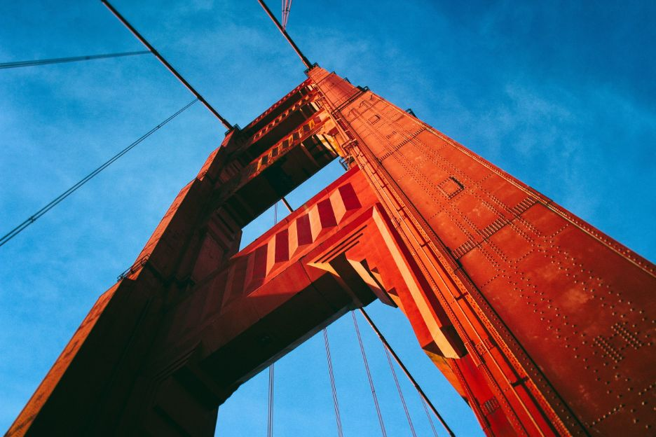

<!-- markdownlint-disable-file -->
**TL;DR** : Coming out of AngelPad’s 2015 Demo Day, we suddenly found ourselves vacillating between an acquisition and Series A funding, though we were arguably too early for either.

### **PART 1: MOMENTUM**

Nov. 11, 2015, AngelPad Demo Day, San Francisco: AP is the top ranked accelerator in the world and, while we were still a hot mess, the presentation went well and we hit the ground with some momentum. After all, we’re in data, and [data is hot!](https://www.astronomer.io/blog/the-growing-data-opportunity) We closed some early, high-visibility investment that night (500 Startups, Social Starts, etc) and our revenue story began to get interesting as it quickly climbed to over $40K ARR in a matter of weeks.

To be honest, the following month was a bit of a blur as we tried to cram millions of VC/Angel meetings into a couple weeks and recovered from the boot-camp brutality of AngelPad. FOMO was our rally cry and, as much as it makes me want to punch pop culture in the face, it’s a thing.

As the fundraising blitz wound down in December, our primary focus shifted back to revenue growth, and we began scouting for “low-hanging fruit” opportunities…

**Enter Romeo (my codename for our eventual Suitor)**

One of our early reach-outs was to a fast-growing firm out of Southern California. Romeo’s business sat directly downstream from our data engineering platform. They needed to consume large quantities of client data to provide their solution, and we smelled a juicy partnership opportunity.

On Dec. 15, we sent a friendly “Hi, let’s partner” note and they responded with “Hi, let’s buy you.” They had actually heard of Astronomer through the Silicon Valley VC rumor mill, and had been advised to consider acquiring a firm like us to build out their data consumption capabilities.

To be honest, our initial reaction was dismissive. Given our stage (super early), we didn’t think they were serious, so we responded with a more formal partnership proposal:

“We believe we can help your prospects/customers get better control of their clickstream data, and send it to you with minimal pain/expense. Specifically:

1. Astronomer builds an integration from you, Romeo, to our data hub—making it dead simple for any Astronomer user to send you data.
2. We mutually choose a pilot company to test with—could be one of our customers, or one of yours.
3. If you have a standard way to summarize clickstream data, we could build that data processing into Astronomer, so the customer has access to that aggregated data for other purposes (lifecycle messaging, CRM/customer support, etc.).”

_Note: while we are a much broader data engineering platform today, at this point in our product life-cycle we were still primarily handling clickstream (app/site event) data._

**Enter Interested Third&nbsp;Party**

Jumping ahead to mid-January, it was maybe 4 degrees outside, and Romeo kept urging us to consider their offer (the sunny SoCal weather became a serious decision factor). Mid-afternoon on Jan. 20, we learned that an interested third party (I3P) had&nbsp;motivation for Romeo to acquire us. A deal with Romeo would not only help them achieve some regional economic goals—helping a local startup grow quickly/create a bunch of local jobs—but would also indirectly return some locally invested capital to the region.

I3P had a strong relationship with Romeo’s investors and CEO, and they began working to help us pull a deal together.

The following week, my co-founder Ry and I were headed to San Francisco for investor meetings, but we scheduled a quick stop in SoCal first, for a meeting with Romeo’s CEO.

On Feb. 1, when we walked into what we expected to be a relaxed “get-to-know-you” meeting, we found ourselves asked to pitch to several key company executives and board members. The pitch seemed to go well, and afterwards, Romeo offered to give us a tour of their brand new office space.

The space was amazing, but the most interesting feature for us had to be the brand new Cincinnati Reds hat, sitting atop a pile of drywall in the middle of the otherwise completely empty room.

Already the trip was promising, and we hadn’t even stepped on the plane to SF.

**PART 2:&nbsp;SIREN'S CALL**

Let me back up a little for context (stay with me here). A few months prior to AngelPad, Ry and I had met with an entrepreneur out in SF who was in the process of transitioning to venture capital. Our friend, we’ll call him Regis, was a killer advisor to us throughout AP, and continued to help shape our fledgling vision through the winter.

Though his full-time job was investing in startups at this point (back to January), we never really saw Regis as a potential investor. His fund, let’s call it Temptation Capital (TC), focused exclusively on Series A rounds—still at least a year out for us. However, amazingly **,** while we were in the middle of pitching Romeo’s team on Feb. 1, we received a voicemail that TC was interested...and we had a two-day window for an in-person meeting before the fund’s managing partner jetted out of town.

Well, for a good hour we sat in a beachfront bar anguishing over whether to stay the course or cancel the SF leg of the trip (the whole reason we went to California in the first place) and head right back to the Midwest.

_Another quick note here: getting meetings with VC’s is actually not that hard. After all, they need to take a ton of meetings to find good opportunities. The difference is that you’re generally meeting with an associate__,_ _who’s just scouting. This was an opportunity to meet with the fund’s managing partner and was set up by another partner. Good._

So, we made the bold (possibly stupid?) decision to cancel our SF meetings, fly to Chicago that evening (on the only flight available) and rent a car and drive through the night to meet with TC the next morning…

**Diligence**

The TC meeting was positive and so the process began for exploring an investment. TC’s next partner meeting was scheduled for Feb. 8, so Regis decided it was time to run Astronomer by the rest of the partners.

The initial reaction was mostly positive, with some understandable questions about our stage given TC’s focus on later stage companies. Nonetheless, the group decided to begin diligence on us and we started working on producing all sorts of info (e.g. market, competition, team, hiring plans, product roadmap, etc.).

The context was that three of the TC partners were a firm “yes,” one was “neutral” (votes with the majority) and one was a “no.” We needed the “no” to convert to a “yes” or “neutral” to do a deal. To push for that, Regis called an emergency partner meeting for that Friday (Feb. 12), and we drove to their office to make our first presentation to the full group.

The TC round would be an anomaly for our stage, and as such still felt very much like a long shot. We pushed forward but kept our options open. At this point (mid-February), we were not only in the diligence process with TC but also still “talking” to Romeo. Not to mention staying in early conversations with other investors about a smaller seed round we were working to pull together.

**Hurry up and wait...**

As is typically the case when trying to close a venture round, we needed to be prepared for a term sheet at any point while also planning for the process to take months (which it would).

By now though, our business was growing and our two largest customers both decided to expand their contracts with us (within six months of becoming customers) by 50% and 140%. We were within spitting distance of $100K ARR and ahead of schedule to hit our $200K target by June. Helpful.

It must have been enough progress to create some urgency, because, a few days later, Regis wrote and submitted a full&nbsp;investment report&nbsp;and deal recommendation to his partners for an investment in Astronomer. We waited...while silently dreaming of hacking his email to see that report!

After the following week’s partner meeting, we got what seemed to be a “conditional yes.” In a nutshell, TC wanted to see some further progress against a specific, key assumption in our model.&nbsp;

If you’ve ever raised capital, you know that time kills all deals and a “conditional yes” rarely turns into an actual “yes.” So, we kept working on the requested deliverable for them, but mostly wrote the deal off at that point.

I’ll be honest, we were bummed.

**PART 3: THE DILEMMA**

****

We still had our Romeo though. And on March 9, after pitching his Board, Romeo got the go-ahead to begin pulling a formal offer together. That meant more diligence.

A couple days later, I3P stormed back into the picture with some shiny possible deal incentives—including private and public financing to build out our local operations. We incorporated this into our post-deal calculations and used them to build out what we began to affectionately refer to as the “SFAP” (Super Freaking Aggressive Plan).

_I should pause again here to say that by now we had begun determining what our magic number (total deal amount) would need to be, and it was high. I was personally beginning to feel some strong doubt as to whether we could get to terms that really made sense for Romeo. After all, we needed to make sure our investors received a fair return (we had raised ~$750K by this point), and given our growth/momentum, we personally needed a pretty decent payoff to give up the potential upside of going solo._

No matter how much we sliced and diced the numbers, we couldn’t figure out how we could get to a deal that made sense for us both. Still, true to our inner optimists, we pressed onward.

On March 18, we had our first official discussion with Romeo around deal structure and hard figures. We decided to come in extra high, hoping to kill the deal quickly if Romeo wasn’t serious. Risky, but given our momentum and investor progress, we felt confident taking a big swing.

Next up, Romeo took the deal to his investors and board for discussion. At that point, things begin to bounce back and forth rather quickly, but these were the two big events:

- March 22: Romeo countered low but near where we expected. They did, however, bring some new, interesting items to the table, including strong funding commitment for our SFAP. 
- March 23: We countered somewhere close to the midpoint, and I3P contributed some further detail on the financing support they could offer, which provided a potential path forward for some of the more challenging aspects of the deal.

Then, on March 28, after we began to circle in on an agreed upon number, Romeo asked if his senior exec team can fly out the following week to meet with our team.

Right about now the gravity of the situation began setting in. Nine months after launching Astronomer, we were _very_ seriously considering selling it.

**Tempted Again**

Now, Romeo was (is) rapidly growing and, from what we can tell in that moment, it’s an incredibly exciting company. To this point (late March), they’ve said all the right things and made the right promises, but it’s still quite difficult to wrap our heads around selling. It takes so much irrational optimism to launch a startup that you’re (statistically) delusional about your chances of success and corresponding upside potential.

You’re confident that your team is building a $1B company. Period. The prospect of “exiting” early is almost blasphemy. And yet, de-risking, instant cash wealth, equity in something new and exciting, and...most of important of all, no more fundraising! is, well, tempting.

On the day we agreed to meet Romeo’s senior execs, however, we were presented with a conundrum: Regis sent us a note saying he’s ready to make another run at getting investment approval in the TC partner meeting. This was largely driven by the progress forward with Romeo, which we kept Regis in the loop with at a high-level. So once again, we hurried up, pulled some materials together, sent them off...and waited.

**PART 4: THE FINAL COUNTDOWN**

On April 1, the Romeo diligence began to move into its final stages. Several more conversations flew back and forth rapidly over the next week around finalizing deal structure. We built 10,000 scenarios for how to ensure that all stakeholders got sufficient ROI’s, and I3P started direct conversations with Romeo about financial participation in the deal.

Meanwhile, Astronomer had a big month, signing several new clients and expanding another client contract (gold!). We also locked pilot deals with a few very large prospects.

While Romeo deliberated, we got news back from the TC partner meeting. Unfortunately, it wasn’t good. The “No” partner decided to hold his ground. He still wanted to see more progress on the key model assumption. At that point, we had no choice but to assume the deal was dead and move on.

Bummer. Onward.

On April 18, instead of visiting us, Romeo asked us to bring our core team (eight total at the time) to SoCal for several days of one-on-one and group meetings. These were largely interviews for post-acquisition roles, but also some additional diligence on team and product maturity/roadmap.

Two days later, we headed west and began the wild experience of being “courted” for an acquisition: great hotel, black car service and a baller dinner out. It wasn’t all fun and games though. We also spent two full days in intense meetings at the Romeo offices.

Ben, our Head of Delivery, probably put it best: “The entire experience was both surreal and validating. Getting acquired was such an abstract idea for so long that it felt like more of a ‘Wouldn't it be nice…’ than an actual possibility. Then we're suddenly on a plane to SoCal to have very real conversations around it.”

Interestingly, our CTO, Greg, had a different take: “There’s no way this happens.”

**Doubts**

For a fledgling Midwest startup, we definitely had some stars in our eyes. Still, over the course of the meetings, it started to become apparent to me (and probably others on the team) that the fit wasn’t quite perfect.

Specifically, parts of our product and roadmap were clearly on a different path than what they wanted. Ry and I left the last meeting with mixed emotions: greater appreciation for Romeo’s team and vision, but also greater uncertainty around Romeo’s ability to justify the tentatively agreed-upon price—given how much product work would be required to reconcile our product visions.

Well, if you know us at all, you’ll know that today we are still 100% Astronomer and in no way a part of Romeo’s portfolio. Without going into too much detail, a week after returning from SoCal, the deal was dead.

**After "Almost"**

We were definitely disappointed, but we knew it was right. Surprisingly, I was even a little relieved and, despite the mammoth distraction, grateful for the opportunity.

Ry put it nicely: "The opportunity to learn is maximized when you do something hard, regardless of the outcome. Getting close to a deal that doesn't come through feels bad in the moment, but when you reflect on it, you realize how much you learned about yourself, your team, business, the world—I'd do it over again in a heartbeat. It's living. And it won't be our only acquisition offer; we're now better prepared for what comes next."

We have nothing but great things to say about Romeo and the way they treated us throughout the process. Not to mention, we know now that the opportunity and sense of urgency it created around the TC option contributed to some other important events. We’re eager to see what the future holds for us. And who knows? Perhaps our path may cross Romeo’s again in the future.

Plus, that was three whole months ago, and so much happens in three months at a startup. In fact, don’t be surprised when you see exciting news from us in the very near future...

