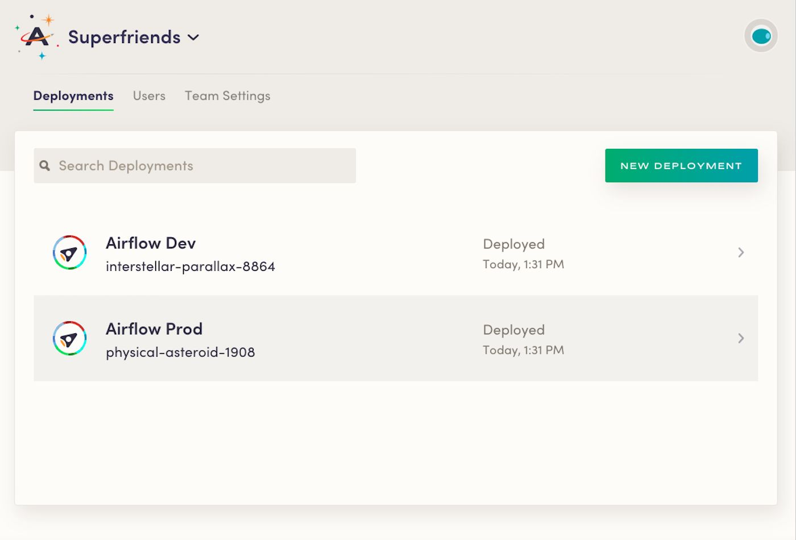
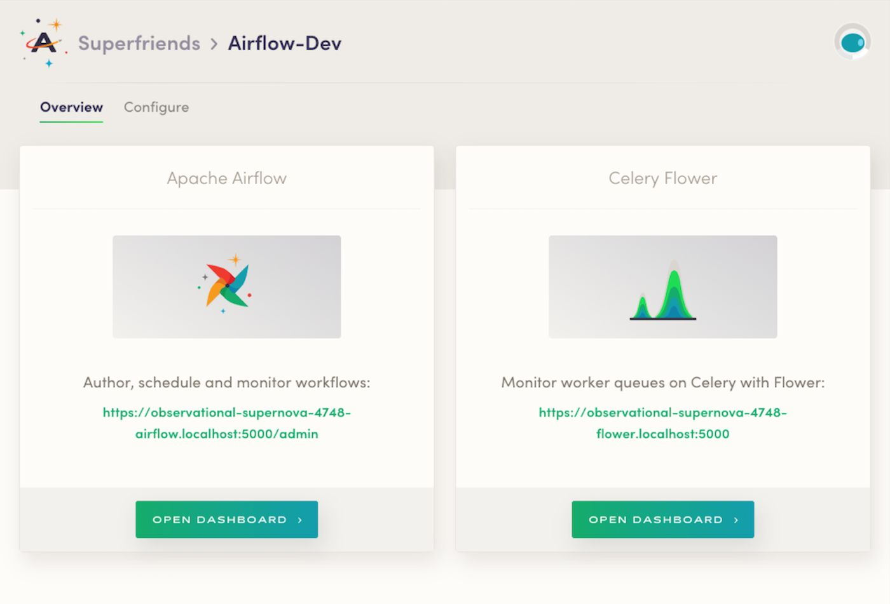
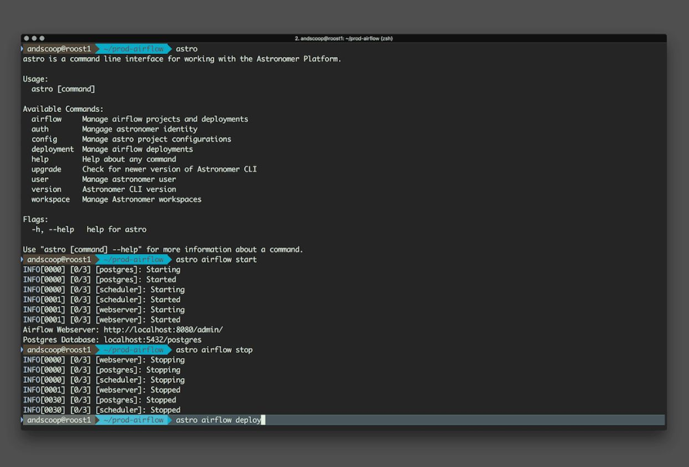

<!-- markdownlint-disable-next-line -->
**We’re proud to announce the latest version of our commercially-supported, high-availability solution for organizations seeking to adopt Apache Airflow.**

## We *really* like Airflow

As we have [mentioned](https://www.astronomer.io/blog/astronomer-is-the-airflow-company/) [a couple of times](https://blog.midweststartups.com/picking-a-favorite-child-988a850aafe8?gi=273d352a67b7) before, we are all-in on Airflow–and for good reason. Airflow is sweeping the data landscape, with huge companies like [Pandora](https://engineering.pandora.com/apache-airflow-at-pandora-1d7a844d68ee) and [RobinHood](https://robinhood.engineering/why-robinhood-uses-airflow-aed13a9a90c8) integrating the scheduling and orchestration tool into their data infrastructure. Through the many conversations we've had with folks in the Airflow community, we've found that the biggest pain point for adoption is that setting up the infrastructure to support, secure, and scale a diverse and reliable ecosystem of Airflow clusters is expensive and requires a huge team of nerds. That's the problem we are solving here at Astronomer. 

With that, we’d like to formally introduce you to the latest version of our managed Airflow product: **Astronomer v0.3**. It's jam-packed full of new features and optimizations. Let's dive in.

## Meet Astronomer v0.3

Our team has continued to build on our [last release](https://www.astronomer.io/blog/announcing-astronomer-enterprise-edition-0-2-0/), which laid the foundation for easy Apache Airflow deployments in a user’s own, secure environment.

Astronomer v0.3 brings improvements across the board, including optimizations to our CLI, authentication methods, monitoring stack, out-of-the-box security, scalability with Kubernetes, and a brand new UI for simplified deployment of multiple Airflow clusters with custom permission groups. 

The latest release allows users to spin up multiple Airflow clusters anywhere Kubernetes runs, including both public clouds (AWS, GCP, Azure) and on-prem private clouds. It is designed to simplify the process of running and monitoring data workflows and clusters at scale, with high-availability and maximum security. Now, you can access and monitor Celery worker queues right in the new UI–and that's just the tip of the iceberg regarding our plans to improve Airflow monitoring.

While this release allows our infrastructure to scale up to support larger organizations with many workflows and complex requirements, it also allows us to scale down to serve smaller teams (we can even run on a single-node Kubernetes cluster!). Astronomer v0.3 is designed to greatly reduce the time and effort required to get Airflow running in a stable and secure way, even at scale.

> “Astronomer provides a turn-key, flexible, scalable, and affordable ETL solution to power our batch processing of billions of rows of data per day for our customers. In addition, their expert data engineers have trained our engineering team so we could be self-sufficient; they've been a great partner! - Nic Zangre, VP Product, CaliberMind

### Our Newest Release, Unpacked

Here are a few specific benefits and features of the v0.3 release: 

#### Multiple clouds and teams

Once Astronomer is installed, users are up and running with the ability to deploy multiple Airflow clusters. Users can create team workspaces that are isolated, with the ability to invite team members to collaborate.

#### Brand new UI

We made it incredibly easy to create and manage these Airflow clusters and teams with just a few clicks in our new UI, as well as some included monitoring of teams and Celery workers. The future is bright for this tool, as it will soon be home-base for your resource monitoring and controls, as well as Airflow logs and alerts.

#### High availability

Astronomer relies exclusively on Kubernetes to provide maximum uptime and reliability, and this version brings even deeper integration. We have seen big improvements in availability with v0.3 installs vs competitors such as Google's Cloud Composer, as well as previous versions of our own product.

#### Improved CLI

We drastically improved our authentication process for maximum security and usability, and made several additional improvements to our configuration process from start to finish. 

## Try it Out

If you’re interested in exploring Astronomer, [request beta access v0.3](https://www.astronomer.io/#beta-request) on our website. If you have any questions or feedback, don’t hesitate to drop us an email at [humans@astronomer.io](mailto:humans@astronomer.io).
