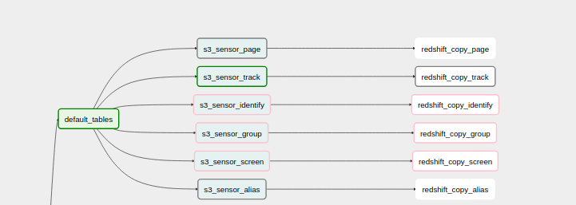
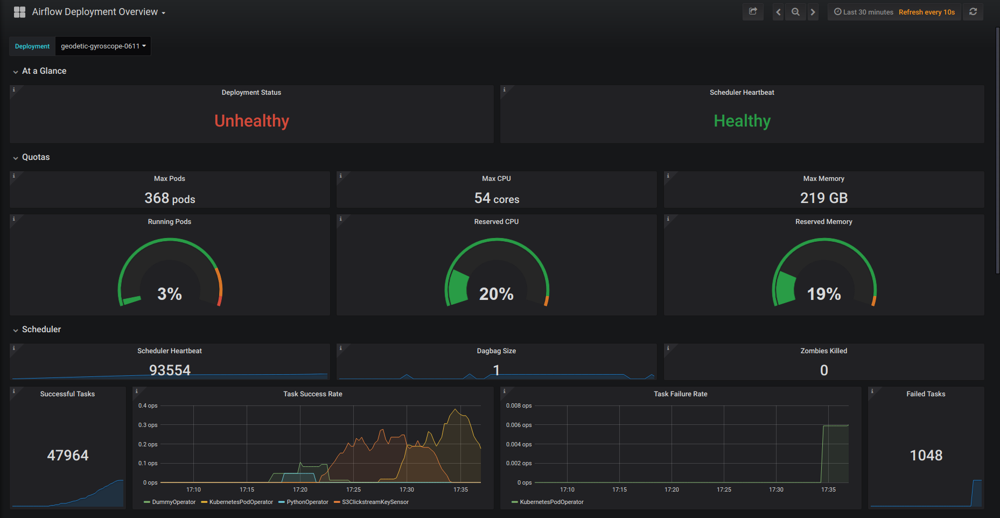

As of Spring 2018, our team has been [all in on Airflow](https://www.astronomer.io/blog/astronomer-is-the-airflow-company/). We’re fully committed to helping organizations of all sizes, industries, and experiences adopt [Apache Airflow](https://airflow.apache.org/). But that wasn’t always the case.

A few months back, we were struggling to run two separate products, one powered by the other. (1) A managed version of Airflow and (2) an event-tracking software we called Clickstream (now known as [metarouter.io](http://metarouter.io)). 

Metarouter was the product from which Astronomer was born. It was because of the unique challenges Metarouter presented us with that we discovered Airflow in the first place; everything from the pain points and workarounds to the pro tips, growing community and compelling use cases.

This post will walk you through our very own internal use case from start to finish. We'll top it off with some thoughts on what that experience has taught us about Airflow, and what we’re building to make running Airflow a better, more flexible, and more reliable experience.

## Part I: What we were looking for

### Metarouter.io's Value Prop

For context, Metarouter.io (formerly Astronomer Clickstream) is an event-routing platform. Primarily aimed at marketers and non-technical users, it captures events* from web, mobile, and server-side sources, and routes them to marketing analytics tools (Mixpanel, Google Analytics, etc.) and large data stores (S3, Redshift, etc.). 

A user can configure those pipelines by dropping a snippet into their application and choosing which destinations they want data to be pushed to via the Astronomer-built UI.

*An event is any user’s interaction with content that can be tracked independently from a web page or a screen load. Think: downloads, clicks, or video plays on a website. 

### Initial Needs

As we were building Metarouter - and promising customers that we’d reliably push data from one place to another - we quickly faced batch-processing needs.

To give you more insight into that internal process, let’s take a workflow that pushes to a data warehouse (a popular destination) to start. To send data from a web app to Amazon Redshift, here’s what we needed the flow to look like:

- Events flow from the app or website onto a Kinesis stream
- Events are picked up from Kinesis via a typical event forward logic, and loaded onto S3
- From S3, events are finally loaded onto Redshift, each event into its own table with the necessary complementary information

### A Few Conditions

As we explored solutions, Airflow among others, we recognized a few additional conditions:

1. Users needed the ability to add and remove events to track (i.e. Add to Cart, Remove from Cart)
2. Some hours and customers have exponentially more events than others. 
3. Raw event logs of varying size need to be transformed before they can be loaded into Redshift.
4. Everything needs to be fault tolerant enough to handle a system failure without losing any customer data.

And to Apache Airflow we turned. 

## Part II: Where Airflow Comes In

Apache Airflow was, and still is, the rising industry standard for dev-friendly ETL. 

It proved to be an-open source tool that offered smart scheduling, dependency management, flexibility, and scalability. We loved that, among other things, Apache Airflow would allow us direct insight into points of failure in and around a workflow architecture, and that it had a growing open-source community around it. There are now [more than 200 companies](https://github.com/apache/incubator-airflow) (Robinhood, Quizlet, ING and Twitter to name a few) that have officially adapted Airflow into their data infrastructure. Ultimately, we felt good about the project’s future (and still do).

More specifically, here’s a breakdown of what exactly Airflow offered as a solution to the needs and conditions listed above: 

   **1. Dynamic task generation.** Given that users needed the ability to add and remove events, we needed a dynamic framework that would adapt to customer needs. While most workflow configurations are static, being able to define workflows that would change depending on the state of Redshift was huge.

   **2. Scaleable to client needs**. Some customers had exponentially more events than others, and certain hours of the day were significantly busier. Apache Airflow allowed us to fine-tune and configure our resource management settings to perform optimally under constantly changing conditions.

   **3. Defining Dependencies in code.** Raw event logs of varying size needed to be transformed before being loaded into Redshift. Apache Airflow’s protocol for processing tasks within DAGs took full advantage of independent events and parallelism, which meant that ultimately, performance would be optimized, regardless of input size.

   **4. Robust Error Handling.** Customer data is valuable to any organization, and a fault-intolerant system could have potentially disastrous company-wide implications. Defining DAGs in Apache Airflow allows for tasks to be retried a specific number of times upon failure, and also trigger alerts if a task is taking an unusual amount of time.

## Part III: Airflow in Practice

Powered by Airflow, here’s a breakdown of how Metarouter.io runs. 
 
At the highest level, events are routed from the Kinesis stream to the appropriate workflow defined in a DAG, before ultimately landing in Redshift (internally dubbed our `Redshift Loader`).

**1. Events flow from the app or website onto a Kinesis stream, and are picked up and transformed by Vortex**

Vortex is responsible for microbatching the data, and performing necessary transformations such as deduplication, before dropping the data into an S3 bucket. Given that all the data in Clickstream is streaming data, Vortex acts as the bridge that transforms the data from a stream format to a batch format. Since DAGs require data on disk memory to perform scheduled jobs, Vortex will also store data in a structure on disk that an hourly DAG can consume.

**2. Events are loaded onto S3 and DAGs are dynamically generated**

Every customer receives their own Clickstream DAG, which consists of tasks for each customer-specified event. Given the need for customers to create and remove events, DAGs needed to be generated dynamically each time they are run. Our Houston API was the perfect answer. Houston stores event types- it is the single source of truth, and all pieces of Clickstream rely on the information it sends them on request (good name, isn’t it?). The first step in a Clickstream DAG is to make a call to Houston. Houston will relay event information back about the event types in the DAG, and dynamic task generation will begin. All DAGs are configured to look for the S3key with the corresponding event and time period for each task.

**3. From S3, events are finally loaded onto Redshift, each event into its own table with the necessary complementary information**

In order for an event to be fully processed, it must successfully pass through two Airflow tasks - a Sensor Operator and a Docker Operator using the Databricks Redshift Loader (this is entirely for performance reasons, but there is an operator in Airflow to push data from S3 to Redshift). The sensor operator is designed to check a specified S3 bucket for a key given a timestamp. If a key is found (i.e. a user has hit “Add to Cart” in a mobile app), the downstream Docker operator is triggered to load data into Redshift. Every task will run in a separate Docker container, which is dynamically allocated resources from a DC/OS cluster, preventing unnecessary upkeep costs. 
### How we optimized Airflow to fit our needs

**1. Core Settings.** We tinkered around with airflow.cfg, the configuration file in every Airflow deployment to ensure scalability and make sure that it could handle all the DAGs that were being thrown at it (ex. setting parallelism to 1 million).

**2. Going back to Cron.** The Airflow scheduler can be temperamental at times, by crashing or hanging in general, so we found that having a cron job reset the scheduler every 15 minutes kept it in check.

**3. Utilizing Variables in Airflow.** Airflow ships with a Variable abstraction, that provides a key value data structure for storing data. We found that saving destinations to an Airflow variable made dynamic DAG generation simpler, and much more efficient.
## Part IV: Moving to Kubernetes

Recently, we moved the Metarouter Loader from DC/OS to Kubernetes, specifically, [Google's Kubernetes Engine](https://cloud.google.com/kubernetes-engine/) (GKE). We absolutely love the Kubernetes + Helm ecosystem and were able to make a few significant improvements to the system by migrating it over.

**1. Switching to the Celery Executor**
We moved the executor from the Mesos Executor to the Celery Executor. We had been experiencing issues getting Airflow to use all of the resources it was allocated, and this switch made for significant optimizations on that front. Plus, it gave us a host of new bells and whistles to tune that'd allow us to better optimize how jobs run.

**2. Using the KubernetesPodOperator instead of the DockerOperator**
By running our jobs in Kubernetes Pods instead of Docker containers, we were able to leverage views avaliable in GKE to get more visiblity into how our jobs were running. Airflow ships with a `KubernetespodOperator`, so we didn't have to change much of our underlying source code to make this switch.

**3. Kubernetes native monitoring with Prometheus**
Airflow comes with some great built-in alerting tools for jobs, but there's not much for the Airflow instance itself. As described above, we scheduled automatic scheduler restarts and other preventative measures to prevent silent failures. The new Metarouter Loader runs with a Prometheus [side car pod](https://kubernetes.io/docs/concepts/workloads/pods/pod-overview/) that pushes metrics to Grafana dashboards to give us some "single pane" views and platform level alerting. Furthermore, Kubernetes healthchecks gave us a much higher level of stability.

## Part V: Future Vision

Apache Airflow is still very much in active development, and new features and updates are being rolled out consistently. We’re dedicated to not only building out features on our platform to offer a better managed Airflow, but also actively contributing back to the open source Airflow community. While Airflow is a powerful DevOps tool that streamlines much of the process of setting up a highly scalable data infrastructure, it has its own quirks and shortcomings. We’ve learned a lot about how to best configure Airflow from using it internally and developing a managed platform, so there’s a lot on our radar in terms of future direction. We keep an updated product roadmap [here]
(https://www.astronomer.io/docs/roadmap/), so things are sure to change, but as of right now, some of the things we’re working on include:

**1. Streaming logs in realtime using ElasticSearch.** As we discovered above, one of the biggest pain points with Airflow can be scheduler bottlenecks. Saying that Airflow is a resource-intensive program is an understatement, and much of the source code is not optimized in terms of space and time complexity. Therefore, monitoring and tracking Airflow deployments is one of the best ways to rapidly diagnose and repair failures. Astronomer’s platform collects time-series metrics in Prometheus and pipes them right to dynamic Grafana dashboards where an Airflow developer or IT administrator can pull up metrics on specific deployments quickly to diagnose and correct the right configuration settings for a specific Airflow deployment, and not waste time or energy trying to test and fix problems manually. Now, with realtime logs featuring fulltext search and filtering, Airflow developers and administrators have another powerful tool in their arsenal to find and fix issues.

**2. Scale to zero.** We firmly believe you should only pay for what you use. Since Airflow constantly needs workers available to pull tasks off of a queue when DAGs are running, the cost of keeping worker nodes alive can be high. Ideally, you’d only have workers available when you need them. Running Airflow on Kubernetes allows us to achieve exactly that. Spin up a pod when you need it, and when the job’s done, spin it down.