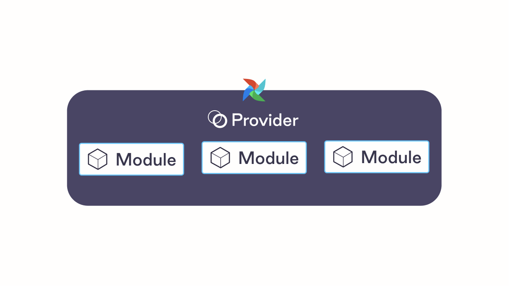

Today, we're excited to announce [The Astronomer Registry](http://registry.astronomer.io/): a discovery hub for Airflow providers designed to bridge the gap between the Airflow community and the broader data ecosystem.

The [Airflow providers framework](http://airflow.apache.org/docs/apache-airflow-providers/) has long been a valuable asset for the community. DAG authors benefit from access to a deep library of standard patterns while maintaining code-driven customizability; it enables a tight integration between Airflow and almost any tool in the modern data stack.

But it doesn't stop there. The value of the provider framework also extends beyond the Airflow user to the service provider itself.

The data ecosystem loves Airflow, as it allows service providers to fit their tools into highly-contextual pipelines that help enable broader business outcomes. An easy plug-and-play architecture allows folks to use tools the way they're *meant* *to be used,* which produces a more favorable outcome for all downstream data users.

So we've made it easy for the data ecosystem get involved with the Airflow community. With a [sample repository](https://github.com/astronomer/airflow-provider-sample/tree/main/sample_provider) and support from the Astronomer team, anyone, from a major technology company to an individual developer writing DAGs, can publish a provider on the Registry *from any public repository*. The Registry aggregates and curates the best bits of the ecosystem so that developers can easily discover and access the integrations they need.

## Highlights

### Providers and Modules

The providers framework is a robust solution for interfacing with a large catalog of tools, but we found that a user's first exposure to the framework can be overwhelming. across hooks, operators, sensors, transfers, and providers, there are many different entities designed to do different things. To simplify the experience, we've introduced the concept of **Modules** to make the logical separation clear:

- **Providers** are the top-level python packages that users download to interface with a specific *service*. These package contain all relevant **modules** for a service.
- **Modules** are specific pieces of provider packages that can be imported and used in a DAG or in an Airflow configuration file. The module abstraction includes the classic integration points that Airflow users know and love- hooks, operators, sensors, etc. At the time of writing this post, there are 700 modules available in the ecosystem, with more being added every day.

### Easy Navigation

The Registry's goal is to consolidate only the most crucial information a user needs to get started with a provider package and its modules, including access instructions, required parameters, and example DAGs. Our goal is to help users easily conceptualize how providers and modules are used contextually in DAGs.

Note that Registry documentation does *not* conflict or compete with core Airflow documentation; in fact, the docs rendered on the Registry are built from the same source as the Airflow docs! Instead, the Registry amalgamates Airflow docs, example DAGs, and quick access instructions from both the core Airflow repository and third-party repositories to improve discoverability and access across the entire ecosystem.

### Search

Through many user interviews, it became clear that discoverability is a major pain point for the Airflow community. To address that pain, we built the Astronomer Registry with first-class, intuitive search *across both providers and modules*, making it easy to find and implement anything in the ecosystem without spending hours reading source code.

### Partner Providers [Beta]

Many companies have reached out asking for assistance in creating an Airflow Provider for their tool. The Registry allows partners in the data ecosystem to deliver high quality providers and modules to the Airflow community more quickly, with success metrics baked in.

We're proud to launch a beta program with a small batch of partners who have worked closely with us to refine the build and release process, including [Great Expectations](http://greatexpectations.io) and [Fivetran](http://fivetran.com). We look forward to delivering many more of these packages in the coming months and working to bring more first-class integrations to the Airflow community.

Please visit our [sample provider repo](https://github.com/astronomer/airflow-provider-sample) for more info and feel free to [get in touch](http://registry.astronomer.io/publish-provider) if you'd like to publish a provider package.

## Looking Ahead

There are a few items that we're particularly excited about working towards with the Registry in coming months:

- **More Providers:** We're excited to help our partners in the data ecosystem get involved with Airflow, and we're even more excited for the high-quality DAGs that these providers will allow users to build and share on the Registry.
- **Better Metrics:** Documentation helps a user get started, but we know that users also want to understand how *popular* certain modules are as a proxy for quality. We've started by surfacing download count for each package, but know that's not enough. We look forward to incorporating a scoring system that incorporates usage statistics to determine the popularity of each individual *module* on the Registry.
- **Private Registry:** Public packages help a user get started with DAG authoring, but we know that many users want to go even further and share custom operator code they've written with their teammates. To meet this demand, we plan to build a first-class, authenticated experience that allows users to easily publish and share internal packages for their teammates to access and implement.

We sincerely hope you enjoy what we've built. Please browse away, and if you're interested in becoming a beta tester for any of the above features, please don't hesitate to reach out to us at ecosystem@astronomer.io.
