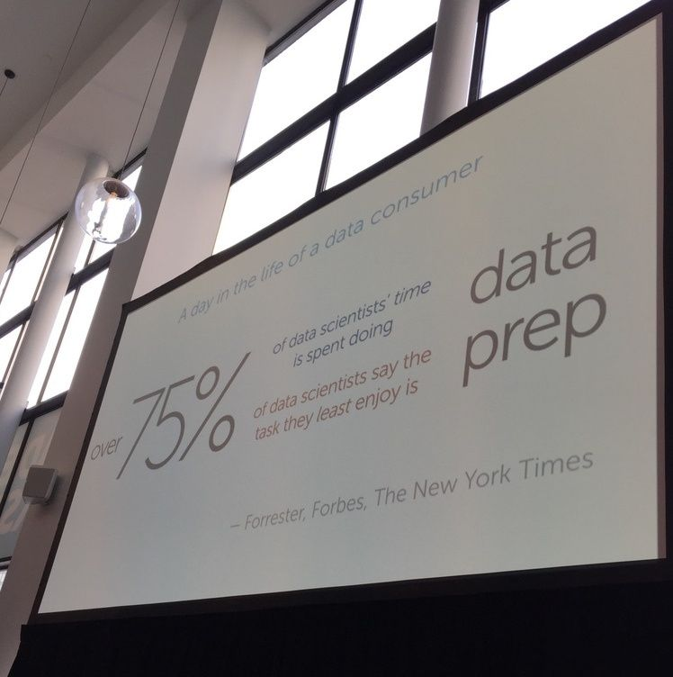

_Day 2 of PLOTCON&nbsp;has wrapped, so it’s time for the Astronomer team to debrief from the day. If you missed it, first check out [why we’re here](https://www.astronomer.io/blog/astronomer-takes-plotcon) and [what we learned on Day 1](https://www.astronomer.io/blog/astronomer-takes-plotcon-2016-day-1). &nbsp;_

BG: So many good talks today—I was just going over my notes, and it’s hard to pick a favorite.

VP: Yeah, I can't pinpoint my favorite talk either, but the best quote was definitely, “I do believe data science can build a lot of cultural changes, particularly in old established companies,” from [Carlo Torniani](https://twitter.com/carlotorniai)’s (Head of Data Science at [Pirelli](https://www.pirelli.com/global/en-ww/homepage)) lecture. It fits right in with what we’re trying to do at Astronomer.

BG: My quote of the day was, “Cardiologists … those sons of b\*\*\*\*\*\*” from the talk on visualizing HIPAA compliance. Who knew they were the worst violators in the entire healthcare system?

VP: Hahaha! That was surprising to me as well, but not as much&nbsp;as the fact that fewer than half of the companies that invest in data initiatives feel like they’re getting a return on them. When the guys from [Red Hat](https://www.redhat.com/en) mentioned that, it surprised and scared me a little. Sidenote: this stat from them was also pretty interesting:&nbsp;

BG: Yeah, no kidding! But to me, the most&nbsp;interesting part of their talk was related to use of data in enterprise environments. Specifically, that they’re looking to build a “unicorn,” a person who can do everything (engineering, statistics, design). Ostensibly, that’s as hard to find as a real unicorn, but can be done in a hybrid way by building out teams with a diverse skill set and domain expertise.

VP: Actually, it seemed like every talk valued thought diversity in building out data science teams. Some of the examples showcased how amazing the results can be&nbsp;when a data scientist works in conjunction with a designer and a subject matter expert. The entire presentation by [Edward Lee&nbsp;](https://twitter.com/edwrdlee)from Spotify, which exemplified that, absolutely blew me away. Some of the coolest visualizations I’ve ever seen!

BG: That was incredible. Everything they eventually publish is really well done, and it was cool to see him showcase a few experimental visualizations that their team created without expectation of what they’d find. Like anything else insight-driven, quality work is an iterative process. And going back to thought diversity, I liked how they structure their team to be an interdisciplinary mix of engineering, research and design. All three are essential for effective communication of complex ideas.

VP: The [MapD](https://www.mapd.com/) presentation blew my hair back, too. Those queries and lookups were being done so fast all the interactions looked like they were happening on the front end—1.2B rows of data in just 30 milliseconds! Can we add that to our product roadmap?

BG: Well, it’s easy to do that when you’re running everything on GPUs … but it’s expensive, too. It makes sense that a few of their customers are hedge funds. I can’t imagine what it costs to run that system.

VP: Probably not the most practical use of funds where we are, but still cool as hell. Overall, I think we both got a lot out of today. Plotly did a great job of bringing together a lot of different perspectives and methodologies, which is what has made these last few days such a great learning experience. Can’t wait to get back at it tomorrow!

_\*Update: Here's what we learned on&nbsp;[Day 3](https://www.astronomer.io/blog/astronomer-takes-plotcon-day-3)._

