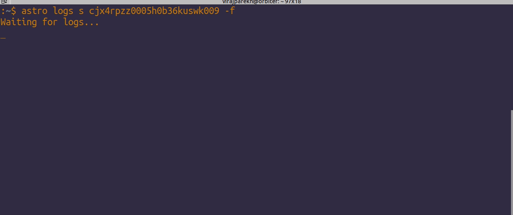

This week, we successfully cut v0.9 of our platform. This release includes major features that have been long-anticipated by our customers, including beta integration with the Kubernetes executor, RBAC integration, and in-app montioring dashboards. These features have been on our roadmap since we [went all-in on Airflow](https://www.astronomer.io/blog/astronomer-is-the-airflow-company/) in May of 2018; we're extremely excited to bring our day-one dreams to life.

**Note:** v0.9 is only available to Enterprise customers as of now. We're working hard to migrate our Cloud cluster over to our new backend and are in the final stages of ensuring our underlying infrastructure is locked and loaded for a fully smooth transition. Future platform upgrades will be continuously deployed. We're approaching the finish line and will have these features roped into Cloud very soon!

## What's new in 0.9

**1. Support for the Kubernetes Executor**

Allowing our customers to auto-scale their Airflow deployments has long been a goal of ours at Astronomer. With the incorporation of the Kubernetes Executor in our platform, we've taken a big step towards making that dream a reality. 

From a customer's perspective, this will be a major win; now, not only do you not need to worry about manually scaling things up if you deploy resource-intensive DAGs, but also you soon will no longer pay for idle resources.

**2. In-App Metrics Dashboards**

Airflow deployment metrics are now accessible via our API and dashboards in our UI. Now, you can keep an eye on your task status, quotas, scheduler performance, database connections, and resource utilization in one view.

**3. RBAC Integration**

We now offer full integration with Airflow's native RBAC functionality. Users on Astronomer can be assigned `Admin`, `Editor`, and `Viewer` roles, each with increasingly strict permissions. These permissions carry over into your Airflow deployments, so you can now invite users to your Workspace and control the level of access they have to your Airflow instances.

**4. Logs Streaming to the CLI**

You can now stream logs from your Airflow deployments directly to your terminal. This is useful if you ever need to view a live output of logs while deploying your DAGs.

**5. Custom error messages in our UI**

We roped in a smarter default backend for NGINX that allows us to show custom error messages based on the errors getting returned from Airflow. For example, you'll no longer see a scary 503 if you try to access your Airflow deployment while it's still booting up.

**6. Support for Okta Oauth Integration in Astronomer Enterprise**

You can now integrate Astronomer Enterprise with your company's internal Okta auth servers via a config exposed in our helm charts.

**7. General UI improvements**

We added some small optimizations to our front-end, including a fix that prevents logs from being truncated in our logging dashboards.

## Up Next

We've recently expanded our team and will now keep releases coming regularly. We'll be sure to keep you updated with all of the new features we build in the coming weeks as we continue our push to v1.0.