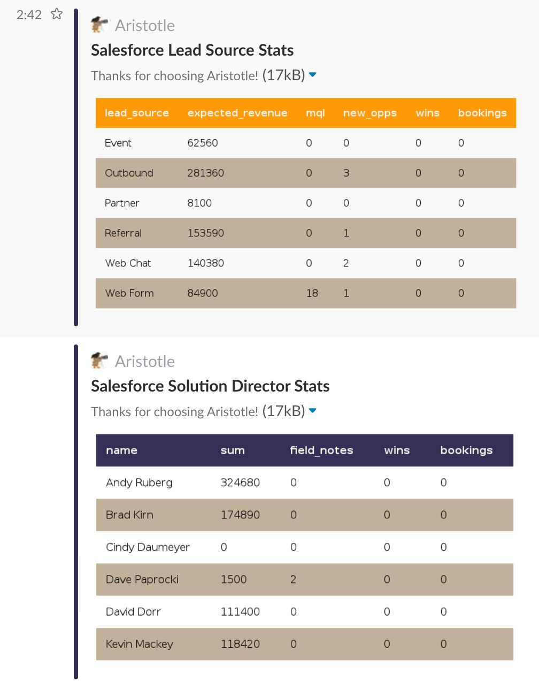
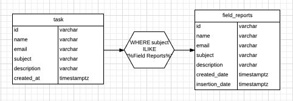
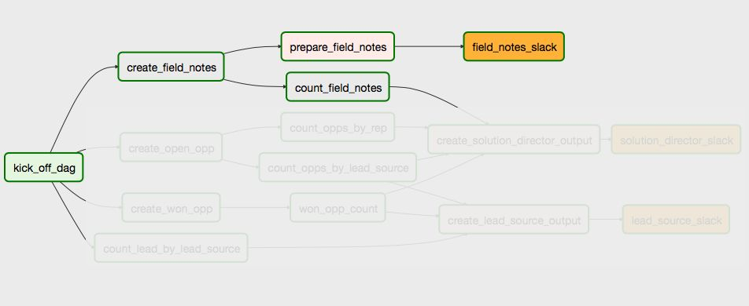
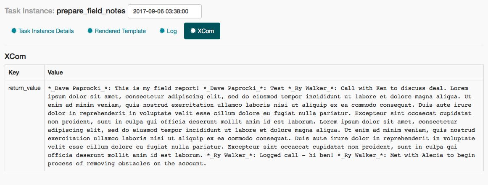
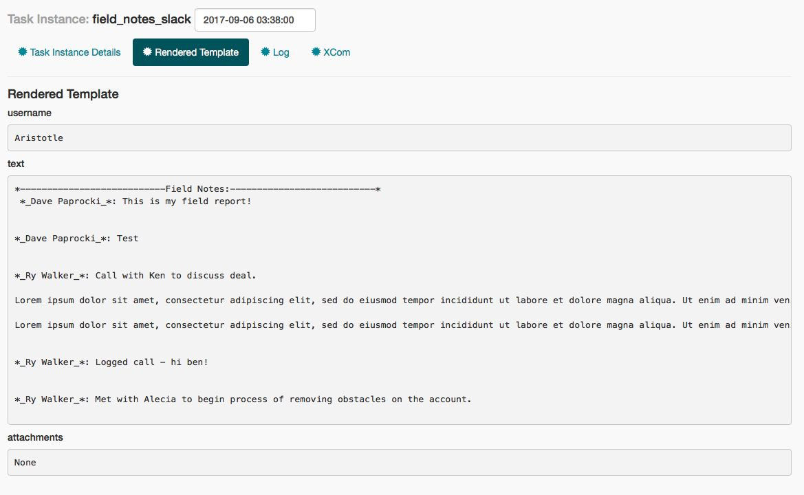
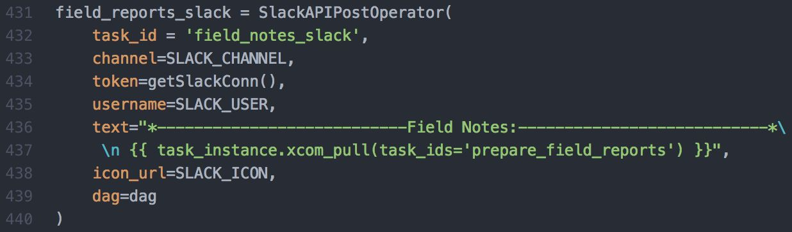
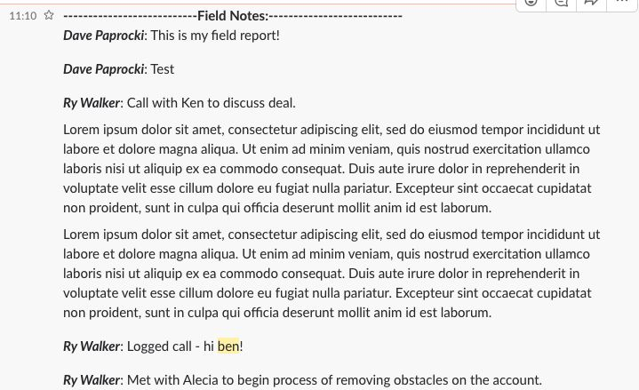

<!-- markdownlint-disable-file -->
In our past two posts ([here](http://www.astronomer.io/blog/automating-salesforce-reports-in-slack-with-airflow/) and [here](http://www.astronomer.io/blog/automating-salesforce-reports-in-slack-with-airflow-ii/)), we covered pulling data from Salesforce and using the Python, Postgres and Slack operators to build out some standard reports that were previously being done manually. While working on replicating these reports, we realized we could replicate a second reporting mechanism that is also fairly manual but covers essentially the same data.

Every day our Growth team posts notes from prospect conversations in a Slack channel called “#fieldnotes”. This is great for keeping the team up to date on what new prospects are on the horizon and gives everyone a chance to weigh in and help as they can. The problem with this is: a) requiring the Growth team to post in both Salesforce and Slack is time consuming and prone to error and b) reports are sent out at all times of day, causing other team members to miss the notifications if they’re busy.

To solve this, we’re working on a new process to have the Growth team log their Field Notes in Salesforce as a call associated with the relevant Contact. These are pulled from Salesforce along with all other notes and reminders and put into the “task” table. From there, we filter for records that contain the words “Field Notes” in the subject line and put them into a second table called “Field Notes.” Given that Field Notes also need to be included in the report summaries, this kills two birds with one stone.

After that, a Python operator kicks off using the get_records() function within the Postgres hook to read the new records into a list. The get_records() function only requires a SQL command and because we've preprocessed our data already, it’s as simple as the following to pull the relevant records.

    SELECT name, description

    FROM salesforce_staging.field_reports

    WHERE trunc(created_date) = trunc(GETDATE())

    ORDER BY name;If we click into this task and go to the Rendered Template section, we can see the same data from before in the specified formatting.

If we click into this task and go to the Rendered Template section, we can see the same data from before in the specified formatting.

This data is then received by the next task in the series, a SlackAPIPostOperator, where it is then pushed as text to the relevant channel:

And here we have our nicely formatted field notes that can be set to run on a predictable interval with significantly less work by our Growth team. As an added benefit, having all of our field notes in our database allows us to do more in depth performance and text analysis down the road. We're really excited about what other existing reports we can automate and what new reports may now be feasible given the reduced human input required.

Thanks for following along on this series and please feel free to reach out to [humans@astronomer.io](mailto:humans@astronomer.io) for more information on how you can use Airflow and Astronomer at your company.