In [our last post](http://www.astronomer.io/blog/automating-salesforce-reports-in-slack-with-airflow/), we covered getting the raw data out of Salesforce, into S3, and then finally into Redshift, with notifications and clean up along the way. In this post, we'll cover how we process that data and what tools we use to build and publish the reports the Slack. To follow along more closely, you can view the [code on Github](http://github.com/astronomerio/example-dags/blob/master/salesforce_to_slack/salesforce_data_processing.py).

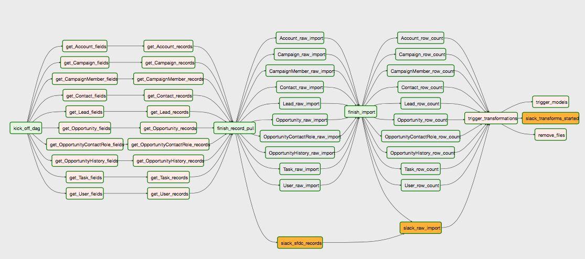

Now that we have our data in a schema called “salesforce_raw”, we can begin processing it. We’ll eventually have four schemas: “salesforce_raw”, “salesforce_stats”, “salesforce_staging”, and “salesforce_models.” The latter two will be used to hold our derivative tables, created in the DAG that was just triggered.

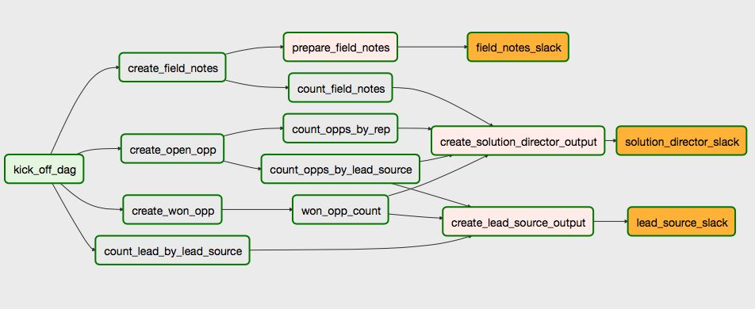

To start generating our report, let’s derive the numbers we need for open opportunities -- both how many have been created this month (and from where!) and what our current expected revenue is.For that, we need to filter for opportunities where the current state of the property “is_closed” is set to false (or more accurately, ‘f’) and insert the results into a staging table called “open_opps.” These are then aggregated into two model tables (“opp_by_lead_source”, “opp_by_rep”), joining with the user table to match the “owner_id” of the opportunity (something like “00546000001ALq6AAG”) to an actual name when partitioning by Solutions Director.

Modeling it out, we end up with a workflow with the following logic:

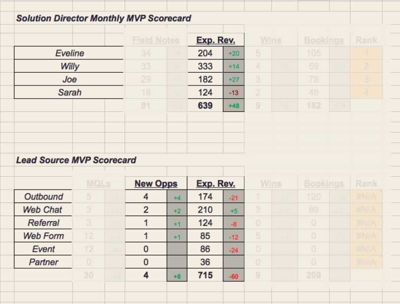

For that, we need to filter for opportunities where the current state of the property “is_closed” is set to false (or more accurately, ‘f’) and insert the results into a staging table called “open_opps.” These are then aggregated into two model tables (“opp_by_lead_source”, “opp_by_rep”), joining with the user table to match the “owner_id” of the opportunity (something like “00546000001ALq6AAG”) to an actual name when partitioning by Solutions Director.

Modeling it out, we end up with a workflow with the following logic:

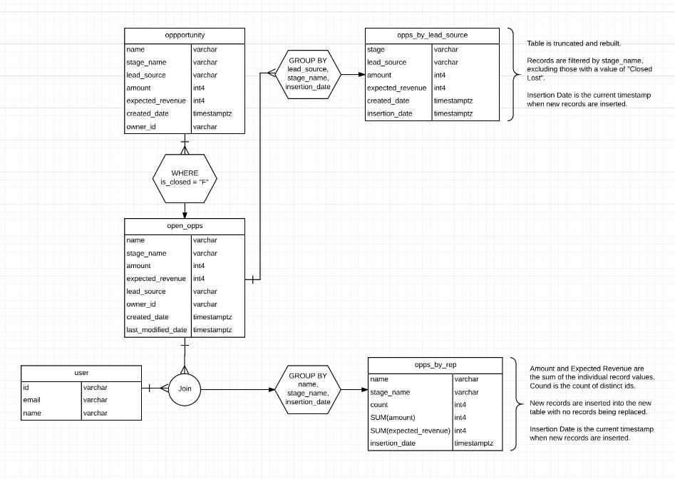

To fill in the remaining parts of the chart, we also need to get data for current won opportunities as well as MQL (marketing qualified lead) counts.

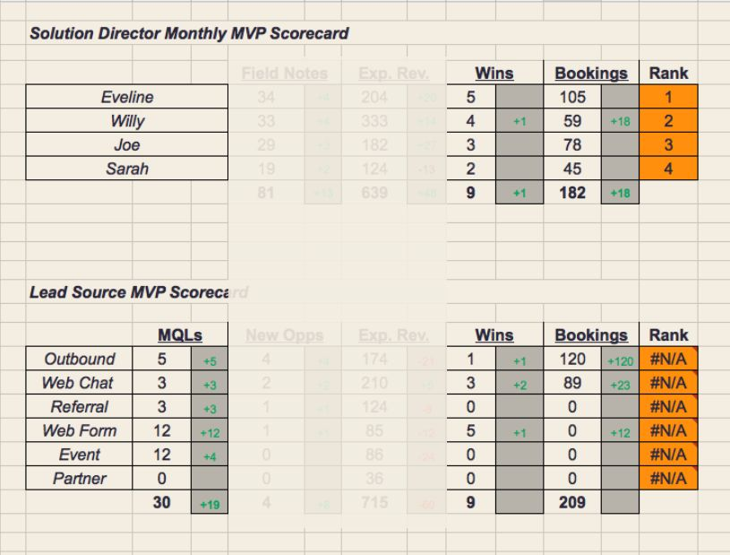

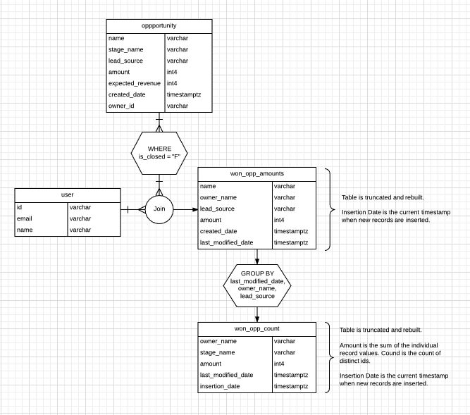

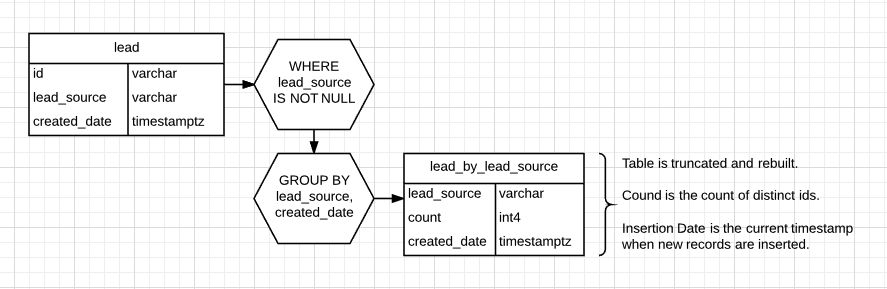

When we put it all together, it covers the majority of the logic in our DAG.

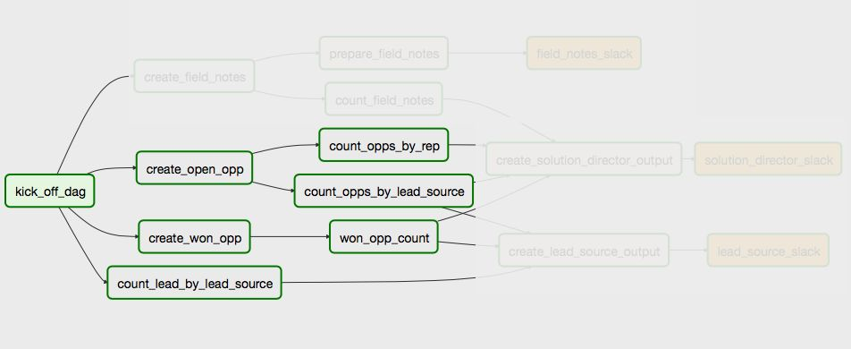

To put our final chart together, we use the .get_pandas_df() method within the Postgres Hook to read in our basic metrics into four DataFrames and join them together. Because of the pre-processing we did prior to this step, the queries require very few resources from our database. 

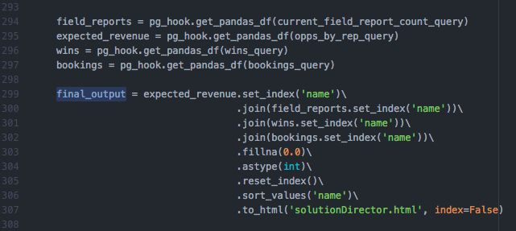

At the very end of this process, we export the DataFrame to html. This allows us to then style and export the table as a image using WeasyPrint, a popular conversion package.

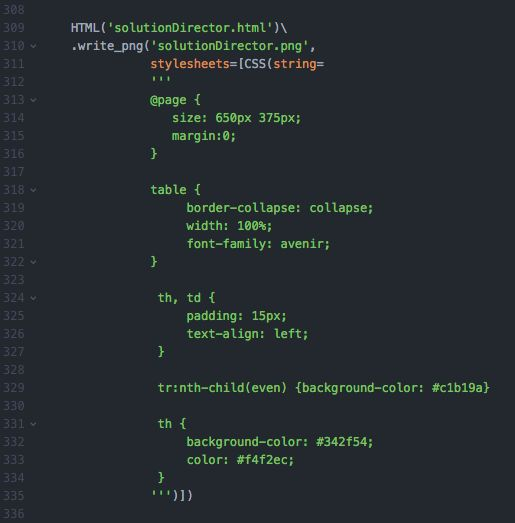

WeasyPrint isn't exactly the smallest package to install but it is quite powerful. If we wanted to, we could convert this HTML to a variety of formats including GIF, JPG, SVG or PDF. It also supports custom CSS so we can make sure our images are Astronomer-ized.

Like we did in the previous DAG, we use the S3 hook to load this image into a bucket that can then be accessed by our SlackAPIPostOperator.

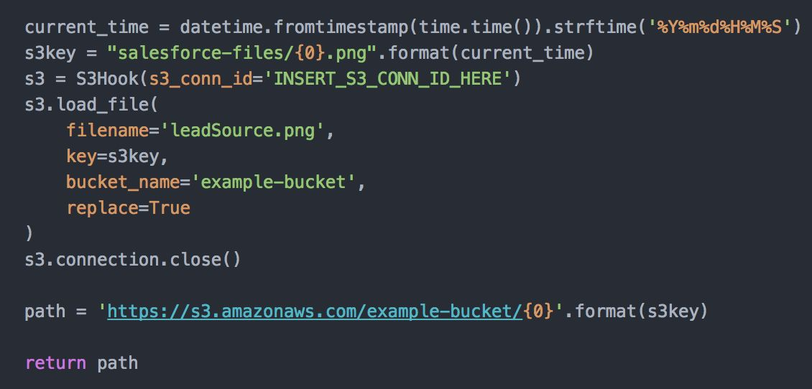

When working with images that are added to Slack, it’s important to use a unique name because Slack will cache previous versions based on the URL. So if your image resides at [https://s3.amazonaws.com/example-bucket/lead_source_performance.jpg](http://s3.amazonaws.com/example-bucket/lead_source_performance.jpg), changes will not be evident between Slack messages even if the image has changed. To address this, we add the current_time as a suffix to all messages to ensure it is always unique.

Lastly, when using S3 as a file store, referencing the image solely by the URL will require them to live in a public folder. To enable this, you will need to add something like the following to your Bucket Policy:

    {
 
       "Version": "2008-10-17",
 
       "Statement": [{
 
          "Sid": "AllowPublicRead",
 
          "Effect": "Allow",
 
          "Principal": { "AWS": "*" },

          "Action": ["s3:GetObject"],
 
          "Resource": ["arn:aws:s3:::bucket/file_path/*"]

       }]

    }

Now, that the path to the image is returned from the function, we can access it as an XCOM by the final operator in our workflow, the SlackAPIPostOperator.This operator is pretty straightforward to use and only requires a standard Slack Token for authentication as Slack takes care of all request routing from there. The details of the message itself are wrapped up in a standard Slack attachments object. In our case, we’re only passing in the path to the image as an XCOM but you could enrich your messages further by passing in specific stats or conditional alerts based on performance data.

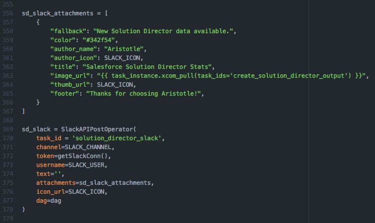

And we have our charts in Slack! 

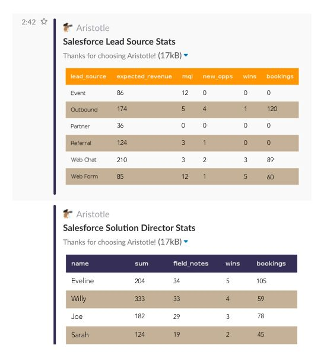

And there we have it! Our two automated reports requiring zero human involvement. The benefits of this is immediately apparent:

1. We save a significant amount of a real person’s time (and therefore $$$) not having to run repetitive tasks.
2. Because this process requires zero human interaction, we can update this to run whatever schedule we want (e.g. every day, every hour, every 15 minutes).
3. The core of our work (pulling the data, processing derivative models, formatting the tables) only needed to be set up once so now any additional reports we want are trivial to automate.

In [our third and final post](http://www.astronomer.io/blog/automating-salesforce-reports-in-slack-with-airflow-3/), we’ll cover another report we weren’t expecting to automate but ended up being able to by making one small change to our processes. Stay tuned!