At Astronomer, we compile and share a daily sales/marketing report (the names and data here have been changed). This requires looking at seven custom reports in Salesforce, pasting that data into a Google Sheet and taking a screenshot dropping it into a Slack channel. If the person who does that work is out on any given day, the report just doesn’t get built. Most companies have hundreds of processes like this that affect every aspect of their business. 

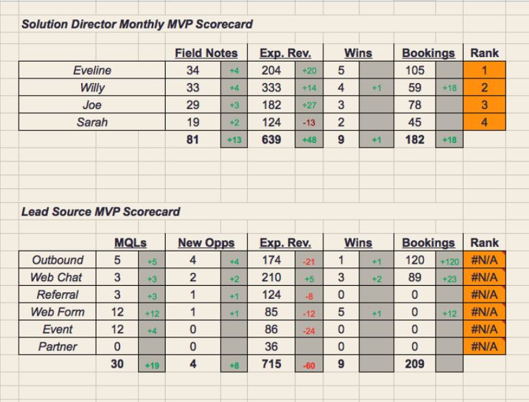

Given how manual and error-prone this process could become, we decided to automate it (that’s what we do: streamline data engineering!) using a combination of the Salesforce API, Amazon Redshift, Airflow and Slack. In this tutorial, we’ll walk you through the steps and considerations we took to generate this report. [To follow along for yourself, view all the code in GitHub.](http://github.com/astronomerio/example-dags/blob/master/salesforce_to_slack/salesforce_to_redshift.py)

*Note: this is not the most concise or advanced way of showing this process, but was done to illustrate a basic introduction to Airflow.

By the end of the this series, we’ll have remade the old table into something much nicer: 

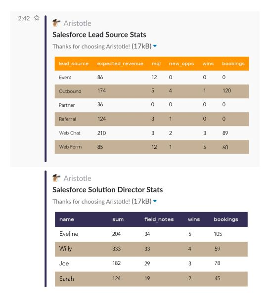

First, we need to identify what is the appropriate data to pull in from Salesforce. For the purposes described above, we will pull information on tasks, opportunities and leads and then parse them by both users (e.g. Eveline) and lead source (e.g. Web Form).

For additional reporting, we also pull data on accounts, campaigns, campaign members, contacts, opportunity contact role and opportunity history.

We’re going to make our first DAG in Airflow where we will:

* Fetch our Salesforce records
* Write them to an intermediary file storage system (S3)
* COPY from S3 into Amazon Redshift
* Create some QA checks
* Trigger a second DAG that will then process the data

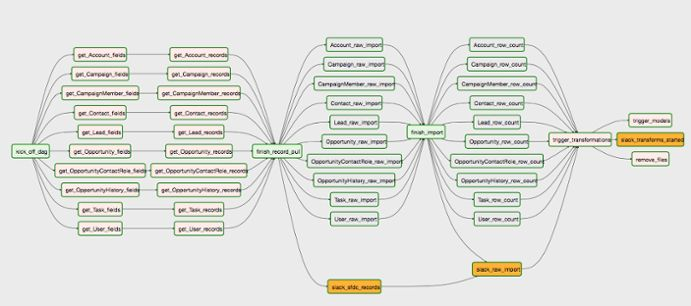

This looks complicated but it’s actually pretty straightforward and that’s what makes Airflow such a powerful tool. Even though we’re pulling in 10 Salesforce objects and applying four operations to each of them, we don’t have to manually write out 40 operators. By just starting with a list of the objects we want data from and a loop with our templated operators, we can build our 40 tasks in about 75 lines of code (less if we didn’t care about formatting!).

The best part of building out our DAG this way is that if we wanted to pull a dozen more objects (and [there are plenty](http://developer.salesforce.com/docs/atlas.en-us.object_reference.meta/api/sforce_api_objects_list.htm)), it would just be a matter of adding these objects to the names array. Consider that the alternative would be to drag and drop 50 more tasks onto the page in some other tools, and you can start to understand why Airflow is so immediately valuable.

But to get the full picture, let’s walk through what’s happening in this DAG.

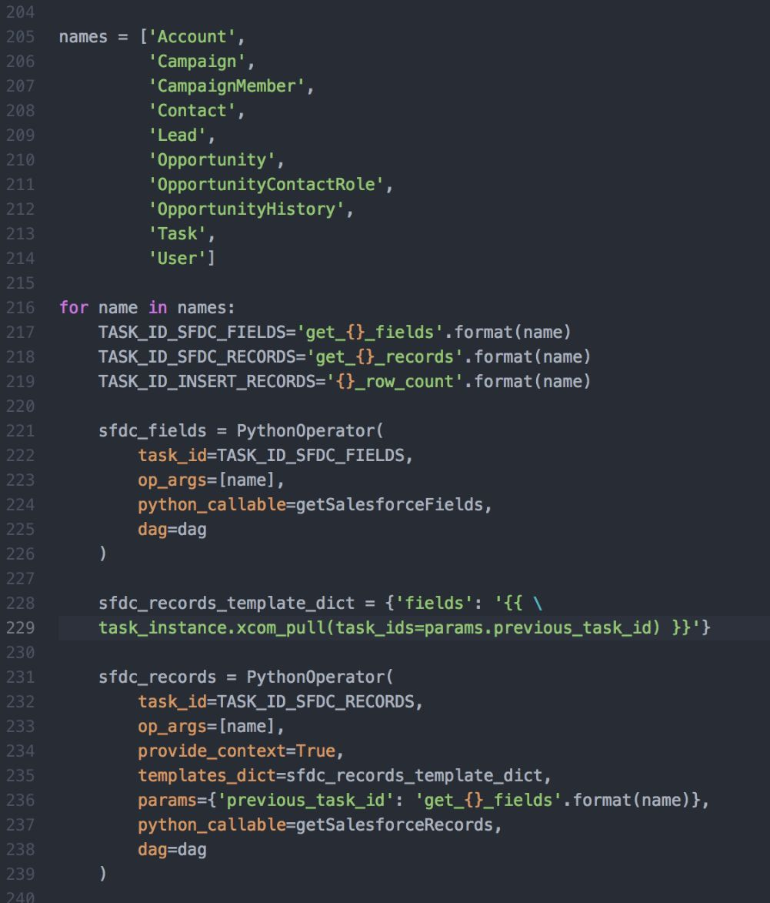

Our “kick_off_dag” operator is just a Dummy Operator.As the Airflow [documentation](https://pythonhosted.org/airflow/code.html#airflow.operators.DummyOperator) says, it “does literally nothing.” But it is useful for grouping tasks and when starting a new project, setting the schedule to “@once” and restarting your DAG by clearing all downstream of this Dummy Operator in a single click rather than individually restarting 10 or 20 separate tasks can be very helpful. Dummy Operators are also useful when needing to provide a stoppage point to block downstream tasks. The downside to using a Dummy Operator in this way is that if all the operators upstream of it (the ones with a “get_” prefix) don’t end successfully, then this task and all downstream of it will fail. A slightly more advanced alternative is to use the [Short Circuit Operator](https://pythonhosted.org/airflow/code.html#airflow.operators.ShortCircuitOperator), which will set all downstream tasks to “skipped” instead of “failed” if certain criteria are not met.

Once the DAG is built, it’s time to kick it off.

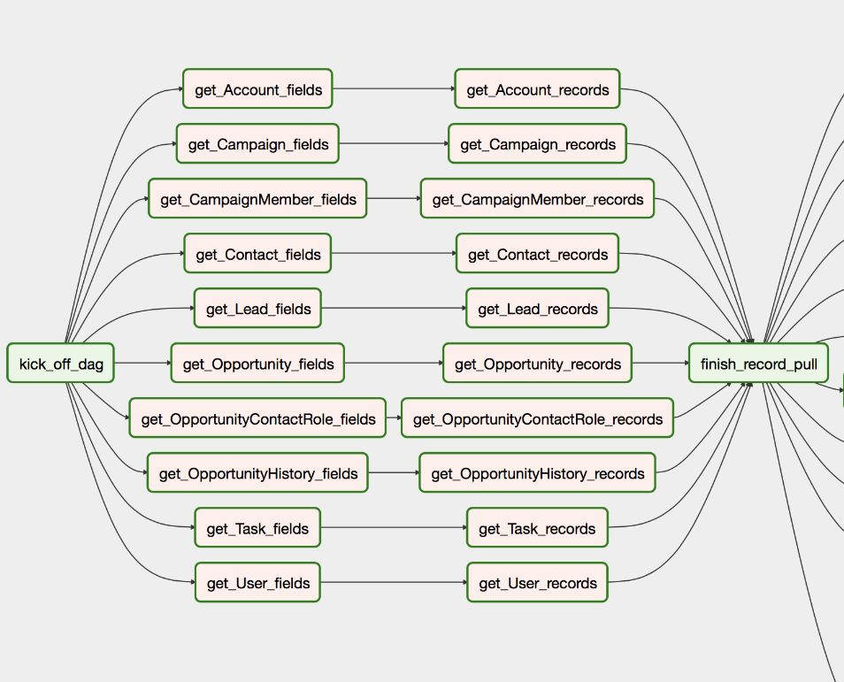

First, we query for the available fields in each Salesforce object. We use a few tools that integrate with Salesforce (e.g. Engagio, Pardot, Unbounce) so a lot of the fields are not standard. After we get these fields, they'll be passed these field names as XCOMs to the next task in the series, which pulls the actual records themselves through a SOQL query.

If we click into our “get_Lead_fields” and go to the XCOM panel, we can see our fields being returned as a list.

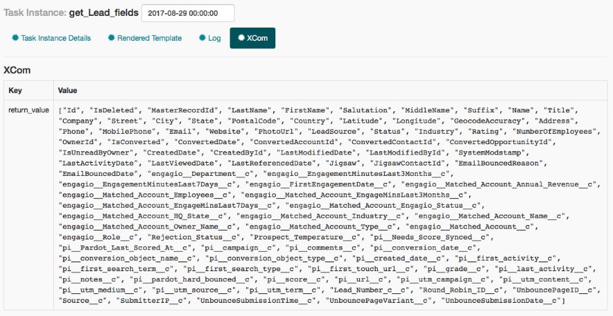

But wait a second - we've passed the fields as an XCOM but where do they go from here? After all, we're programmatically building our tasks so how do our downstream tasks know which XCOMs to pull? For that we need to add a 'provide_context=True' to our operator that pulls records and create a new dict with a "fields" object using jinja templating and the name of the previous task passed as a parameter. Because a standard naming convention is used, we can format this pretty easily by just passing in the name of the object.

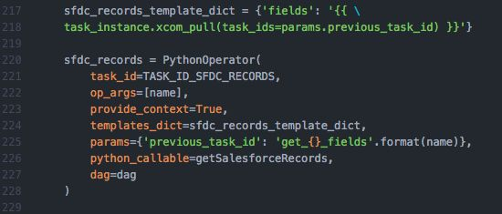

We’re using the [simple-salesforce](https://github.com/simple-salesforce/simple-salesforce) package to wrap around the Salesforce API, using the helpful .query_all() method, which takes care of paginating the requests under the hood. Simple-Salesforce also offers a method for making bulk requests, but as of the time of this writing has [an open issue](https://github.com/simple-salesforce/simple-salesforce/issues/176) preventing us from using it here.

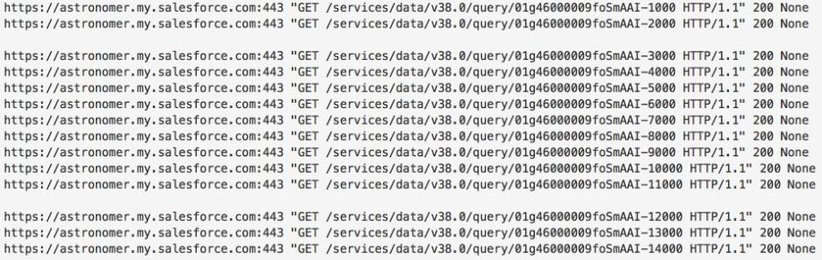

After that, the records are written as separate JSON files to S3 using the load_file() method from the [s3Hook](https://pythonhosted.org/airflow/_modules/S3_hook.html). As we’re using Astronomer (where all tasks run in isolated Docker containers that are destroyed after completion), we don’t care about the local persistence of the file so we’re just using the NamedTemporaryFile method from Python’s tempfile library.

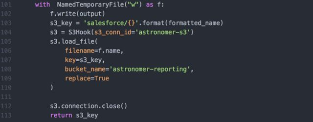

From S3, they are then COPIED into our Redshift using the [PostgresOperator](https://pythonhosted.org/airflow/_modules/postgres_operator.html#PostgresOperator). Similar to before, we use Dummy Operators as break points between tasks to ensure that individual tables aren’t being updated while others are failing. We would rather have all records complete up to a given point than be out of sync. 

As an additional quality assurance measure, a simple row count is then performed on each of the tables and put in an “insertion_records” table in our “salesforce_stats” schema. After that, the bulk of the work is complete.

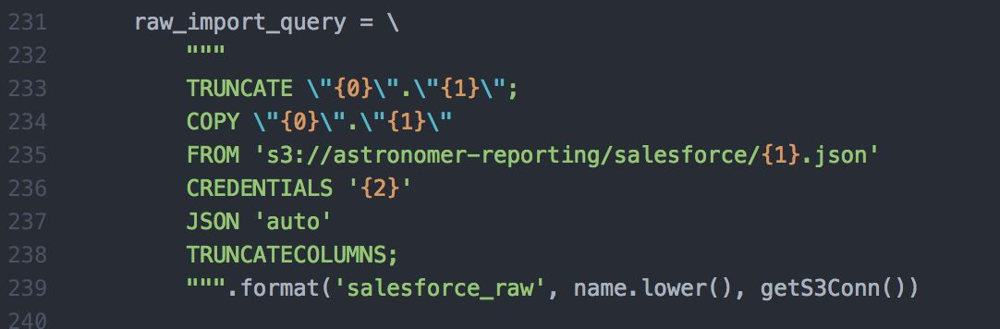

From there, three additional tasks occur concurrently. The first task triggers the next DAG (“trigger_models”), which will process the data, and is instantiated through the [TriggerDagRunOperator](https://pythonhosted.org/airflow/_modules/dagrun_operator.html#TriggerDagRunOperator). This operator uses a python function to determine whether or not to trigger, activating the specified trigger_dag_id if the specified python_callable returns dag_run_obj. In our case, we always want the next DAG to run if this operator gets activated so we’ve hard-coded the params to ensure it resolves to true. We’ve set ourselves up, however, to easily alter this in the future to be receive a condition as an XCOM or the product of any custom logic.

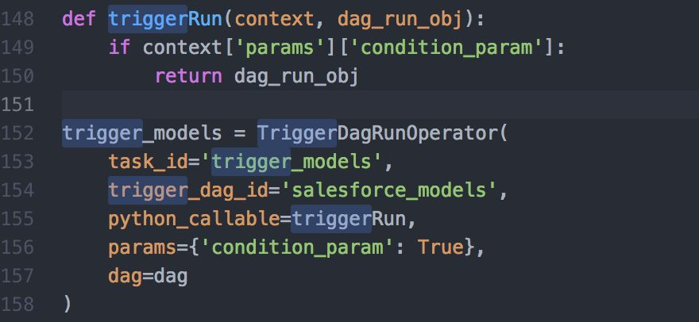

While this second DAG triggers, a Slack notification is sent confirming the workflow has finished (using the [SlackAPIPostOperator](https://pythonhosted.org/airflow/_modules/slack_operator.html#SlackAPIOperator), which we’ll talk about in the next post) and a Python Operator runs a script to remove the files stored in S3. Funny enough, even though the S3hook uses Boto under the hood, it doesn’t have native support for removing files. For that we actually have to import Boto3 (as our containers use Python 3.6) and use the delete_objects() method.

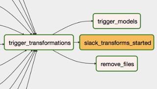

To recap what we just went over, we created a DAG that pulls data from Salesforce, stages it in S3, loads it in Redshift, sends some Slack notifications, cleans up old files and triggers the next DAG. [In the next post](http://www.astronomer.io/blog/automating-salesforce-reports-in-slack-with-airflow-ii/), we walk through the DAG, which handles the actual building of our report directly.

 