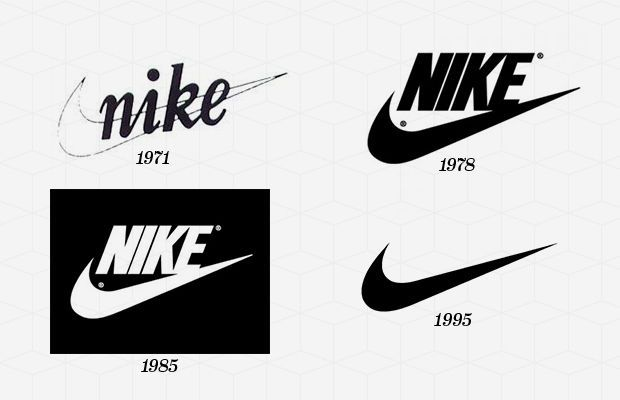
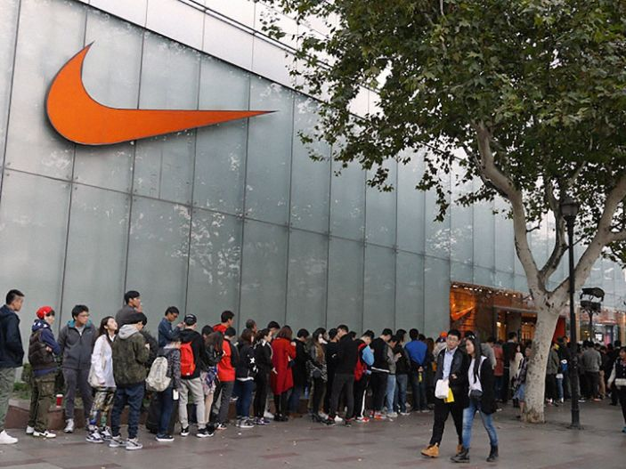

I work for a startup. If there’s one consistent thing about a startup, it’s change. Roles pivot as often as the product does. Since I started eight months ago I’ve worked on everything from [redesigning our logo](https://www.astronomer.io/blog/a-logo-story) to sales to product development. As our young company grows, the need to refine and clarify roles and responsibilities becomes more important every day (though as a startup we must be careful not to embolden ourselves to [processes](https://www.astronomer.io/blog/the-problem-with-process)).

Recently, I’ve started to work on Astronomer’s branding and marketing. As I considered this new charge, I wondered what the differences really are between branding, marketing and design. Is Astronomer’s logo and colors its brand? Is the Astronomer brand something different? Something more inclusive, perhaps? Are marketing and branding the same thing?

It was all pretty confusing to me, and I’m the undisputed “expert” on this stuff on our team. I’ve worked on branding and marketing projects for ten years as a freelance designer and as an art director at various branding agencies. If words like branding and marketing were still difficult for me to explain, I figured they must be confusing for a lot of people working in other companies—who, as it turns out, are doing brand-building work every day, whether they realize it or not.

This post is my attempt to answer my own questions and add clarity to what it is that I should be working on every day and what kinds of people we should hire.

My goal is to better define three commonly misunderstood concepts: brand, logo and marketing. Let’s get to it.

What is a brand, anyway?

Brand is one of those words thrown around loosely in business meetings but the definitions are often vague and abstract. Brand is commonly defined as a promise, a trademark, your positioning, your logo, your company’s personality, a gut feeling and so on.

Little did I know that a conversation I had with San Diego-based author [Jeremiah Gardner](https://jeremiahgardner.com/) more than two years ago would form the basis for how I think about branding at Astronomer today.

Gardner came to speak to a small group of entrepreneurs in Cincinnati in 2014 and shared a definition of brand so simple and obvious, yet so complete:

> _&nbsp;A brand is a relationship between an organization and an audience._

&nbsp;Gardner’s definition is a fresh take on branding, especially in a world with new rules and opportunities as a result of technology:

> _The relationship between brands and customers has changed dramatically as the channel has changed from one-direction to multi-directional. It is both synchronous and asynchronous, it is both real-time and time-lagged, it is one-to-one, one-to-many, many-to-one, and many-to-many._

A brand is indeed a promise, a trademark, your positioning, your logo, your personality, and a gut feeling. All of those things matter because they represent a “shared effort to attribute meaning” to the relationship, according to Gardner.\*

So then, what is a logo?

This is Nike’s logo. A logo is a symbol used to represent an organization and its products.

Designed by a Portland State University student named [Carolyn Davidson](https://www.npr.org/2011/06/23/137376121/nike-swoosh-designer-discusses-her-iconic-creation) in 1971 and sold to Nike for $35\*\*, some consider the Nike Swoosh to be the [greatest logo of all time](https://www.complex.com/style/2013/03/the-50-most-iconic-brand-logos-of-all-time/nike). Upon seeing it the first time in 1971, however, Nike founder and CEO Phil Knight remarked,

> &nbsp;I don’t love it, but it will grow on me.

It grew on him. It sounds crazy today that Phil initially thought The Swoosh was just OK because it’s impossible to separate The Swoosh from all of the feelings we now have about Nike. Every inspiring Nike commercial, billboard, mobile app or sneaker is now positively associated with The Swoosh. It's a logo, a symbol, that represents all of those good feelings and those good feelings represent Nike’s brand.

OK, what about marketing?

On a rainy day in Shanghai in 2014, hundreds of people lined up outside a Nike store for the chance to buy a limited edition rerelease of Nike’s [Air Jordan 6](https://www.flightclub.com/air-jordans/air-jordan-6) sneakers, originally worn by Michael Jordan during the 1991 season with the Chicago Bulls, the year of his first NBA Championship with the team.

This is an example of Nike’s marketing. Marketing is the act of promoting a company or its products. Marketing is an intentional effort to remind customers of, and strengthen, the brand relationship.

Nike obviously has enough resources to distribute as many Air Jordan 6 sneakers as they wish but they chose to stock the Shanghai store with only 300 pairs. They were all gone within minutes. Every customer who snatched a pair, no doubt, felt lucky just for the opportunity to pay Nike for its products. Each individual customer’s relationship with Nike was reinforced with delight, and FOMO was cured instantly.

**The Swoosh is Nike’s logo, a graphic symbol that represents the company. A limited edition rerelease of classic Nike sneakers is a marketing campaign, a proactive attempt by Nike to remind you of its products. Those immediate feelings you get when you see The Swoosh or open up that box and get a whiff of that new shoe smell is Nike’s brand.**

What does all this mean for Astronomer?

When I first started working for Astronomer last fall, I dove head first into a [redesign of our logo](https://www.astronomer.io/blog/a-logo-story).

As important as it is to make a beautiful logo (it is), a great brand is ultimately the result of a great relationship with customers. Again, Gardner lays this out nicely:

> _The importance we place on non-important things in brand development is astounding. All of the bells, whistles, glitz, glam and cleverness are not the most important things. The most important thing is the real, living, breathing people you are forming a relationship with._

Last week, I went to the office of one of Astronomer’s customers and asked their data scientist how we are doing in our efforts to serve the needs of their organization.\*\*\*\* I’m going back again next week to continue the conversation.

When I walk into that conference room, shake the hand of our customer and have an honest and open conversation I am building Astronomer’s brand.

I’ll be sure to wear an Astronomer t-shirt though, with a big logo on it. Just as a reminder.

☺️

_\* Jeremiah Gardner expounds on his definition of branding as a relationship in his phenomenal book, [The Lean Brand](https://leanbrandbook.com/). I highly recommend it for anyone doing branding work._

_\*\* In 1983, Phil Knight ceremoniously gave Carolyn a diamond ring and an undisclosed amount of Nike stock for her iconic design—today, “[she’s not quite a millionaire](https://www.npr.org/2011/06/23/137376121/nike-swoosh-designer-discusses-her-iconic-creation).” She remains very proud of her design._

_\*\*\* The Swoosh is not a bad design. It is elegant in its simplicity and does convey motion, though graphically it is nothing extraordinary._

_\*\*\*\* Short summary of his response: “Great!”_

&nbsp;

Lovely illustration by [Chase Curry](https://dribbble.com/shots/2331767-Tandem-Google-Bike)

