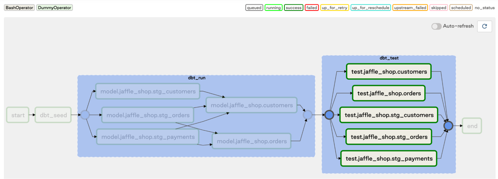

In our recent blog posts ([Part 1](https://www.astronomer.io/blog/airflow-dbt-1) and [Part 2)](https://www.astronomer.io/blog/airflow-dbt-2), we wrote about a pattern for running dbt transformation pipelines in an Airflow DAG by making use of dbt’s manifest.json file and mapping each dbt model to a task in an Airflow DAG. Along with the blog post, we provided some code snippets and a sample repo, which helped many of you getting started. We decided to take this work a little further and put together a utility package that can be used to generate Airflow DAGs from dbt models in a more convenient fashion. 

In this post, we’ll give you a brief overview of how to use the package and show you some sample configurations. All code in this post can also be found in the [demo repo on GitHub](https://github.com/astronomer/airflow-dbt-demo). And if you haven’t read the first two parts of this post yet, we recommend you [go back and read those first](https://www.astronomer.io/blog/airflow-dbt-1)!

## A dbt Parser Utility

The sample code we provided in the previous post demonstrates how to loop through the manifest.json file of your dbt DAG to parse out the individual models and dependencies and map them to Airflow tasks. In order to simplify the DAG code when using this pattern, we built a small convenience utility method that takes care of the parsing. The DbtDagParser utility works as follows:

* The parser takes the dbt project path containing the dbt_project.yml file, as well as the path to the profiles.yml file as inputs. Note that this setup assumes a “mono repo” with the dbt project being collocated with the Airflow code.
* By providing a “dbt_tag” parameter, a user can select a subset of models to run. This allows specifying multiple DAGs for different subsets of the dbt models, for example to run them on different schedules, as described in [this blog post](https://www.astronomer.io/blog/airflow-dbt-2).
* The utility returns a task group containing all “dbt run” tasks for the models in the specified dbt DAG, and optionally another task group for all test tasks.

When used as shown in the sample code below, the utility provides a convenient shortcut to creating Airflow task groups with the respective dbt models that can be triggered in a DAG run. Note that this code snippet only shows part of the DAG file; you can find the whole file in the [demo repo](https://github.com/astronomer/airflow-dbt-demo).

**dbt_advanced_utility.py**

```
`with dag:`

``

`start_dummy = DummyOperator(task_id='start')`

`dbt_seed = BashOperator(`

`task_id='dbt_seed',`

`bash_command=f'dbt {DBT_GLOBAL_CLI_FLAGS} seed --profiles-dir {DBT_PROJECT_DIR} --project-dir {DBT_PROJECT_DIR}'`

`)`

`end_dummy = DummyOperator(task_id='end')`

``

`dag_parser = DbtDagParser(dag=dag,`

`dbt_global_cli_flags=DBT_GLOBAL_CLI_FLAGS,`

`dbt_project_dir=DBT_PROJECT_DIR,`

`dbt_profiles_dir=DBT_PROJECT_DIR,`

`dbt_target=DBT_TARGET`

`)`

`dbt_run_group = dag_parser.get_dbt_run_group()`

`dbt_test_group = dag_parser.get_dbt_test_group()`

``

`start_dummy >> dbt_seed >> dbt_run_group >> dbt_test_group >> end_dummy`
```

One important fact to note here is that the DbtDagParser does not include a “dbt compile” step that updates the manifest.json file. Since the Airflow scheduler parses the DAG file periodically, having a compile step as part of the DAG creation could potentially incur some unnecessary load for the scheduler. We recommend adding a “dbt compile” step either as part of a CI/CD pipeline, or as part of a pipeline run in production before the Airflow DAG is run.

There are two small differences between the previous examples in dbt_advanced.py and elt.py in the demo repo and this example with regards to the “dbt test” runs:

1. The test runs are optional. You can simply skip the tests by not using get_dbt_test_group().
2. The “dbt test” task group depends entirely on the “dbt run” group instead of each test running right after the corresponding model. This means that in this example, the DAG will run all models first, then all tests. 

Which pattern you choose for your tests most likely depends on the kind of alerting or DAG run termination you add to your test tasks; we’re just suggesting one possible option here.

Using the jaffle_shop demo dbt project, the parser creates the following DAG including two task groups for the “dbt_run” and “dbt_test” tasks:



## Some Considerations on Tradeoffs

One question that frequently comes up (or at the least we’ve been wondering ourselves!) is how mapping the dbt DAG into Airflow tasks impacts the DAG run time. It’s not entirely obvious whether this causes a performance hit due to any overhead of calling “dbt run” repeatedly as we mentioned in the [previous post](https://www.astronomer.io/blog/airflow-dbt-2), or can actually lead to improvements, or whether it really makes any difference at all. 

In order to compare the performance, we ran a larger version of the jaffle_shop dataset with 10K customer records, 5M order records, and 10M payment records that we generated for this test. The dbt DAG structure is shown in the above screenshot, with the staging models being materialized as views, and the other two models being materialized as actual tables. The “dbt seed” task that loads the data was excluded from the runs since it’s not relevant here. The reported runtimes were simply taken from the Airflow UI and averaged across ten runs. Parallelism was set to 4 threads in the dbt profiles.yml, and the [default Airflow configuration that Astronomer provides](https://www.astronomer.io/guides/airflow-scaling-workers), i.e. 16 tasks per DAG. 

Across the ten runs, we found that the mapped DAG took consistently longer to execute start to finish than the DAG containing only single tasks for “dbt run” and “dbt test” for the entire pipeline. On average, the mapped DAG took 1 minute 48 seconds to run, with only minimal fluctuations. The DAG containing a single “dbt run” task took an average of 34 seconds. We also ran some ad-hoc tests on a [KEDA cluster](https://www.astronomer.io/blog/the-keda-autoscaler) where we observed a similar pattern. The logs show that there is some non-neglible overhead per task when “dbt run” is called for each individual model.

We can look at these tradeoffs from a use-case perspective for running your DAG: If you run the full dbt DAG frequently (say, for manual tests during development, or every few minutes in production) and the overall runtime is short, this overhead per task will likely add up. On the other hand, if the DAG runs every hour or even just daily, the overhead may be entirely negligible and well worth it for the benefit of having fine-grained control over each model, including retries, notifications, stopping the DAG run on model failure, etc. These are all operations that would otherwise happen late in the game once the full DAG run has finished, may need digging through logs for the entire DAG, or would require re-running individual models manually. The dbt DAG used for testing is also fairly linear, so a more parallelizable DAG structure may be advantageous here.

Please keep in mind that this isn’t a highly scientific setup and depending on the hardware and amount of parallelization the dbt DAG structure allows, this might also look very different on a production system. The setup for the two DAGs (dbt_advanced_utility.py and dbt_single_task.py) can be found on a [branch in the repo](https://github.com/spbail/airflow-dbt-demo/tree/sam/perf_tests), but it does not include the data due to the file size. We encourage our users to run their own tests and [share their insights](https://astronomer.io/contact) with us! 

## Closing Thoughts

We hope that this post has given you another look into a possible pattern for running a dbt DAG in Airflow. We encourage users to adopt this pattern for their own use case, either by copying and modifying the code, or by installing it from the GitHub repo -- keep in mind, this is still fairly experimental, and you’ll definitely want to consider the possible performance impact depending on the structure of your dbt model and amount of data that you deal with.

While we’ve presented one possible approach to running dbt DAGs in Airflow in this series, we’re aware that there are many other ways to combine the two tools. In a future post, we plan to take a step back to look at some more patterns that dbt and Airflow have been implemented together by data teams in production environments, and discuss some of the pros and cons.