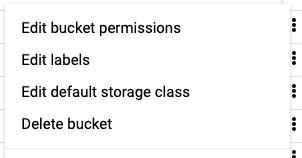
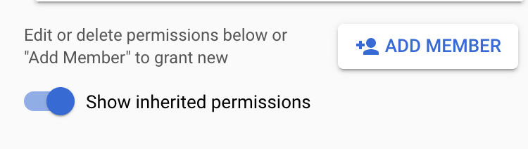
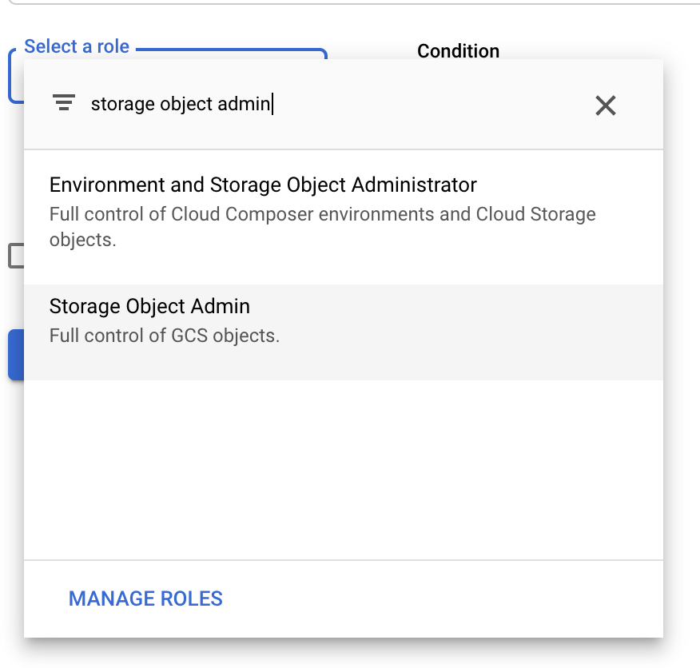
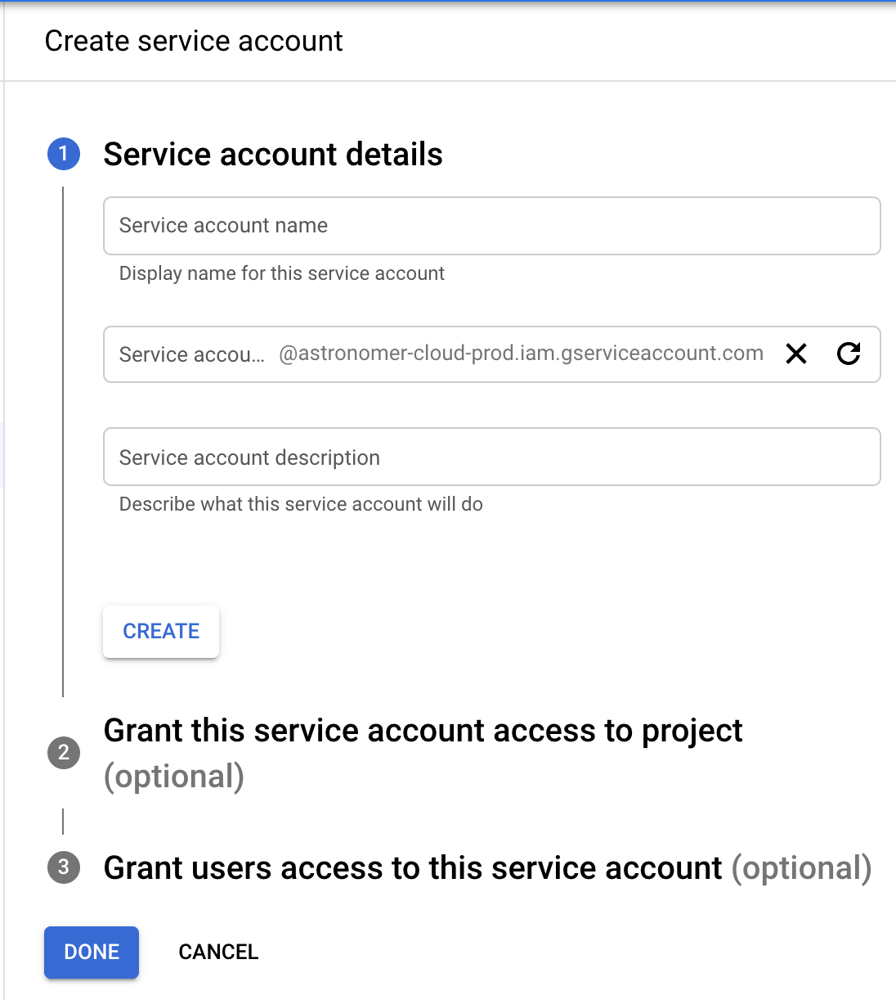
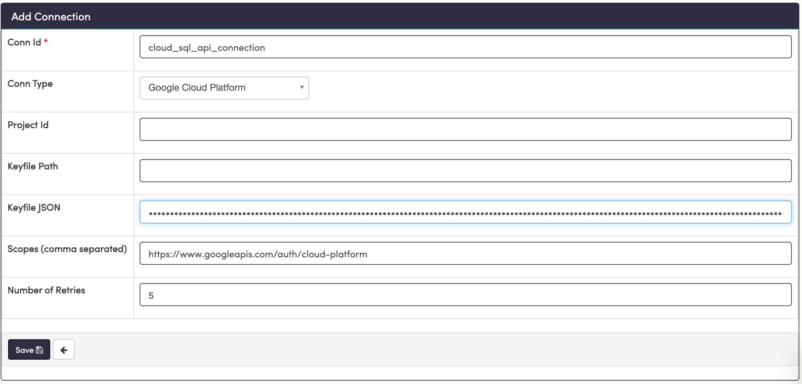
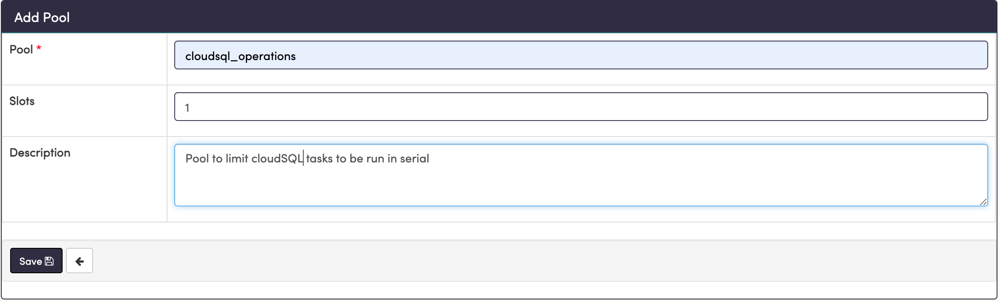
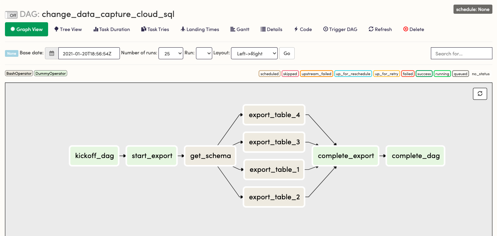
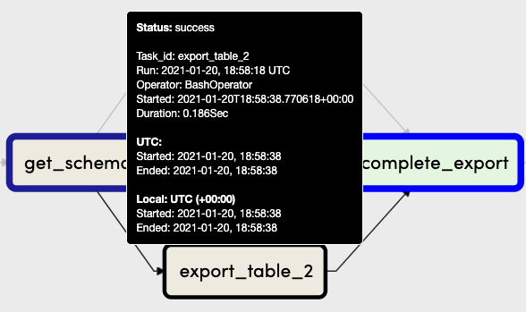
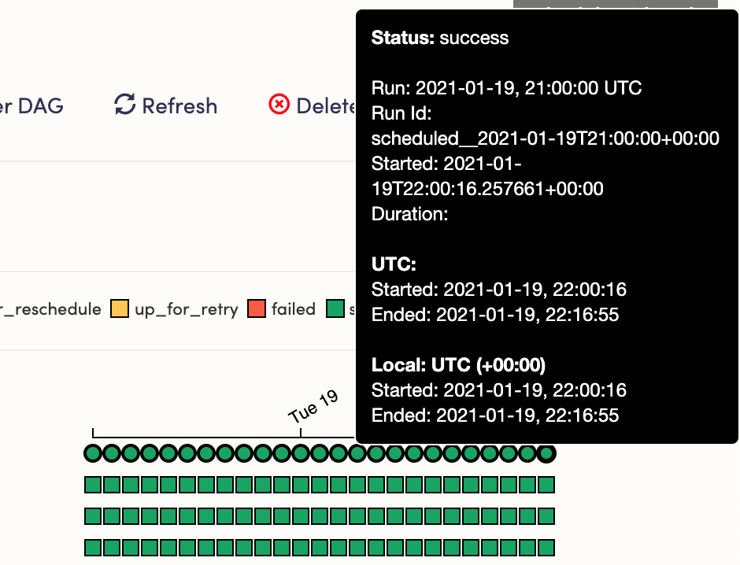
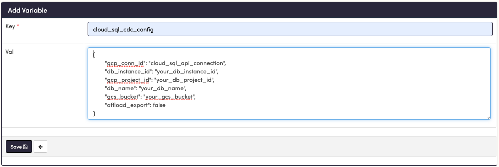

> **Note:** All of the code in this post is available in [this Github repository](https://github.com/astronomer/cdc-cloudsql-airflow-demo) and can be run locally using the Astronomer CLI.

Extracting changes in data from a database is often needed to keep that data current in separate environments. It's especially important in contexts such as populating a search engine, training machine learning models, or building analytic reports from a warehouse. This post walks you through a scheduled method for extracting data changes using Apache Airflow in a way that is near-real time, flexible, and highly available.

## Overview

The scheduled approach outlined in this post - enabling change data to be updated in near-real time - has the added benefit of built-in data partitioning formats directly from the process. In a distributed data network, using Airflow as the scheduled approach pushes it into the realm of Consistency and High Availability (CA) in the CAP theorem. That is, you can base SLAs on this approach.

Those capturing data in the format of time-series or events will benefit the most with this approach, but it can be used for any data by adding soft deletes to your transactions and defining the time scope to which changes must be recorded. Eventual consistency is achieved in a robust manner by creating an idempotent approach to how the data is extracted and moved. 

In this series, we'll outline all steps in the process from end to end, from setup to extract. Specifically, this entails:

- Setting up security and IAM in GCP
- Calling the CloudSQL Export API
- Setting up Airflow and connecting it to GCP
- Building a DAG in Airflow
- Configuring Watermarking for data extract intervals
- Writing an operator in Airflow to extract the data
- Integrating the operator into the DAG
- Scheduling and coordinating the extract
- Deployment to Production on Astronomer Cloud

In a later post, I will show you how to transform or clean the data then add it to a warehouse as part of the same workflow. We will be using the [Astronomer Platform](https://www.astronomer.io/), as it is the easiest way to get your Apache Airflow instance up and running.

## How it Works

The base method for extract uses the [CloudSQL Export API](https://cloud.google.com/sql/docs/postgres/import-export/exporting#rest-v1beta4). This runs an operation with a SQL query, sending the results to a Google Cloud Storage (GCS) bucket that you specify. You could just as easily extract directly from your database if your system and workload allows for such. 

Using the extract API provides a robust and easily configurable security layer controlled by a service account, such that no system outside of CloudSQL is touching your production database. It also provides a "serverless offload" option if you need to guarantee zero load on your database from the extract.

The caveat for the export API in general is that you [cannot run concurrent CloudSQL Operations](https://cloud.google.com/sql/docs/postgres/import-export/exporting#too-long-rca), so you will need to run each query in serial, a scenario perfectly handled by using pools in Airflow.

In general, the API call looks like this:

```bash
POST https://www.googleapis.com/sql/v1beta4/projects/<project-id>/instances/<instance-id>/export
{
 "exportContext":
   {
      "fileType": "CSV",
      "uri": "gs://bucket_name/path_to_csv_file",
      "databases": ["database_name"],
      "offload": false
      "csvExportOptions":
       {
           "selectQuery":"SELECT Query - no CTE allowed - subquery okay"
       }
   }
}
```

This will query `database_name` (only one allowed at a time) using the enclosed `selectQuery` and format the results to a CSV at the GCS bucket and keypath set in `uri`. 

  > **Note:** This CSV will not have headers, so you will need to run a second operation to obtain the table schema, which will be described below

## Step 1: Set Up Airflow

> *If you already have the Astronomer CLI installed you can skip to Step 2*

The [Astronomer CLI](https://github.com/astronomer/astro-cli) is the easiest way to run Apache Airflow on your machine. From the CLI, you can establish a local testing environment regardless of where you'll be deploying to from there.

### Prerequisites

The Astronomer CLI installation process requires [Docker](https://www.docker.com/) (v18.09 or higher).

### Install with cURL

To install the latest version of the Astronomer CLI, run:

```bash
curl -sSL https://install.astronomer.io | sudo bash
```

  > *For alternative installation methods, read our [install guide](https://www.astronomer.io/docs/cloud/stable/develop/cli-quickstart).*

## Step 2: GCP Access - CloudSQL to GCS

To allow for access between Airflow, CloudSQL, and your GCS bucket, you'll need to both give your CloudSQL instance the necessary permissions to export to the GCS bucket and give Airflow access to make API calls to both services.

Starting with CloudSQL and GCS:

1. Make note of the production project ID and your database instance ID for your GCP project and CloudSQL instance, respectively. 
2. Using the [gcloud CLI](https://cloud.google.com/sdk/docs/install), obtain the necessary CloudSQL service account to be added to your bucket by running the following commands:

    ```bash
    $ gcloud config set project your-prod-project-id
    Updated property [core/project]

    $ gcloud sql instances describe your-database-instance-id
    ...stuff
    serviceAccountEmailAddress: <stuff>@gcp-sa-cloud-sql.iam.gserviceaccount.com
    ```

3. Open your GCP Storage Browser and navigate to your destination GCS bucket, or create one, and `Edit Bucket Permissions`.

    <!-- markdownlint-disable MD033 -->
    <span style="display:block;text-align:center;">
      
    </span>

4. Take the value for `serviceAccountEmailAddress` and add it as `Storage Object Admin` to your  GCS bucket.

    <!-- markdownlint-disable MD033 -->
    <span style="display:block;text-align:center;">
      
      
    </span><br clear="all">

## Step 3: GCP Access - CloudSQL Export API Service Account

Next, you'll need to facilitate CloudSQL API access for your Airflow Instance by creating a service account to be used in Airflow. To do so: 

1. Create a service account in your source GCP project and grant it the role of `Cloud SQL Admin`.

    <!-- markdownlint-disable MD033 -->
    <span style="display:block;text-align:center;">
      
      
    </span><br clear="all">

2. In the menu for the service account, select `Actions -> Create Key`. This will provide you the necessary keyfile JSON for your airflow instance. Grab the JSON (save it somewhere important and safe), and bring it to your Airflow Deployment. 

    > **Note:** If you are running airflow on astronomer Cloud and your GCP is running in VPC, you will need to give access to the following IP addresses:

    > 
    - `35.245.140.149`
    - `35.245.44.221`
    - `34.86.203.139`
    - `35.199.31.94`

    > *For more information on VPC access, [you can visit the Astronomer page on VPC Access here.](https://www.astronomer.io/docs/cloud/stable/manage-astronomer/vpc-access)*

## Step 4: Initialize Your Airflow Project

If you are already familiar with creating a new Airflow project, you can skip to the next section. 

1. To create a new project with the Astronomer CLI, in your terminal, simply create a new directory for your project and then use the Astronomer CLI to scaffold out your project.

    ```bash
    mkdir <directory-name> && cd <directory-name>
    ```

    ```bash
    astro dev init
    ```

    This will generate the following files in that directory:

    ```bash
    .
    ├── dags # Where your DAGs go
    │   ├── example-dag.py # An example dag that comes with the initialized project
    ├── Dockerfile # For Astronomer's Docker image and runtime overrides
    ├── include # For any other files you'd like to include
    ├── plugins # For any custom or community Airflow plugins
    ├── airflow_settings.yaml #For your Airflow Connections, Variables and Pools (local only)
    ├──packages.txt # For OS-level packages
    └── requirements.txt # For any Python packages
    ```

2. For version consistency at the time of writing, let's manually set the image our `Dockerfile` uses. Open the `Dockerfile` and change the contents to read:

    ```docker
    FROM quay.io/astronomer/ap-airflow:1.10.14-1-buster-onbuild
    ```

3. Next, In the `dags` directory create a new python file with appropriate naming of your choice, such as `change_data_capture.py`. Now (with docker running) start up Airflow from the CLI by running:

    ```bash
    astro dev start
    ```

4. Once the containers are built and the webserver starts, you can access the UI at  `[localhost:8080](http://localhost:8080)` and login with `admin:admin`.

## Step 5: Create a Connection to GCP

Now we need to add the service account JSON from GCP to Airflow to create a connection. To do so: 

1. In the Airflow UI, open the `Admin -> Connections` tab and create a new connection with the `Connection Type` of `Google Cloud Platform`. 
2. In the `Scopes` field, add the the following scope:

    ```bash
    https://www.googleapis.com/auth/cloud-platform
    ```

3. In the `Keyfile JSON` field, paste the Keyfile JSON you copied from Step 2. 

    

Keep the `Conn Id` handy. You will use that in your Airflow DAG to reference this connection. When you're ready, save this connection to finalize your access management. 

## Step 6: Configure Pooling

The next configuration you'll set is a pool. From the [Airflow docs](https://airflow.apache.org/docs/apache-airflow/stable/concepts.html?highlight=pool#pools), "Airflow pools can be used to limit the execution parallelism on arbitrary sets of tasks". Therefore, using them will enable you to create other parallel jobs while still guaranteeing that your export API tasks will run in serial. 

To create this pool, simply go to the top bar to `Admin -> Pools`, then hit the `+` sign to add a new record. Choose a pool name and description to your liking, but choose the number of slots as `1`.



Now all we have to do is add the name of the pool to our task definitions, which we'll build in the next step.

## Step 7: Build Your Pipeline in Airflow

  > *If you are familiar with the foundational concepts of Airflow, you can skip to the next subsection for the `DAG Workflow`.*

Airflow pipeline design rests on the foundational structures of `hooks` and `operators`. Hooks facilitate connections and repository-type actions, whereas operators use hooks in combination with domain-specific logic and error handling in order to accomplish a task. Airflow comes pre-packaged with many of these hooks and operators, all built to work with services we use regularly. For example, `BashOperator` allows you to run a bash command directly in-line. A simple task using a this operator might look like:

```python
hello_world = BashOperator(
    task_id='get_schema',
    bash_command='echo "hello, world"'
)
```

Getting more advanced, a `PostgresOperator` executes SQL code in a specific PostgreSQL database using a `PostgresHook` to establish the connection, while templating your command and implementing a `run` function to execute it. A task involving this operator might look like:

```python
insert_row = PostgresOperator(
    task_id='insert_row',
	  postgres_conn_id='default_conn_id',
    sql='INSERT INTO table_1 VALUES (%s, %s, %s)',
    parameters=(1, 'a very important string', datetime.now())
)
```

### DAG Workflow

Because of the great flexibility of Airflow, you can also use hooks to create custom operators, just as well as you can create custom hooks. In this post, we will create a custom `CloudSqlCsvExportOperator` using an existing `CloudSqlHook`, a hook designed to facilitate several types of operations on CloudSQL instances. First, we will use the `BashOperator` to simulate our workflow and check dependencies.

In the DAG workflow, it is extremely advantageous to also create generic tasks that serve only as checkpoints in the workflow. This facilitates best practices like idempotency, task grouping, workflow readability, and traceability. This is accomplished by a stand-in operator called the `DummyOperator`. Outlining your DAG using `DummyOperator` tasks is an excellent way to visualize task dependencies and control the flow of tasks. As a next step, we can use a `BashOperator` to add a "Hello, world" level of functionality and test the flow of the DAG. To do this:

1. Open your DAG file `change_data_capture.py` in your favorite text editor. First we'll import a few modules and then set the basic workflow structure in order to visualize and test the flow.

    ```python
    #change_data_capture.py
    from airflow import DAG
    from airflow.operators.dummy_operator import DummyOperator
    from airflow.operators.bash_operator import BashOperator
    from datetime import datetime, timedelta

    default_args = {
        'owner': 'airflow',
        'depends_on_past': False,
        'email': ['your-email@email.com'],
        'email_on_failure': True,
        'email_on_retry': False,
        'retries': 4,
        'retry_delay': timedelta(minutes=2),
    }

    # Name DAG with the first argument
    with DAG('change_data_capture_cloud_sql',
              max_active_runs=1, # Ensure one at a time
              schedule_interval=None, # Start with None for manual trigger, change to '@hourly'
              catchup=False, # If True, it will start historically to start_date
              start_date=datetime(2020, 12, 29, 0, 0, 0),
              default_args=default_args) as dag:
            
        # Fictitious tables you want to extract from 
        # You may load from a Variable or JSON/YAML files
        tables = ['table_1', 'table_2', 'table_3', 'table_4']
        
        kickoff_dag = DummyOperator(task_id='kickoff_dag')
            
        start_export = DummyOperator(
            task_id='start_export',
            trigger_rule='one_success'
        )
        
        complete_export = DummyOperator(
            task_id='complete_export',
            trigger_rule='all_success'
        )
        
        get_schema = BashOperator(
            task_id='get_schema',
            bash_command='echo "getting schema"',
            trigger_rule='one_success',
            pool = 'cloudsql_operations'
        )
         
        complete_dag = DummyOperator(task_id='complete_dag')

        for table in tables:

            export_table = BashOperator(
                task_id=f'export_{table}',
                bash_command=f'echo "exporting {table}"',
                trigger_rule='one_success',
                pool = 'cloudsql_operations'
            )

            get_schema >> export_table >> complete_export  
            
        kickoff_dag >> start_export >> get_schema
        complete_export >> complete_dag
    ```

    This workflow is simply creating a set of dependent tasks and instructing them to run in a pool with a single slot, thereby forcing them to run one at a time. Save the file. The bash commands will appear in the tasks logs when run. 

2. Open the Airflow UI, click on your DAG in the list, then navigate to the `Graph View` . It should look something this:

    

3. Switch `Off` to `On`  and choose `Trigger DAG` to see this workflow run, then verify each export task runs one at a time by looking at the `started` time for each. 

    <!-- markdownlint-disable MD033 -->
    <span style="display:block;text-align:center;"></span>

    If it doesn't run, check that your start date is set to the past, not the future. If your DAG is not in the list and doesn't appear after a minute, you may have a syntax error in your python file.

    Once the DAG is running as expected, we can turn the DAG back to `Off` and start building in functionality.

## Step 8: Build the CloudSqlCsvExportOperator

In the `plugins` directory, create a new file with the path:

```bash
├── plugins
│   ├── gcp_custom
│   │   ├── operators
│   │   │   └── gcp_cloudsql_export_operator.py
```

The path is arbitrary once you add this in your `plugins` directory, but this is a recommended format for modularization. 

1. Copy-paste the following code into your python file:

    ```python
    import re
    from airflow.models import BaseOperator
    from airflow.utils.decorators import apply_defaults
    from airflow.exceptions import AirflowException
    from airflow.contrib.hooks.gcp_sql_hook import CloudSqlHook

    class CloudSqlCsvExportOperator(BaseOperator):
        """
        Call CloudSQL Export API and direct output to a GCS Bucket. Export 
        can be scoped by a SELECT export_query. Subqueries are acceptable but
        CTE-type queries will be rejected. Optionally, for a big load, one can 
        offload to a serverless format. Additional pricing and time will be
        be incurred for the tradeoff of complete removal of database load.

        The API call is asynchronous; however, the hook has a 
        _wait_for_operation_to_complete function built in. We can assume if it 
        completes without error, the task has succeeded.

        For more information see the Export API 
        https://cloud.google.com/sql/docs/mysql/import-export/exporting
        :param gcp_conn_id: The connection ID used to connect to Google Cloud Platform.
        :type gcp_conn_id: str
        :param gcs_bucket: The name of the GCS bucket.
        :type gcs_bucket: str
        :param gcs_keypath: The keypath in the GCS Bucket to the destination object.
        :type gcs_keypath: str
        :param project_id: The GCP project ID
        :type project_id: str
        :param database_instance: The CloudSQL Instance ID
        :type database_instance: str
        :param database_name: The name in CloudSQL of the database
        :type database_name: str
        :param export_sql: SQL SELECT statement for export selection
    		:type export_sql: str
        :param offload: True for serverless export, False otherwise
    		:type offload: bool
        """

        template_fields = ('export_sql','gcs_bucket','gcs_key','project_id')

        template_ext = ('.sql', )

        ui_color = '#9f8fdb'

        @apply_defaults
        def __init__(self, gcs_bucket, gcs_keypath, database_instance,
                    database_name, export_sql, project_id,
                    gcp_conn_id='gcs_default', offload=False, 
                    *args, **kwargs):
            
            super().__init__(*args, **kwargs)
            
            self.gcp_conn_id = gcp_conn_id
            self.gcs_bucket = gcs_bucket
            self.gcs_keypath = gcs_keypath
            self.database_instance = database_instance
            self.database_name = database_name
            self.export_sql = export_sql
            self.project_id = project_id
            self.offload = offload
            self.file_type = 'CSV'

        def execute(self, context):
            try:
                assert self.file_type == 'CSV'
            except AssertionError:
                raise AirflowException(f'Extract file_type must be CSV')

            hook = CloudSqlHook(api_version='v1beta4', gcp_conn_id=self.gcp_conn_id)

            newlines = re.compile("[\r\n]+(\s+|)")
            
    				# The query must have newlines removed
            self.export_sql = re.sub(newlines, ' ', self.export_sql)\
                                .strip()

            body = {
                "exportContext":
                {
                  "fileType": f"{self.file_type}",
                  "uri": f"gs://{self.gcs_bucket}/{self.gcs_keypath}",
                  "databases": [f"{self.database_name}"], 
                  "offload": self.offload, # True for serverless (takes longer but offloads - use true for historical extract)
                  "csvExportOptions":
                   {
                       "selectQuery": f"{self.export_sql}"
                   }
                }
            }
            hook.export_instance(instance=self.database_instance,
                                 body=body, 
                                 project_id=self.project_id)
    ```

2. Save your new custom operator. Note how some the parameters in the API call indicate this is configurable. You can now use the same code with a different values for `gcs_bucket`, `gcs_keypath`, `export_query`, `project_id`, and `gcp_connection`, making this operator reusable for any variation of this workflow. You can even modify it to fulfill a different component of the same workflow. 

## Step 9: Implement Watermarking and Execution Dates

In data synchronization, a [watermark](https://en.wikipedia.org/wiki/Watermark_(data_synchronization)) can be defined as:

> An object of a predefined format which provides a point of reference for two systems/datasets attempting to establish delta/incremental synchronization; any object in the queried data source which was created, modified/changed, and/or deleted after the watermark value was established will be qualified as "above watermark" and could/should be returned to a delta-querying partner.

Change data in the concept of time-series or events can be looked at by the associated events and their `event_timestamp`. Therefore, we can use event timestamps in increments as high and low watermarks to establish delta synchronizations.

 > **Note:** Transactional or non-time series change data can be included here by adding soft deletes (`deleted_at` fields) then watermarking by `deleted_at` and `updated_at` timestamps as per the granularity of timing necessary.

Airflow has out of the box event timestamps to help with this. When used in combination with the aforementioned source `event_timestamps`, they become extremely helpful in watermarking and partitioning the extracted data. In other words: For all of our task runs, Airflow hands us a value that we can dynamically assign watermarks with and use in our queries. In particular, the `execution_date` is discussed and used here. 

The `execution_date` is a `pendulum.Pendulum` object available via a jinja templated macro as `{{ execution_date }}`. It's defined as a standard time relative to that which the DAG was scheduled to run at, independent of when it started or was re-run.

All Airflow macros, including `execution_date`, can be used to template our SQL command. With that, we can begin by letting the DAG `execution_date` be the `high_watermark` and subtract an hour for the `low_watermark`.

Essentially, a basic version of the templated SQL query might look something like this:

```sql

SELECT * FROM some_schema.table_1
WHERE event_timestamp AT TIME ZONE 'UTC' >= '{{ low_watermark }}' AT TIME ZONE 'UTC'
AND event_timestamp AT TIME ZONE 'UTC' < '{{ execution_date }}'
```

If you have done this before, you might be thinking we will need to adjust for how the `execution_date` is calculated relative to the schedule interval. We will do that in `Step 12`. First, we need to template our SQL. To do so:

1. Make some SQL files formatted as `table_name.sql` , as well as a `get_schema.sql`file, in the following path:

    ```bash
    ├── include
    │   └── templates
    │       ├── cloud_sql_cdc
    │       │   └── export_csv
    │       │       ├── table_1.sql
    │       │       ├── table_2.sql
    │       │       ├── table_3.sql
    │       │       ├── table_4.sql
    │       │       ├── get_schema.sql
    ```

2. Add the following to each `table_{num}.sql` file you created, changing the table name to your own, accordingly:
    
    ```sql
    
    SELECT * FROM some_schema.table_1
    WHERE event_timestamp AT TIME ZONE 'UTC' >= '{{ low_watermark }}' AT TIME ZONE 'UTC'
    AND event_timestamp AT TIME ZONE 'UTC' < '{{ execution_date }}'
    ```

3. Combine all tables into a single schema CSV by adding the following to the  `get_schema.sql` (and changing `some_schema`):
    
    ```sql
    
    SELECT 
      table_name,
      column_name,
      data_type,
      ordinal_position
    FROM information_schema.columns 
    WHERE table_schema = 'some_schema' 
    AND table_name in (
      
        
        '{{ name }}'
        
        ,'{{ name }}'
        
      
    )
    ```

    The `ordinal_position` field is how you will be able to assign column names to header fields in the CSV file. The `params.tables` assignment will come in the DAG file. With that in place, we're now able to include functionality in our Airflow tasks.

    > **Note:** It's also possible to join tables here (in the need for immediate denormalization) by running a `UNION SELECT` on this to the join query with an assigned table name.

## Step 10: Build Operators into the Tasks

We now need to import our operator, import the `os` package, and tell Airflow which directory it needs to look at for templating. To do so:

1. In `change_data_capture.py`, add the following to the imports at the top of the file:

    ```python
    import os
    from plugins.gcp_custom.operators.gcp_cloudsql_export_operator import (
        CloudSqlCsvExportOperator
    )

    ROOT_DIR = os.getenv('AIRFLOW_HOME')
    TEMPLATES_DIR = f'{ROOT_DIR}/include/template'
    gcp_conn_id = 'cloud_sql_api_connection'
    db_instance_id = 'your_db_instance_id'
    gcp_project_id = 'your_db_project_id'
    db_name = 'your_db_name'
    gcs_bucket = 'your_gcs_bucket'
    gcs_root = f'{gcs_bucket}/cloudsql_export'
    offload_export = False # True for serverless, more expensive and longer running, but offloads completely
    ```

    > **Note:** All of these strings will be added later as a JSON-serialized airflow variable, which can be configured through the Airflow UI.

2. Add the `template_searchpath` parameter to your `DAG` definition like so:

    ```python
    with DAG('change_data_capture_cloud_sql',
              max_active_runs=1, # Ensure one at a time
              schedule_interval=None, # Start with None for manual trigger, change to '@hourly'
              catchup=False, # If True, it will start historically to start_date
              template_searchpath=TEMPLATES_DIR, # Add this**
              start_date=datetime(2020, 12, 29, 0, 0, 0),
              default_args=default_args) as dag:
    ```

    With that, we can simply pass the `.sql` file path to our operators instead of the entire query.  

3. Update the `get_schema` task to show the following:

    ```python
    gcs_schema_keypath = (
        f"{gcs_root}/"
        "schemas/"
        "{{execution_date.year}}/"
        "{{execution_date.month}}/"
        "{{execution_date.day}}/"
        f"{db_name}/"
        f"{db_name}_schema_"
        "{{ts_nodash}}.csv"
    )

    get_schema = CloudSqlCsvExportOperator(
        task_id = 'get_schema',
        gcp_conn_id = gcp_conn_id,
        database_instance = db_instance_id,
        project_id = gcp_project_id,
        database_name = db_name,
        gcs_bucket = gcs_bucket,
        gcs_keypath = gcs_schema_keypath,
        offload = offload_export,
        params = {
            "tables": tables
        },
        export_sql = 'cloud_sql_cdc/export_csv/get_schema.sql',
        pool = 'cloudsql_operations',
        trigger_rule = 'one_success'
    )
    ```

    > **Note:** Notice here how we also used `execution_date` to construct the GCS keypath. You'll see another macro there as well `{{ts_nodash}}`, which is the equivalent of `execution_date.isoformat()` with special characters and spaces removed, useful for time-based object keys.

4. Change the  `export_table` tasks to show the following:

    ```python
    for table in tables:

        gcs_raw_keypath = (
            f"{gcs_root}/"
            "raw/"
            f"{table}/"
            "{{execution_date.year}}/"
            "{{execution_date.month}}/"
            "{{execution_date.day}}/"
            f"{table}_"
            "{{ts_nodash}}.csv"
        )

        export_table = CloudSqlCsvExportOperator(
            task_id = f'export_{table}',
            gcp_conn_id = gcp_conn_id,
            database_instance = db_instance_id,
            project_id = gcp_project_id,
            database_name = db_name,
            gcs_bucket = gcs_bucket,
            gcs_keypath = gcs_raw_keypath,
            offload = offload_export,
            export_sql = f'cloud_sql_cdc/export_csv/{table}.sql',
            pool = 'cloudsql_operations',
            trigger_rule = 'one_success'
        )

        get_schema >> export_table >> complete_export
    ```

    As mentioned above, all source code here is [available for download on github](https://github.com/astronomer/cdc-cloudsql-airflow-demo). Now it's time to check that everything works by using the render tool.

## Step 11: Render Template Check

In your terminal, you can use the Astro CLI to render all templating using the following command:

```bash
astro dev run render <dag-id> <task-id> 'execution_date'
```

Based on this example, we can run:

```bash
astro dev run render change_data_capture_cloud_sql export_table_1 '2021-01-14 13:00:00'
```

Afterwards, we should see our templating print out:

```bash
# ----------------------------------------------------------
# property: export_sql
# ----------------------------------------------------------
SELECT * FROM some_schema.table_1
WHERE event_timestamp AT TIME ZONE 'UTC' >= '2021-01-14T12:00:00+00:00' AT TIME ZONE 'UTC'
AND event_timestamp AT TIME ZONE 'UTC' < '2021-01-14T13:00:00+00:00'

# ----------------------------------------------------------
# property: gcs_bucket
# ----------------------------------------------------------
your_gcs_bucket

# ----------------------------------------------------------
# property: gcs_keypath
# ----------------------------------------------------------
your_gcs_bucket/cloudsql_export/raw/table_1/2021/1/14/table_1_20210114T130000.csv
```

We see our SQL Query, our bucket, and the full `gcs_keypath` fully rendered based on our `execution_date` chosen. Try the same for `get_schema`. If this templating renders correctly, then the DAG is now ready to be run. 

## Step 12: Implement Scheduling and Timing

Scheduling and timing in Airflow possesses a few relative time-based parameters that need to be defined and thought through together to fully grasp. In `Step 9`, we introduced one of them: the `execution_date`. Now we must add in the interval those are scheduled to execute in, called the `schedule_interval`. It's important to understand how they relate together with the time it is on the clock.

When a DAG starts at its scheduled time, it begins at the end of the interval chosen. So for `schedule_interval='@hourly'` and an `execution_date` of `2021-01-14T13:00:00+00:00`, the DAG would actually be starting at `2021-01-14T14:00:00+00:00`. 

For a visual example, the image below shows the task tree of a particular DAG in which this concept can be observed. The first line, `Run: 2021-01-19, 21:00:00 UTC`, shows the `execution_date` from an hourly scheduled DAG, set as `schedule_interval='@hourly'`. Notice `Started: 2021-01-19T22:00:16xxx` is an hour (a single interval) after the schedule date. That is, it starts one `schedule_interval` later than the `execution_date`.

<!-- markdownlint-disable MD033 -->
<span style="display:block;text-align:center;">
   
</span>

The `start_date` you set in the DAG definition also follows this logic. If you choose:

```python
start_date = DateTime(2021, 1, 14, 13, 0, 0),
schedule_interval = '@hourly',
catchup = False
```

If the current calendar date was before the `start_date`, you would see the first run begin on the clock at `2021-01-14T14:00:00+00:00`, but the `execution_date` will be set as `2021-01-13T13:00:00+00:00`. If the current calendar date was after the `start_date`, you would see the first run start at the beginning of the most recent hour and the execution date is one hour less. If a task fails and you re-run it, the `execution_date` doesn't change.

> **Note:** At the time of writing, the relative measurement of the `execution_date`, the `schedule_interval`, and the calendar date is currently up for discussion in the Airflow community and you are encouraged to share your thoughts. Information about joining the mailing list can be found [here](https://airflow.apache.org/docs/apache-airflow/stable/project.html#:~:text=Developer's%20mailing%20list%3A%20dev%2Dsubscribe,subscribe%40airflow.apache.org). 

This concept as a whole is powerful because you can use that hard interval to further refine your watermarks and obtain data created **right up until the DAG starts running**. With that, you now have near-real time change data capture capabilities. Furthermore, the consistency and high-availability allows for SLAs to be set on this data (and in Airflow), something extremely difficult in a streaming solution.

To adjust your watermarks for near-real-time:

1. If your interval is always going to be the same, in `table_1.sql`, you could hard-code your `low_watermark` adjustment to be:
    
    ```sql
    
    
    SELECT * FROM some_schema.table_1
    WHERE event_timestamp AT TIME ZONE 'UTC' >= '{{ low_watermark }}' AT TIME ZONE 'UTC'
    AND event_timestamp AT TIME ZONE 'UTC' < '{{ high_watermark }}'
    ```

    which you would see renders to

    ```bash
    # ----------------------------------------------------------
    # property: export_sql
    # ----------------------------------------------------------
    SELECT * FROM some_schema.table_1
    WHERE event_timestamp AT TIME ZONE 'UTC' >= '2021-01-14T13:00:00+00:00' AT TIME ZONE 'UTC'
    AND event_timestamp AT TIME ZONE 'UTC' < '2021-01-14T14:00:00+00:00'
    ```

    getting you changes in the previous hour. 

2. Make the following changes to the rest of your `.sql` files.

3. In your DAG definition, adjust to your interval of choice. Suppose you want to make this run every 30 minutes. The `schedule_interval` parameter also accepts a crontab value. So in the DAG definition, that would be `schedule_interval = '* /30 * * * *'`, and your templated SQL would appear:

    ```sql
    
    
    SELECT * FROM some_schema.table_1
    WHERE event_timestamp AT TIME ZONE 'UTC' >= '{{ low_watermark }}' AT TIME ZONE 'UTC'
    AND event_timestamp AT TIME ZONE 'UTC' < '{{ high_watermark }}'
    ```

    In a future post, I will show you how to set these dynamically through the UI as to allow interval changes and full scans when needed.

### Step 13: Intro to Dynamic Configs with Airflow Variables

Airflow Variables are simple key-value fields that can be added through the Airflow UI and parsed in your DAG. They are useful for adding dynamic configuration values to your DAG file. With this, it's important to note that for every loop of the scheduler, a query is made to the database for each variable. To make this efficient, it's recommended to add a single JSON-serialized variable, then access individual values as items in a dictionary. To convert our hard-coded strings:

1. Navigate to the DAG python file `change_data_capture.py` and locate the string configs.
    
    ```python
    gcp_conn_id = 'cloud_sql_api_connection'
    db_instance_id = 'your_db_instance_id'
    gcp_project_id = 'your_db_project_id'
    db_name = 'your_db_name'
    gcs_bucket = 'your_gcs_bucket'
    offload_export = False
    ```

2. Converting them to JSON
    
    ```json
    {
      "gcp_conn_id": "cloud_sql_api_connection",
      "db_instance_id": "your_db_instance_id",
      "gcp_project_id": "your_db_project_id",
      "db_name": "your_db_name",
      "gcs_bucket": "your_gcs_bucket",
      "offload_export": false
    }
    ```

3. Open the Airflow UI and navigate `Admin -> Variables`, add the JSON as the Val.

    

4. Back to your DAG python file, change the strings config to access the Variable:
    
    ```python
    from airflow.models import Variable

    ROOT_DIR = os.getenv('AIRFLOW_HOME')
    TEMPLATES_DIR = f'{ROOT_DIR}/include/templates'
    dag_configs = Variable.get('cloud_sql_cdc_config',
                                deserialize_json=True)
    gcp_conn_id = dag_configs.get('gcp_conn_id')
    db_instance_id = dag_configs.get('db_instance_id')
    gcp_project_id = dag_configs.get('gcp_project_id')
    db_name = dag_configs.get('db_name')
    gcs_bucket = dag_configs.get('gcs_bucket')
    offload_export = dag_configs.get('offload_export')
    gcs_root = f'{gcs_bucket}/cloudsql_export'
    ```

    The final DAG file would look like:
    
    ```python
    #change_data_capture.py
    import os
    from airflow import DAG
    from airflow.operators.dummy_operator import DummyOperator
    from datetime import datetime, timedelta
    from airflow.models import Variable
    from plugins.gcp_custom.operators.gcp_cloudsql_export_operator import (
        CloudSqlCsvExportOperator
    )

    ROOT_DIR = os.getenv('AIRFLOW_HOME')
    TEMPLATES_DIR = f'{ROOT_DIR}/include/templates'
    dag_configs = Variable.get('cloud_sql_cdc_config',
                                deserialize_json=True)
    gcp_conn_id = dag_configs.get('gcp_conn_id')
    db_instance_id = dag_configs.get('db_instance_id')
    gcp_project_id = dag_configs.get('gcp_project_id')
    db_name = dag_configs.get('db_name')
    gcs_bucket = dag_configs.get('gcs_bucket')
    offload_export = dag_configs.get('offload_export')
    gcs_root = f'{gcs_bucket}/cloudsql_export'

    default_args = {
        'owner': 'airflow',
        'depends_on_past': False,
        'email': ['your_email@example.com'],
        'email_on_failure': True,
        'email_on_retry': False,
        'retries': 4,
        'retry_delay': timedelta(minutes=2),
    }

    # Name DAG with the first argument
    with DAG('change_data_capture_cloud_sql',
              max_active_runs=1, # Ensure one at a time
              schedule_interval='@hourly', # Can use crontab here
              catchup=False, # If True, it will start historically to start_date
              template_searchpath=TEMPLATES_DIR,
              start_date=datetime(2021, 1, 14, 13, 0, 0),
              default_args=default_args) as dag:
            
        # Fictitious tables you want to extract from 
        # You may load from a Variable or JSON/YAML template files
        tables = ['table_1', 'table_2', 'table_3', 'table_4']
        
        kickoff_dag = DummyOperator(task_id='kickoff_dag')
            
        start_export = DummyOperator(
            task_id='start_export',
            trigger_rule='one_success'
        )
        
        complete_export = DummyOperator(
            task_id='complete_export',
            trigger_rule='all_success'
        )
        
        gcs_schema_keypath = (
            f"{gcs_root}/"
            "schemas/"
            "{{execution_date.year}}/"
            "{{execution_date.month}}/"
            "{{execution_date.day}}/"
            f"{db_name}/"
            f"{db_name}_schema_"
            "{{ts_nodash}}.csv"
        )

        get_schema = CloudSqlCsvExportOperator(
            task_id = 'get_schema',
            gcp_conn_id = gcp_conn_id,
            database_instance = db_instance_id,
            project_id = gcp_project_id,
            database_name = db_name,
            gcs_bucket = gcs_bucket,
            gcs_key = gcs_schema_keypath,
            offload = offload_export,
            params = {
                "tables": tables
            },
            export_sql = 'cloud_sql_cdc/export_csv/get_schema.sql',
            pool = 'cloudsql_operations',
            trigger_rule='one_success'
        )
         
        complete_dag = DummyOperator(task_id='complete_dag')

        for table in tables:
            
            gcs_raw_keypath = (
                f"{gcs_root}/"
                "raw/"
                f"{table}/"
                "{{execution_date.year}}/"
                "{{execution_date.month}}/"
                "{{execution_date.day}}/"
                f"{table}_"
                "{{ts_nodash}}.csv"
            )

            export_table = CloudSqlCsvExportOperator(
                task_id = f'export_{table}',
                gcp_conn_id = gcp_conn_id,
                database_instance = db_instance_id,
                project_id = gcp_project_id,
                database_name = db_name,
                gcs_bucket = gcs_bucket,
                gcs_key = gcs_raw_keypath,
                offload = offload_export,
                export_sql = f'cloud_sql_cdc/export_csv/{table}.sql',
                pool = 'cloudsql_operations',
                trigger_rule='one_success'
            )
            get_schema >> export_table >> complete_export  
            
        kickoff_dag >> start_export >> get_schema
        complete_export >> complete_dag
    ```

    Now, we have a DAG that extracts change data from our tables at an hourly interval as soon as that interval completes. We can now deploy this to production.

## Step 14: Deploy to Production

Once you commit your changes to git and merge to branches as needed, you are ready to deploy this to production.

### Create an Airflow Deployment

To create an Airflow Deployment on Astronomer, start a free trial of [Astronomer Cloud](https://astronomer.io/get-astronomer), open your Workspace, and click **New Deployment**.


## Configure Your Airflow Deployment

Use the **New Deployment** menu to configure the following:

- **Name**
- **Description** (Optional)
- **Airflow Version**: We recommend using the latest version.
- **Executor**: We recommend starting with Local.


When you've finished, click **Create Deployment**.

Once you've initialized your Deployment, give it a few moments to spin up. Afterwards, you'll have access to your Deployment dashboard:


From this dashboard, you can:

- Modify your Resources
- Initialize the Airflow upgrade process
- Configure **Email Alerts**
- Access the Airflow UI
- Access your Celery Dashboard (if using CeleryExecutor)
- Delete your Deployment

For more information on deployment configuration, read [Configure an Airflow Deployment on Astronomer](https://www.astronomer.io/docs/cloud/stable/deploy/configure-deployment/).

## Deploy Code from the CLI

1. Authenticate via the Astronomer CLI

    To authenticate via the Astronomer CLI, run:

    ```bash
    astro auth login gcp0001.us-east4.astronomer.io
    ```

2. Confirm Your Workspace and Deployment

    From the Astronomer CLI, you're free to push code to any Airflow Deployment you have access to as long as you have the appropriate deployment-level permissions to do so.

    Before you deploy to Astronomer, make sure that the Airflow Deployment you'd like to push code to is within the Workspace you're operating in.

    To see the list of Workspaces you have access to, run:

    ```bash
    astro workspace list
    ```

    To switch between Workspaces, run:

    ```bash
    astro workspace switch
    ```

    To see the list of Deployments within a particular Workspace, run:

    ```bash
    astro deployment list
    ```

    For more specific CLI guidelines and commands, read [CLI Quickstart](https://www.astronomer.io/docs/cloud/stable/develop/cli-quickstart/).

3. Deploy to Astronomer

    Finally, make sure you're in the correct Airflow project directory.

    When you're ready to deploy your DAGs, run:

    ```bash
    astro deploy
    ```

    This command returns a list of Airflow Deployments available in your Workspace and prompts you to pick one.

4. Start the DAG

    To start running this on a schedule, in the `DAG` page of the airflow UI, flip the `OFF` switch to `ON`. This will find the last completed hour on the clock and set that as the `execution_date` to begin running.

## Looking Ahead

The concept introduced here allows us to securely extract data from a production database with a simple set of configurations, while storing in a well-partitioned and easily traceable manner, all using [Apache Airflow on the Astronomer Platform](https://www.astronomer.io/). Further writings here will involve a more dynamic approach to watermarking using Airflow custom macros. From there, we can discuss transform and cleaning on CSVs as well as an efficient loading procedure into a data warehouse.
