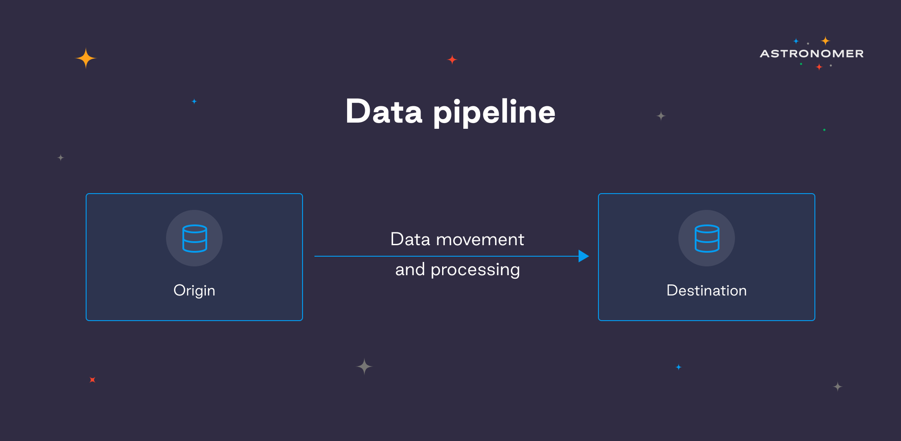

## What is a data pipeline?

It's simple, really. To grasp how data pipelines work, consider any pipe that accepts something from a source and transports it somewhere else. Long story short, a data pipeline handles the flow of data from the initial source to the destination. What happens to the data along the journey is determined by the business use case, specific needs, and the final destination. A data pipeline can do basic data extraction and loading, or it can be as complex as training on datasets for machine learning solutions.

To be more specific, let's say you own a business and - since you're a wise, innovative entrepreneur - you gather a variety of valuable data from your customers. You record their location, purchases, session recordings, interactions, bounce rates, and other factors from various sources. You have the data, but to get insights, create target personas, or simply measure engagement, you have to move it across systems. It requires complicated processes such as data mining, cloud storage, reformatting, and merging with other data sources. To handle such processes manually is a data engineer's nightmare - so that's where our data pipelines enter with a bang. What you get from a data pipeline is a smooth, automated flow of data from one station to the next. The end station can be a warehouse for analysis, but not necessarily - your pipeline can also route data into other applications or visualization tools. It's the ultimate assembly line! 

> "A successful pipeline moves data efficiently, minimizing pauses and blockages between tasks, keeping every process along the way operational."
>
> Bas Harenslak, Solutions Architect at Astronomer

## Why are data pipelines important?

Data pipelines are not important. To say that would be an understatement. Data pipelines are an absolute necessity for any smart, data-driven business (like yours). They are vital - companies need to fuel their analytical tools for insights while simultaneously supporting day-to-day operations, which can only be achieved through a reliable infrastructure for data management. If you want to utilize data for conducting sales trend analysis or any other reason which requires data integration - you need a data pipeline. 

Manually built data pipelines work for some companies, but when your goal is to upgrade data intelligence operations, the best idea is to implement a scalable automated data pipeline solution like Airflow. It can provide the most-wanted flexibility, scale, and cost-efficiency for your business. And data intelligence operations are something every organization should strive to improve, right?

> "Once you get past the basics, data pipelines can be used to give you a competitive advantage. They expand into machine learning, AI, and other sorts of business intelligence around your consumers to try and predict the future. In order to continuously get and elongate the value out of models and insights, you need a functional data pipeline."
>
> Viraj Parekh, Field CTO at Astronomer ([click here to find out how data pipelines are changing the eCommerce game](https://www.astronomer.io/blog/data-pipelines-in-ecommerce))

## The components of data pipelines

So let's get past the basics! Starting off with a list of data pipeline components.

* **Origin:** where the pipeline begins. In other words, it is the point at which data from all sources enters the pipeline. Common pipeline origins include transactional processing apps, application APIs, IoT sensors (real-time), or storage systems such - data warehouses or lakes (batch). 
* **Destination:** the final station of the pipeline, where the data is transferred to. It is determined by the use case, so for the most use scenarios, the data flows to data analysis/business intelligence tools or data warehouses/lakes.
* **Data flow:** no surprise there - it's the flow of data from the origin to the destination, including the operations performed on the data on the road. One of the most frequently used data flow techniques is ETL. E stands for Extract (gathering the data from sources such as MySQL database), T for Transform (converting the data to a format suitable for BI/analysis tools), and L for Load (storing the data in the destination such as Snowflake). 
* **Storage:** all systems necessary for preserving data at subsequent stages as it moves through the pipeline.
* **Processing:** all activities and procedures involved in gathering data from sources, storing it, processing, and loading it into the destination. The emphasis here is on data flow implementation.
* **Monitoring:** ensuring that the data pipeline and all of its stages are functioning correctly; executing the necessary operations.
* **Alerting:** notifying developers and maintainers in case of any failure or a specific event, so that they can take action immediately.

## The types of data pipelines 

Now that you know the components of data pipelines, let's have a look at their specificity. It is crucial to note that data pipeline types are not mutually exclusive. A data pipeline can have all of the properties of two distinct kinds - it can be cloud-native batch processing or open-source real-time processing, etc. Mix and match all the way! The main types of data pipelines include: 

1. **Batch**

When organizations need to transfer large amounts of data at regular times, batch processing is what they need. Batch tasks are generally scheduled to run on a regular basis (for example, every 24 hours) or when the volume of data hits a certain threshold.

2. **Real-time**

Real-time data pipelines were designed to process - you guessed it - data in real-time, that is, as soon as it is created at the source. It's particularly useful when processing data from a streaming source, such as financial market data or telemetry from connected devices.

3. **Cloud-native**

By now you probably get the naming drill - cloud-native pipelines have been designed to only operate with cloud-based data sources, destinations, or both. Because these pipelines are hosted directly in the cloud, they are the most scalable, allowing organizations to save money on infrastructure and manual force.

4. **Open-source**

Last but not least, open-source pipelines are a perfect match with organizations seeking an alternative to commercial pipelines or dreaming about a fully customizable pipeline for their own business and data needs. The creation and management of these pipelines are more tricky - it requires constant assistance of qualified specialists.

## Data pipeline best practices 

How can organizations ensure that data processing and transformation are resilient, efficient, and easy to maintain? When building a data pipeline, it's important to consider several best practices early in the implementation phase. Here are 5 best practices for building a data pipeline, all based on dozens of years of experience from our data engineers and teams. Ready?

1. **Build your pipeline gradually…** 

You probably have a huge amount of data with a dynamic structure.  If you decide to manually design your custom pipeline, prepare for quite a lot of effort. Creating a data pipeline from scratch is a ridiculously complex process - and maintaining it is also a wild ride. Most likely, you won't know what you need until you construct something that doesn't exactly fit your needs. You need to build sections of your pipeline in a modular, re-adjustable way, so take time to analyze and build incrementally... 

2. **...or go for an automated platform like Airflow.** 

Less time to deployment, less cost, as you don't have to invest in the technology in-house. An automated solution effortlessly connects with various data sources allowing you to change your schemas and goals on the way. Automation gives you a chance to improve your resource utilization, as it requires much less in-house workforce. Your engineers will have more time to respond to product needs, they won't be spread too thin anymore. To us, it's a win-win-win.

3. **Incorporate automation and intelligence capabilities** 

No matter which solution you go with, in order to design time and routing, your pipeline needs auto-tuning, auto-provisioning, and auto-scaling. Scalability is critical since data intake requirements might vary dramatically in a short period of time. It becomes extremely difficult to keep up with these shifting demands without some form of auto-scaling.

4. **Stay flexible by choosing a cloud infrastructure**

As your data will likely have numerous jobs running in parallel and tons of varying data to process, you need to focus on your underlying infrastructure's flexibility. Running your data pipeline on cloud infrastructure gives you all the elasticity you need to support multiple, various active tasks.

5. **Reuse existing building blocks** 

Giving your data engineers the ability to customize how your data pipelines run and making them run on time can't be understated. Apache Airflow allows you to run a pipeline from source A to source B easily and lets you move faster as your developers work modularly and plug directly into whatever tooling they are using.

## How do businesses benefit from implementing Airflow?   

Automated platforms make it easy to support even the most complex data management strategies. No more anxiety about in-house deployments - with Airflow you get an end-to-end, seamless environment for data collection, cleaning, and processing. You can grow your number of data sources and quit worrying about data silos. 

If you'd like to extract more value out of your data, at the same time putting less effort into it - this is a perfect solution. Real-time data visualization, adding numerous data sources, monitoring, and alerting are only a couple of useful benefits you will get from an automated data pipeline platform like Airflow.

Moreover, Airflow gives you all the flexibility your data pipeline may need, as it is a Python-based platform. No limits!

## Success story

Our client Herman Miller had been using data pipelines written manually in a complex way so that problem detection would take half a day. 

> "We need to know about the problem as early as possible. We would know there was an issue, but to pinpoint it would require a few-hour investigation"
>
> Mark George, VP of Data & Analytics at Herman Miller

They were looking for a solution that would offer data accuracy, strong alerting and monitoring, as well as easy developing and deploying of CI/CD. After comparing Airflow with other tools, it turned out that Airflow ticked all the boxes from data quality and a data monitoring perspective. The decision was a no-brainer - Herman Miller developed a perfect Airflow platform in cooperation with Astronomer.

> "We are not focusing on the technology anymore—Airflow has allowed us to focus on using the data and making the most of it," says Mark.
>
>

**Interested in taking your business to the next level and capitalizing on your data?** 

Reach out to one of our experts[ to learn more about how Airflow and Astronomer can help. ](https://www.astronomer.io/get-astronomer)