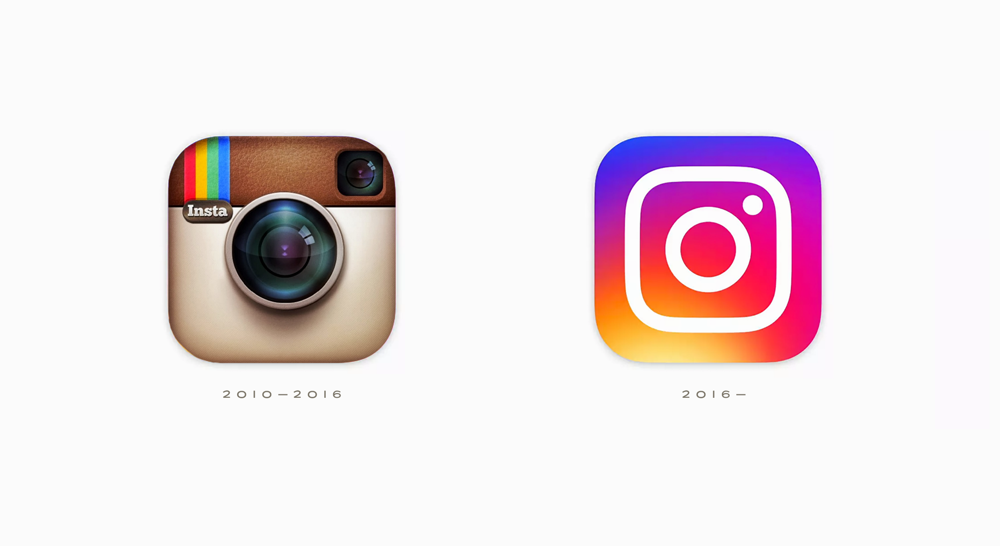
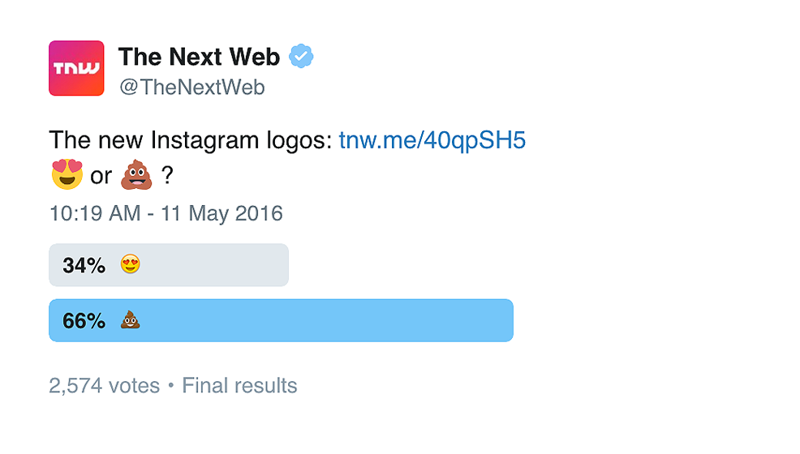
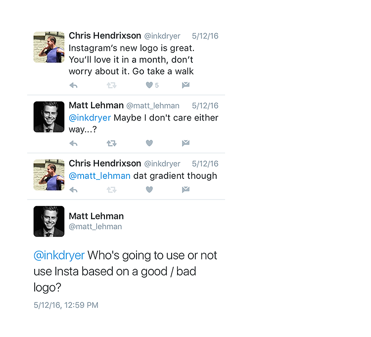
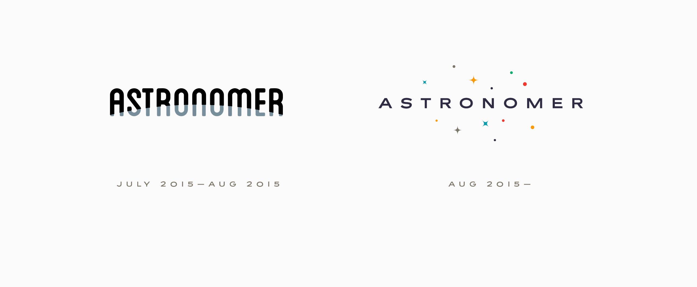
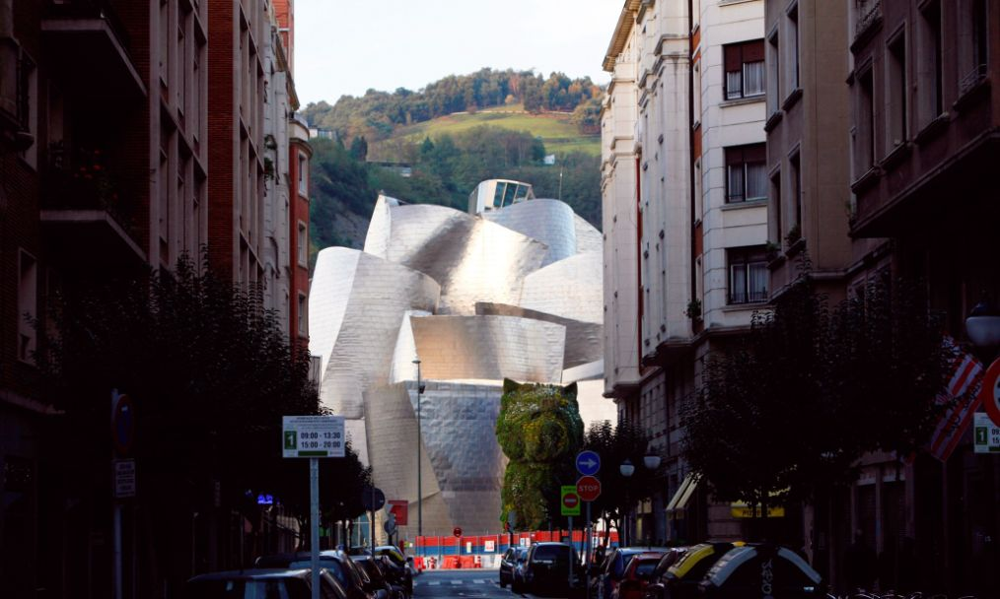

**_Two weeks ago, Instagram changed their logo. The Internet blew up._**

_ **A Quick Refresher:** Instagram was founded in 2010 and just two years later the company was acquired by Facebook for $1 billion. Today, more than 400 million people around the world regularly use Instagram. In the US, almost a quarter of the entire population is grammin._

On May 11, 2016...

...just minutes after Instagram’s colorful new logos arrived, the Internet responded, naturally, using emojis:&nbsp;

**Sentiment of new posts about the logo, according to [Amobee Brand Intelligence](https://medium.com/r/?url=http%3A%2F%2Fwww.adweek.com%2Fsocialtimes%2Famobee-brand-intelligence-new-instagram-logo-sentiment%2F639495), was overwhelmingly negative:**

### 🙂 14%&nbsp;… 🤔 33%&nbsp;… 😡 53%

App store optimization company Sensor Tower [analyzed](https://medium.com/r/?url=http%3A%2F%2Fwww.adweek.com%2Fsocialtimes%2Famobee-brand-intelligence-new-instagram-logo-sentiment%2F639495) app store reviews and found 70% to be negative in the immediate aftermath. By comparison, Instagram’s overall ratings over the last five years are 86% positive (which is quite impressive).

I liked the new Instagram logo from the start. I liked the old one too, though. I adored it when it first came out. Back then, the iPhone’s entire visual ecosystem was skeuomorphic — the notes app looked like a legal pad, the calendar had faux leather and stitching — and Instagram was one of the last remaining logos from that era. Funny how quickly things become nostalgic in tech.

**This got me thinking:** &nbsp;

> **“Does&nbsp;a logo&nbsp;really matter?”**

A bunch of people were pissed about Instagram’s new logo but did it make them use Instagram any less?

I’ve spent the past few weeks talking with friends, family, colleagues and fellow designers (amateur and professional) about this:&nbsp;

[Matt Lehman](https://medium.com/r/?url=http%3A%2F%2Fwww.mattlehmanstudio.com) is a designer and illustrator in Nashville, a good friend and one of the most insanely talented people I know. I met Matt at my first summer internship. His question is what started me down this path in the first place. It turns out he was right, mostly. At least anecdotally, my Instagram habits haven’t changed much since the update.

At Astronomer, we recently [changed our logo](https://medium.com/the-astronomer-journey/a-logo-story-2ea9a5f90a61#.ofs75518l) too:

But does it matter? The question is actually much bigger than I originally thought:&nbsp;

> **“Does visual design really matter?”**

If Facebook had a red bar instead of a blue one, would that change how I feel about Facebook? Would that change how I use it?

In architecture and industrial design, the same question is framed a bit different while asking the same thing:&nbsp;

> **“Does form follow function?”**

In other words, does a building or product have to work well _and_ look beautiful while doing it?

A few nights later I found myself sitting at Great American Ball Park, discussing these matters with Andrew Hendrixson, a grad student at Yale University studying the relationship between art and religion. Full disclosure: Andrew is my badass older brother.

After a few innings of back and forth about why a brand’s logo, colors and visuals matter, Andrew paused and said something that’s been rattling around in my brain ever since:

> **“It’s why we tear down the old ball park and build a new one.”**

### **Architecture & The Power of Design**

In an episode of the TED Radio Hour podcast, called [The Power of Design](https://medium.com/r/?url=http%3A%2F%2Fwww.npr.org%2Fprograms%2Fted-radio-hour%2F478560031%2Fthe-power-of-design), host Guy Raz explores the impact that architecture has on our lives, specifically the Guggenheim Museum in Bilbao, Spain:

> “You’ve probably seen photos of the Guggenheim. It looks kind of like a series of huge ribbons of steel resting on each other and it’s incredibly innovative and experimental. But at the same time, it was inviting. You just kind of felt good looking at it.”

Tourism in the otherwise-very-normal city of Bilbao increased 2,500% after the Guggenheim opened, creating a phenomenon now known as [The Bilbao Effect](https://medium.com/r/?url=http%3A%2F%2Fwww.economist.com%2Fnews%2Fspecial-report%2F21591708-if-you-build-it-will-they-come-bilbao-effect).

Architect Mark Kushner explains more in his phenomenal [TED talk](https://medium.com/r/?url=https%3A%2F%2Fwww.ted.com%2Ftalks%2Fmarc_kushner_why_the_buildings_of_the_future_will_be_shaped_by_you%3Flanguage%3Den):&nbsp;

> “We are always in architecture and if we’re not in architecture, we’re surrounded by architecture. So, think about anything else that has that much presence in your life that you don’t respond to emotionally. You spend as much time around buildings as you do around your loved ones.”

Think about it. Do you have a particular room in your home that you particularly enjoy sitting in? Is there a lamp that you love or carpet that you hate?

What about the place where you work? Do the fluorescent lights kind of make you cringe? Have you ever walked into someone else’s office building and wished your office looked more like that one?

Andrew Hendrixson would go as far as to argue that we have a physical reaction to 2-D graphics in a similar way as we do to a dimly lit office environment. A photo of a [vintage Porsche 911](https://medium.com/r/?url=http%3A%2F%2Fmedia.caranddriver.com%2Fimages%2Fmedia%2F51%2Fsinger-porsche-911-inline-1-photo-550990-s-original.jpg) is not nearly as exhilarating as driving one but it does make us _feel something_ doesn’t it?

You may not be inspired much by architecture or cars or logos but did you style your hair this morning? Did you shave? How did you decide which shirt to wear? If your spouse picked it out for you, what informed her decision?

Matt Lehman was probably right when he implied that Instagram’s logo probably doesn’t really matter too much, at least in whether or not people will continue to use Instagram.&nbsp;

Similarly, you wouldn’t choose to not work with a client or business partner based solely on his fashion sense or haircut. But will you comb your hair before the meeting or make sure you don’t have a piece of cilantro stuck in your teeth? Absolutely.

*Chris Hendrixson is Head of Design at Astronomer. [Follow him on Twitter](https://twitter.com/inkdryer)&nbsp;to read more of his thoughts on design.*

