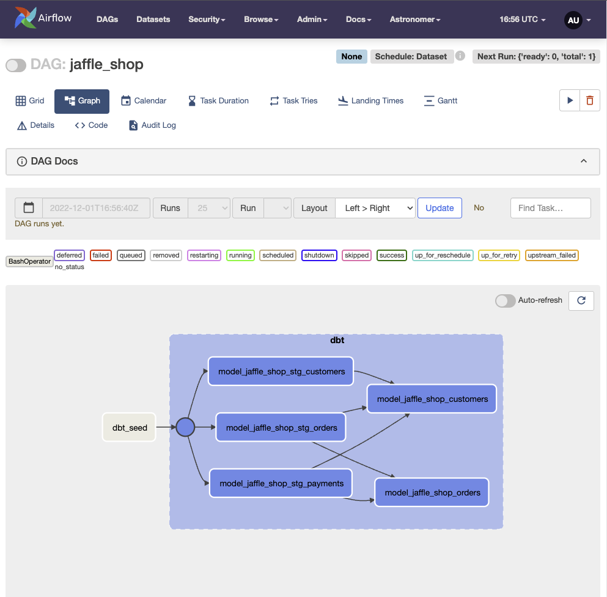
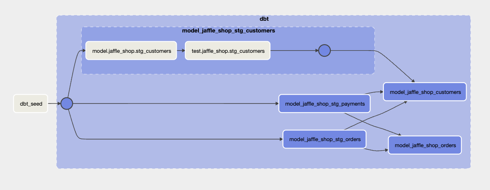
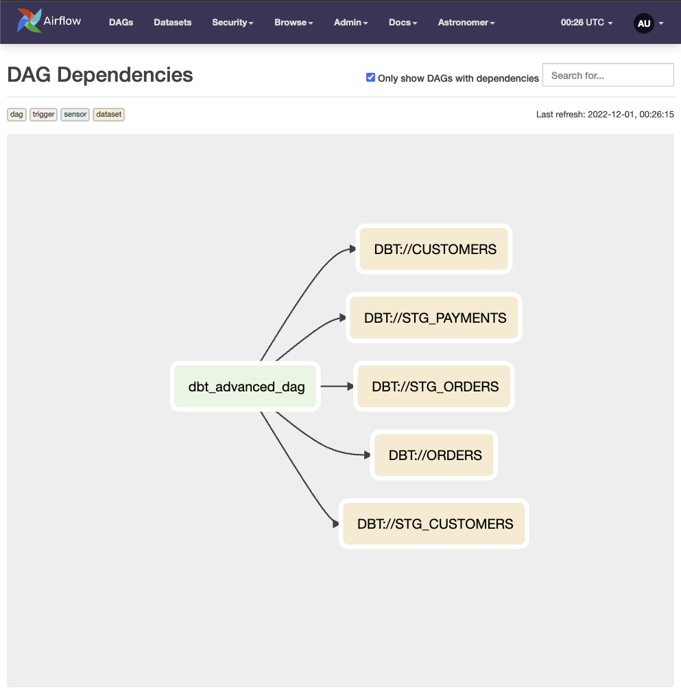
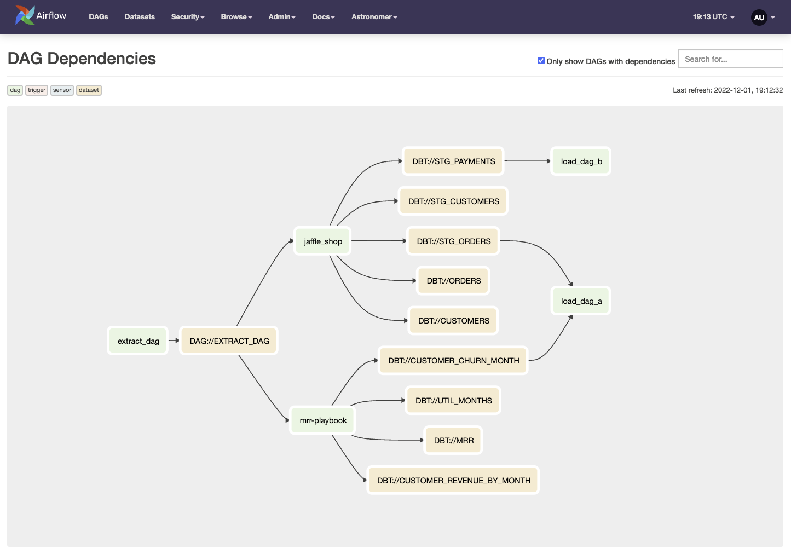

> All code in this post can be found in [this GitHub repository](https://github.com/astronomer/airflow-dbt-blog). 

In August 2021, we published the final part of a 3-part blog post. These 
blogs became instrumental to the guidance we provided to our customers when running dbt transformation pipelines in 
Airflow. Since then, there have been rapid changes to both Airflow and dbt and obvious pain points when embedding dbt 
projects in an Airflow environment.

> Read the original dbt blogs (from Astronomer) here:
> 
> - [Part 1](https://www.astronomer.io/blog/airflow-dbt-1): Building a Scalable Analytics Architecture With Airflow and 
>dbt
> - [Part 2](https://www.astronomer.io/blog/airflow-dbt-2): Building a Scalable Analytics Architecture With Airflow and 
>dbt: Part 2
> - [Part 3](https://www.astronomer.io/blog/airflow-dbt-3/): Building a Scalable Analytics Architecture With Airflow and 
>dbt: Part 3
>

In this post, we'll guide you to alleviate those pain points and share methods used internally at Astronomer to 
leverage dbt models in Airflow.


## Avoiding Dependency Hell

> This dependency issue arises when several packages have dependencies on the same shared packages or libraries, but they 
> depend on different and incompatible versions of the shared packages. If the shared package or library can only be 
> installed in a single version, the user may need to address the problem by obtaining newer or older versions of the 
> dependent packages. This, in turn, may break other dependencies and push the problem to another set of packages.
> -- [Wikipedia](https://en.wikipedia.org/wiki/Dependency_hell)

By nature of what each of these platforms provides, dbt and Airflow share many standard packages (one of the most 
prevalent of these is [Jinja](https://jinja.palletsprojects.com)). Working with our customers, we found that whenever 
a new shiny update was released for either Airflow or dbt, those updates would clash and prevent Airflow images 
from building due to *Dependency Hell*.

The solution to this issue is quite elegant but also simple. To keep Airflow and dbt dependencies from clashing, we used 
a [Python Virtual Environment](https://docs.python.org/3/library/venv.html) to isolate them. In the self-same 
*Dockerfile* that is pulling the Astronomer-managed Airflow image, we can add additional steps to create a virtual 
environment for dbt core:

```dockerfile
# /airflow_project/Dockerfile

FROM quay.io/astronomer/astro-runtime:6.0.4

ENV AIRFLOW__CORE__ENABLE_XCOM_PICKLING=true

USER root

# Set dbt root directory
ARG BASE_DIR="/usr/local/airflow/include/dbt"

# Create a venv for dbt and generate manifest.json files for each model
RUN python -m virtualenv dbt_venv && source dbt_venv/bin/activate && \
    pip install --no-cache-dir dbt-core==1.3.1 && \
    pip install --no-cache-dir dbt-postgres==1.3.1 && \
    dbt ls --profiles-dir ${BASE_DIR} --project-dir ${BASE_DIR}/jaffle_shop && \
    dbt deps --profiles-dir ${BASE_DIR} --project-dir ${BASE_DIR}/mrr-playbook && \
    dbt ls --profiles-dir ${BASE_DIR} --project-dir ${BASE_DIR}/mrr-playbook && deactivate

# Grant access to the dbt project directory for everyone
RUN chmod -R 777 ${BASE_DIR}

# Create an alias for dbt commands so we don't have to activate every time
RUN printf '#!/bin/bash \n source /usr/local/airflow/dbt_venv/bin/activate && dbt $@' > /usr/bin/dbt
RUN chmod +x /usr/bin/dbt

USER astro
```

Now that we've added these layers in our `Dockerfile`, a virtual environment for dbt initializes when our sandbox is 
built (done by running `astro dev start`).

So what would this look like when running a dbt command in a DAG? Use a [BashOperator](https://registry.astronomer.io/providers/apache-airflow/modules/bashoperator) 
to run the dbt command:

```python
# /airlfow_project/dags/dbt_manifest_create.py 

from datetime import datetime

from airflow import DAG
from airflow.operators.bash import BashOperator

DBT_PROJECT_DIR = "/usr/local/airflow/include/dbt"

with DAG(
    dag_id="dbt_manifest_create",
    start_date=datetime(2022, 7, 27),
    schedule=None,
    max_active_runs=1,
    tags=["dbt"]
) as dag:

    BashOperator(
        task_id="dbt_ls_cmd",
        bash_command=f"dbt ls --profiles-dir {DBT_PROJECT_DIR} --project-dir {DBT_PROJECT_DIR}/jaffle_shop"
    )
```

## Structuring your dbt projects in Airflow

A common headache that our customers have run into is how to structure a directory of multiple dbt projects *within 
Airflow*. [dbt's official documentation](https://docs.getdbt.com/guides/best-practices/how-we-structure/1-guide-overview) 
on this topic may be helpful, but ultimately this is what our team at Astronomer ended up doing:

```markdown
├── Dockerfile
├── README.md
├── airflow_settings.yaml
├── dags
│   ├── dbt_manifest_create.py
│   ├── extract_dag.py
│   ├── jaffle_shop.py
│   ├── load_dag_a.py
│   ├── load_dag_b.py
│   └── mrr-playbook.py
├── include
│   ├── dbt
│   │   ├── jaffle_shop
│   │   │   ├── LICENSE
│   │   │   ├── README.md
│   │   │   ├── dbt_packages
│   │   │   ├── dbt_project.yml
│   │   │   ├── etc
│   │   │   ├── logs
│   │   │   ├── models
│   │   │   └── seeds
│   │   ├── mrr-playbook
│   │   │   ├── README.md
│   │   │   ├── data
│   │   │   ├── dbt_packages
│   │   │   ├── dbt_project.yml
│   │   │   ├── docs
│   │   │   ├── logs
│   │   │   ├── macros
│   │   │   ├── models
│   │   │   └── packages.yml
│   │   └── profiles.yml
│   └── utils
│       ├── dbt_dag_parser.py
│       └── dbt_env.py
├── packages.txt
├── plugins
├── requirements.txt
└── tests
    └── dags
        └── test_dag_integrity.py
```

Notice that we have multiple projects nested in that `include/dbt` parent directory. These are two example projects 
provided by dbt labs

1. [jaffle_shop](https://github.com/dbt-labs/jaffle_shop) - jaffle_shop is a fictional eCommerce store. This dbt project 
transforms raw data from an app database into a customer and orders model ready for analytics.
2. [mrr-playbook](https://github.com/dbt-labs/mrr-playbook) -  This dbt project is a working example demonstrating how 
to model subscription revenue.

With this structure, we are ready to parse those projects and their associated models within Airflow.

## A dbt Parser Utility (re-imagined)

In the [third part of our dbt blogs](https://www.astronomer.io/blog/airflow-dbt-3/), a dbt Parser Utility was born. 
This utility parses through the well-known dbt [manifest.json](https://docs.getdbt.com/reference/artifacts/manifest-json) 
file to dynamically generate `BashOperators` for each model of a dbt project embedded in Airflow. Using this as a 
starting point, we can modify it to accomplish the following goals:

- Add a parameter to filter down to a specific dbt project
- Create an [Airflow Dataset](https://airflow.apache.org/docs/apache-airflow/stable/concepts/datasets.html) for the dbt 
test commands in that model (this will allow us to create cross DAG dependencies off of specific steps in our model).
- Pass a set of default environment variables to each dbt `BashOperator` (necessary for authenticating to the data 
warehouse defined in our [profiles.yml](https://docs.getdbt.com/reference/profiles.yml)).

With those goals in mind, here is what the resulting script looks like:

```python
# airflow_project/include/utils/dbt_dag_parser.py

import json
import logging
import os

from airflow.datasets import Dataset
from airflow.operators.bash import BashOperator
from airflow.utils.task_group import TaskGroup
from include.utils.dbt_env import dbt_env_vars

class DbtDagParser:
    """
    A utility class that parses out a dbt project and creates the respective task groups

    :param model_name: The model to parse
    :param dbt_root_dir: The directory containing the models
    :param dbt_profiles_dir: The directory containing the profiles.yml
    :param dag: The Airflow DAG
    :param dbt_global_cli_flags: Any global flags for the dbt CLI
    :param dbt_target: The dbt target profile (e.g. dev, prod)
    :param env_vars: Dict of environment variables to pass to the generated dbt tasks
    """

    def __init__(
        self,
        model_name: str,
        dbt_root_dir="/usr/local/airflow/include/dbt",
        dbt_profiles_dir="/usr/local/airflow/include/dbt",
        dag=None,
        dbt_global_cli_flags=None,
        dbt_target="dev",
        env_vars: dict = None,
    ):
        self.model_name = model_name
        self.dbt_root_dir = dbt_root_dir
        self.dbt_profiles_dir = dbt_profiles_dir
        self.dag = dag
        self.dbt_global_cli_flags = dbt_global_cli_flags
        self.dbt_target = dbt_target
        self.env_vars = env_vars


        # Parse the manifest and populate the two task groups
        self.make_dbt_task_groups()

    def make_dbt_task(self, node_name, dbt_verb):
        """
        Takes the manifest JSON content and returns a BashOperator task
        to run a dbt command.

        Args:
            node_name: The name of the node
            dbt_verb: 'run' or 'test'

        Returns: A BashOperator task that runs the respective dbt command

        """

        model_name = node_name.split(".")[-1]
        if dbt_verb == "test":
            node_name = node_name.replace("model", "test")  # Just a cosmetic renaming of the task
            outlets = [Dataset(f"DBT://{model_name}".upper())]
        else:
            outlets = None

        # Set default env vars and add to them
        if self.env_vars:
            for key, value in self.env_vars.items():
                dbt_env_vars[key] = value

        dbt_task = BashOperator(
            task_id=node_name,
            bash_command=(
                f"dbt {self.dbt_global_cli_flags} {dbt_verb} --target {self.dbt_target} --models {model_name} \
                  --profiles-dir {self.dbt_profiles_dir} --project-dir {self.dbt_root_dir}/{self.model_name}"
            ),
            env=dbt_env_vars,
            dag=self.dag,
            outlets=outlets,
        )

        # Keeping the log output, it's convenient to see when testing the python code outside of Airflow
        logging.info("Created task: %s", node_name.replace(".", "_"))
        return dbt_task

    def make_dbt_task_groups(self):
        """
        Parse out a JSON file and populates the task groups with dbt tasks

        Returns: None

        """
        project_dir = f"{self.dbt_root_dir}/{self.model_name}"
        manifest_json = load_dbt_manifest(project_dir=project_dir)
        dbt_tasks = {}
        groups = {}

        # Create the tasks for each model
        for node_name in manifest_json["nodes"].keys():
            if node_name.split(".")[0] == "model":
                with TaskGroup(group_id=node_name.replace(".", "_").replace("core", self.model_name)) as node_group:
                    # Make the run nodes
                    dbt_tasks[node_name] = self.make_dbt_task(node_name, "run")
                    # Make the test nodes
                    node_test = node_name.replace("model", "test")
                    dbt_tasks[node_test] = self.make_dbt_task(node_name, "test")
                    dbt_tasks[node_name] >> dbt_tasks[node_test]
                    groups[node_name.replace(".", "_")] = node_group

        # Add upstream and downstream dependencies for each run task
        for node_name in manifest_json["nodes"].keys():
            if node_name.split(".")[0] == "model":
                for upstream_node in manifest_json["nodes"][node_name]["depends_on"]["nodes"]:
                    upstream_node_type = upstream_node.split(".")[0]
                    if upstream_node_type == "model":
                        groups[upstream_node.replace(".", "_")] >> groups[node_name.replace(".", "_")]

    def get_dbt_run_group(self):
        """
        Getter method to retrieve the previously constructed dbt tasks.
        Returns: An Airflow task group with dbt run nodes.
        """
        return self.dbt_run_group

    def get_dbt_test_group(self):
        """
        Getter method to retrieve the previously constructed dbt tasks.
        Returns: An Airflow task group with dbt test nodes.
        """
        return self.dbt_test_group


def load_dbt_manifest(project_dir):
    """
    Helper function to load the dbt manifest file.

    Returns: A JSON object containing the dbt manifest content.

    """
    manifest_path = os.path.join(project_dir, "target/manifest.json")
    with open(manifest_path) as f:
        file_content = json.load(f)
    return file_content
```

This `DbtDagParser` can now be called in an Airflow DAG to dynamically generate that dbt Model in Airflow:

```python
#/airflow_project/dags/jaffle_shop.py

from pendulum import datetime

from airflow import DAG
from airflow.datasets import Dataset
from airflow.operators.bash import BashOperator
from include.utils.dbt_dag_parser import DbtDagParser
from include.utils.dbt_env import dbt_env_vars
from airflow.utils.task_group import TaskGroup


DBT_PROJECT_DIR = "/usr/local/airflow/include/dbt"

with DAG(
    dag_id="jaffle_shop",
    start_date=datetime(2022, 11, 27),
    schedule=[Dataset("DAG://EXTRACT_DAG")],
    catchup=False,
    default_args={
        "owner": "02-TRANSFORM"
    }
) as dag:

    # We're using the dbt seed command here to populate the database for the purpose of this demo
    seed = BashOperator(
        task_id="dbt_seed",
        bash_command=f"dbt seed --profiles-dir {DBT_PROJECT_DIR} --project-dir {DBT_PROJECT_DIR}/jaffle_shop",
        env=dbt_env_vars
    )

    with TaskGroup(group_id="dbt") as dbt:
        dag_parser = DbtDagParser(
            model_name="jaffle_shop",
            dbt_global_cli_flags="--no-write-json"
        )

    seed >> dbt


```

The graph view for this DAG would render as this:



Each dbt model contains bash operators for the `dbt run` and `dbt test` commands. These can be seen by clicking on the 
task group model:



Our dbt utility parser also creates the following datasets off of each `dbt test` BashOperator. These can be viewed in 
the `Browse >> DAG Dependencies` menu as well as the `Datasets` menu and are essential for setting cross DAG 
dependencies:



## Setting Cross DAG Dependencies

With the release of Airflow 2.4, a new method of creating cross-dag dependencies was introduced. [Datasets](https://airflow.apache.org/docs/apache-airflow/stable/concepts/datasets.html) 
provide Airflow users the ability to schedule a DAG based upon a task updating a dataset. In our case, the task being a 
`BashOperator` running our dbt models. In the dbt Parser utility, we ensured datasets were generated off of each test model. 
Making them callable to any downstream Airlfow DAGs. But why does this matter?

It matters because dbt can now be used as the *Transform* step of traditional ETL/ELT workflows (and Airflow can be used 
to orchestrate the *Extract* & *Load* steps).

So, if in our Airflow deployment we have other (non-dbt) dags that were responsible for data ingestion, loading, reverse
etl's, etc. then they could be intermingled with our embedded dbt models. When we set up these dependencies between our 
dbt DAGs and our non-dbt DAGs, our `DAG Dependencies` view tells the ETL story:



- `extract_dag`: could represent ingestion from an endpoint, database, or similar
- `jaffle_shop`: dbt model 1
- `mrr-playbook`: dbt model 2
- `load_dag_a`: DAG that needs to run downstream of dbt model(s)
- `load_dag_b`: DAG that needs to run downstream of dbt model(s)


