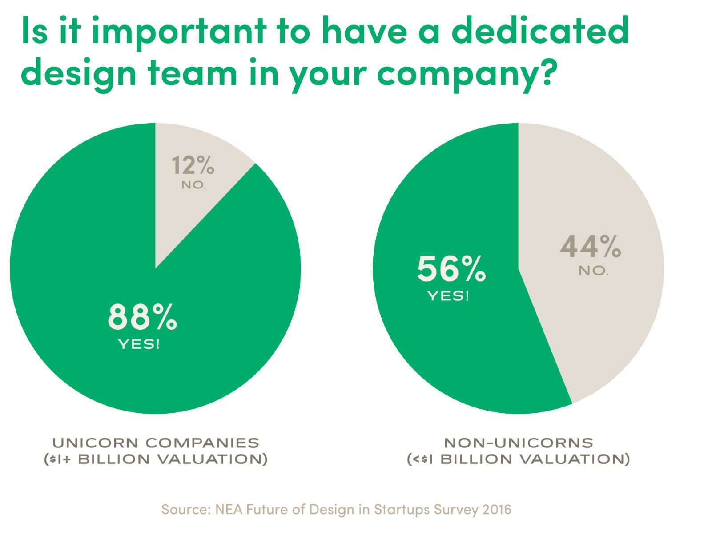
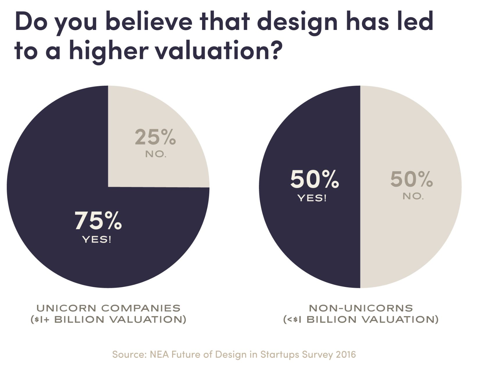
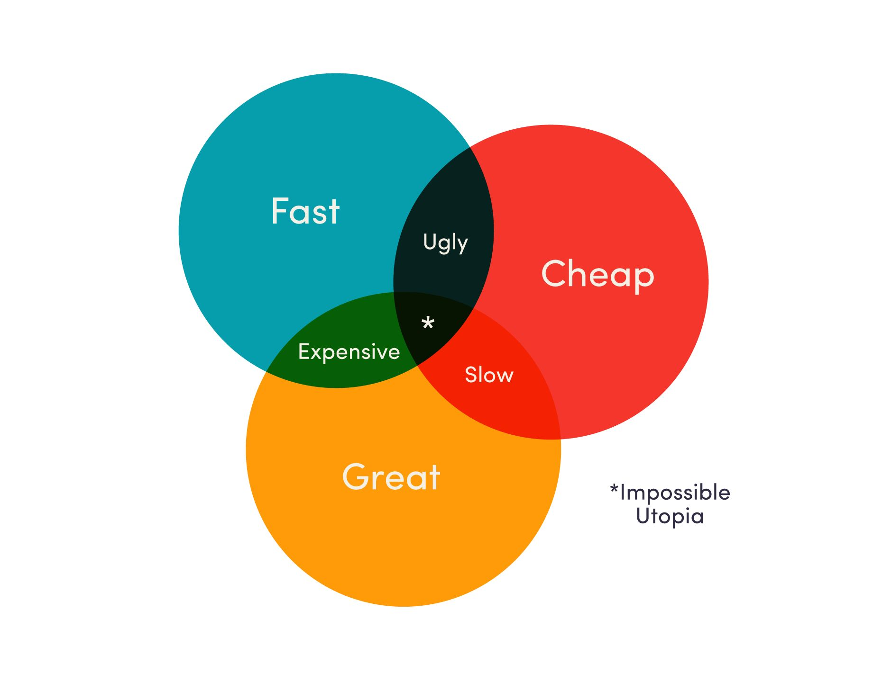

<!-- markdownlint-disable-file -->
There’s a major trend happening in tech companies today: design teams are growing like mad. Whether you are in design, engineering or business development, this trend will likely affect you. At the very least, get used to seeing a lot more designers around the office. You’ll know us by our [Adidas triple white NMDs](https://www.google.com/search?q=adidas+nmd+white&source=lnms&tbm=isch&sa=X&ved=0ahUKEwiR9ZaSqMPTAhUm4IMKHbLGAPkQ_AUICygC&biw=1280&bih=700&dpr=2#tbm=isch&q=adidas+triple+white+nmd) or tiny Moleskine notebooks or lengthy conversations about fonts.

As we often say at Astronomer, the data doesn’t lie. According to LinkedIn, design teams at the biggest tech companies — Facebook, Google and Amazon — grew by an astronomical [65%](https://designintechreport.wordpress.com/) in 2016.

Designers are also making their way into tech companies through acquisitions, a trend that began when tech companies started [acquiring design agencies](https://designintechreport.wordpress.com/) in the mid 2000s. Thirteen design agencies were acquired between 2004–2012 by companies like Facebook, Google, Square and Adobe. Since 2012, that number has skyrocketed. In the last five years, 59 design agencies were acquired by tech companies. There were 21 acquisitions in 2016 alone. IBM bought three.

It’s a great time to be a freelancer, too. According to NEA’s Future of Design in Startups&nbsp;2016 Survey, venture-backed tech companies across the board plan to double their freelance design spend in the next 12 months, mostly on branding.

### Who Cares About Design?&nbsp;

The same survey, which gathered information from hundreds of tech companies around the world, found that 87% of startups believe design is important to their business. There is one group, however, that values design significantly more than the rest: _unicorns_.

A [unicorn](https://en.wikipedia.org/wiki/Unicorn_(finance)) is a startup valued at over $1 billion. According to [TechCrunch](https://techcrunch.com), as of April 2017, there are 224 unicorns in the world. The largest include Uber, Airbnb, Xiaomi, Palantir, Dropbox and Pinterest. The most recent unicorn to become a public company was Snap, Inc. in March 2017.

When it comes to companies who aren't valued over $1 billion, the sentiment around design is different. A lot fewer believe in the importance. Nearly all unicorns (88%) believe it is important to have a dedicated design team. Among non-unicorns, just&nbsp;56% agree.

Unicorns also recognize the value of design across departments. Companies valued over $1 billion more strongly believe that design leads to higher sales and twice as many unicorns as non-unicorns believe that designs leads to higher customer retention.

When it comes to investors, can design lead to a higher valuation? Startups that have raised more than $20 million can’t quite decide. They’re split 50/50. Unicorns, however, are more certain: 75% say “yes.”

Are unicorns simply more mature — and therefore more enlightened — than other startups when it comes to design? And, if so, can less mature startups learn from them and start to make design more of a priority today? Yes!

But it’s also a bit more complicated than that.

### Great Design&nbsp;vs.&nbsp;The Startup Mentality

As a young designer starting to pick up freelance jobs, I was often warned that most clients are looking for something cheap, fast and great. This is an impossible utopia. A project can be cheap and great but it won’t be fast. It can be fast and great, but it will require extra resources or an extraordinary effort and, therefore, will not be cheap.

The fact that less mature startups don’t value design as much as more mature ones may be less an issue of naiveté than it may seem after all.

Startups lack two major things: money and time. Because every young startup is building products as quickly and cheaply as possible, greatness is difficult to achieve. Minimum Viable Products are rudimentary and unrefined. But like a newborn baby, MVPs are full of hope and potential, requiring extreme care to survive and grow. Taking the time and resources required for deep refinement — the result of which is greatness — is neither smart nor feasible.

But this changes as a company grows. Every startup at every stage is building things fast. The difference is that more mature startups have more money. They can put resources into things like design and when they do, they realize its value. The most mature startups have a full realization of design’s impact on their businesses because they finally have the luxury of making design a priority.

Still, even the least mature startups today must think about design in a new way. There’s a shift happening at the intersection of business, technology and design. We are entering into the Design Era.

### Technology's New Hero

For the past 30 years or so, engineers were the heroes of technology. And rightly so! Engineers built the first personal computers in the '70s and '80s, created the world wide web in the '90s, and then brought the internet&nbsp;into our pockets in the form of constantly connected, miniature supercomputers more powerful than anyone could have dreamed.

Because the technology is now ubiquitous, consumers have nearly endless options. When consumers have endless options, they will crave and seek out the best of the best. Brands must compete on user experience now more than ever.

There’s a growing, nearly insatiable appetite among consumers for better-designed experiences and interfaces, and therefore a growing appetite for design talent inside of tech companies.

The last 30 years encompass the Era of Engineering, which laid the foundation for the coming Design Era. It will be amazing for designers, companies and consumers alike.

### So, what’s next?

What can you do to prepare your organization for the Design Era?

If you’re not a designer, get to know the designers in your company. Learn about the creative process. Many non-designers still believe that design is a mystical gift&nbsp;some people are born with and some aren’t. That couldn’t be further from the truth. Design is a skill — a way of thinking — that can be learned and honed just like any other skill. Hang out with designers and learn how we work. Great designers are curious, and will return the favor.

If you’re a CEO, champion design in your company. Remember that business folks are focused on keeping costs low, engineers on speed and efficiency, and designers on elegance and beauty. Designers have a unique voice and crucial perspective, though we’re significantly outnumbered in tech companies (engineers [outnumber](https://daoy1b221nves.cloudfront.net/NEA_FOD_Survey_2016.pdf) designers 10:1, product managers 4:1). Make sure you support your design team financially and mentally. You need them if you want to build a billion dollar business.

And if you are a designer, keep doing what you’re doing! Get to know the engineers. Hang out with the sales guys. Learn as much as you can about product management and business. As design teams continue to grow, more and more designers are becoming leaders inside tech companies. It’s quite possible you’ll be needed in the boardroom soon.

