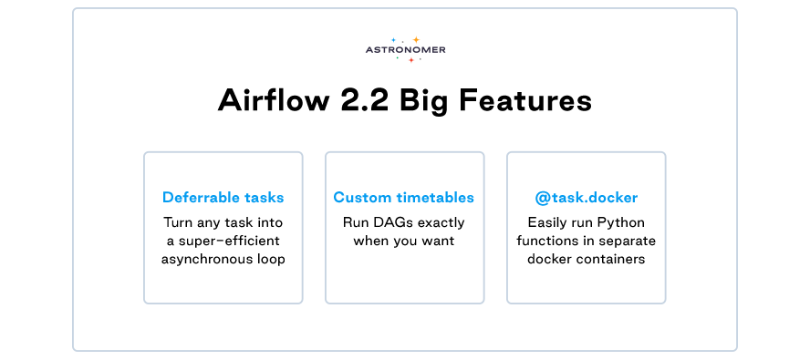
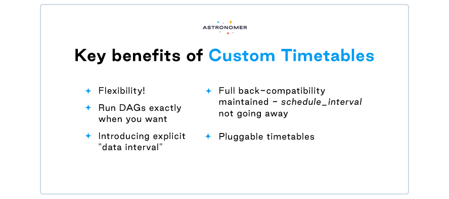
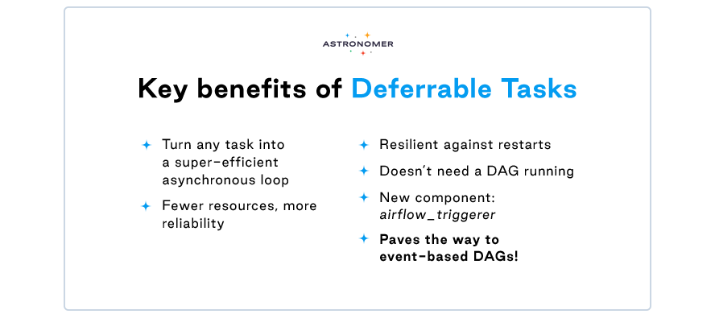

As most of you know, Apache Airflow took off in 2014 as an open-source tool from the very first commit - and still remains this way. Currently, the vibrant, unique Airflow community consists of over 500 active members, ensuring 24/7 support and constant growth. Any kind of big architectural upgrade or a fundamental change to the way Airflow operates goes through the Airflow Improvement Proposal (AIP) process and a vote. It ensures that the big fundamental improvements get by in front of the community.

[Airflow 2.0](http://astronomer.io/blog/introducing-airflow-2-0) was released in December 2020, and 11 months later we’re happy to announce that the second upgrade of this version is finally live! **Say *hello* to Airflow 2.2.0.** The new release combines two new big features and a whole lot of small quality-of-life improvements to make Airflow even more powerful. Contributors also managed to fix some long-standing complaints. 

We’re extremely proud to say that the authors of most new features are a part of the Astronomer crew! Specifically, our team participated in launching:

* AIP-39 - Custom Timetables / Richer scheduling intervals
* AIP-40 Deferrable Operators
* Dag Params
* Airflow standalone

In celebration of the highly anticipated release, we’ve put together an overview of major Airflow 2.0 features below. Let's get to know the long-awaited new goodies!

## Airflow 2.2.0 New Features

## AIP-39: Custom Timetables

Any heavy Airflow user would agree that this feature has been a long time coming!

Cron expressions got us as far as regular time intervals, which is only convenient for predictable data actions. Before Airflow 2.2.0, it was impossible to schedule data activities from Monday to Friday and stop them from running over the weekend, but now that custom timetables are finally here, the scheduling sky is the limit! This super useful feature allows looking at a given data for a specific period of time, which can be really useful. 

* #### New concept alert: data_interval

##### **A period of data that a task should operate on.**

Since the concept of "execution_date" was confusing to every new user, a better version is now available. No more “why didn’t my DAG run yet?!”, as this feature has been replaced with data_interval, which is the period of data that a task should operate on. 

It includes:

* logical_date (aka execution_date)
* data_interval_start (same value as execution_date for cron)
* data_interval_end (aka next_execution_date)

#### Bonus for Astronomer Customers only:

##### NYSE Trading Timetable

The trading hours timetable allows users to run DAGs based on the start and end of trading hours for NYSE and Nasdaq. It includes historic trading hours as well as holidays and half-days where the markets have irregular hours. 

## AIP-40: Deferrable Tasks

Do you know the feeling of tasks or sensors clogging up worker resources when waiting for external systems and events? Airbnb introduced smart sensors, the first tackle of this issue. Deferrable tasks go further than sensors - they are perfect for anything that submits a job to an external system then polls for status.

With this feature, operators or sensors can postpone themselves until a light-weight async check succeeds, at which time they can resume executing. This causes the worker slot, as well as any resources it uses, to be returned to Airflow. Deferral task does not consume a worker slot while in deferral mode - instead, one triggerer process can run 100s of async deferred tasks concurrently. As a result, tasks like monitoring a job on an external system or watching for an event become far less expensive. 

To enable this functionality, a new component called the triggerer, which is the daemon process that executes the asyncio event loop, has been introduced to Airflow.

### Custom @task decorators and @task.docker

The '@task.docker' decorator allows for running a function inside a docker container. Airflow handles putting the code into the container and returning xcom. This is especially beneficial when there are competing dependencies between Airflow and tasks that must run.

## Other features

* **Validation of DAG params** (Only with manually triggered DAGs!)

  It is now possible to apply validation on DAG params by passing a param object for each param. Sets the stage for future params-related functionalities!
* **Airflow standalone.**

  Run all the airflow components (migrations, scheduler, webserver, triggerer, etc) directly without a docker. Perfect for local development.
* **Testing Connections from the UI.**

  Test if the credentials for your Connection actually work
* **Duplication Connections from the UI.**
* **DAGs “Next run” info visible in the UI,** including when the run will actually start.

## Summary

Overall, the new release contains 30 new features, 84 improvements, 85 bug fixes, and many internal and doc changes. Check out the [full list](https://airflow.apache.org/docs/apache-airflow/stable/changelog.html).

**Details**:

📦 PyPI: <https://pypi.org/project/apache-airflow/2.2.0/>\
📚 Docs: <https://airflow.apache.org/docs/apache-airflow/2.2.0/>\
🛠️ Changelog: <https://airflow.apache.org/docs/apache-airflow/2.2.0/changelog.html>\
🐳 Docker Image: docker pull apache/airflow:2.2.0\
🚏 Constraints: <https://github.com/apache/airflow/tree/constraints-2.2.0>

Thank you and congratulations to everyone who has contributed to this release, in particular our amazing **Astronomer experts**: Andrew Godwin, Ash Berlin-Taylor, Brent Bovenzi, Ephraim Anierobi, James Timmins, Jed Cunningham, Josh Fell, Kaxil Naik, Sumit Maheshwari, Tzu-ping Chung, and Jarek Potiuk.

## Astronomer - making Airflow even better

Airflow is now considered the industry’s leading workflow orchestration solution, and Astronomer makes this platform easily accessible by you and your team. Astronomer enables you to centrally develop, orchestrate, and monitor your data workflows with best-in-class open source technology. With [multiple provider packages in our registry](https://registry.astronomer.io/providers/), it becomes intuitive and straightforward to take off with your pipelines orchestration and take full advantage of your data. 

[Reach out to our experts](https://www.astronomer.io/get-astronomer/) and find out more!