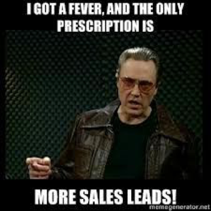

_“In any moment of decision, the best thing you can do is the right thing. The worst thing you can do is nothing.” - Teddy Roosevelt_

In business, decisiveness is of critical importance. Yet decisiveness does not operate in a vacuum. The power to make decisions should not be measured by the results it produces, but by the information fueling the process. Why? Because the information driving a decision _causes_ a result, whereas looking at the result alone only suggests a correlation between the information powering the decision and the subsequent outcome. This begs the question: how does one go about getting the best information in order to make a decision, leading to what Ol’ Teddy calls “the right thing?”

Here at Astronomer, our answer is the scientific method. Yes, we are talking about _the_ scientific method you learned in 1st grade:

- 1) **question** \> 2) **hypothesis** \> 3) **test** / **experiment** \> &nbsp;4) **observe** \> 5) **conclude**

No matter the question, we research, hypothesize, test and decide. Should we build our technology with open source components? Test it; decide ([yes, by the way](https://www.astronomer.io/blog/our-open-source-philosophy)). Can you make a blowgun for Nerf darts out of 1-inch PVC? Test it; decide (also yes... incredible range).

We even apply this approach to our Growth team. Using the scientific method, I, along with the rest of the Growth team, concluded that some traditional sales techniques are no longer relevant in the world of SaaS (at least in the forms they existed before). **This post is about how we tested a growth strategy and successfully failed—and what we learned from it going forward.**

### The Question
> **How can we scale Sales?**

Per traditional sales wisdom and guidance from various sales mentors, Astronomer’s growth team decided to add a [Sales Development Representative](https://www.ringdna.com/inside-sales-glossary/inside-sales-glossaryinside-sales-glossarywhat-are-sales-development-reps-sdrs) (SDR)—me. An SDR is the ground infantry of the sales team, the front lines. Think cold calling and email blasting. SDRs take massive lists of prospects and try to whittle them down to Sales Qualified Leads (SQLs). SQLs are then handed off to salespeople for closing. It is a Smithian division of labor that allows for specialization within a sales organization.

### The Research and Experiment

In the words of our co-founder, Tim Brunk:

> Keeping the top of the funnel full is hyper-critical for a B2B SaaS company focusing on larger contracts. Often, simple marketing isn't nearly as effective, particularly when you haven’t established credibility in the market due to how new the company is. So, common wisdom said to bring on an SDR fairly early to help source prospects and leads. This would allow the salespeople to focus on closing and curating the pipeline rather than generating leads. We want to grow fast, so we decided it was worth a shot.

After 5 months in the role, here are the 3 reasons why I am no longer an SDR at a data company (don’t worry, though, still on the team).

### The Results

#### 1. SDRing Shouldn’t Be Done as a Team of One

Generally speaking, there are two types of SDRs on the market: those who&nbsp;do their own prospecting and those who&nbsp;are given lists of prospects. In the latter case, the company will supply the SDR with prospect lists (invariably a purchased list) that are as cold [as antarctic tundra](https://youtu.be/OL7O5O7U4Gs?t=1m8s). On the other hand, some SDRs do their own prospecting. While the prospects are still cold in this context, the SDR can tailor his or her research based on experience, the company’s product and even, after a time, intuition … all in hopes of finding slightly warmer leads.

We tried both approaches, and this is the bottom line: both approaches result in the SDR reaching out to cold leads. Response rates for cold outreach are notoriously low, about 7-8% if you are an absolute whiz, but more realistically 4-5%. We were hovering at about a 6-7% average response rate, and of those responses, we had about a 50% SQL conversion rate, which is pretty high. So, for every 100 prospects, we were getting 3-4% SQLs ([MailChimp](https://mailchimp.com/resources/research/email-marketing-benchmarks/), [Close.io](https://blog.close.io/cold-calling-conversion-funnel-analytics)).&nbsp;

Now, for an established company, those numbers are _great_. But in a startup whose very survival depends on a much higher growth rate, 3-4% is unsustainable. And&nbsp;while our sales knowledge was telling us to SDR, we were hitting a wall. Of course, the SDR role has been championed by much bigger organizations, ones with the resources to hire _teams_ of SDRs. We realized that, **because the SDR game boils down to volume, this approach really works best at scale, because the likelihood of landing a deal that will cover the cost of all SDR activity increases as you put more irons in the fire.** It’s just shots on goal, and one is bound to go in.&nbsp;

So, all this to say, having an&nbsp;SDR isn’t the best use of growth resources in a startup ... at least until that company has the resources to build a team around this strategy.&nbsp;

#### 2. People Ignore Everything

121: That’s the average number of emails Americans receive daily. That is absolute madness, and email is a growing source of annoyance in people's lives. We have all&nbsp;become so desensitized to and wary of email outreach that I’d bet good money that most people delete any unknown email, even ones with compelling subject lines like “You won $1B” or “Your house is literally on fire right now.” They simply don’t care about emails from addresses they don’t recognize. **Breaking through the noise is is largely an exercise in futility—sure, it’s possible, but it takes a lot of effort, and there’s no guarantee that there will be anything on the other side.**

We tried everything from running promos (e.g. 10% off October Deals) to changing our messaging (i.e. technical, non-technical, cold, urgent, funny, etc.) to personalizing emails with cool new tools like [Nova.ai](https://www.nova.ai/). We connected with prospects on LinkedIn and sought out full teams. Nothing really moved the needle at scale. People are desensitized.

2.gif)

#### 3. Software Isn’t Shoes

This is arguably the most important point I will make here. Data software isn’t shoes. **Buyers can’t see what we are selling; they can’t try it on or feel it.** Many people have a hard time conceptualizing it. Hell, sometimes I have a hard time explaining our product! Not only that, but data software is new, nebulous and often without precedent. The sheer volume of data is growing at a blistering pace, and the tools appearing to handle this data are increasingly specialized and complex. Currently, there are an estimated 4 trillion GB of data in existence (that is, to-date from all time). In 2020, [that number is predicted to be 40 trillion GB](https://www.emc.com/leadership/digital-universe/2014iview/executive-summary.htm)—10x in 3 years (\*\*picks jaw up off floor\*\*). Furthermore, the big data industry is poised to grow by a factor of two between 2015 and 2019, [hitting $187BB by 2019](https://www.informationweek.com/big-data/big-data-analytics/big-data-analytics-sales-will-reach-%24187-billion-by-2019/d/d-id/1325631).

At this rate, it is becoming exceedingly hairier for companies to develop any sort of semi-coherent data strategy, let alone sustainable data maturity model. So, all this being considered, effectively communicating this context and what we do in a 3-line email or a 2 minute call can be overwhelmingly difficult.

Yet, despite this reality, our business is working. We are closing deals, sitting at the table with giant enterprise accounts and actively being courted by VCs on the coasts. I’m not simply tooting Astronomer’s horn—rather, I’m saying that tech-savvy audiences understand our platform and know how powerful it can be in today’s data insanity. However, and unfortunately, it takes time to explain and discuss our offering, and time is an SDR’s worst enemy.

### The Decision

The implications of applying the scientific method can be brutal. Every person on the team has to be willing to accept the hard truths accompanying this approach, and there is little to no room for ego, nostalgia, pride or any other emotionally-driven characteristic. Why? Because building a company is, by definition, an exercise in heuristics. There are no perfect fail-safe plans or silver bullets, and because finding long-term perfection is impossible, we must turn to shorter-term satisfactory solutions, all while maintaining vision. Only by relentlessly applying the scientific method can we successfully find the best solutions for our current problems.

**After gritting through the experiment, Astronomer decided to scrap the SDR role (for now).** What are we doing instead? We reallocated our focus, attention and resources toward the already-humming marketing machine. We are now relying more on inbound lead generation strategies and warm intros. That means developing our website (a lot has changed—[check it out!](https://www.astronomer.io/)), starting more ad campaigns, attending events more frequently, pursuing account-based marketing and generating content like mad.

So far, we are seeing success with it, and this process has yielded results with few additional financial resources spent. Granted, it isn’t perfect, but like I said, that is the nature of a building a company. We are just trying to be like Teddy Roosevelt by questioning, testing, observing and making the “right” decision that PVC piping is, in fact, the preferred tool for shooting your founders in the neck with Nerf darts.

