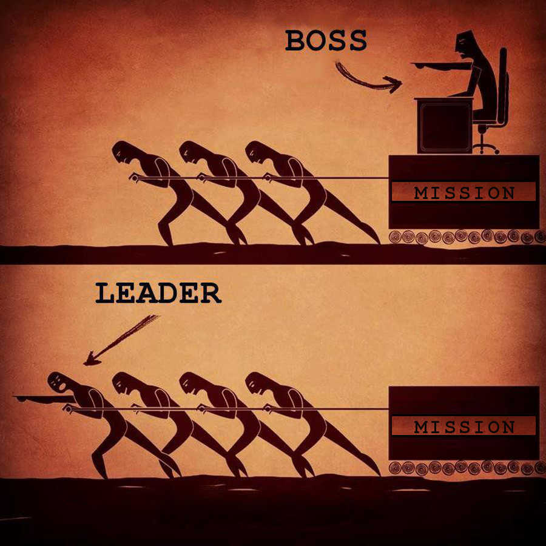

Anyone who studies leadership and how to create a high-performing team has heard truisms like: empower and enable your team for success, support your team, accept blame, give credit, etc. … it’s all true, but, as with many things in life, it’s the execution that proves significantly more difficult.

Leading well&nbsp;requires hard work, attention to detail, experience, failures and lessons learned (lots of lessons learned) to continually refine your skills to build a great team. And frankly, it’s hard to do it right. I’ve had the opportunity to lead [in a lot of different ways](https://www.astronomer.io/blog/why-i-left-big-consulting-for-a-startup), but I’m on the cusp of a new one: building a sales team for Astronomer after a [brand new organizational restructuring](https://www.astronomer.io/blog/building-an-org-chart-that-scales). As I consider how I want to lead my team, I’m considering the same old truisms—but more importantly, I'm finding examples of how other leaders have exemplified them. &nbsp;

### 1. Be committed to a mission.

As a leader, you need relentless commitment to accomplish the mission. However, to do so, you must deeply understand your&nbsp;objective(s) and build a team to accomplish the mission as quickly and thoroughly as possible.

When Elon Musk created SpaceX, he started with [a very clear mission](https://www.spacex.com/about).

> “SpaceX designs, manufactures and launches advanced rockets and spacecraft. The company was founded in 2002 to revolutionize space technology, with the ultimate goal of enabling people to live on other planets.”

Elon’s relentless focus on advancing the space industry is reflected in his team. His vision and actions back up the company mission. As a result, SpaceX attracts the best and brightest to push the limits of space exploration and the team has accomplished feats that no one thought would be possible (i.e. [landing a rocket on a barge](https://www.youtube.com/watch?v=QygpaIJclm4)).

Before you jump into training your team, empowering them for success and pushing them to new heights, make sure you are deeply committed to the mission and understand what your team is responsible for accomplishing. Answer questions like: What does high-performance look like? How is it defined? What does your team need to do to get there? What skills do they need? How can you help them accomplish it?

Then write it down. Track progress against it. And build your team to crush it. If something goes wrong, keep pushing toward the goal. In a 60 Minutes interview, Musk&nbsp;responds to a question about quitting:

> “Never. I don’t ever give up. I mean, I’d have to be dead or completely incapacitated.”

As a leader, demonstrating this same commitment and resolve is critical as it will rub off on your team and together, you’ll start to raise the water. That will allow you to execute another important ideal:

 

_\*From [Modern Servant Leader](https://modernservantleader.com/servant-leadership/bad-boss-vs-good-leader-image/)_

### 2. Empower and enable your team for success.

The goal is to work alongside your team to help them absolutely master their core responsibilities and build something great. To do this, it’s imperative to create a culture of creativity, curiosity and expertise—continuously encourage your team that they can make a difference, that they are _already_ part of something great ... and you are all in this together._&nbsp;_

Though some of his management styles were questionable, Steve Jobs was a master at pushing his team to greatness. He worked tirelessly to empower employees to make a difference and cherish innovation by thinking differently. He focused on not making people do things, but on making people _better_ at doing things. Like the [1997 Apple commercial](https://hbr.org/2012/04/the-real-leadership-lessons-of-steve-jobs) says:

> “The people who are crazy enough to think they can change the world are the ones who do.”

Steve pushed people, arguably too far at times, but [his methods did lead his team to the extraordinary](https://hbr.org/2012/04/the-real-leadership-lessons-of-steve-jobs). If he demanded that a multi-month project get done in less than a week, it did. One member of the original Mac team recalls:

> It was a self-fulfilling distortion. You did the impossible because you didn’t realize it was impossible.

Of course, empowering—even pushing—your team towards success is best done by adding to it this next truism..._&nbsp;_

### 3. Support your team.

Good leaders show support for their team and serve as a buffer from pressures that come from the top. Stand up for your team in turbulent times and encourage them to support one another. If they feel you have their best interest in mind, your team members will react with loyalty and willingness to work harder.

Perhaps best exemplifying this is Sheryl Sandberg, COO of Facebook. Not only does she lead within her company, but she wrote “Lean In” and sparked an entire movement of supportive leadership communities across the nation. According to [the New Yorker](https://www.newyorker.com/magazine/2011/07/11/a-womans-place-ken-auletta), CEO Mark Zuckerberg describes Sheryl’s leadership like this:

> I think the fact that she really wants to get her hands dirty and work, and doesn’t need to be the front person all the time, is the amazing thing about her. It’s that low-ego element, where you can help the people around you and not need to be the face of all the stuff.

And while we’re talking Facebook, it’s worth mentioning something Mark Zuckerberg does well:

### 4. Accept blame.

It’s inevitable that your team will fall short of goals at some point or fail to influence in the manner they intended, regardless of how high-performing they are. It happens to the best teams. As a leader, you should focus on working with your team to gain a deep understanding of what went wrong, why goals were not met and how to adjust for success. You should be the one to accept blame rather than pointing at your team, or worse, individuals on your team to blame them for falling short of goals._&nbsp;_

During the 2016 presidential election, Facebook allegedly served&nbsp;as an outlet for fake news that potentially influenced the election results. Initially, Mark Zuckerberg refuted this assessment; however, he quickly realized it was his responsibility to accept blame for the spread of fake news via Facebook, as it is his company and he is the leader. Zuckerberg&nbsp;took ownership of the issue. He quickly enacted policies to set the direction to drive accurate news sharing on Facebook and has set into motion a collaborative effort with local media outlets._&nbsp;_

I’m certain Mark Zuckerberg could have easily pointed fingers within his team and deflected blame to a very senior level Facebook employee. But he didn’t, and that’s how leaders behave.

What does this do? It demonstrates that leadership is not going to throw the team under the bus at the first sign of resistance or difficulty. This&nbsp;gives your team the confidence they need to continue pursuing their goals relentlessly and the motivation they need to work harder to achieve them. It looks a lot like this: &nbsp;_&nbsp;_

__

Which brings us to the fifth and final truism:

### 5.&nbsp;Deflect credit.  

Seems unfair, especially if we’re going to accept blame, right? But too often, management receives credit for the hard work and success of their team. Good leaders deflect this credit and point out the contributions and achievements of their team members who enabled the success of the whole. _&nbsp;_

In 2016, Jeff Bezos, founder of Amazon, said [he was considering writing a memoir some day](https://www.pjstar.com/business/20160521/one-reason-why-amazon-ceo-jeff-bezos-says-he-may-want-to-write-his-own-book-amzn) for this reason:

> One of the reasons I might do it is because there are so many people throughout our history who deserve more credit than they've gotten. And I could make sure that I dished out that credit._&nbsp;_

A good leader is constantly looking for ways to reward their team for hard work and results. Giving credit publicly and among the team is a fantastic way to continually show appreciation for your team’s efforts.

At the end of the day, though, execution comes down to making a call you believe is best for your team. There simply isn't one playbook. Not only that, but every team is different. My experience as a team leader for a Marine Reconnaissance Team was much different than leading a team of IT consultants at a firm out west—the skills, objectives, personalities, culture, required learning and team composition were much different. Consider your mission, what your team needs to do and how you can all get there together. Then execute, taking cues from other leaders along the way!

