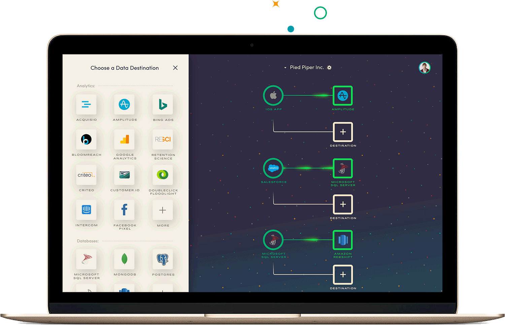
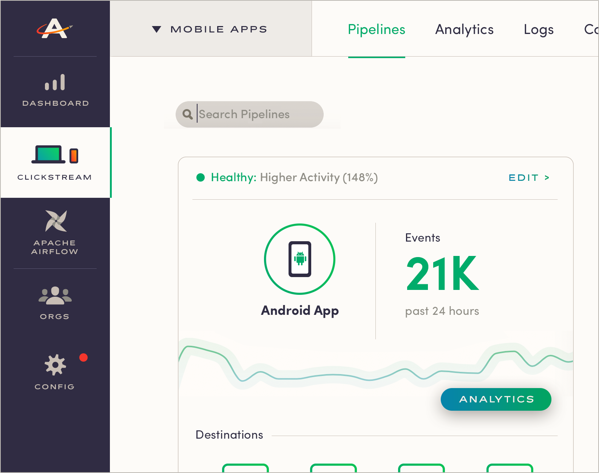

Great companies create great products. We admire Apple, Tesla, Nike and Netflix because of their great products. They are winning because they make sure that product innovation isn’t reactive, but predictive.

The good news is, it can be. Tech exists to understand what users do (or don’t do), before, during and after they experience your product.

Astronomer is a means to that end — but let’s start at the beginning… 

### The USERcycle Era
Before we were Astronomer, we were UserCycle, a platform for user analytics. We realized, however, that all of our customers had the same problem: getting data into their analytics platform took forever. So we thought, what if we solved that problem? We could be a platform for user event—or clickstream—data collection. 

After all, user event data is low-hanging fruit for a company. Everybody has a website and apps. Most have product managers. Large orgs even have huge, expensive internal portals. Yet many don’t manage their products—internal or external—with data. This has to change. 

### Finding Ourselves
Step one was making user behavioral analytics easier. But that quickly evolved when our clients started needing access to more types of data and “forced” us to extend our clickstream infrastructure. We realized then that a component of our product—[Apache Airflow, which we used in a variety of ways](https://www.astronomer.io/blog/airflow-at-astronomer/)—could solve that problem out of the box. Airflow is a workflow management system to schedule, deploy and monitor dependency-based data pipes. In other words, it could do a whole lot more than what we were using it for. 

We started by exposing Apache Airflow to our internal team to enable them to move more quickly. Then we thought, we work with smart customers. They have engineers, too. Could they derive value from Airflow? The quick answer seemed to be yes, but it was always in conjunction with clickstream data, not as a separate entity. As we were building tools, we realized little by little that moving all data around is critical to product analytics … and frankly, nobody is good at it. Suddenly, we were a total data hub with two offerings: a Clickstream “module” and Apache Airflow “module.” We were (and are!) a platform for modern data engineering. 

This trend continued: we stepped into different parts of the ecosystem to provide customers with value, and they pointed us to another problem. Every problem had to do with moving data. So the growth of the platform has been completely organic—and will continue to be. Any tool is disposable; it’s the data engineering capability that’s not. 

Currently, our organic growth involves making Clickstream deployable in a virtual private cloud. And while we were using Apache Airflow to get data for third parties, that’s not what it was designed for—there are better technologies for that space. So we are also looking at Kafka to build out next-level streaming infrastructure for non-clickstream sources. 

We’ll innovate however we have to, so that others can do the same. 

### Our First Product, A Good First Step
Clickstream is now relatively simple. You might need a few minutes of dev time, but the setup is fast. It’s a perfect first step for any company ([and an initiative is fairly painless to kick off](https://preview.astronomer.io/blog/five-steps-to-take-before-kicking-off-a-clickstream-data-initiative/)). Clickstream’s sole focus is ingestion—no transformation, processing or manipulating. Ingestion is the first thing to tackle because if you get down the road with logic too early, you won’t have the right data, and the whole process will need to be re-worked once you do. 

*Here's a peek at our current clickstream interface: *

Of course, the ingestion market is more mature, so the window of opportunity will close sooner. But at that point, Apache Airflow and Kafka Connect will be accessible through the “command center.” Companies at any stage can sign up and access one, two or three of these “modules.” 

You can think of us like a platform with multiple applications on top, which means we’re going to use the same components to drive different applications and can freely share these (open source) tools. Then organizations will install one platform and get different tools. It’s worth it, even if they don’t use all of them at first, because deployment is so simple. And when they do grow, the tool’s there. All they have to do is turn it on.

*Here's a sneak peek at our command center interface: *

So while we’re currently a great alternative for someone like Segment, we’re built for so much more. And as we grow into more of a data engineering platform, we’ll continue focus on whatever our customers need. It might be building out hundreds of clickstream integrations, but it also might be focused on operationalizing a vendor-neutral data warehouse or streaming third party data to a private data lake. It’s all about being agile enough to give our customers what they need to be agile. 

### It All Comes Down to Agility
This agile, [Lean Startup](http://theleanstartup.com/) mentality has always resonated with me: build something small, measure it, learn from it, make changes. Companies have read the book, but most aren’t doing it. And once the few who are doing it with data start taking off, it’s going to be too late for everyone else. That’s the nature of technology. Our tools are centered around that concept. We want people to be able to try new tools, and quickly. 

I was talking to a friend about the need for this the other day. Let’s call him Joe. He works at an enterprise company who just signed a three-year project with a top five consulting firm to build out their Hadoop data structure. But Joe and the ones who actually engineer the data know that’s way too slow. The problem is, everything about their business will be different in three years. Not to mention, Joe has to deliver value today. So he has shadow IT building what they need, in an agile way. We want to make that easier, whether it has to be done in the shadows or in the light. 

The thing is, we have to get people to buy into the vision—and when we find someone willing to think outside the box to create an excellent product, we equip them with the tools they need to keep on growing. Data engineering is required for any kind of business today, whether you’re building a product or offering services. You need data to make decisions and provide value. But you shouldn’t be spending your time building out a platform when that’s someone else’s core competency.

### Agility for Us, Too
While we’re enabling this agility, we have to operate in the same way with our products. Yet we want to maintain a reliable, rock solid core. Our solution is what we call the Houston API, [written in GraphQL](https://www.astronomer.io/blog/topic/graphql/). Even if a module gets “retired,” the API stands firm. It’s the glue that holds the frontend and backend together, no matter what technologies we want to switch out on either end. Everything is interchangeable, but the data engineering hub remains strong. And customers can count on access to the technology they signed up for. 

That too, by the way, was driven by customer needs. They wanted the option to interact with the API and ignore the frontend altogether, so we gave it to them. They can write their system to our systems and programmatically create pipelines. The fact that it’s in GraphQL gives you tooling to tinker with it and explore it as a developer. That’s a big differentiator from our competitors.

### So Who Needs Astronomer? 
Companies that are aligned and operate (or want to operate) with agility to do better analytics—not just product and behavioral analytics, but also data science or more—are perfect fits for us. Or, if you love this idea of data engineering and having “librarians” working in your org to decide where data goes, we’re a good fit. Some companies are willing to spend millions to get the right data structure, but three-year consulting firms aren’t the answer anymore—the world if moving too fast. Those who want to iterate to success are a good fit. 

Another way to look at it is like this: If you’re dissatisfied with how you’re doing analytics today or feeling pressured by a competitor and can’t afford to wait three years, Astronomer can help. Quick innovation is something that many companies aren’t equipped to do, especially in certain industries. Big consulting firms aren’t equipped either. It requires thinking outside the box and solving a very real problem at a striking velocity. 

If your mentality is “innovate or die,” start now. [Sign up for free today](https://app.astronomer.io/) and start ingesting clickstream data from your website or app. Build something, measure it, learn from it, make changes. And as you grow (which you inevitably will), we’ll be there.