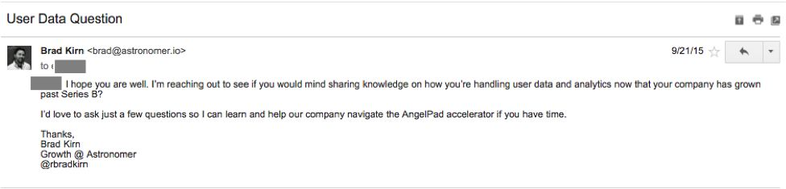
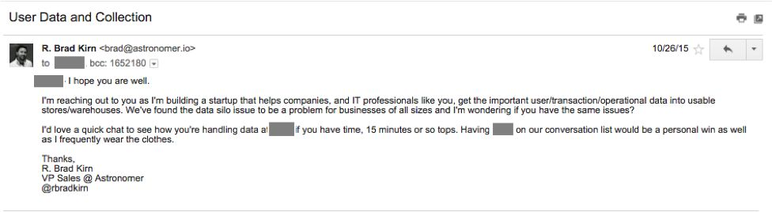
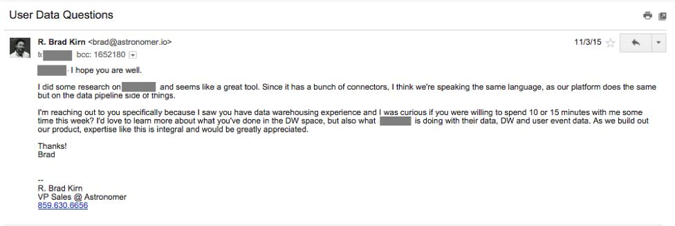

<!-- markdownlint-disable-file -->s
 **_“It’s really about the basics; understanding your customer, taking care of your customer, practicing blocking and tackling…” -_ Warren Buffett**

In the startup world, it's said that the best way to get started is to **just start**. I could not agree more. Just start running, get a stride, and...well, smash into&nbsp;a million obstacles, earn&nbsp;a million small wins, climb&nbsp;peaks, descend into valleys and, ultimately, you realize that building a company is much more difficult than you once thought :)

One of the best first steps is to get out of the building and talk to people. Talk to your target customer, learn from them, hear their complaints and wishes, and try to match that with the problem you're looking to solve. If you do this job well, you'll eventually get to product-market fit and should be taking the next exit towards scaling.

**The Target Customer**

The target customer of your business is your most valuable asset throughout the entire life of your business. But why? It's actually a two-fold answer. In the short-term, the knowledge, information, and feedback your target gives you will help you refine the early vision as well as give you a very specific group/role to focus on. Longer-term, they give you the knowledge to build a solid foundation from which you can expand to other targets.

As your business evolves, so does your target customer but nailing that beachhead target customer is so important, so tough but so rewarding.

_A **beachhead target** is the initial target customer, the one you start with...they may not be your target customer forever but, for right now, you are able to provide them the most value and deliver it faster than to any other target._

On the surface, it seems like the initial target&nbsp;customer (beachhead) just falls into your lap. You have this awesome idea to solve the problem that people are experiencing and are convinced the solution you've designed will bring in millions per year in revenue. That 'fall in your lap' mindset (which is prevalent in a lot of first time entrepreneurs) will lead to the thought that your product solves a problem 'for everyone.' While that may be true at some point in the future, at the outset the task is to identify one, succinct description of one segment of a group of people who experience the problem and have propensity to pay to solve it. Simply put:

_ **"Who has a real enough problem that they would pay you to solve it?"** _

Even though we've existed for less than a year, we've already had quite the journey to identify and learn from (and eventually sell to) our target customers. Our initial target customer was the developer. Astronomer is built by developers, for developers, so we assumed devs must be the target, customer, and the buyer. Why?&nbsp;Astronomer makes it easy to connect to any data source, which is a task that generally resides in IT. It's also completely configurable, which is something devs greatly desire when working with platforms.

It made sense that devs were our target so, practicing what I preach, I started talking to people - developers, VPs of IT, CTOs - in an attempt to learn as much as I can about their day-to-day and problems they face. Most of the time, they would divulge their experience with the problem we're solving, which was great because, not only were we learning from our target, we were also filling the pipeline with qualified leads.

Have a look at some real emails I sent to IT professionals looking to get on their calendar.&nbsp;

Short and to the point. It was an honest ask too...we talked with a VP of Engineering and asked a bunch of helpful questions.

I started writing longer, more in depth emails that explained a bit more of what we're doing. My tactic here was to divulge more in the initial email in hopes to spark some interest in the actual product.

I tried getting more specific on what I was looking to learn about (data warehouses) and seemed to have lost the genuine ask to learn.

By framing the conversation as a learning call, I was able to learn from some of the top IT professionals in the country. From the Fortune 10 to the newest startup in town, ALL of them complained that their business had so much 'dark data' that they weren't&nbsp;using to gain strategic actionable insights. This was fascinating. It became clear that this wasn't a problem characterized by the type of business or by individuals in specific departments but rather a fundamental problem with the way businesses viewed and used the data.

Almost all of the individuals I talked to were speaking our language; they were complaining about data silos, about what this department could be doing better or should be doing in general, and, honestly, it felt good. After most calls, Ry, our CEO,&nbsp;and I would follow up and digest. It was reaffirming to hear from big businesses, SMBs, and startups alike that they were facing problems our product - well, vision for the product - could solve.&nbsp;

**So What Went Wrong?**

It's one thing to get someone on the phone for a learning call. Generally, people are happy to help out pure altruism, the novelty of chatting with a startup, and the opportunity to vent their daily frustrations. But it's another thing to try to sell to these same people.

Some of the objections I heard after the post-call:

- "We could build this ourselves, if someone in our group has the problem."
- "It's on our roadmap but is a few months away."
- "Our analysts and data scientists are getting the data they need. And if they weren't, they would've said something."
- Nothing. They wouldn't respond because IT folks generally would rather code/build than respond to _another_ email :)

This brought me to a screeching halt. We had one - sometimes two or three - great conversations where we leveled on how _important_ data is, how _prevalent_ dark data is, how _restraining_ bad data insights are.&nbsp;But&nbsp;when the time came to make **THE ASK** &nbsp;they immediately retreated or kicked the can down the road. WHAT?!?&nbsp;

**Who benefits from your product?**

It took us a little while to figure out that, while IT is a user of our system, they are _not_ the buyer.

The turning point was a sleepless night, going through everything I've heard over the past few months in my head. I couldn't sleep because I couldn't reconcile why&nbsp;the&nbsp;equation behind our strategy wasn't working. The IT people I talked with understood the problem, but they had not interest in buying. Sleepless nights like that are incredible for gaining clarity&nbsp;and after semi-consciously emailing ideas to myself 10 times between 2-4am, I pieced together the big miss with our current tactic.

**_Astronomer makes it easy to get data from any source to any destination, in any format._**

&nbsp;Who has data-heavy requirements? Who uses data to do their job? What jobs need data?&nbsp;

**Data Scientists** &nbsp;

Looking back, there were clues telling us this the entire time. Data scientists are routinely tasked with drawing valuable insights from data. They ALSO&nbsp;spend a lot of their time collecting and cleaning data - two tasks with technical requirements typically beyond data scientists that end up straining IT resources or forcing them to work with what they already have.

I became fascinated, almost obsessed, with the power of data when you have a genius professional in the form of a data scientist to make something of it. Finding insight in problems like:&nbsp;

- What external factors affect in-store versus online purchasing?
- Why has our user churn increased 10% in the last quarter?
- What features should be enhanced and/or killed in our app?

A big lesson my first boss taught me was:

_"With today's technology and information, the answers to all your questions are at your fingertips. Go find them yourself."_

That has resonated with me over almost a decade and after talking with over 30 data scientists in the past month, I've learned they retain that same mindset. Challenge them with a problem, and they will find the answer. That is what gets them up in the morning and what keeps them going.

**What happened next?**

I spoke&nbsp;with 30 data scientists in a month. I asked them all to run through a list of questions we created so we can learn about their problems, their day-to-day, their team size, tools they use, etc. This information is insanely valuable for an early stage startup. Now we know how to talk to them, can almost guess some of the issues they go through and, most importantly, are able to genuinely solve a big problem.

The result was higher quality conversations both during the learning phase as well as in more sales-oriented follow ups. This customer pivot has been so valuable to our business in other ways too. We understand our customers tendencies, problems, relationship with management, relationship with other teams and purchasing habits. From this information, we built our marketing message, our sales narrative, and our customer deck. Had we never made the switch, we would be barking up the wrong proverbial tree.&nbsp;

Stay tuned, as I want to share some of the insights we gained from interviewing so many data scientists. It's fascinating to understand what brought people to the role, the answers they want to give their company, and what problems they run into at each stage.

Until then, if you like what you see with our product or want to learn more about discovering your target, email me at [brad@astronomer.io](mailto:brad@astronomer.io). I would love to talk with you.

&nbsp;

