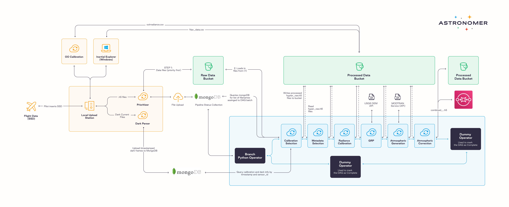

\- 5x bigger data volume being processed in the same time period

\- 4x more structured data pipelines within the organization

\- 10x higher YoY Annual Recurring Revenue in 2021 compared to 2020

Key product values:

* **Developer productivity** — eliminating the issue of undifferentiated heavy lifting by providing automation tools.
* **Day-2 operations** — adding scalability, diagnostics, automation, and observability.
* **Business impact** — helping the client deliver the right data fast to their customers.
* **Continuous innovation** — allowing the client to stay on top of Airflow advancements.
* **Mission critical** — uninterrupted business operations thanks to 24/7 support. 

## Ground-truth datasets for agriculture

[Cloud Agronomics](https://www.cloudagronomics.com/) is a tech company that uses hyperspectral imagery, satellite data, and machine learning to challenge the way agriculture has been done for millennia. With the help of Astronomer, they’ve built the ag industry’s largest cloud-based hyperspectral data pipeline. Here at Astronomer, we believe in supporting amazing startups like Cloud Agronomics in their data management journey as it allows them to grow and change the world for the better. 

The agriculture industry has only recently joined the game of cloud computing and AI due to the lack of reliable data. The company’s goal is to fill that gap and help agribusinesses produce sustainable, carbon-negative, resilient, and nutritious food. By using aircraft to gather proprietary data, the Cloud Agronomics platform provides actionable metrics on soil and plant productivity, allowing customers to make better, more sustainable decisions, as well as quantify changes to their field’s Soil Organic Carbon (SOC) content.

“We try to give food a story — how it was planted, where it came from, how it got to the shelf in your grocery store. People should know how sustainable that journey was.” — explains Benjamin Leff, VP, Engineering at Cloud Agronomics.

## The challenge — leveraging big data 

In the AgTech world, due to weather conditions and the nature of the local biosphere, you’re relying on ever-changing, dynamic data. In order to deliver the right information quickly to their customers, Cloud Agronomics needed a way to build reliable and scalable data pipelines. 

“Timing is extremely relevant to our business *—* says Benjamin *—* we have about 48 hours between flying the aircraft and delivering insights to our customers.”

Cloud Agronomics deals with terabytes of data and hundreds of thousands of files — called “Datacubes” — at a time. They have to be processed, analyzed, and delivered to customers on time. If they’re not, and there’s a change in plant nutrient uptake, the information delivered becomes irrelevant, putting the farmers’ crops and businesses in danger. 

To solve these problems, the client looked into different solutions that would:

* Allow their developers to be more productive (eliminating the undifferentiated heavy lifting)
* Enhance operational efficiency
* Easily manage infrastructure that gives them insights into possible issues
* Simply work (be out-of-the-box and easily integrated)

Apache Airflow caught their attention as a lot of Cloud Agronomics’ data engineers are Python experts. Additionally, Airflow has a massive community behind it, and therefore, easily accessible support. After looking into many similar tools, choosing Apache Airflow was a no-brainer as it turned out to be the most mature, scalable, flexible, and simplest one to use.

*A DAG flow design prepared during one of the brainstorming sessions with the client*

## Astronomer on Microsoft Azure

Getting Airflow up and running and managing it on your own is difficult, which is why the company came to us for help. Having already been using our SaaS cloud service (Astronomer Cloud), they wanted to leverage the power of Microsoft Azure and [their partnership with Microsoft](https://www.microsoft.com/en-us/ai/ai-for-earth-cloud-agronomics) to run the Astronomer Platform in their own cloud. 

The switch went smoothly as our platform runs natively on Azure Kubernetes Service (AKS), which made it easy for the Cloud Agronomics workloads to run as KuberneretesPodOperators. This gives them the flexibility to run whatever docker images they like, all coordinated from Airflow. The client was also able to easily optimize their Airflow environment to fit their use case by switching to the Celery Executor.

Additionally, Cloud Agronomics gets ongoing support for their data engineering team with the Astronomer Platform.

“Astronomer makes Airflow so easy to use and get started with” — says Benjamin — “The abstractions they have provided on top of that — nobody holds a candle.”

“Astronomer’s expertise in working with advanced Airflow features and integrations such as Kubernetes functionality helped jumpstart our transition to Airflow. It would have been significantly harder to approach these problems on our own” — says Annie Weinmann, Data Engineer at Cloud Agronomics.

Airflow allows Cloud Agronomics to automate their data pipelines and work management to provide a reliable way to operate their business at scale. They can now process discrete, smaller batches of data, saving compute time and making reprocessing easier, ultimately saving them time and money.

“Thanks to the infrastructure created by Airflow, we transformed our data pipelines from systems that didn't allow retries and restarts throughout the pipeline to a flexible, scalable, and reliable pipeline that can easily handle and adapt to unexpected changes” — Annie confirms — “As an added bonus, Airflow's GUI makes it easy to visualize exactly what's going on in our pipeline, too." 

Thanks to the Astronomer platform, instead of spending countless hours managing their data pipelines, they can focus on putting those resources somewhere else: into growing the company and providing better services for their customers.

“Unless you want to spend a couple of million dollars rolling your own solution, and dealing with all the problems that come with it, use Airflow and Astronomer. They’ve already put the great work in.” — sums up Benjamin.

Are you looking for an easier and scalable way to run Airflow? [Learn more about Astronomer here](https://www.astronomer.io/docs/cloud), and set up a call with our team—we’ll walk you through it!